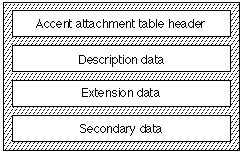

# 'acnt' 表

介绍
重音附件表（标记名称：“ acnt”）提供了一种节省空间的方法，可将组件字形组合为复合字形以形成重音。 重音字形是复合字形的一个非常受限制的子类。 它们的特征描述如下：

* 重音字形由一种主要成分和一种或多种辅助成分形成。
* 除了实际轮廓外，带重音符号的字形的所有属性都与主要成分共享，或者可以从主要字形和辅助字形的属性派生。 示例包括指标，字距调整值和后记名称。
* 组件不能为带重音的字形。
* 组件必须是轮廓，而不是bitmaps。
* 每个重音字形都必须具有唯一的字形索引。 重音字形的字形索引必须是连续的，并且必须以大于常规字形的最高索引的索引开头。
* 字体的主要组成部分不能超过32,768。
* 字体不能包含超过255个辅助成分。
* 将次要组件定位在主要组件上的唯一机制是连接点的匹配。
* 次要组件只能有一个连接点。
* 每个不同的带重音符号的字形都必须具有唯一的字形索引，并且必须提供数据以指定每个次级分量如何与每个重音符号的主分量相连。
口音附件表需要以下存储空间：
* 单个重音符号：4个字节。
* 多个重音符号：每个重音4个字节+ 2个字节。
* 次要字形：3个字节。

## 口音附件表格式

重音附件表由标题，描述数据，扩展数据和辅助数据组成。 下图显示了口音附件表的整体结构： 

口音附件表格式如下：

|类型|名称|描述|
|-|-|-|
|fixed32|version|重音附件表的版本号（当前版本为0x00010000）。|
|uint16|firstAccentGlyphIndex|第一个带重音的字形索引。|
|uint16|lastAccentGlyphIndex|最后一个带重音的字形索引。|
|uint32|descriptionOffset|相对于描述数据的字节偏移量。|
|uint32|extensionOffset|扩展数据的字节偏移量。|
|uint32|secondaryOffset|相对于辅助数据的字节偏移量。|
|variable|glyphs[numberOfAccentedGlyphs]|
|variable|ext[numberOfGlyphsWithMoreThan2Components]|
|variable|accents[numberOfSecondaryGlyphs]|
