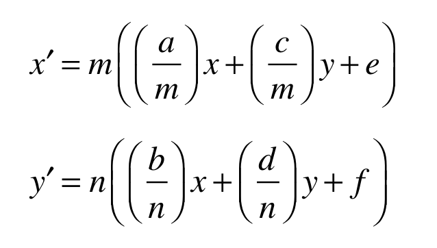

# 'glyf' 表 (glyph font)
'glyf' 表包含定义字体中字形外观的数据。 这包括描述构成字形轮廓的轮廓的点的规范以及网格拟合该字形的指令。 'glyf' 表支持简单字形和复合字形的定义，即由其他字形组成的字形。

字体中的字形数量仅受“head”表中规定的值的限制。 字形在字体中的放置顺序是任意的。

请注意，字体必须至少有两个字形，并且字形索引 0 必须有轮廓。 [有关详细信息，请参阅字形映射](https://developer.apple.com/fonts/TrueType-Reference-Manual/RM07/appendixB.html)。

## 字形数据
表 14 记录了字形定义的格式。 零或正数量的轮廓表示一个简单的字形。 如果轮廓数小于零，则字形由组件组成。 如果字形的轮廓为零，则它不需要任何字形数据。 如果字形由组件组成，建议在此字段中使用值 -1。

字形中坐标数据的最小和最大 x 和 y 值定义字形的边界框。 这是在进行任何网格拟合之前原始字形轮廓的边界框。

**表 14**：字形描述
<table>
  <tr>
    <th>类型</th>
    <th>名称</th>
    <th>描述</th>
  </tr>
  <tr>
    <td>int16</td>
    <td>numberOfContours</td>
    <td>如果轮廓数为正数或为零，则为单个字形；<br>如果轮廓数小于零，则字形是复合的</td>
  </tr>
  <tr>
    <td>FWord</td>
    <td>xMin</td>
    <td>坐标数据的最小 x</td>
  </tr>
  <tr>
    <td>FWord</td>
    <td>yMin</td>
    <td>坐标数据的最小 y</td>
  </tr>
  <tr>
    <td>FWord</td>
    <td>xMax</td>
    <td>坐标数据的最大 x</td>
  </tr>
  <tr>
    <td>FWord</td>
    <td>yMax</td>
    <td>坐标数据的最大 y</td>
  </tr>
  <tr>
    <td colspan='3' >(here follow the data for the simple or compound glyph)</td>
  </tr>
</table>
<!-- |类型|名称|描述|
|-|-|-|
|int16|numberOfContours|如果轮廓数为正数或为零，则为单个字形；<br>如果轮廓数小于零，则字形是复合的
|FWord|xMin|坐标数据的最小 x
|FWord|yMin|坐标数据的最小 y
|FWord|xMax|坐标数据的最大 x
|FWord|yMax|坐标数据的最大 y -->

## 简单的字形

表 15 指定了简单字形的格式。 字形轮廓要求的更详细描述在[数字化字母设计中给出](https://developer.apple.com/fonts/TrueType-Reference-Manual/RM01/Chap1.html)。

**表 15**：简单的字形定义
|类型|名称|描述|
|-|-|-|
|uint16|endPtsOfContours[n]|每个轮廓的最后一个点的数组； n 是轮廓的数量； 数组条目是点索引|
|uint16|instructionLength|指令所需的总字节数|
|uint8|instructions[instructionLength]|此字形的指令数组|
|uint8|flags[variable]|flags数组
|uint8 or int16|xCoordinates[]|x 坐标数组； 第一个是相对于 (0,0)，其他的是相对于前一点
|uint8 or int16|yCoordinates[]|y 坐标数组； 第一个是相对于 (0,0)，其他的是相对于前一点

flags 数组中的每个条目的大小都是一个字节。与该字节中的每个位相关联的含义在下面的表 16 中给出。

表 16：大纲标志(Outline flags)

|Flags|Bit (0 is lsb)|描述|
|-|-|-|
|On Curve|0|如果设置，则该点在曲线上；<br>否则，它是偏离曲线的。|
|x-Short Vector|1|如果设置，则对应的 x 坐标为 1 个字节长；<br>否则，对应的 x 坐标为 2 个字节长|
|y-Short Vector|2|如果设置，对应的y坐标为1字节长；<br>否则，对应的 y 坐标为 2 个字节长|
|Repeat|3|如果设置，下一个字节指定这组标志要重复的额外次数。 这样，列出的标志数可以小于字符中的点数。|
|This x is same (Positive x-Short vector)|4|此标志具有两种含义之一，具体取决于 x-Short Vector 标志的设置方式。<br>如果设置了 x-Short Vector 位，则该位描述值的符号，值 1 等于正值，零值等于负值。<br>如果未设置 x-short Vector 位，而设置了该位，则当前 x 坐标与前一个 x 坐标相同。<br>如果 x-short Vector 位未设置，且该位未设置，则当前 x 坐标是有符号的 16 位增量向量。 在这种情况下，增量向量是 x 的变化
|This y is same (Positive y-Short vector)|5|此标志具有两种含义之一，具体取决于 y-Short Vector 标志的设置方式。<br>如果设置了 y-Short Vector 位，则该位描述值的符号，值 1 等于正值，零值等于负值。<br>如果未设置 y-short Vector 位，而设置了该位，则当前 y 坐标与前一个 y 坐标相同。<br>如果 y-short Vector 位未设置，且该位未设置，则当前 y 坐标是一个带符号的 16 位增量向量。 在这种情况下，增量向量是 y 的变化|
|Reserved|6 - 7|设置为零|

## 复合字形

复合字形是由两个或多个组件字形组成的字形。 复合字形描述的开头就像一个简单的字形描述，有四个词描述了边界框。 它后面是 n 个分量字形部分。 每个组成字形部分由一个标志条目、两个偏移条目和一到四个转换条目组成。

描述复合字形中每个组成字形的格式记录在表 17 中。与第一个条目中的标志相关的含义在表 18 中给出。

<br>

**表 17**：组件字形部分说明
<!-- |类型|名称|描述|
|-|-|-|
|uint16|flags|组件标志|
|uint16|glyphIndex|组件的字形索引|
int16, uint16, int8 or uint8|argument1|组件或点编号的 X 偏移； 类型取决于组件标志中的位 0 和 1
int16, uint16, int8 or uint8|argument2|组件或点编号类型的 Y 偏移取决于组件标志中的位 0 和 1
transformation option|--|One of the transformation options from Table 19 -->
<table>
  <tr>
    <th>类型</th>
    <th>名称</th>
    <th>描述</th>
  </tr>
  <tr>
    <td>uint16</td>
    <td>flags</td>
    <td>组件标志</td>
  </tr>
  <tr>
    <td>uint16</td>
    <td>glyphIndex</td>
    <td>组件的字形索引</td>
  </tr>
  <tr>
    <td>int16, uint16, int8 or uint8</td>
    <td>argument1</td>
    <td>组件或点编号的 X 偏移； 类型取决于组件标志中的位 0 和 1</td>
  </tr>
  <tr>
    <td>int16, uint16, int8 or uint8</td>
    <td>argument2</td>
    <td>组件或点编号类型的 Y 偏移取决于组件标志中的位 0 和 1</td>
  </tr>
  <tr>
    <td colspan='2'>转换选项</td>
    <td>表 19 中的转换选项之一</td>
  </tr>
</table>

<br>

**表 18**：组件标志
|Flags|Bit|描述|
|-|-|-|
|ARG_1_AND_2_ARE_WORDS|0|如果设置，则参数为单词；<br>如果未设置，则它们是字节。|
|ARGS_ARE_XY_VALUES|1|如果设置，则参数为 xy 值；<br>如果未设置，则为点。|
|ROUND_XY_TO_GRID|2|如果设置，则将 xy 值四舍五入到网格；<br>如果未设置，则不将 xy 值舍入到网格（仅与设置的位 1 相关）|
|WE_HAVE_A_SCALE|3|如果设置，则组件有一个简单的比例。<br>如果未设置，比例为 1.0。|
|（此位已废弃）|4|（已过时；设置为零）|
|MORE_COMPONENTS|5|如果设置，则至少有一个额外的字形跟随此字形。|
|WE_HAVE_AN_X_AND_Y_SCALE|6|如果设置 x 方向将使用与 y 方向不同的比例。|
|WE_HAVE_A_TWO_BY_TWO|7|如果设置，则将使用 2×2 转换来缩放组件。|
|WE_HAVE_INSTRUCTIONS|8|如果设置，则组件字符的说明位于最后一个组件之后。|
|USE_MY_METRICS|9|将此组件中的度量用于复合字形。|
|OVERLAP_COMPOUND|10|如果设置，此复合字形的组件将重叠。|

<br>

## 表 19：转换选项
<!-- |转换选项|含义|
|-|-|
|transformation entry #1|scale (same for x and y) -->


<table>
  <tr>
    <th>转换选项</th>
    <th>含义</th>
  </tr>
  <tr>
    <td>transformation entry #1</td>
    <td>scale (same for x and y)</td>
  </tr>
  <tr>
    <td rowspan='2' >transformation entry #2</td>
    <td>x-scale</td>
  </tr>
  <tr>
    <td>y-scale</td>
  </tr>
  <tr>
    <td rowspan='4' >transformation entry #3</td>
    <td>xscale</td>
  </tr>
  <tr>
    <td>scale01</td>
  </tr>
  <tr>
    <td>scale10</td>
  </tr>
  <tr>
    <td>yscale</td>
  </tr>
</table>

复合字形中的字形数据不同于简单字形的数据，它由每个组件的描述组成，然后是对整个复合字形的任何说明。

字形索引描述第 j 个分量字形的位置。

转换条目确定在组件被合并到父字形之前应用于组件的仿射转换的值。 给定组件矩阵 [a b c d e f]，应用于组件的变换为：



144 / 5000
翻译结果
a、b、c和d的值如表19a中所示获得。 e 和 f 的值如下面的伪代码所示： 

```
if (ARG_1AND_2_ARE_WORDS && ARGS_ARE_XY_VALUES)
	1st short contains the value of e
	2nd short contains the value of f
else if (!ARG_1AND_2_ARE_WORDS && ARGS_ARE_XY_VALUES)
	1st byte contains the value of e
	2nd byte contains the value of f
else if (ARG_1AND_2_ARE_WORDS && !ARGS_ARE_XY_VALUES)
	1st short contains the index of matching point in compound being constructed
	2nd short contains index of matching point in component
else if (!ARG_1AND_2_ARE_WORDS && !ARGS_ARE_XY_VALUES)
	1st byte containing index of matching point in compound being constructed
	2nd byte containing index of matching point in component
```


298 / 5000
翻译结果
最后，m和n计算如下：

首先，让 m₀ = max(|a|, |b|) 和 n₀ = max(|c|, |d|)。

如果|(|a|-|c|)| ≤ 33/65536，则 m = 2m₀； 否则，m = m₀。

类似地，如果|(|b|-|d|)| ≤ 33/65536，则 n = 2n₀； 否则，n = n₀

如表19a所示导出线性变换数据。 

**重要的**

如果 e 和 f 直接指定为偏移量而不是要匹配的点索引，则偏移量的正确值取决于转换组件。 例如，如果对组件应用二分之一的通用比例因子，则在使用 e 和 f 的值偏移组件之前，该比例因子也会应用于这些值。 另请注意，当组件旋转 45 度的倍数时，比例因子将翻倍。 由于这些原因，通过使用锚点和匹配点指定偏移比直接通过偏移值容易得多。

**表 19a**：线性变换

|WE_HAVE_A_SCALE|WE_HAVE_AN_X_AND_Y SCALE|WE_HAVE_A_TWO_BY_TWO|a|b|c|d|
|-|-|-|-|-|-|-|
|0|0|0|1.0|0.0|0.0|1.0|
|1|0|0|1st short|0.0|0.0|1st short|
|0|1|0|1st short|0.0|0.0|2nd short|
|0|0|1|1st short|2nd short|3rd short|4th short

存储为 short 的数字被视为有符号的固定二进制小数点数，二进制小数点左侧一位，右侧 14 位。

可以认为转换和指令的应用按以下顺序发生：

对于每个组件

* 应用本地转换（如果有）
* 应用全局变换（例如点大小、分辨率）
* 网格拟合轮廓
* 应用偏移量或锚点的平移
* 如果有说明，则对复合字形进行网格拟合