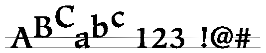

# 关于Apple Advanced Typography字体

## 介绍

Apple的文本图像技术Apple Advanced Typography（AAT）使应用程序可以为用户提供具有特殊印刷效果的字体，例如草书连接，华丽和复杂的连字。 其中许多功能是罗马以外的文字所必需的，例如阿拉伯文或梵文。

Apple当前通过Apple Type Services为Unicode™图像（ATSUI）提供了使用AAT字体进行绘图的支持。

本文档适用于正在创建要与AAT一起使用的字体的字体开发人员。 本文档说明了您包含在“ sfnt”资源中的字体表，以使您的字体具有特殊的功能和效果。

完整的“ sfnt”资源不在此处描述。 资源的其他表在[TrueType字体规范](https://developer.apple.com/fonts/TrueType-Reference-Manual/index.html)中描述。 您可能还需要Unicode标准：全球字符编码2.0版，可以从Addison-Wesley获得。 有关Unicode的更多信息，请参见[Unicode联盟网站](https://home.unicode.org/)。

字体供应商可以创建实现不同功能集的表。 应用程序可以选择字体来确定可用的样式。 字体表存储给用户展示的字符串集样式。

Apple在[AAT字体功能注册表](https://developer.apple.com/fonts/TrueType-Reference-Manual/RM09/AppendixF.html)中定义了一组文本功能。 苹果和字体开发人员将添加其他功能。 您可以包括一个或多个这些功能，也可以创建自己的文本功能。 字体将支持的字体功能必须是注册表的一部分； 要建议添加注册表，请联系：
applefonts@apple.com

## 字符，字形和字体

理解文本处理的基础是字符和字形之间的区别。 字符是具有单个和唯一语义或语音含义的抽象对象。 字形代表角色的视觉，图形外观。 例如，可以使用不同字体的字形（例如Times Roman或Zapf Chancery）来表示字符“ A”。 这是一个汉字字形的示例，它对应于几种不同语言的字符：

字体是具有某些设计一致性元素的字形的集合，例如使用衬线或一致的笔触粗细。 字体通常包含其他信息，例如哪些字形代表连字或上下文形式。

许多字形与字符没有一对一的关系：一个或多个字形可以组成一个字符（例如，“ i”可以表示为无点“ i”上的点重音），而 一个字形可以表示两个或多个字符（“ f”和“ i”可以用“ fi”连字表示）。 上下文还可以确定使用哪个字形来表示字符。 例如，在草书字体中，四个字形可以表示相同的字符：在单词的开头，中间和结尾分别为一个字符； 以及一个隔离字符的字形。

在字体内，每个字形都与一个称为其字形索引的16-bit code相关联。 对于给定的字形，不同的字体可能具有不同的字形索引。

复杂的字体包含将某些字形索引与某些字符和规则组合相关联的信息。 例如，字体中的信息可以将字形ID 0x1A01（代表“ fi”连字）与两个字符0x0066（小写字母“ f”）和后跟0x0069（小写字母“ i”）的组合相关联。 缺少此类关联信息的任何字体称为简单字体。

从技术上讲，简单字体是仅包含所需标准表（“ cmap”，“ glyf”，“ head”，“ hhea”，“ hmtx”，“ loca”，“ maxp”，“ post”）的字体。 与非布局相关的可选表（“ cvt”，“ fpgm”，“ hdmx”，“ prep”）。 Macintosh System 7发行的所有TrueType字体都是简单字体。

复杂字体中的字形可以分为两类：按表渲染，组合式； 还有字符字形，它们与字符代码一一对应。 按表渲染形式包括连字，应用标记和上下文形式； 这些将在后面的部分中进一步讨论。 通常，只有字符字形包含字体的字符到字形映射表中的条目。 字体中的其他表格用于生成渲染表单。

## 字符属性

字符代码具有一组关联的字符属性。 其中一些与简单的字符标识有关：空格是空白字符，而'A'不是。 其他一些与字符方向有关：希伯来字母的方向是从右到左，而罗马字母的方向是从左到右。

## 字符串和字符串排序

字符串是组成字符代码的字节的有序数组。 一些字符代码包含一个字节，而另一些字符包含两个字节。 此数组中隐含的顺序可能与相应字形的显示顺序（称为可视顺序）不同。 字符串是后备存储的示例，它是字符代码的有序存储库。 后备存储顺序指定字符代码在例如文档中的存储顺序，即在执行任何渲染操作之前。 有时，术语“语音订单”被用作后备商店订单的同义词。

请记住，字符串中的这种顺序以语音顺序反映了原始的简单字符代码。 特别是，阿拉伯字符串不会以相反的顺序显示给AAT文本处理器。 例如，在混合阿拉伯语和英语的字符串中（如下图所示），字符以该语言的母语者在页面上出现的顺序从左到右显示。 幸运的是，所有这些双向排序都是由ATSUI使用Unicode双向算法处理的，因此ATSUI客户端不必担心自己进行双向重新排序。

## 变音标记

变音标记是在特定文字中添加到字形或字形组合的任何标记，它们会创建与未标记的字形不同的新语音值。 变音符号包括重音符号，变音符号，波浪号，小调符号或表示元音存在的点（例如希伯来语或阿拉伯语）。

诸如阿拉伯语之类的语言需要此功能，因为有两种形式的书面语言：带元音的儿童读物； 并且没有元音，因为成年人已经学会了没有元音的阅读语言。

## 连字和语境形式

连字是代表两个或更多单独字形组合的单个字形。 一个示例是英语中的“ fi”连字。

带重音符号的形式是连字的一个特殊子类：将字母与变音符号结合在一起的字形。 例如，字形“ä”和“ò”是重音形式。 多个重音符号本身可以作为重音连字出现在字体中，如下图所示：

上下文形式的字形的替代形式，其使用取决于字形在单词中的位置。 例如，在阿拉伯语中，字符根据其出现的位置（在单词的开头，中间或结尾）而具有不同的上下文形式。 下图显示了阿拉伯字母“ ha”的形式，它们单独出现在单词的开头，中间或结尾。 每种情况下使用相同的字符代码。 您在字体表中提供的信息允许选择正确的字形。

连字是两个或多个字形结合在一起形成一个新的字形，而上下文形式是一个字形形状的变化。 下图显示了两种字体如何形成“ fi”连字，第一种使用连字，第二种使用上下文形式。 第一个“ fi”连字是单个字形，它替换了常规的“ f”和“ i”字形。 在下图的底部，在将“ i”字形与“ f”字形放置在一起以形成“ fi”连字之前，将其更改为上下文形式。 在第二种情况下，在更改“ i”之后，“ fi”连字不是一个独立的字形，而是两个字形。 如果“ i”字形没有跟随“ f”字形，则格式将不会更改。

要在字体中包含连字和上下文形式，应包含一个[字形变形表](https://developer.apple.com/fonts/TrueType-Reference-Manual/RM06/Chap6mort.html)。

## 非上下文形式（表）

非上下文形式（表）的字形的替代形式可以在文本的任何位置使用，而不管其上下文如何。 这方面的一个示例可能是数字集0到9的两种或多种样式。对于希望使用字体创建数字列的用户，可以包括一组比例间距的数字和一组固定宽度间距的数字。 在下图中，数字集有三种形式（尽管并非全部来自同一字体）：衬里数字，即具有成比例间距的数字，它们的高度大约相同，并且不延伸到基线以下； 传统数字，即具有比例间距的数字，其高度和位置相对于基线有所不同； 和固定宽度的数字，适用于制表。

## 案例替代

您也可以使用大小写替换，它替换了字形的大写或小写非上下文形式，即使用户最初选择的不是这种情况。 这与上下文形式不同，因为字形的位置及其含义不会改变。 在下图中，以四种不同的方式显示了同一组字母：第一种，不区分大小写；第二，将所有字母翻译成大写形式； 第三，将所有字母都翻译成小写形式； 第四，将所有小写字母都翻译成小写。

要在字体中包含非上下文形式，您需要包括一个[字形变形表](https://developer.apple.com/fonts/TrueType-Reference-Manual/RM06/Chap6mort.html)。

## 印度重排

在某些源自印度语的语言中，即使始终从左到右读取文字，某些字形的顺序也会更改。 例如，在Devanagari文字中，在逻辑上跟随的辅音之前会打印一个简短的“ i”：因此，当在Devanagari中打印时，单词“ Hindi”会重新排列为“ iHndi”。 在许多东南亚语言中，元音标记可以出现在它们修改的辅音的所有四个侧面上。

字符串中的字形以语音或语义顺序出现。 在前面的示例中，后备存储将包含顺序为“印地语”而不是顺序为“ ihndi”的字符代码。

## Swash变体

swashi散布现有字形的变体，通常是装饰性的。 字形的两个变体同时出现在字体中。 特征名称和字形变形AAT字体表标识现有字形的Swash变体。 用户可以随时通过应用程序选择Swash表。

### 分数

通过使用上下文形式和转换功能，您可以提供分数的自动构造。 因为在Macintosh集中定义了小数斜杠字符代码（代码0xDA），所以您可以设置一个字体表，例如，该表识别“数字，小数斜杠，数字”类型的字符串。 然后，您可以根据字形库进行多种选择-例如，可能会预先绘制“一半”字形并使用字体。 如果没有预绘格式，则可以替换较小的上标和下标数字字形，或者可以设置跨流字距调整表以相对于基线自动移动数字。 下图给出了一个示例：

### 表格的垂直替换

垂直替换是一种变体形式，其中字形在垂直线上被替换形式替换。 （请注意，此替代字形不仅是第一个旋转的字形，而且是独立的字形。）为了使垂直替换起作用，垂直旋转的形式必须存在于字体中，并且必须在字体表中进行指示。 否则，不会替换任何字形。 默认行为是执行字体允许的任何此类替换。 下图显示了它是如何工作的：

### 小写

小写字母样式不只是使用大小稍小的大写字母。 小写可以指定为特殊形式的斜盘型号。 如果您的AAT字体包含真正的小写字母字形，则可以在文本运行中使用它们。

## 文字样式匹配

字体家族和字体样式曾经是截然不同的正交对象。 问题在于，这仅允许使用一组固定的样式，例如粗体，斜体，下划线，轮廓，阴影，压缩和扩展。

相比之下，AAT字体家族可以具有多种不同的宽度变体和独特命名的样式，例如Antique，Book，Titling和Caption。 应用程序可以允许用户选择具有混合系列(families)和样式(styles)的文本运行，并选择新的字体系列而不会影响运行样式。

AAT使用字体表来解释字体样式信息，选择最接近的匹配字体，并通过算法对文本进行样式设置以满足样式要求。 下表显示了一些文本样式匹配功能的示例。 这些示例显示了为现有的旧样式运行选择新的字体系列以创建“新样式运行”的结果。

|现有样式运行|			 新字体家族|		新样式运行|
|-|-|-|
|Times Bold|					 Courier|				Courier Bold|
|Times Bold|					 Chicago|				Chicago+textFace(bold)|
|Times Bold|					 Skia|					 Skia+variant(bold)|
|Skia Italic+variant(bold)|		Times|					Times Bold Italic|
|Skia Italic+variant(bold)|		Courier|				Courier |
|Bold+textface(italic)|
|Skia Italic+variant(bold)|		Chicago|				Chicago+textface(bold, italic)|

要创建支持文本样式匹配的字体，可以包括[字体描述符表](https://developer.apple.com/fonts/TrueType-Reference-Manual/RM06/Chap6fdsc.html)。

## 基准线

一个字形的基线是一条线，它定义了字形相对于其他字形的位置。 当使用不同大小的字形时，说明了基线的重要性。 在这种情况下，基线代表一个稳定的位置，字形从此位置成比例地上升和下降。 下图显示了罗马字形的通用基线：

除Roman以外的其他文字可能会显示相关但不同的行为：例如，一行文本中的字形可能从基线下降，也可能以基线为中心。

当前支持以下基准：

罗马基线

这定义了大多数罗马文字所使用的对齐方式，其中大多数字形都位于基线之上，有时某些部分位于基线之下。基线在整个字形行的底部附近。
以表意文字为中心的基线。
这定义了中文，日文和韩文表意文字的行为，它们以行高为中心。
表意文字低基线。
这也定义了中文，日文和韩文中使用的行为，但字形略有降低，因此与罗马字符相邻的表意文字略低于罗马基线。
悬挂基线。
这定义了Devanagari和派生文字中使用的对齐方式，其中大多数字形都低于基线。
数学基线。
这定义了用于设置数学的对齐方式，在该对齐方式中，诸如负号之类的运算符在字体中垂直位于x轴高度的一半处。
设计字体时，可以添加其默认基线的定义以及字体的`em-square`中其他类型基线的相对位置。 下图显示了字体的字形，其主要基准是罗马基准。 但是，还标记了其他两个基线：悬挂基线和表意文字居中基线。 如果将此字体与主要基线为例如悬挂基线的文本一起使用，则该字体将通过使其悬挂基线与主要基线对齐来使其自身与文本的主要基线对齐。

相对于基线，字形的一般关系可能存在巨大差异。 下图显示了三个文字以及每个文字中不同大小的字形与主要基线的关系：

上图中文字中的基线正确匹配，但是罗马，印度和中国文字之间的关系不正确。 当用户或应用程序选择占主导地位的文本行时，所有字体均会参考运行行的基线作为其相对位置，而不管其类型，大小或默认基线是什么。 在下图中，占主导地位的是较小的罗马文字行：

所有语言都可以利用这些相对的基线调整功能。 例如，您可以通过为文本运行指定悬挂基线来用罗马字体创建所谓的首字母大写，如下图所示。 在此，此文本的主要基准是18点类型的罗马基准。 首字母大写的悬挂基线与常规文本的悬挂基线度量一致。

要提供字体的基线控制，您必须包括一个[基线表](https://developer.apple.com/fonts/TrueType-Reference-Manual/RM06/Chap6bsln.html)。

## 视觉边界

除非您做出某些调整，否则字形似乎在边距处排列不正确。造成这种影响的因素有两个。首先，字形的预增宽度包含一定量的额外空白，以解释正常的字形间距。这个额外的空白称为侧肩，分为左侧和右侧。这会产生某些异常，因为实际的左侧承受距离随字形的大小而变化。例如，如果同一字形的不同大小向左对齐，则它们似乎无法正确排列，如此图所示：

第二个问题是，由于某些视觉效果，曲线似乎无法与直线正确对齐。 为了解决这个问题，您可以设计弯曲的字形，例如“ C”或“ S”，以便它们在基线下方稍微延伸，从而看起来与直线字形（例如“ H”）对齐，如下所示：

相同的视觉效果发生在线条的最边缘。 在下图的两半中，大写的“ O”字形与大写的“ H”字形对齐，即“ H”的最左边缘与“ O”的最左边缘平齐。 但是，如果没有垂直线说服观看者，这些字母似乎无法正确对齐。

为了补偿这些影响，可以使用字体表中包含的视觉对齐信息。 在确定文本行的前缘和后缘时，无论是在制表符停止还是在行首，都使用视觉前缘和后缘。 这些值是从字体中获得的，它是相对于字形边缘的一对偏移量。

要为您的字体提供视觉范围控制，您可以包括一个[视觉范围表](https://developer.apple.com/fonts/TrueType-Reference-Manual/RM06/Chap6opbd.html)。

## 字间距

字间距是对两个或多个字形之间出现的法向间距的精细调整。 字距调整不是指超出其边界的字形，也不是指超出其由字符原点和前进宽度定义的前缘或后缘的字形。

您可以使用字体表中的信息来确定增加或减少两个字形之间的间距。 此数量可能不仅取决于两个相邻字形：它还可能取决于前面或后面的字形。 例如，您可以紧缩下图中的前两对字形，但是如果在第三对字形中应用相同的距离，则引号将与“ F”的上半部分相撞。 您的字距调整数据可以弥补这一点，并在这种情况下提供不同的字距调整量。

字体表允许n个字形映射到n-1个字距调整值（即，字形位置偏移）。 字距调整时，字形之间的偏移量会被有效分割。 下图显示了插入符号将出现在两个字形之间的位置。

还有另一种字距调整，称为交叉流字距调整，它允许字形垂直于文本的行方向自动移动。 对于水平文本，这意味着垂直。 在下图中，两个大写字形之间的连字符被引起，使其落在那些字形的高度的中点附近。

Taliq（在乌尔都语中使用）之类的文字需要cross-stream字距调整。 如关于变体变体的部分中所述，它还可以帮助创建馏分。 cross-stream的另一个罗马字体示例

字距调整如下所示：

要提供字体字距调整，您需要包括一个[字距调整表](https://developer.apple.com/fonts/TrueType-Reference-Manual/RM06/Chap6kern.html)。

## 追踪

您可以通过将跟踪值应用于字形来增加或减小字形宽度。 此值称为轨道号，指定是否要减小或增大字形间隔。 实际的位置偏移是基于轨迹号，以磅为单位的文本大小以及字体的跟踪表中的阈值进行的二维插值的结果。 这些阈值用于允许非线性跟踪量：例如，制造商可以在以下点大小范围内为文本使用四组不同的值：8到12、12到15、15到36以及超过36。

轨道号是一个值，它指定字形间距的相对紧密度或松散度。 正轨号会导致字体中所有字形的超前宽度增加。 负的轨道号会导致所有字形的超前宽度减小。 增加字形的前进宽度会增加字形间距，以提供相对宽松的字形序列。 减小字形的前进宽度会减小字形间距，以提供相对紧密的字形序列。 下图显示了正常跟踪，严格跟踪和宽松跟踪：

要提供对字体的跟踪，您必须包括一个[跟踪表](https://developer.apple.com/fonts/TrueType-Reference-Manual/RM06/Chap6trak.html)。

## 对齐

对齐是将一排文本印刷或拉伸以适合给定的水平宽度或垂直高度的过程。 您可以将线间隙的部分分配给具有不同优先级的不同类别的字形，并且可以包括用于处理类似复杂的Kashida的对齐方式的工具。 kashidais是一个扩展条，用于连接阿拉伯语和草书罗马使用的单词的字形。

下图显示了kashida的使用如何影响线条的外观：

与其他对齐方式模型不同，这些模型基于字词与字形的固定比例（例如Apple LaserWriter打印机中的9：1）按比例分配额外的空白，而字词与字形的固定比例不同，AAT字体允许按给定的优先级分配空白 直到所有空白被填补或达到最大指定数量。 因此，字形间距不必像比例模型中那样频繁出现（甚至根本不出现）。 如果间隙可以用字间距来填充，那么它将是不需要字形间距的。 但是，如果要在字体中使用比例分配，则行布局允许。

AAT对齐模型使您可以用字体获得多种效果。 这里有一些可能性。

常规对齐
通常，除非绝对必要，否则用户不希望添加字形间距。 该对齐模型通过允许您为空白字形和中间字形指定不同的优先级，从而完全支持此方案。 空格字形具有更高的优先级，并且始终优先处理。 仅当给定的间隙不能用空格填充时，才考虑字形间距。 您可以通过在空白字形中设置一个标志来覆盖它，以便仅在对齐使用字体的行时才添加空白。
简单的一级kashidas
您可以使用kashida连接栏代替空格来证明已连接脚本的行的正当性，例如阿拉伯语。 通常，喀什达语是在一系列关联脚本中使用的唯一对齐方式。 您可以将此类字形的行指定为kashida对齐优先级字形，而无需考虑任何因素，并设置无限制位。
多级kashidas
有时，您可能希望在一行上提供不同类别的kashida：一组占据所有缺口直到某个阈值，而另一组占据剩余部分。
对齐表存储字体字形和整个字体的对齐信息。 您可以存储水平和垂直调整，也可以存储一个方向的调整。
下图演示了AAT如何允许您调整字符间和词间间距的优先级以实现对齐控制。 文本的第一行具有字形和字间距的默认设置。 文本的第二行具有分配给字间距的所有对齐效果。 文本的最后一行将所有对齐效果分配给字形间距。

要提供字体对齐，可以包含一个[对齐表](https://developer.apple.com/fonts/TrueType-Reference-Manual/RM06/Chap6just.html)。

## 垂直度

垂直字体的垂直度量类似于水平字体的水平度量。 每个字形必须相对于公共中心线放置在水平位置，并且相对于前一个字形放置在垂直位置。

为了对每个字形提供垂直控制，字形的轮廓中包含两个控制点。 在其垂直原点包含一个点，在其垂直提前量包含一个点。 这允许指令微调每个字形的垂直设备指标。

通过在字体中包含垂直标题表（标记名称：'vhea'）和垂直度量表（标记名称：'vmtx'），为垂直字体提供垂直度量。 垂直标题表包含类似于水平标题表的行距度量（标记名称：'hhea'）。 垂直指标表包含垂直轴承，并且类似于水平指标表（标签名称：'hmtx'）。

通过在字体中包含垂直标题表（标记名称：'vhea'）和垂直度量表（标记名称：'vmtx'），为垂直字体提供垂直度量。 垂直标题表包含类似于水平标题表的行距度量（标记名称：'hhea'）。 垂直指标表包含边位，并且类似于水平指标表（标签名称：'hmtx'）。

## 字体变化

字体是通过指定字体的家族和样式来定义的。 常规样式通常限于少数正交属性集。 典型样式包括粗体，斜体，粗体斜体，下划线，阴影，压缩和扩展。 当前，大多数字体系列包含一到四种样式。 相反，AAT允许您设计具有任意数量的命名样式的字体系列。 典型的样式名称为常规，粗体，半金属，黑色，古董，斜体，薄和超浓缩。 AAT样式变化是一种机制，您可以通过该机制将高质量样式构建到字体本身中。 这减少了对图形系统中算法样式的依赖。

应用程序通过向字体传递样式坐标列表来使用AAT样式变化，该列表描述了每种字体可能的样式变化的风格化程度。 样式坐标是一对数字。 标签标识样式轴，坐标指定要应用的变化量。 典型的轴是颜色，宽度，对比度和光学尺寸。 下图显示了粗体的样式轴。 最小粗体在左侧，最大粗体在右侧。 中心字形是此字体的默认粗体级别。

字体中的给定样式轴具有最小和最大坐标值。 坐标值仅标识样式坐标上最小值和最大值之间的点。 沿任何单个样式轴通过插值产生的不同样式称为实例。 可以沿任何轴创建的实例范围称为动态范围。 

可以组合样式坐标，以允许使用两个，三个，四个或任意数量的样式轴进行样式变化。 例如，您可以选择创建带有粗体和精简轴的字体。 字体的用户然后可以指定粗体和紧缩度的任何同时组合。 下图显示了带有大写和精简样式变化的字体的大写“ G”字形的二维数组示例。 压缩样式从上到下增加，粗体样式从左到右增加。 通过在两个样式轴上指定所需的坐标，可以选择显示的任何字形样式或显示的字形样式之间的任何字形。 默认字形显示为灰色。

要创建具有字体变体的字体，您可以包括字体变体表，字形变体表和控制值表（CVT）变体表。 仅对于指示字体才需要。 [字体变化表](https://developer.apple.com/fonts/TrueType-Reference-Manual/RM06/Chap6fvar.html)提供有关所包括的样式轴以及样式空间中命名位置的坐标的全局信息。 [字形变化表](https://developer.apple.com/fonts/TrueType-Reference-Manual/RM06/Chap6gvar.html)提供了所有用于样式化字形轮廓和度量的数据。 [控制值表（CVT）变量表](https://developer.apple.com/fonts/TrueType-Reference-Manual/RM06/Chap6cvar.html)提供了用于对控制值表进行样式化的数据，以匹配对轮廓所做的样式。

## 位图

AAT支持字形的轮廓和位图描述。 轮廓字形描述非常有用，因为它们可以缩放和转换。 但是，位图字形描述对于非常小尺寸的字形很有用，而这些字形很难使用指示的轮廓生成。

若要创建AAT位图字体，您需要包括一个位图位置表和一个位图数据表。

[位图位置表](https://developer.apple.com/fonts/TrueType-Reference-Manual/RM06/Chap6bloc.html)（标记名称：'bloc'）提供有关字体中请求点大小的位图可用性的信息。 如果字体中包含位图，它还会告诉您数据在位图数据表中的位置。 [位图数据表](https://developer.apple.com/fonts/TrueType-Reference-Manual/RM06/Chap6bdat.html)（标记名称：'bmap'）是字体中所有位图字形的位图的集合。

## 口音附件（Accent Attachment）

[重音附件表](https://developer.apple.com/fonts/TrueType-Reference-Manual/RM06/Chap6acnt.html)（标记名称：“ acnt”）提供了一种将组件字形组合为复合字形的有用方法。 在组合之前，每个组件都可以独立变换和指示。 然后可以转换和指导生成的组合。

## 功能和设置

[功能名称表](https://developer.apple.com/fonts/TrueType-Reference-Manual/RM06/Chap6feat.html)（标记名称：'feat'）使您可以包括字体的文本功能，每个文本功能的设置以及功能和设置的常用（人类可读）名称的名称表索引。

以下是当前定义的功能(feature)类型：

* 所有印刷功能
* 连字
* 草书连接
* 信箱
* 纵向替代
* 重排
* 数字间距
* 智能对齐
* 变音符号
* 垂直位置
* 分数
* 重叠字符
* 印刷附加
* 数学拓展符号
* 装饰套
* 字符选择
* 设计复杂度
* 样式选项
* 角色形状
* 数字案例
* 字符间距

## TrueType 1.0的更改

作为AAT的一部分发布的TrueType 2.0缩放器已添加了功能，以支持AAT增强的功能。 这种功能上的变化迫使TrueType字体中的某些字段的解释以及向某些字段添加位标志时，进行了一些非常小的更改。 本节描述了这些更改。

必须强调的是，旧格式的TrueType字体将始终在新的TrueType缩放器上正确呈现，而新格式的字体将始终在旧的缩放器上正确呈现。 但是，当使用新的TrueType 2.0定标器运行新格式的字体时，会实现最佳功能。

## “ glyf”表

“ glyf”表有两个更改，分别涉及重叠的轮廓和旋转下的复合字形分量。

### 重叠轮廓

“ glyf”表的一个附加功能是指定轮廓重叠的字形。 TrueType缩放器进行渲染不需要此功能，但是当必须将TrueType字体转换为Type 1字体并在某些Level 2 PostScript实现下在打印机上进行渲染时，则需要此设置。

由于引入了原始的“ glyf”格式，因此引入了2级后记。 某些包含2级Postscript的打印机对Type 1字体使用偶数填充算法，而不是以前的PostScript实现中使用的非零卷绕数填充。 因此，为了将TrueType字体准确地转换为Type 1字体以在Level 2打印机上使用，必须简化轮廓重叠的字形，因此有必要知道哪些轮廓重叠的字形。 没有正确标记的字形将在这些打印机上绘制，轮廓上有空白的空白孔。

对于简单的字形，如果未隐藏的字形轮廓具有重叠的轮廓，或者如果变化控件或提示控件可能导致任何轮廓重叠，则应将第一个“轮廓标志”字节的位6设置为1。 否则，该位应设置为0。

对于复合字形，如果任何一个成分字形可以具有重叠的轮廓，或者任何成分的轮廓可以与复合字形中的另一个成分的轮廓相重叠，则应将第一个成分中标志字的第10位设置为1。 否则，将该位设置为0。请注意，在某些旧文档中，该标志字的位4指定为标记重叠的轮廓。 该位已过时，所有缩放器都将忽略它。

### 具有旋转组件的复合字形

如果复合字形包含对组件应用2 by 2变换的组件，并且组件的平移由偏移号而不是锚点提供，则在转换之前，将偏移号乘以变换的比例因子 组件。 此外，在TrueType 1.0定标器中，如果变换是旋转45度，则比例因子乘以2。在TrueType 2.0定标器中，这种45度的特殊情况不再导致比例因子乘以2。 换句话说，旋转45度并使用数字偏移量进行平移的组件在TrueType 1.0缩放器上的呈现方式将与TrueType 2.0缩放器上的呈现方式不同。 我们建议使用锚点来指定旋转45度的零部件的平移。 这样的组件将在所有缩放器上呈现相同的效果。

## 'sfnt'目录

“ sfnt”中的第一个条目是字体目录。 该目录指定字体中的表数以及其他字体信息。 该目录的前4个字节最初被指定为'sfnt'的版本号。 因此，当前的TrueType字体在这四个字节中都具有版本1.0（0x00010000）。

在AAT中，除了TrueType（例如PostScript）之外，“ sfnt”格式也已扩展以供其他缩放器使用。 因此，现在将'sfnt'的前四个字节解释为指定应用于呈现字体的缩放器。 因此，TrueType字体现在应该在“ sfnt”的开头具有“ true”（0x74727564）。

## “head”表

已为“ head”表中的flags字段定义了四个新位，供AAT线路布局代码使用以优化性能。 为垂直字体定义了另外一位，并为TrueType缩放器的Microsoft实现添加了一位。 下表描述了这些新位：

|代码|名称|含义|
|-|-|-|
0x0010|instructionsChangeAdvanceWidths|由Microsoft的TrueType缩放器实现使用。
0x0020|xPositionSpecifiesBaseline|该位应该设置为打算垂直放置的字体，并且在这些字体中绘制了字形，以便x坐标0对应于所需的垂直基线。
0x0040|reserved|该位必须设置为零。
0x0080|fontRequiresLayout|如果在没有布局干预的情况下此字体的渲染不正确，则应设置此位。 一个示例是阿拉伯字体，如果在渲染过程中不涉及布局，则会导致语言上不正确的输出。
0x0100|fontHasNormalLayout|如果字体包含默认情况下发生的变形表效果，则应设置此位。
0x0200|fontCanReorder|如果字体包含从右到左的任何强大字形，则应设置此位（有关强方向性的讨论，请参见“ prop”表章节）。
0x0400|fontCanRearrange|如果字体在变形表中包含用于印度风格重排的条目，则应设置此位。

## “post”表

日文，中文或韩文打印机上的复合字体仅适用于字符代码。 AAT打印机驱动程序仅了解字形索引值。 定标器使用新定义的“ post”表版本4重新编码映射到打印机上复合字体的字体。 这种编码包括使用字型的字符代码来命名字型。 该驱动程序具有PostScript代码，该代码知道如何获取此ASCII字符串，去除前导'a'并将其余部分转换为十六进制。 产生的十六进制是字形的字符代码。 以这种方式，使用打印机上的复合字体。 

映射到打印机上的复合字体的任何字体都需要包含格式4“ post”表。 格式4“ post”表的结构如下：postTableHeader后跟一个uint16值数组。 每个字形都需要一个条目。 数组的索引等于字形索引。 数组中的数据是映射到指定字形索引的字符代码。 名称将通过在此字符代码前加上小写的ASCII'a'来合成。 如果字形在复合字体中没有对应的字符，则该字形在表中的条目应为0xFFFF。