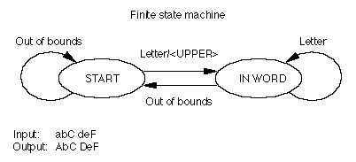
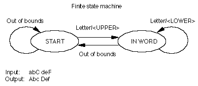
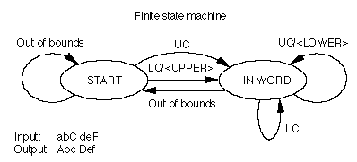
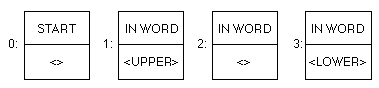
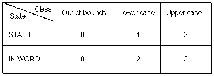

# 苹果高级字体字体表

本章讨论了许多Apple Advanced Typography（AAT）表使用的三个表组件，并总结了所有AAT表。 此外，还总结了本文档中包含的每个AAT字体表的作用。

## 表组件

本节中描述的三个表组件是二进制搜索表，查找表和状态表。 二进制搜索表包含有助于在其所在表中进行信息的二进制搜索的数据。查找表将字形索引映射到没有上下文的信息。 状态表将字形索引映射到具有上下文的动作。

## 二进制搜索表

因此，文本处理将花费尽可能少的时间，许多字体表包含的信息可加快搜索与特定字形索引关联的条目的过程。 此信息包含在二进制搜索标头或BinSrchHeader结构中。 BinSrchHeader结构的格式如下：

|类型|名称|描述|
|-|-|-|
uint16|unitSize|此搜索的查找单元的大小（以字节为单位）。
uint16|nUnits|要搜索的先前尺寸的单位数。
uint16|searchRange|unitSize的值乘以小于或等于nUnits的值的2的最大幂。
uint16|entrySelector|对数以2为底的最大幂2小于或等于nUnits的值。
uint16|rangeShift|unitSize的值乘以nUnits的差值减去2的最大乘方小于或等于nUnits的值。

为了保证二进制搜索终止，您必须在要搜索的数据末尾包含一个或多个特殊的“搜索表末尾”值。 需要包含的终止值的数量是特定于表的。 指示二进制搜索终止的值为0xFFFF。 这个特殊值的存在使搜索逻辑尽可能快，并且在字体表中的额外空间中花费的开销相当小。 二进制搜索头通常在查找表中使用。

请注意，searchRange，entrySelector和rangeShift字段是多余的。 二进制搜索表旨在与1980年代后期可用的处理器有效地协同工作； 这三个字段的包含允许在此类处理器上使用非常有效的查找算法。 现代处理器不需要这种优化，并且不再使用这三个字段。

## 查找表

查找表提供了一种查找有关字形索引的信息的方法。

一些查找表执行简单的数组类型查找。 其他涉及分组，允许您以相同的方式处理许多不同的字形索引（即查找有关它们的相同信息）。 查找表的顶级描述包含格式编号和特定于格式的标头。 查找表头的格式如下：

|类型|名称|描述|
|-|-|-|
uint16|format|该查询表的格式。 有五种查找表格式，每种格式都有一个格式编号。
variable|fsHeader|特定于格式的标头（以下各节中描述了每个标头），然后是实际的查找数据。 fsHeader结构的详细信息以不同的格式给出。

在以下描述中将查找的结果称为查找值。 对于不同类型的表，查找值的解释不同。 处理特定表的每个页面均提供有关如何解释特定于该表的查找值的信息。

查找表有五种格式：

|格式|描述|
|-|-|
0|简单数组格式。 查找数据是由字形索引索引的查找值数组。
2|段单一格式。 每个不重叠的段都有一个单独的查找值，该值适用于该段中的所有字形。 段定义为字形索引的连续范围。
4|段数组格式。 执行段映射（与格式2一样），但不是对段中所有字形的单个查找值，而是段中的每个字形都有自己的单独查找值。
6|单表格式。 查找数据是<glyph index，lookup value>对的排序列表。
8|整理后的数组格式。 查找数据是由字形索引索引的简单修剪数组。
10|扩展的修剪数组格式。 查找数据是由字形索引索引的简单修剪数组。

### 简单数组格式0查找表

格式为0的查找表的fsHeader字段提供了一个查找值数组，该查找值由字形索引索引。 这些值表示的内容取决于您要使用的查找表的字体表。

### 段单一格式2查找表

格式2查找表的fsHeader字段将字形索引的某些部分划分为连续的范围或段。 段单一格式2查找表的格式如下：

|类型|名称|描述|
|-|-|-|
|BinSrchHeader|binSrchHeader|此二进制搜索的单位为LookupSegment类型，并且始终具有最小长度6。
|LookupSegment|segments[]|实际的段（segments）。 必须已经根据每个单词中的第一个单词（每个段中的最后一个字形）对它们进行了排序。

格式2 LookupSegment的格式如下：

|类型|名称|描述|
|-|-|-|
|uint16|lastGlyph|该段中的最后一个字形索引
|uint16|firstGlyph|该段中的第一个字形索引
|variable|value|查找值（仅一个）

对于格式2查找表，单个查找值将均匀地应用于段中的所有字形。

### 段数组格式4查找表

格式4查找表的fsHeader字段将字形索引的某些部分划分为连续的范围或段。 段数组格式4查找表的格式如下：

|类型|名称|描述|
|-|-|-|
|BinSrchHeader|binSrchHeader|此二进制搜索的单位为LookupSegment类型，并且始终具有最小长度6。
|LookupSegment|segments[]|实际的段（segments）。 必须已经根据每个单词中的第一个单词（每个段中的最后一个字形）对它们进行了排序。

格式4 lookupSegment的格式如下：

|类型|名称|描述|
|-|-|-|
|uint16|lastGlyph|该段中的最后一个字形索引
|uint16|firstGlyph|该段中的第一个字形索引
|uint16|value|从表开始到数据的16位偏移(A 16-bit offset from the start of the table to the data)

单表格式6查找表
格式6查找表的fsHeader字段将查找数据存储为字形索引及其查找结果对的排序列表。 单个表Format 6查找表的格式如下：

|类型|名称|描述|
|-|-|-|
|BinSrchHeader|binSrchHeader|此二进制搜索的单位为LookupSegment类型，并且始终具有最小长度4。
|LookupSingle|entries[]|实际条目，按字形索引排序。

格式6 LookupSingle的格式如下：

|类型|名称|描述|
|-|-|-|
|uint16|glyph|字形索引
|variable|value|查询值

## 剪裁(Trimmed Array)数组格式8查找表

格式8查找表的fsHeader字段将查找数据存储为由字形索引索引的简单剪裁数组(Trimmed Array)。 它与[扩展见剪裁数组(Trimmed Array)格式10查找表](https://developer.apple.com/fonts/TrueType-Reference-Manual/RM06/Chap6Tables.html#LookupFormat10)的不同之处在于，查找值的大小必须为两个字节。

修剪后的数组格式8查找表的格式如下：

|类型|名称|描述|
|-|-|-|
|uint16|firstGlyph|剪裁数组中包含的第一个字形索引。|
|uint16|glyphCount|字形总数（等于最后一个字形减去firstGlyph的值加1）。|
|variable|valueArray[]|查找值（由字形索引索引减去firstGlyph的值）。 值数组中的条目必须为两个字节。|

## 扩展剪裁数组格式10查找表

格式10查找表的fsHeader字段将查找数据存储为由字形索引索引的简单剪裁数组。 它与剪裁数组格式8查找表的不同之处在于，它允许查找值大小，而不是两个字节。

扩展的剪裁数组格式10查找表的格式如下：

|类型|名称|描述|
|-|-|-|
|uint16|unitSize|此查找表的查找单元的大小（以字节为单位）。 允许的值为1、2、4和8。
|uint16|firstGlyph|剪裁数组中包含的第一个字形索引。
|uint16|glyphCount|字形总数（等于最后一个字形减去firstGlyph的值加1）。
|variable|valueArray[]|查找值（由字形索引索引减去firstGlyph的值）。

## 状态表

以下对状态表的介绍性讨论使用少量的类和状态来描述基本概念。 AAT表使用的全套预定义类和状态在[类子表](https://developer.apple.com/fonts/TrueType-Reference-Manual/RM06/Chap6Tables.html#ClassSubtable)部分中定义。

在对齐，字距调整和字形变形表中使用状态表来提供字形处理。 状态表的基本格式在本节中给出。 表特定状态表格式数据包含在描述特定表的页面中。 

状态是用于将一类字形映射到特定条件（例如“单词的中间”）和修改字形流的动作的一组规则。 有限状态机维护状态数组的索引，称为当前状态。 当前状态被初始化为一个特殊的值，称为初始状态。 有限状态机内从一种状态到另一种状态的运动称为过渡。

AAT表提供支持行中字形的上下文处理的信息。 该行通过字形数组（字形记录的数组）在内存中表示，该字形记录按显示顺序存储。 每个字形记录都包含有关字形的数据，包括其字形索引。 字形数组由有限状态机处理，该有限状态机将字形范围作为输入，并且可以响应或不响应其特性更改输入。 

有限状态机将输入字形映射到类中。 就文本而言，类是具有某些共同属性的字形的集合。 类的示例可能是算术数字，第一个字形为“ f”时形成连字的字母以及分隔单词的字形。 对于字形数组中的每个字形，有限状态机都会执行适合字形的类和状态的操作。

每个动作总是导致状态改变，有时导致类改变。 状态的改变可以是从一种状态到相同状态或不同状态。 然后，有限状态机继续处理字形数组中的下一个字形。 在处理了字形数组中的所有字形之后，有限状态机将在特殊状态所指示的当前状态下执行操作，该特殊类称为文本结尾或行尾。

为了表示有限状态机的操作，程式化的流程图可用于显示状态，类和动作之间的关系。状态用椭圆表示，动作用箭头表示。箭头标题是发生指定操作的类。根据状态和类，动作将处于相同状态（由循环显示回到该状态）或指示状态变化（由从一个状态到另一状态的箭头显示）。

所有状态表进程均以启动状态开始。这是该图的初始状态。让我们来看一个有限状态机的示例及其在状态表中的相应解释。

如果将字体的所有字形分为“字母”（A，B，a，b等）和“超出范围”（不是字母的任何东西）两类，则可以设计一个有限状态机在文本流中将每个单词的首字母大写。机器在START状态和数据流的开始处开始。它确定第一个字形是“字母”类还是某个其他类的成员，在这种情况下，字形是“超出范围”。如果字形是字母，则机器将字母大写并进入IN WORD状态。如果下一个字形在“字母”类中，则机器将保持在“输入字”状态，并且不执行任何操作。如果该字形在另一个类中，则它是“超出范围”的，并且机器将返回到START状态。

请注意，此有限状态机会将标点符号解释为“超出范围”，并大写序列中的下一个字形。 结果，单词“不会”将被转换为“不会”。

下图给出了一个有限状态机的示意图，该状态机将单词中的第一个字母大写。

您可以通过指定其他规则来使此有限状态机更加复杂：仅将每个单词的第一个字母大写，并将所有后续字母小写。 您可以将新规则添加到IN WORD状态，该规则告诉计算机将“字母”类中的所有字形更改为小写形式，如下图所示：

但是，此有限状态机始终将每个单词的第一个字形更改为大写形式，而不管其是否已经是大写形式，并且将单词的后续字形更改为小写，即使它们已经是小写。 您可以通过添加更多的类（例如“大写”和“小写”（在下图中缩写为UC和LC））来最小化此有限状态机的工作。 当有限状态机开始于START状态时，如果遇到字母，它将移至IN WORD状态，但仅对“小写”类的成员执行操作。 在IN WORD状态下，它将循环浏览字形，如果它们是“大写”类的成员，则对其进行更改；如果它们是“小写”类的成员，则不进行任何操作；如果它们属于“小写”类，则返回到START状态。 “越界”。 这样，有限状态机仅更改那些不适合其在单词中使用的字形； 所有其他都保留下来。 

状态表表示总结并组织了有限状态机用来指定该机可以执行的类，状态和操作的数据。 下图显示了上图中描述的有限状态机的四个可能的过渡和动作对。 该对中的第一个成员是机器应进入的状态，第二个成员是机器应采取的动作（如果有）。 输入“ <>”表示有限状态机不应采取任何措施，应返回到当前状态。

这些对的状态表将创建一个数组，其中包含所有可能的状态（行）和可能的类（列），如下图所示。 根据开始状态和字形的类别，机器可以决定适当的过渡和采取的措施。

状态表数据结构分为四个部分：状态头，类子表，状态数组和条目子表。 状态标头包含有关状态大小和其他子表的偏移量的信息。 类子表允许您将字体的字形划分为不同的类。 状态数组描述了表中状态的顺序。 条目子表包含类和与状态有关的操作。

这些子表中的一些使用 per-glyph 表。 这些表保存有关字体中每个字形的某种类型的信息（例如，偏移量），这些信息与字形索引相关。

状态表以状态表头（称为StateHeader数据类型）开头。 状态表头的格式如下：

|类型|名称|描述|
|-|-|-|
|uint16|stateSize|状态的大小，以字节为单位。 大小限制为8位，尽管该字段为16位用于校准。
|uint16|classTable|从状态表的开始到类子表的字节偏移量。
|uint16|stateArray|从状态表的开始到状态数组的字节偏移量。
|uint16|entryTable|从状态表的开始到条目子表的字节偏移量。

## 类子表

class子表将字体的字形索引映射到类中。 子表由第一个字形的字形索引，类表中的字形数量以及与每个字形关联的类代码数组组成。 要限制类表的大小，您应该设计字体，以使由给定状态表处理的字形具有较小范围内的字形索引。

|类型|名称|描述|
|-|-|-|
|uint16|firstGlyph|该段中的第一个字形索引
|uint16|nGlyphs|类表中字形的数量。
|uint8|classArray[]|类代码（由字形索引减去firstGlyph索引）。 类代码的范围是从0到stateSize减去1的值。

前四个类代码（0、1、2和3）是预定义的。 后续的类代码可以由字体开发人员定义。 类代码及其描述如下：

|类代码|描述|
|-|-|
|0|文字结尾。 此类不应出现在class数组中。|
|1|(out of bounds)越界。 所有小于firstGlyph或大于或等于firstGlyph加nGlyphs的字形索引将自动分配为类代码1。类代码1也可能出现在类数组中。
|2|删除字形。 有时，上下文处理通过将字形索引更改为已删除的字形索引0xFFFF来从字形数组中删除字形。 该字形代码被自动分配为“已删除”类，该类不应出现在类数组中。|
|3|行结束。 此类不应出现在class数组中。|
|4 通过（stateSize-1）|你的类代码。 通常可以用来满足字体需求的类代码包括字母，空格和标点符号。 例如，状态表可以将字母字形定义为4类，将空格字形定义为6类，将标点符号定义为7类。|

## 状态数组

状态数组实际上是一个数组数组。 状态数组中的每个条目本身都是uint8值的数组，这些数组表示进入到条目子表中的索引，该索引对应于此状态表定义的每个类代码。 前两个状态是预定义的。 状态0是文本状态的开始。 状态1是线路状态的开始。 在文本处理期间，这两个状态之一将被选作初始状态（取决于上下文）。 字体设计者可以使用所有其他状态。

## 条目(入口)子表
条目（入口）子表包含状态表操作信息。 条目（入口）子表中的值具有以下格式：
