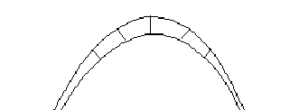
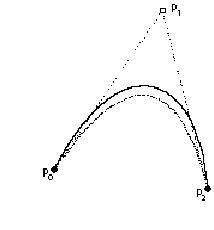
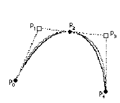
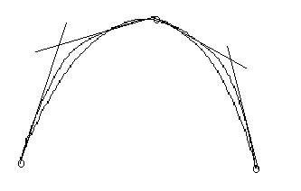

# 将轮廓转换为 TrueType 格式
本节考虑将轮廓从其他轮廓格式转换为 TrueType 格式支持的二次样条时所涉及的一些问题。

任何轮廓字体设计中的一个关键问题是用于表示字形的曲线与预期字形设计的相似程度。对于直接以 TrueType 格式开发的设计，所使用的曲线精确地定义了设计。从其他格式转换或数字化纸质设计时会出现更复杂的问题。

这里的问题在于确定可接受的误差或公差值。一旦确定了这个数字，转换就变成了在规定的公差范围内找到一组描述原始设计的二次曲线的问题。

虽然给定的曲线可能无法以二次样条格式精确表示，但该曲线始终可以按要求精确表示。此过程中棘手的部分是确定所需的准确度，然后决定如何确定给定的字体是否符合准确度指南。

多少误差是可以接受的？
如果轮廓描述中可能出现的错误小于预期使用的最敏感渲染设备所固有的错误，则字体设计中可达到的精度不会丢失。根据经验法则，小于 em 方块 1/1000 的错误通常符合此准则。

在尝试确定所选的误差容差是否可接受时，必须查看生成的输出。字母“s”的质量通常是该容差可接受性的良好指标，因为存在许多曲线和过渡点。

如何测量误差？
有多种方法可以测量曲线近似中涉及的误差。所有可用的方法都有相关的陷阱。本书只能建议一些可能采取的方法并警告一些陷阱。
在查看原始曲线和用于近似它的曲线时，可能很容易通过查看两个参数方程的曲线值来测量近似误差，这两个参数方程指定两条曲线的 t 值相同。但是，这种方法可能不起作用，因为两条曲线很可能具有不同的速度，因此有必要根据弧长重新参数化这两条曲线。

在查看原始曲线和用于近似它的曲线时，可能很容易通过查看两个参数方程的曲线值来测量近似误差，这两个参数方程指定两条曲线的 t 值相同。但是，这种方法可能不起作用，因为两条曲线很可能具有不同的速度，因此有必要根据弧长重新参数化这两条曲线。

确定误差的更好方法是沿垂直线测量原始曲线到新曲线的距离，如下图 1 所示。

**图 1** 测量曲线近似中的误差

## 从其他格式转换
如果将纸质设计直接数字化为二次样条曲线，则在 TrueType 格式中描述轮廓的主要工作已经完成。但是，如果将艺术作品数字化为其他类型的曲线，则需要将这些曲线转换为二次样条曲线。

如果您从其他格式转换，则您的目标不应该是原始曲线和新曲线之间的精确匹配。根据原始格式，此目标可能无法实现。此外，精确匹配对于获得高质量轮廓不是必需的。更合适的目标是以足够的精度呈现原始设计，以使轮廓更接近原始设计的额外努力不会在最终输出中产生差异。

从三次到二次

您获得的轮廓可能会被描述为三次曲线。如果是这样，则无法在两种格式之间进行精确转换。但是，可以将曲线描述转换为所需的精度。也就是说，你可以将翻译中的任何错误减少到任意小的容差范围内。

以下段落概述了在这两种格式之间进行转换的方法。

1. 将每条轮廓分解为“曲线段”，即，在这些段上用一种曲线替换另一种曲线是有意义的。
2. 在拐点处细分每条曲线。
拐点是曲率改变方向的位置。抛物线不能有拐点，因此有拐点的曲线不能用二次样条成功地近似。但这不是问题，因为这种曲线  可以在拐点处细分。
3. 拟合到选定的公差。
此步骤的目标是找到最小（或接近最小）数量的二次样条，这些样条将以小于选定公差的误差因子近似曲线。实现此目的的方法是用单个抛物线近似曲线，测量误差，将该误差与公差进行比较。如果误差在公差范围内，则拟合成功。如果误差超出容差范围，则需要做更多的工作。图 2 展示了首次尝试使用二次样条函数近似曲线。

**图 2** 首次用抛物线近似曲线

减少误差的一种方法是采用一种称为递归细分的过程。也就是说，将曲线分成两部分，对每个部分拟合一个二次函数，并根据公差检查误差。重复细分过程，直到满足公差条件。分割曲线的位置有两种可能的选择：中点或误差最大的位置。图 3 显示了细分曲线的过程，以便找到两条与原始曲线整体拟合更好的二次曲线。

**图 3** 细分曲线以减少误差

将曲线一分为二并完成曲线拟合后，您可以通过满足所谓的等波纹条件来优化最终结果（即最小化使用的二次函数数量）。两条曲线中的每一条都有自己的误差项。然而，令人担忧的是这两个误差项中的最大值。通过巧妙选择中间点，您可以近似地使两个误差项相等，从而减少最大误差项。图 4 说明了通过改变中间点的选择来最小化误差项的尝试。

**图 4** 移动分割点以均衡误差因子s

给定一个公差，有几种方法可以生成与原始三次函数匹配的二次函数。最佳方法保证使用最少数量的二次函数。一般来说，将给定轮廓表示为指定公差需要的二次函数多于三次函数。此方法需要相当长的处理时间，因此如果您需要进行即时转换，则该方法并不实用。