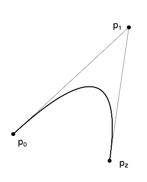
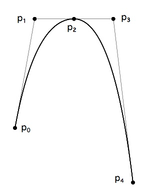
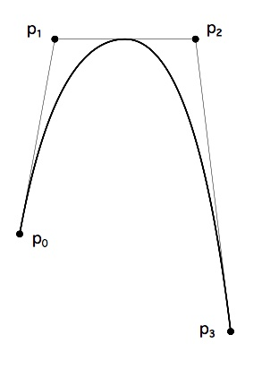

# 数字化字体设计

## 介绍

本章概述了数字化字形的主要注意事项：数字化 TrueType 格式的字形设计。 [TrueType 字体文件](/FontTables/FontTables.html)中，TrueType 字形轮廓在字体文件中表示的格式的完整规范。

## 点

在最低层，TrueType 字体中的每个字形都由网格上的一系列点来描述。虽然两个曲线上点足以描述一条直线，但在两个曲线上点之间添加第三个曲线外点可以描述抛物线。在这种情况下，每个曲线上点代表曲线的终点，曲线外点是控制点。更改三个点中任何一个的位置都会更改定义的曲线的形状。

<!-- （这句话可能不是很好理解，看下面的图片，点<cite>p0</cite>和点 <cite>p2</cite> 都可以看做这条曲线的终点。） -->
<!-- <cite>p0</cite> -->
<!-- <cite>p1</cite> -->
<!-- <cite>p2</cite> -->
这种曲线的定义可以正式如下：给定三个点 <cite>p0</cite>、<cite>p1</cite>、<cite>p2</cite>，它们定义了一条从点 <cite>p0</cite> 到点 <cite>p2</cite> 的曲线，其中 <cite>p1</cite> 是偏离曲线的点。 控制点 <cite>p1</cite> 位于曲线的切线在点 <cite>p0</cite> 和 <cite>p2</cite> 的交点处。 因此 <cite>p0</cite>, <cite>p1</cite> 在点 <cite>p0</cite> 处与曲线相切。 类似地，<cite>p2</cite>，<cite>p1</cite> 在点 <cite>p2</cite> 处与曲线相切。 这三个点指定的曲线由参数方程定义。 对于 0 到 1 的 t，p(t) 的位置如图所示：

p(t) = (1-t)2<cite>p0</cite> + 2t(1-t)<cite>p1</cite> + t2<cite>p2</cite>

以上描述的曲线是贝塞尔二次曲线。 二次曲线如图 1 所示：

**图1**

由三个控制点定义的二次曲线。

本质上是抛物线的曲线可以用一条二次曲线来表示。 更复杂的曲线可以用几条相连的曲线来表示。 这些组件的切线连续连接产生二次样条。 当曲线以它们的共享点具有相同切线的方式连接时，就会发生这种连接。

如果每个曲线点都在连接两个侧翼控制点的线上，则连接的二次曲线具有一阶连续性和切线连续性。

这样的曲线如图 2 所示。这里两条曲线 p0、p1、p2 和 p2、p3、p4 在它们的公共点 p2 处连接。 请注意，在图中，点 p1、p2 和 p3 是共线的。

**图 2**

二次曲线共享一个共同的曲线上点

也可以通过删除点 p2 来指定图 2 中所示的曲线少一个点。 点 p2 不是严格定义曲线所必需的，因为它暗示了它的存在，并且它的位置可以从其他点给出的数据中重建。 对剩余点重新编号后，我们得到了图 3 所示的曲线。

**图 3**

具有隐含曲线上点的二次曲线

通过组合曲线和直线，可以构建复杂的字形。 这种字体如下图 4 所示。 定义字形的曲线上点显示为黑色小圆圈。 偏离曲线点显示为小的空心圆圈。

**图 4**

带有曲线上和曲线外点的字形轮廓

## 轮廓

在相对简单的字形中，例如图 4 中所示的字母 c，定义字形的点序列组合起来形成称为轮廓的闭合形状。 在更复杂的字形中，例如下图 5 中所示的字母 B，点序列定义了三个不同的闭合形状，每个都是轮廓。

**图 5**

具有三个轮廓的字形轮廓

从这些例子可以推断，字形可以有零个或多个轮廓。 （字形空间有一个提前宽度但没有其他可见的表现形式，其轮廓为零。）

## 轮廓方向：

在定义轮廓时，字体制造商必须遵循许多规则。 轮廓中的点必须从第一个轮廓点 0 开始连续排序。后续轮廓将从第一个未使用的数字开始。 必须按照字体文件中指定的顺序从一个点到另一个点来描述每个轮廓。