# 数字化字体设计

## 介绍

本章概述了数字化字形的主要注意事项：数字化 TrueType 格式的字形设计。 [TrueType 字体文件](/FontTables/FontTables.html)中，TrueType 字形轮廓在字体文件中表示的格式的完整规范。

## 点

在最低层，TrueType 字体中的每个字形都由网格上的一系列点来描述。虽然两个曲线上点足以描述一条直线，但在两个曲线上点之间添加第三个曲线外点可以描述抛物线。在这种情况下，每个曲线上点代表曲线的终点，曲线外点是控制点。更改三个点中任何一个的位置都会更改定义的曲线的形状。

<!-- （这句话可能不是很好理解，看下面的图片，点<cite>p0</cite>和点 <cite>p2</cite> 都可以看做这条曲线的终点。） -->
<!-- <cite>p0</cite> -->
<!-- <cite>p1</cite> -->
<!-- <cite>p2</cite> -->
这种曲线的定义可以正式如下：给定三个点 <cite>p0</cite>、<cite>p1</cite>、<cite>p2</cite>，它们定义了一条从点 <cite>p0</cite> 到点 <cite>p2</cite> 的曲线，其中 <cite>p1</cite> 是偏离曲线的点。 控制点 <cite>p1</cite> 位于曲线的切线在点 <cite>p0</cite> 和 <cite>p2</cite> 的交点处。 因此 <cite>p0</cite>, <cite>p1</cite> 在点 <cite>p0</cite> 处与曲线相切。 类似地，<cite>p2</cite>，<cite>p1</cite> 在点 <cite>p2</cite> 处与曲线相切。 这三个点指定的曲线由参数方程定义。 对于 0 到 1 的 t，p(t) 的位置如图所示：

p(t) = (1-t)2<cite>p0</cite> + 2t(1-t)<cite>p1</cite> + t2<cite>p2</cite>

以上描述的曲线是贝塞尔二次曲线。 二次曲线如图 1 所示：

**图1**

由三个控制点定义的二次曲线。

本质上是抛物线的曲线可以用一条二次曲线来表示。 更复杂的曲线可以用几条相连的曲线来表示。 这些组件的切线连续连接产生二次样条。 当曲线以它们的共享点具有相同切线的方式连接时，就会发生这种连接。

如果每个曲线点都在连接两个侧翼控制点的线上，则连接的二次曲线具有一阶连续性和切线连续性。

这样的曲线如图 2 所示。这里两条曲线 p0、p1、p2 和 p2、p3、p4 在它们的公共点 p2 处连接。 请注意，在图中，点 p1、p2 和 p3 是共线的。

**图 2**

二次曲线共享一个共同的曲线上点

也可以通过删除点 p2 来指定图 2 中所示的曲线少一个点。 点 p2 不是严格定义曲线所必需的，因为它暗示了它的存在，并且它的位置可以从其他点给出的数据中重建。 对剩余点重新编号后，我们得到了图 3 所示的曲线。

**图 3**

具有隐含曲线上点的二次曲线

通过组合曲线和直线，可以构建复杂的字形。 这种字体如下图 4 所示。 定义字形的曲线上点显示为黑色小圆圈。 偏离曲线点显示为小的空心圆圈。

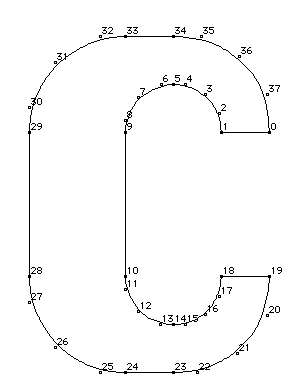

**图 4**

带有曲线上和曲线外点的字形轮廓

## 轮廓

在相对简单的字形中，例如图 4 中所示的字母 c，定义字形的点序列组合起来形成称为轮廓的闭合形状。 在更复杂的字形中，例如下图 5 中所示的字母 B，点序列定义了三个不同的闭合形状，每个都是轮廓。

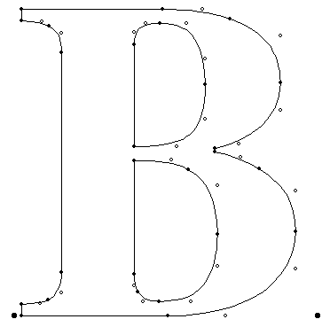

**图 5**

具有三个轮廓的字形轮廓

从这些例子可以推断，字形可以有零个或多个轮廓。 （字形空间有一个提前宽度但没有其他可见的表现形式，其轮廓为零。）

### 轮廓方向：

在定义轮廓时，字体制造商必须遵循许多规则。 轮廓中的点必须从第一个轮廓点 0 开始连续排序。后续轮廓将从第一个未使用的数字开始。 必须按照字体文件中指定的顺序从一个点到另一个点来描述每个轮廓。

指定点的顺序很重要，因为它决定了轮廓的方向。 方向始终是从较低的点数向较高的点数。

字形轮廓的方向用于确定轮廓定义的形状的哪些部分是填充的（黑色），哪些部分是未填充的（白色）。

在进行此确定时，TrueType 使用非零绕组数规则（the non-zero winding number rule）。 有关应用此规则的信息，请参阅[区分字形的内部和外部(字体引擎)](./Font_Engine.md)。

### 相交轮廓：

TrueType 允许两个轮廓相交的可能性。 此功能可以方便地描述字母的轮廓，例如 Q。在这种情况下，将调用非零缠绕数规则（the non-zero winding number rule）来确定适当的填充。 当放置在其他黑色填充区域上时，黑色填充区域将保持黑色。 下面的图 6 显示了这种效果的一个示例。

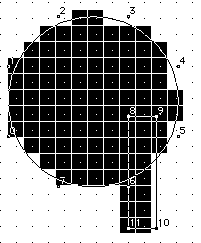

**图 6**

重叠轮廓

### 复合字形：

通常将字体中的一些字形组合起来以产生新的字形很方便。 这通常用于在字体同时包含基本字符和重音字符的情况下生成重音字符。 TrueType 通过复合字形机制允许这些组合。 图 7 显示了一些可能以这种方式创建的字形。

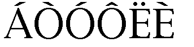

**图 7**

组件字形

复合字形由基础字形和添加以产生新字形的第二个字形组成。 新的字形结合了这两个组件来创建新的复合形式。 如果需要，可以使用两个以上的组件创建字形。

## 复合字形放置

为了帮助相对于基本字形放置附加字形，必须提供指定后续字形相对于第一个字形中的点的偏移量的信息。

组合成复合字形的每个字形可以按不同的量进行缩放。 这可能很有用，例如，通过组合分数字形和两个数字来创建分数。

组成复合字形的每个字形都可以有相关的指令。 复合字形作为一个整体也可以有指令。

复合字形规范的详细描述在[复合字形](./FontTables/'glyf'.md)中给出。

## 主网格

构成字形轮廓规范的点位于网格上，其单位不可分割，大小由字体创建者定义。 这些单位被称为字体单位。

网格是一个二维坐标系，其 x 轴描述水平方向的移动，y 轴描述垂直方向的移动。 网格原点的坐标为 (0,0)。 网格：sizegrid 不是无限平面。 每个点必须在 -16384 到 +16383 字体单位的范围内。

在创建字形轮廓时，字体创建者使用了一个源自 em 正方形的旧版式概念的假想正方形。 这个方格可以被认为是一个在其上绘制字符的数位板，尽管字符可以超出数位板或 em 方格。 字体单元的大小相对于 em 方格的大小决定了网格的粒度。 换句话说，网格的分辨率是每个 em 字体单元数的函数。

每个 em 的字体单元数越多，可以在字体文件中表示的设计就越微妙。 在确定什么是合适的网格粒度时，字体设计者应该考虑潜在输出设备的最大分辨率，并考虑到数据转换中可能出现的精度损失。 如果每个 em 的单位是 2 的幂，则轮廓缩放将最快。 例如，Apple 核心字体设计在每 em 2048 个单位的网格上。

图 8 显示了两个不同的网格。 左边的网格不能代表字母 A 原始设计的微妙之处。右边的网格，每个 em 的单位数是四倍，更接近，尽管需要更精细的粒度才能忠实地呈现原始设计。

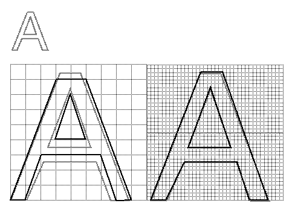

**图 8**

定义主外轮廓。

## 在网格中放置字形

定义字形形状的坐标也决定了字形相对于坐标网格的位置。 虽然没有正式要求字形与网格具有一致的关系，但在实践中，应用程序依赖于某些约定的存在来帮助文本布局。

在旨在水平布局的罗马字体中，0 的 y 坐标通常对应于字体的基线。 没有标准含义与 x 坐标 0 相关联，但如果字体代工厂选择标准含义，应用程序将受益。 一个常见的约定是放置字形原点，以便字形左边缘的值等于左侧方位角。 此选项如图 9 所示。也可以将字形的美学中心放置在 x 轴上，如图 10 所示。

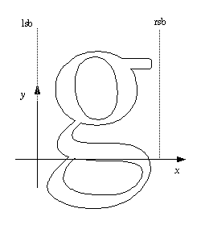

**图 9**

字形的左侧方位角是 x 零。

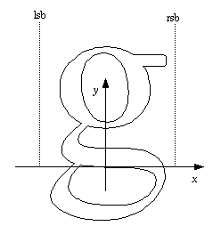

**图 10**

字形的美学中心是 x 零。

非罗马字体可能希望对 x 轴和 y 轴的含义使用其他约定。 然而，为了与突出显示和插入符号进行良好的交互，希望字符的主体大致位于前进宽度的中心。 例如，对称字符应该具有相等的左右侧方位。 例如，一个字形可能被放置在其美学中心位于 x 坐标值 0 处。放置在一个列中的字形使得它们的 x 坐标值 0 重合在渲染时将看起来很好地居中。 此选项可用于汉字或其他垂直排版的字体。 图 11 显示了这种放置的一个示例。

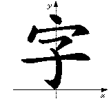

**图 11**

在字形的美学中心带有 x 零的汉字字符

另一种选择是放置每个字形，使其最左边的轮廓点的 x 值等于字形的左侧方位。

虽然在铅字印刷时代，字形不能超出 em 方格，但数字字体并没有像图 12 所示那样受到限制。em 方格可以做得足够大，以完全包含字体中的所有字形，包括重音字形 . 或者，如果证明方便的话，部分字形可能会延伸到 em 方格之外。 由于 TrueType 字体可以处理任何一种方法，因此选择取决于字体设计者的偏好。
<!-- 
em 单位 讲解
http://designwithfontforge.com/en-US/The_EM_Square.html
https://www.jianshu.com/p/8c1c7adaf394
https://www.w3.org/Style/LieBos3e/em
 -->

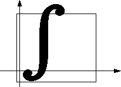

**图 12**

字符延伸到 em 方格之外

## 数字化艺术工作

TrueType 字体可能起源于纸上的一组设计。 在这种情况下，必须将绘图转换为数字数据。 将纸质设计数字化的问题可以通过两种方式中的任何一种来解决。 可以扫描艺术品并将扫描的图像用作模板。 或者，可以将手持数字化设备移动到艺术作品上，并记录描述字形形状的关键点。 临界点是角点和切点。 处于极值的曲线点也很重要。

手动数字化的优点是它允许工作人员消除原始图像中的任何粗糙度。 在将艺术作品数字化时，绘图的大小很重要，因为它将是决定最终结果准确性的关键因素。 增加尺寸可以更好地控制细节。 根据经验，您应该以两倍于您希望在最终结果中实现的精度来数字化艺术品。 例如，要将 2048 单位的 TrueType 字体数字化为 em，您必须考虑到在数字化过程中会丢失一些准确性这一事实。 这意味着，如果您的数字化数位板每英寸有 300 个点，您将需要使用尺寸至少为 7 英寸 x 7 英寸并且可能为 13 x 13 英寸的绘图。 (2048/300=6.28)

那些最喜欢在屏幕上工作的人可能更喜欢扫描字形图像并将扫描的图像用作指南。 也可以使用鼠标直接在计算机屏幕上创建原创艺术作品。 大型显示器在此类工作中是一个优势，但如果没有高分辨率显示器，精确拟合曲线可能需要放大曲线部分。

## TrueType 格式创建外轮廓

除了由直线和抛物线组成的字形之外，对于描述特定字形的曲线没有单一的最佳描述。 数字化字形所固有的问题之一是为预期用途找到可接受的解决方案。

一个好的字形轮廓是保留原始设计中预期外观的轮廓。 对于大多数字体，曲线应该是平滑的，没有意外的凹凸、平点或凹坑。 有时，字体设计可能会利用曲线外观的不均匀性。

使用的曲线必须与预期的字形设计有多接近？ 对于直接以 TrueType 格式开发的设计，答案很简单。 使用的曲线将准确定义设计。 从其他格式转换或将纸质设计数字化时会出现更复杂的问题。 将大纲转换为 TrueType 格式中解决了此问题。

## 需要多少点？

在描述曲线时，您应该使用的点既不要太少也不要太多。通常一条弧线可以用 3 到 4 个点来描述。具有小曲率半径的曲线和具有拐点的曲线将需要更多的点才能忠实地使用二次曲线进行渲染。在考虑完整渲染轮廓所需的点数时，添加点不一定会产生更好的结果。用于描述曲线的点越少，存储每个字形描述所需的空间就越少，因此字体越紧凑。更少的点也会导致更快的缩放。然而，太少的点会导致失去对原始设计的保真度。因此，希望使用足够多的点来完成地转换字形的形状，但不要太多，以免造成不必要的存储空间占用或缩放速度下降。除了空间和速度的损失之外，由于数据中的噪声或舍入误差，过多的点可能会导致颤音（形状的快速调制）。最后，太多的点也会使字体更难显示。

图 13，“三个圆圈太少（左），太多（中），正好（右）。” 显示了定义圆的三种不同尝试。 在最左边的示例中，使用了四个偏离曲线的点，但不足以产生圆形。 最右边的示例使用 8 个偏离曲线点，这会产生一个圆形曲线，除了任意小的误差因子外，该曲线可以形成一个完美的圆形。 中间的例子也产生了一个精确的圆形，但使用了比必要更多的点。 特别是位于曲线切线中点的曲线上点，没有添加额外信息，可能已被省略。

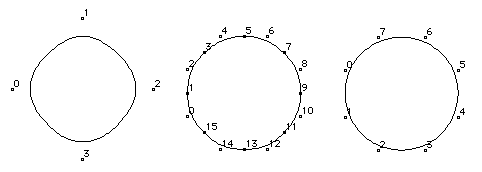

**图 13**

三圈太少（左），太多（中），正好（右）

## 点应该在放在哪里？

字形轮廓应该在极值上有点。 即用曲线点标记x值最小、y值最小、x值最大、y值最大的曲线位置。 一些用于表示轮廓字体的系统需要在切点处设置曲线上的点。 如果切点在侧翼偏离曲线点的中间，则在 TrueType 中不需要这样做。

然而，重要的是在曲线的拐点处放置一个曲线上的点。 拐点是曲线上曲率为零的点。 如果拐点恰好位于连接偏离曲线点的直线的中点，则可以暗示拐点。

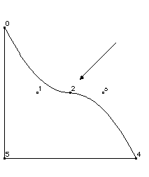

**图 14**

拐点