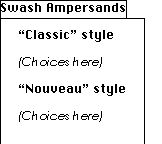

# “Zapf”表

## 一般表信息

“Zapf”表（经授权以传奇字体设计师 Hermann Zapf 命名）包含有关字体中各个字形的信息。从概念上讲，这些信息包括：

* 字形代表的文本字符串
* 一组标识符
* 一组字体特征
* 一组字形集合

### 文本字符串
文本字符串是字形所代表的 (Unicode) 文本。在仅给出字形流的情况下重新创建原始文本时，将使用此字符串。“a”字形将简单地映射到字符串 <U+0061>，而“ct”连字可以映射到字符串 <U+0063 U+0074>。

请注意，这不是将不同字符与字形关联的机制。一般来说，即使两个字符看起来完全相同（例如，拉丁文“A”、希腊文“Α”和西里尔文“а”），也应该用不同的字形绘制它们。对不同的字符重复使用字形可能会使 AAT 或 OpenType 字体功能无法正常工作，并且无法将字符明确地转换为字形。

### 标识符
在字体本身中，字形始终由其字形索引标识，而“post”表可以将单个名称与每个字形关联，但对可使用的字符和名称的长度有相当严格的限制。但是，字体设计者在处理字体时可能希望使用多个字形标识符。他们可能将正式的 PostScript 名称用于“post”表，但有他们喜欢使用的替代名称，或者希望在不同的 Adob​​e 集合中跟踪字形的 CID，甚至有关于字形的注释。所有这些都可以在“Zapf”表中作为字形标识符使用。

### 字体功能
在某些情况下，仅仅重新创建原始文本可能还不够。人们可能希望尽可能多地重新创建原始文档。

例如，考虑使用小型大写字母的文档。如果尝试从字形重建文档，则应用小型大写字母功能这一事实非常重要。 “Zapf”表允许字体设计者将特征与字形关联起来，以捕获此信息。

### 字形集合
具有丰富字形集合的字体可能为某个字符提供多个字形。常见示例有等高和比例数字、大小写和不大小写数字以及小型大写字母。出于 UI 目的，向用户提供有关给定字符可用的字形的信息很有用，这样他们就可以选择单词中间的特定花体字形版本，使文本看起来更好。生成一组用于特定目的（例如标点符号）的字形也很有用，即使它们代表不同的字符。

## 表格格式

### 标题

“Zapf”表格具有以下标题：

类型|名称|描述
|-|-|-|
|Uint16|版本设置为|2|
|Uint16|（未使用）|0|
|UInt32|extraInfo|从表的开始到额外信息空间的开始的偏移量（添加到 GlyphInfo 中的 groupOffset 和 featOffset）|

标题后面紧接着一个查找表。查找表中的值是从“Zapf”表开头到给定字形的 GlyphInfo 结构的 Uint32 偏移量。

（在“Zapf”表的版本 1 中，标题后面紧接着一个 UInt32 偏移量数组，每个字形一个。）

### GlyphInfo 结构

标题后面紧接着一个 GlyphInfo 结构数组。此数组中的每个条目大小可变；到特定 GlyphInfo 的偏移量包含在标题中的 offsets[] 数组中。GlyphInfo 结构具有以下格式：

类型|名称|描述
|-|-|-|
|UInt32|groupOffset|从 extraInfo 的开头到此字形的 GlyphGroup 或 GlyphGroupOffsetArray 的字节偏移量，如果没有则为 0xFFFFFFFF
|UInt32|featOffset|从 extraInfo 的开头到此字形的 FeatureInfo 的字节偏移量，如果没有则为 0xFFFFFFFF
|UInt8|flags|如下所述
|UInt8|num16BitUnicodes|如下所述（可能为 0）
|UInt16|unicodes[]|此字形的 Unicode 代码点（见下文）
|UInt16|numGlyphIDs|后面的 GlyphIdentifiers 数量（可能为 0）
|GlyphIdentifier|glyphIDs[]|此字形的 GlyphIdentifiers（如果有）
|（UInt8|padding2[1..3]|如果需要，在数组中的下一个 GlyphInfo 之前填充到 32 位对齐）|

目前唯一可用的 GlyphInfo.flags 值是 kIsCanonicalGlyphFlag (0x80)，它表示这是给定 Unicode 字符串的“规范”字形。在“Zapf”表的第 2 版之前，为此目的使用了标志 GlyphIdentifier (GlyphIdentifier.kind 127)。

如果所讨论的字形是给定 Unicode 字符串的首选字形，则设置 kIsCanonicalGlyphFlag。如果字形对应于单个 Unicode 字符，则当且仅当“cmap”将该字符映射到此字形时，才应设置此位。但是，该标志可用于对应于多个字符的字形。例如，Zapfino 有两个用于“es”连字的字形，名为“e_s”和“e_s.2”。该标志是为“e_s”字形设置的，而不是为“e_s.2”字形设置的。

kIsCanonicalGlyphFlag 可用于快速生成字体所涵盖的 Unicode 代码点表。此数据也可以从“cmap”表中获取，但由于“cmap”表已针对单次查找进行了优化，因此使用“cmap”表意味着要遍历 Unicode 中的每个定义字符，并检查“cmap”是否有其映射。从“Zapf”表中获取此数据要快得多。

GlyphInfo.num16BitUnicodes 字段是以下 GlyphInfo.unicodes 数组中的 UInt16 值的数量。数组本身包含此字形所代表的唯一文本字符串（UTF-16 格式）。通常，一个字形最多表示一个字符，但为了允许 BMP 之外的字符和复杂的连字，我们使用实际的 Unicode 字符串。

同样，这不允许将同一个字形用于多个字符。即使一个字形用于多个字符（例如拉丁字母 A 和希腊字母 Α）——这本身就不是一个好主意——GlyphInfo.unicodes 数组也应该只包含其中一个。同时包含两个将表明字形映射到字符序列 <U+0040 U+0391>，而不是字符 <U+0040> 或字符 <U+0391>。

如果 GlyphInfo.num16BitUnicodes 为 0，则字形不用于表示实际文本。例如，对于字形 0 来说，情况确实如此。

### 字形标识符结构
字形标识符用于识别字形，并指示其标识符类型。其结构如下：

类型|名称|描述
|-|-|-|
|UInt8|kind|这是哪种标识符|
|UInt8|data[]|标识符数据|

GlyphIdentifier.kind 字段的定义值分为四个范围：

|kind 值|类型|描述|
|-|-|-|
0 到 63|Pascal 字符串|紧跟在类型字节后面的字节组成 UTF-8 格式的 Pascal 字符串；根据值的不同，此名称可能需要或不需要符合 Adob​​e 的 PostScript 字形名称指南
64 到 126|2 字节二进制|紧跟在类型字节后面的字节应被视为 16 位数量的两个字节（大端字节序）。请注意，对齐不能保证，因此读取此值的软件应按字节进行。值的解释（无论是直接数值、“名称”表索引还是其他内容）由实际值控制。有关更多详细信息，请参阅下面的描述。
127|2 字节二进制|紧跟在类型字节后面的字节应被视为 16 位标志字段的两个字节（大端字节序）。请注意，对齐不能保证，因此读取此值的软件应按字节进行。这解决了 GlyphInfo 结构原始设计中缺少标志字段的问题。
128 至 255|保留|这些值尚未定义，不得使用。

目前并非所有这些值都与特定标识符类型相关联，但使用范围允许解析器正确处理 GlyphIdentifiers，即使它们不知道其确切含义。

GlyphIdentifier.kind 字段当前定义的具体值如下：

类型|名称|描述
|-|-|-|
|UInt8|类型|（UTF-8 Pascal 字符串）
|||0=通用 PostScript 名称（即符合所有命名约定的名称）
|||1=Apple PostScript 名称
|||2=Adobe (AGL) PostScript 名称
|||3=AFII PostScript 名称
|||4=使用 Unicode 字符命名约定的字符名称
|||（以下表示直接二进制值）
|||64=日语 CID
|||65=繁体中文 CID
|||66=简体中文 CID
|||67=韩语 CID
|||（以下表示“名称”表索引）
|||68=版本历史记录注释，允许设计人员跟踪字形的版本
|||69=设计人员的简称，旨在成为字形的简短但独特的名称
|||70=设计人员的长名称，如果需要，旨在成为更完整的名称
|||71=设计人员的使用说明，旨在指导用户在什么情况下使用字形（未使用！）
|||72=设计师的历史记录，包括关于此字形如何产生以及它在风格上如何适应类型的信息
|||（以下表示双字节标志字段）
|||127=标志
|（变量）|名称|Pascal 字符串或二进制值，取决于类型的前两位，如上文所述。

Unicode GlyphIdentifier 仅应用于与单个 Unicode 字符对应的字形。通常，此类名称完全可以从 Unicode 标准中推断出来。但是，对于为 Unicode 私有使用区中使用的未编码脚本创建实验字体的设计者来说，此名称可能很有用。

目前，为标志 GlyphIdentifier 仅定义了一个标志：即 kIsCanonicalGlyph，0x8000。不应在“Zapf”表的版本 2 中使用此标志；而应改用 GlyphInfo.flags 字段中的 kIsCanonicalGlyphFlag。

请注意，对于任何对齐，无需单独填充 GlyphIdentifiers。使用的填充是针对整个 GlyphInfo 结构的。

### 字形组的结构

当向用户呈现用于选择特定字形的界面时，应用程序通常希望知道字体中逻辑上相关的字形集（或者可能是在设计者眼中相关的字形集）。为了适应这种情况，GlyphGroup 结构会收集有关相关字形的信息。GlyphGroup 是 GlyphSubgroup 结构的集合，其中每个命名组都有一个名称（通过“名称”表索引）和一个字形索引集合，这些字形索引的顺序由设计者决定。例如，如果字体包含给定字母的许多不同花饰，则设计者可以为该字母的所有字形创建组，其中每个组都有一个名称（例如“长尾”、“粗茎”等）。

“Zapf”表通过将每个字形与零个或多个字形组相关联来实现此目的，每个字形组又由一个或多个子组组成。有三种结构用于提供这些关联。

#### GlyphSubgroup 结构
GlyphSubgroup 是创建一组字形的基本结构。GlyphSubgroup 位于 extraInfo 空间中，格式如下：

类型|名称|描述
|-|-|-|
|UInt16|nameIndex|此组名称在“名称”表中的索引；值为零表示此组没有名称
|UInt16|numGlyphs|此命名组中的字形索引数；此值可能为零，在这种情况下不会有字形跟随，并且此名称是整个组的名称（此约定仅适用于组中的第一个名称）
|UInt16|glyphs[]|此组的字形索引。

注意：不要求 GlyphSubgroup 中的所有字形都用于同一个字符串。字体设计者可以完全自由地为字体中的所有标点符号添加一个 GlyphSubgroup。

#### GlyphGroup 结构
GlyphGroup 结构是 GlyphSubgroup 的数组，如下所示：

类型|名称|描述
|-|-|-|
|UInt16|numGroups|低 14 位指定定义的 GlyphSubgroups 数量；它们一个接一个地跟在这个字段后面。如果最高位为 1，则每个 GlyphSubgroup 前面都有一个 16 位标志字。第 14 位应为 0。
|(变量)|groups[]|此 GlyphGroup 的 GlyphSubgroups。每个组前面可能都有一个 16 位标志（取决于 numGroups 字段的高位）

下列标志可供使用：
|掩码|名称|描述
|-|-|-|
|0x8000|isAligned|如果此位为开，则此 GlyphSubgroup 会填充到 32 位边界
|0x4000|isSubdivided|如果此位为开，则此 GlyphSubgroup 实际上是更大单个组的细分。如果此位为关，则此组是一个唯一的自包含组。应在组中用于呈现用户界面的部分中设置此位。
|0x3FFF|（保留）|这些位当前未定义，必须为零

#### GlyphGroupOffsetArray 结构
GlyphGroupOffsetArray 结构是 GlyphGroups 偏移量的数组。它看起来像这样：

类型|名称|描述
|-|-|-|
|UInt16|numGroups| 低 14 位指定数组中 GlyphGroups 的偏移量。第 15 位应为 0，第 14 位应为 1。
|UInt16|padding| 此字段当前未使用，应设置为 0。它的存在是为了尽可能地在“Zapf”表中保持 32 位对齐。
|UInt32|groupOffsets[]| 与此 GlyphGroupOffsetArray 关联的 GlyphGroups 的偏移量（相对于 extraInfo）。此字段中的第一个值表示要用作给定字形的“替代形式”的组，如 OS X 上的字符调色板中所示。如果包含此字形的组不包含字形的替代形式，则第一个 groupOffset 应为 0xFFFFFFFF。

给定字形的 GlyphInfo.groupOffset 指向 GlyphGroup 或 GlyphGroupOffsetArray。每个都以一个两字节的 numGroups 字段开头，该字段的第 14 位用于区分两者。如果第 14 位为空，则这是一个 GlyphGroup。如果设置了第 14 位，则它是一个 GlyphGroupOffsetArray。

通常，如果满足以下条件，GlyphInfo.groupOffset 应该指向 GlyphGroupOffsetArray：

* 字形属于多个字形组，或者
* 您想要明确标记字形所属的一个组作为同一字符串的备用字形集

为了使代码更简洁，工具编写者还可以让每个 GlyphInfo.groupOffset 指向 GlyphGroupOffsetArray。

**示例**
让我们看几个示例，看看如何使用这些结构来表示各种字形分组。

一个简单的组
首先，在最简单的情况下，字体设计者希望在字体中包含十个不同的花饰符号，并且他们希望将它们放在一个组中，以便用户可以选择一个。在此示例中，每个符号字形的 GlyphInfo 结构将具有相同的 groupOffset 值，该偏移量将引用以下 GlyphGroup：

|名称|值|描述|
|-|-|-|
|numGroups|0x0001|这是一个 GlyphGroup。所有 & 符号只有一个 GlyphSubgroup，并且前面没有标志字
|nameIndex|300|此组名称在“名称”表中的索引（类似于“Swash Ampersands”）
|nGlyphs|10|属于此组的字形数量
|glyphs[]|...|& 符号的十个字形索引

应用程序可以使用此信息向用户提供十个 & 符号的简单调色板以供选择。

一个组内的多个子组
在一个稍微复杂一点的示例中，设计人员仍然有十个花饰 & 符号，并希望用户看到所有这十个符号，但将它们分组到带有标签的组中，并带有一个总体标签，因此菜单看起来会像这样：

