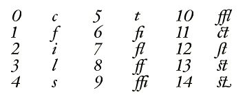

# “Zapf”表

## 一般表信息

“Zapf”表（经授权以传奇字体设计师 Hermann Zapf 命名）包含有关字体中各个字形的信息。从概念上讲，这些信息包括：

* 字形代表的文本字符串
* 一组标识符
* 一组字体特征
* 一组字形集合

### 文本字符串
文本字符串是字形所代表的 (Unicode) 文本。在仅给出字形流的情况下重新创建原始文本时，将使用此字符串。“a”字形将简单地映射到字符串 <U+0061>，而“ct”连字可以映射到字符串 <U+0063 U+0074>。

请注意，这不是将不同字符与字形关联的机制。一般来说，即使两个字符看起来完全相同（例如，拉丁文“A”、希腊文“Α”和西里尔文“а”），也应该用不同的字形绘制它们。对不同的字符重复使用字形可能会使 AAT 或 OpenType 字体功能无法正常工作，并且无法将字符明确地转换为字形。

### 标识符
在字体本身中，字形始终由其字形索引标识，而“post”表可以将单个名称与每个字形关联，但对可使用的字符和名称的长度有相当严格的限制。但是，字体设计者在处理字体时可能希望使用多个字形标识符。他们可能将正式的 PostScript 名称用于“post”表，但有他们喜欢使用的替代名称，或者希望在不同的 Adob​​e 集合中跟踪字形的 CID，甚至有关于字形的注释。所有这些都可以在“Zapf”表中作为字形标识符使用。

### 字体功能
在某些情况下，仅仅重新创建原始文本可能还不够。人们可能希望尽可能多地重新创建原始文档。

例如，考虑使用小型大写字母的文档。如果尝试从字形重建文档，则应用小型大写字母功能这一事实非常重要。 “Zapf”表允许字体设计者将特征与字形关联起来，以捕获此信息。

### 字形集合
具有丰富字形集合的字体可能为某个字符提供多个字形。常见示例有等高和比例数字、大小写和不大小写数字以及小型大写字母。出于 UI 目的，向用户提供有关给定字符可用的字形的信息很有用，这样他们就可以选择单词中间的特定花体字形版本，使文本看起来更好。生成一组用于特定目的（例如标点符号）的字形也很有用，即使它们代表不同的字符。

## 表格格式

### 标题

“Zapf”表格具有以下标题：

类型|名称|描述
|-|-|-|
|Uint16|版本设置为|2|
|Uint16|（未使用）|0|
|UInt32|extraInfo|从表的开始到额外信息空间的开始的偏移量（添加到 GlyphInfo 中的 groupOffset 和 featOffset）|

标题后面紧接着一个查找表。查找表中的值是从“Zapf”表开头到给定字形的 GlyphInfo 结构的 Uint32 偏移量。

（在“Zapf”表的版本 1 中，标题后面紧接着一个 UInt32 偏移量数组，每个字形一个。）

### GlyphInfo 结构

标题后面紧接着一个 GlyphInfo 结构数组。此数组中的每个条目大小可变；到特定 GlyphInfo 的偏移量包含在标题中的 offsets[] 数组中。GlyphInfo 结构具有以下格式：

类型|名称|描述
|-|-|-|
|UInt32|groupOffset|从 extraInfo 的开头到此字形的 GlyphGroup 或 GlyphGroupOffsetArray 的字节偏移量，如果没有则为 0xFFFFFFFF
|UInt32|featOffset|从 extraInfo 的开头到此字形的 FeatureInfo 的字节偏移量，如果没有则为 0xFFFFFFFF
|UInt8|flags|如下所述
|UInt8|num16BitUnicodes|如下所述（可能为 0）
|UInt16|unicodes[]|此字形的 Unicode 代码点（见下文）
|UInt16|numGlyphIDs|后面的 GlyphIdentifiers 数量（可能为 0）
|GlyphIdentifier|glyphIDs[]|此字形的 GlyphIdentifiers（如果有）
|（UInt8|padding2[1..3]|如果需要，在数组中的下一个 GlyphInfo 之前填充到 32 位对齐）|

目前唯一可用的 GlyphInfo.flags 值是 kIsCanonicalGlyphFlag (0x80)，它表示这是给定 Unicode 字符串的“规范”字形。在“Zapf”表的第 2 版之前，为此目的使用了标志 GlyphIdentifier (GlyphIdentifier.kind 127)。

如果所讨论的字形是给定 Unicode 字符串的首选字形，则设置 kIsCanonicalGlyphFlag。如果字形对应于单个 Unicode 字符，则当且仅当“cmap”将该字符映射到此字形时，才应设置此位。但是，该标志可用于对应于多个字符的字形。例如，Zapfino 有两个用于“es”连字的字形，名为“e_s”和“e_s.2”。该标志是为“e_s”字形设置的，而不是为“e_s.2”字形设置的。

kIsCanonicalGlyphFlag 可用于快速生成字体所涵盖的 Unicode 代码点表。此数据也可以从“cmap”表中获取，但由于“cmap”表已针对单次查找进行了优化，因此使用“cmap”表意味着要遍历 Unicode 中的每个定义字符，并检查“cmap”是否有其映射。从“Zapf”表中获取此数据要快得多。

GlyphInfo.num16BitUnicodes 字段是以下 GlyphInfo.unicodes 数组中的 UInt16 值的数量。数组本身包含此字形所代表的唯一文本字符串（UTF-16 格式）。通常，一个字形最多表示一个字符，但为了允许 BMP 之外的字符和复杂的连字，我们使用实际的 Unicode 字符串。

同样，这不允许将同一个字形用于多个字符。即使一个字形用于多个字符（例如拉丁字母 A 和希腊字母 Α）——这本身就不是一个好主意——GlyphInfo.unicodes 数组也应该只包含其中一个。同时包含两个将表明字形映射到字符序列 <U+0040 U+0391>，而不是字符 <U+0040> 或字符 <U+0391>。

如果 GlyphInfo.num16BitUnicodes 为 0，则字形不用于表示实际文本。例如，对于字形 0 来说，情况确实如此。

### 字形标识符结构
字形标识符用于识别字形，并指示其标识符类型。其结构如下：

类型|名称|描述
|-|-|-|
|UInt8|kind|这是哪种标识符|
|UInt8|data[]|标识符数据|

GlyphIdentifier.kind 字段的定义值分为四个范围：

|kind 值|类型|描述|
|-|-|-|
0 到 63|Pascal 字符串|紧跟在类型字节后面的字节组成 UTF-8 格式的 Pascal 字符串；根据值的不同，此名称可能需要或不需要符合 Adob​​e 的 PostScript 字形名称指南
64 到 126|2 字节二进制|紧跟在类型字节后面的字节应被视为 16 位数量的两个字节（大端字节序）。请注意，对齐不能保证，因此读取此值的软件应按字节进行。值的解释（无论是直接数值、“名称”表索引还是其他内容）由实际值控制。有关更多详细信息，请参阅下面的描述。
127|2 字节二进制|紧跟在类型字节后面的字节应被视为 16 位标志字段的两个字节（大端字节序）。请注意，对齐不能保证，因此读取此值的软件应按字节进行。这解决了 GlyphInfo 结构原始设计中缺少标志字段的问题。
128 至 255|保留|这些值尚未定义，不得使用。

目前并非所有这些值都与特定标识符类型相关联，但使用范围允许解析器正确处理 GlyphIdentifiers，即使它们不知道其确切含义。

GlyphIdentifier.kind 字段当前定义的具体值如下：

类型|名称|描述
|-|-|-|
|UInt8|类型|（UTF-8 Pascal 字符串）
|||0=通用 PostScript 名称（即符合所有命名约定的名称）
|||1=Apple PostScript 名称
|||2=Adobe (AGL) PostScript 名称
|||3=AFII PostScript 名称
|||4=使用 Unicode 字符命名约定的字符名称
|||（以下表示直接二进制值）
|||64=日语 CID
|||65=繁体中文 CID
|||66=简体中文 CID
|||67=韩语 CID
|||（以下表示“名称”表索引）
|||68=版本历史记录注释，允许设计人员跟踪字形的版本
|||69=设计人员的简称，旨在成为字形的简短但独特的名称
|||70=设计人员的长名称，如果需要，旨在成为更完整的名称
|||71=设计人员的使用说明，旨在指导用户在什么情况下使用字形（未使用！）
|||72=设计师的历史记录，包括关于此字形如何产生以及它在风格上如何适应类型的信息
|||（以下表示双字节标志字段）
|||127=标志
|（变量）|名称|Pascal 字符串或二进制值，取决于类型的前两位，如上文所述。

Unicode GlyphIdentifier 仅应用于与单个 Unicode 字符对应的字形。通常，此类名称完全可以从 Unicode 标准中推断出来。但是，对于为 Unicode 私有使用区中使用的未编码脚本创建实验字体的设计者来说，此名称可能很有用。

目前，为标志 GlyphIdentifier 仅定义了一个标志：即 kIsCanonicalGlyph，0x8000。不应在“Zapf”表的版本 2 中使用此标志；而应改用 GlyphInfo.flags 字段中的 kIsCanonicalGlyphFlag。

请注意，对于任何对齐，无需单独填充 GlyphIdentifiers。使用的填充是针对整个 GlyphInfo 结构的。

### 字形组的结构

当向用户呈现用于选择特定字形的界面时，应用程序通常希望知道字体中逻辑上相关的字形集（或者可能是在设计者眼中相关的字形集）。为了适应这种情况，GlyphGroup 结构会收集有关相关字形的信息。GlyphGroup 是 GlyphSubgroup 结构的集合，其中每个命名组都有一个名称（通过“名称”表索引）和一个字形索引集合，这些字形索引的顺序由设计者决定。例如，如果字体包含给定字母的许多不同花饰，则设计者可以为该字母的所有字形创建组，其中每个组都有一个名称（例如“长尾”、“粗茎”等）。

“Zapf”表通过将每个字形与零个或多个字形组相关联来实现此目的，每个字形组又由一个或多个子组组成。有三种结构用于提供这些关联。

#### GlyphSubgroup 结构
GlyphSubgroup 是创建一组字形的基本结构。GlyphSubgroup 位于 extraInfo 空间中，格式如下：

类型|名称|描述
|-|-|-|
|UInt16|nameIndex|此组名称在“名称”表中的索引；值为零表示此组没有名称
|UInt16|numGlyphs|此命名组中的字形索引数；此值可能为零，在这种情况下不会有字形跟随，并且此名称是整个组的名称（此约定仅适用于组中的第一个名称）
|UInt16|glyphs[]|此组的字形索引。

注意：不要求 GlyphSubgroup 中的所有字形都用于同一个字符串。字体设计者可以完全自由地为字体中的所有标点符号添加一个 GlyphSubgroup。

#### GlyphGroup 结构
GlyphGroup 结构是 GlyphSubgroup 的数组，如下所示：

类型|名称|描述
|-|-|-|
|UInt16|numGroups|低 14 位指定定义的 GlyphSubgroups 数量；它们一个接一个地跟在这个字段后面。如果最高位为 1，则每个 GlyphSubgroup 前面都有一个 16 位标志字。第 14 位应为 0。
|(变量)|groups[]|此 GlyphGroup 的 GlyphSubgroups。每个组前面可能都有一个 16 位标志（取决于 numGroups 字段的高位）

下列标志可供使用：
|掩码|名称|描述
|-|-|-|
|0x8000|isAligned|如果此位为开，则此 GlyphSubgroup 会填充到 32 位边界
|0x4000|isSubdivided|如果此位为开，则此 GlyphSubgroup 实际上是更大单个组的细分。如果此位为关，则此组是一个唯一的自包含组。应在组中用于呈现用户界面的部分中设置此位。
|0x3FFF|（保留）|这些位当前未定义，必须为零

#### GlyphGroupOffsetArray 结构
GlyphGroupOffsetArray 结构是 GlyphGroups 偏移量的数组。它看起来像这样：

类型|名称|描述
|-|-|-|
|UInt16|numGroups| 低 14 位指定数组中 GlyphGroups 的偏移量。第 15 位应为 0，第 14 位应为 1。
|UInt16|padding| 此字段当前未使用，应设置为 0。它的存在是为了尽可能地在“Zapf”表中保持 32 位对齐。
|UInt32|groupOffsets[]| 与此 GlyphGroupOffsetArray 关联的 GlyphGroups 的偏移量（相对于 extraInfo）。此字段中的第一个值表示要用作给定字形的“替代形式”的组，如 OS X 上的字符调色板中所示。如果包含此字形的组不包含字形的替代形式，则第一个 groupOffset 应为 0xFFFFFFFF。

给定字形的 GlyphInfo.groupOffset 指向 GlyphGroup 或 GlyphGroupOffsetArray。每个都以一个两字节的 numGroups 字段开头，该字段的第 14 位用于区分两者。如果第 14 位为空，则这是一个 GlyphGroup。如果设置了第 14 位，则它是一个 GlyphGroupOffsetArray。

通常，如果满足以下条件，GlyphInfo.groupOffset 应该指向 GlyphGroupOffsetArray：

* 字形属于多个字形组，或者
* 您想要明确标记字形所属的一个组作为同一字符串的备用字形集

为了使代码更简洁，工具编写者还可以让每个 GlyphInfo.groupOffset 指向 GlyphGroupOffsetArray。

**示例**
让我们看几个示例，看看如何使用这些结构来表示各种字形分组。

一个简单的组
首先，在最简单的情况下，字体设计者希望在字体中包含十个不同的花饰符号，并且他们希望将它们放在一个组中，以便用户可以选择一个。在此示例中，每个符号字形的 GlyphInfo 结构将具有相同的 groupOffset 值，该偏移量将引用以下 GlyphGroup：

|名称|值|描述|
|-|-|-|
|numGroups|0x0001|这是一个 GlyphGroup。所有 & 符号只有一个 GlyphSubgroup，并且前面没有标志字
|nameIndex|300|此组名称在“名称”表中的索引（类似于“Swash Ampersands”）
|nGlyphs|10|属于此组的字形数量
|glyphs[]|...|& 符号的十个字形索引

应用程序可以使用此信息向用户提供十个 & 符号的简单调色板以供选择。

一个组内的多个子组
在一个稍微复杂一点的示例中，设计人员仍然有十个花饰 & 符号，并希望用户看到所有这十个符号，但将它们分组到带有标签的组中，并带有一个总体标签，因此菜单看起来会像这样：

|名称|值|描述|
|-|-|-|
|numGroups| 0x8003| 第 14 位为清除，因此这是一个 GlyphGroup。第 16 位已设置，因此每个 GlyphSubgroup 都有一个前置标志字段。后面总共有三个 GlyphSubgroup。
|flag| 0x4000| 此组是较大组的一个细分
|nameIndex| 300| “Swash Ampersands”字符串的名称索引
|nGlyphs| 0| 当 nGlyphs 为零时，nameIndex 标识整个分组
|flag| 0xC000| 此组是较大组的一个细分，并填充到四字节边界
|nameIndex| 301| ““Classic” 样式”字符串的名称索引
|nGlyphs| 6| Classic 样式中有六个“&”符号
|glyphs[]| ...|六个“&”符号的字形索引
||0| 两个字节的填充|
|flag|0x4000|此组是较大组的一个细分
|nameIndex|302| ““Nouveau” 样式”字符串的名称索引
|nGlyphs| 4| Nouveau 样式中有四个“&”符号
|glyphs[]| ...| 四个“&”符号的字形索引

（在实践中，只将三个 GlyphSubgroup 中的一个填充到长边界是没有意义的，但是为了说明标志的使用而包含的。）

**多个组中的字形**
还有一个更复杂的例子，涉及希望字形属于多个组的字体设计者。例如，我们前面示例中的十个 & 符号应具有刚刚描述的所有特征，但它们也应属于字体中所有标点符号的单独组。同样，每个 & 符号可以具有相同的 groupOffset 值，参考此 GlyphGroupOffsetArray 结构：

|名称|值|描述|
|-|-|-|
|numGroups| 0x4002| 这是一个 GlyphGroupOffsetArray 结构（设置了第 14 位），其中有两个偏移量。
|padding| 0| 填充字
|offset[0]| … |偏移量（相对于 extraInfo）到 GlyphGroup 结构，用于替代 & 符号（如上所述）
|offset[1]|… |偏移量（相对于 extraInfo）到 GlyphGroup 结构，用于标点符号字形

句号字形也是标点符号组的成员，但（与 & 符号不同）它没有可供用户选择的替代字形。其 GlyphInfo 结构将包含指向 GlyphGroupOffsetArray 的偏移量，如下所示：

|名称|值|描述|
|-|-|-|
|numGroups| 0x4002| 这是一个 GlyphGroupOffsetArray 结构（设置了第 14 位），其中有两个偏移量。
|padding| 0| 填充字
|offset[0]|0xFFFFFFFF|句点没有替代字形
|offset[1]|…|标点符号字形的 GlyphGroup 结构的偏移量（相对于 extraInfo）

标点符号 GlyphGroup 如下所示：

|名称|值|描述|
|-|-|-|
|numGroups| 0x0001| 一个 GlyphSubgroup 紧随其后，且前面没有标志字
|nameIndex| 350| “标点符号”字符串的名称索引
|nGlyphs| 40| 以下数组中有 40 个标点符号字形（其中包括我们的十个 & 符号和一个句点）
|glyphs[]| ...|所有标点符号的字形索引（同样，包括我们的十个 & 符号和一个句点）

### FeatureInfo 结构
FeatureInfo 结构标识强制显示此字形的布局引擎输入。在许多情况下，没有指定任何内容，因为给定的字形是字符串的默认字形。例如“A”，其中不需要发生任何其他事情。但是，在多个花饰、行首或行尾花饰或上下文形式的情况下，需要更多信息来让用户知道如何在布局一行时获取此字形。（当然，应用程序可以只向用户展示字体中所有字形的调色板，但有时这可能会让人不知所措！）

这里有趣的问题之一是识别在选择某些字形时重要的上下文类型。

FeatureInfo 的格式如下：
|类型|名称|描述|
|-|-|-|
|UInt16|context|位字段，用于标识此字形出现的上下文。注意，可能有多个位处于打开状态！零值表示上下文无关。
|||0x0001 = 行首
|||0x0002 = 行中
|||0x0004 = 行末
|||0x0008 = 字首
|||0x0010 = 字中
|||0x0020 = 字末
|||0x0040 = 自动分数分子
|||0x0080 = 自动分数分母
|UInt16| nAATFeatures| 用于选择此功能的 <type,selector> 对的数量
|sfntFontRunFeature| features[]|<type,selector> 对。（此类型在 SFNTTypes.h 中定义，常量在 SFNTLayoutTypes.h 中）
|UInt32| nOTTags| 用于选择此功能的 4 字节功能标签的数量。
|UInt32| tags[]|标签数组。

## 示例
为了帮助阐明如何表示所有这些信息，让我们看一个具体的例子。假设我们有一个包含以下（有点奇怪的）内容的字体：

数字是字形索引，图像显示实际字形。以下是此字体的示例“Zapf”文件：

<table>
  <tbody>
  <tr align="left">
    <th>偏移</th>
    <th>值</th>
    <th>描述</th>
  </tr>
  <tr>
    <td>0</td>
    <td>0x00010000</td>
    <td class="description">版本 1.0 采用固定表示法</td>
  </tr>
  <tr>
    <td>4</td>
    <td>482</td>
    <td class="description">Offset to start of <code>extraInfo</code> part</td>
  </tr>
  <tr style="font-style: italic;">
    <td colspan="3">The offsets to the <code>GlyphInfo</code> records start here</td>
  </tr>
  <tr>
    <td>8</td>
    <td>68</td>
    <td class="description">Offset to <code>GlyphInfo</code> for glyph 0</td>
  </tr>
  <tr>
    <td>12</td>
    <td>88</td>
    <td class="description">Offset to <code>GlyphInfo</code> for glyph 1</td>
  </tr>
  <tr>
    <td>16</td>
    <td>108</td>
    <td class="description">Offset to <code>GlyphInfo</code> for glyph 2</td>
  </tr>
  <tr>
    <td>20</td>
    <td>128</td>
    <td class="description">Offset to <code>GlyphInfo</code> for glyph 3</td>
  </tr>
  <tr>
    <td>24</td>
    <td>148</td>
    <td class="description">Offset to <code>GlyphInfo</code> for glyph 4</td>
  </tr>
  <tr>
    <td>28</td>
    <td>168</td>
    <td class="description">Offset to <code>GlyphInfo</code> for glyph 5</td>
  </tr>
  <tr>
    <td>32</td>
    <td>188</td>
    <td class="description">Offset to <code>GlyphInfo</code> for glyph 6</td>
  </tr>
  <tr>
    <td>36</td>
    <td>216</td>
    <td class="description">Offset to <code>GlyphInfo</code> for glyph 7</td>
  </tr>
  <tr>
    <td>40</td>
    <td>244</td>
    <td class="description">Offset to <code>GlyphInfo</code> for glyph 8</td>
  </tr>
  <tr>
    <td>44</td>
    <td>272</td>
    <td class="description">Offset to <code>GlyphInfo</code> for glyph 9</td>
  </tr>
  <tr>
    <td>48</td>
    <td>304</td>
    <td class="description">Offset to <code>GlyphInfo</code> for glyph 10</td>
  </tr>
  <tr>
    <td>52</td>
    <td>336</td>
    <td class="description">Offset to <code>GlyphInfo</code> for glyph 11</td>
  </tr>
  <tr>
    <td>56</td>
    <td>364</td>
    <td class="description">Offset to <code>GlyphInfo</code> for glyph 12</td>
  </tr>
  <tr>
    <td>60</td>
    <td>416</td>
    <td class="description">Offset to <code>GlyphInfo</code> for glyph 13</td>
  </tr>
  <tr>
    <td>64</td>
    <td>444</td>
    <td class="description">Offset to <code>GlyphInfo</code> for glyph 14</td>
  </tr>
  <tr style="font-style: italic;">
    <td colspan="3">GlyphInfo for glyph 0 starts here</td>
  </tr>
  <tr>
    <td>68</td>
    <td>0xFFFFFFFF</td>
    <td class="description">No GlyphGroup for this glyph</td>
  </tr>
  <tr>
    <td>72</td>
    <td>0xFFFFFFFF</td>
    <td class="description">No FeatureInfo for this glyph</td>
  </tr>
  <tr>
    <td>76</td>
    <td>1</td>
    <td class="description">Number of 16-bit Unicode values which follow</td>
  </tr>
  <tr>
    <td>78</td>
    <td>0x0063</td>
    <td class="description">Unicode for 'c'</td>
  </tr>
  <tr>
    <td>80</td>
    <td>1</td>
    <td class="description">Number of <code>GlyphIdentifier</code>s which follow</td>
  </tr>
  <tr>
    <td>82</td>
    <td>0</td>
    <td class="description">This is a universal name</td>
  </tr>
  <tr>
    <td>84</td>
    <td>1</td>
    <td class="description">A byte of string length</td>
  </tr>
  <tr>
    <td>85</td>
    <td>'c'</td>
    <td class="description">UTF-8 name 'c'</td>
  </tr>
  <tr>
    <td>86</td>
    <td>0</td>
    <td class="description">Two bytes of padding for long alignment</td>
  </tr>
  <tr style="font-style: italic;">
    <td colspan="3">GlyphInfo for glyph 1 starts here</td>
  </tr>
  <tr>
    <td>88</td>
    <td>0xFFFFFFFF</td>
    <td class="description">No GlyphGroup for this glyph</td>
  </tr>
  <tr>
    <td>92</td>
    <td>0xFFFFFFFF</td>
    <td class="description">No FeatureInfo for this glyph</td>
  </tr>
  <tr>
    <td>96</td>
    <td>1</td>
    <td class="description">Number of 16-bit Unicode values which follow</td>
  </tr>
  <tr>
    <td>98</td>
    <td>0x0066</td>
    <td class="description">Unicode for 'f'</td>
  </tr>
  <tr>
    <td>100</td>
    <td>1</td>
    <td class="description">Number of GlyphIdentifiers which follow</td>
  </tr>
  <tr>
    <td>102</td>
    <td>0</td>
    <td class="description">This is a universal name</td>
  </tr>
  <tr>
    <td>104</td>
    <td>1</td>
    <td class="description">A byte of string length</td>
  </tr>
  <tr>
    <td>105</td>
    <td>'f'</td>
    <td class="description">UTF-8 name 'f'</td>
  </tr>
  <tr>
    <td>106</td>
    <td>0</td>
    <td class="description">Two bytes of padding for long alignment</td>
  </tr>
  <tr style="font-style: italic;">
    <td colspan="3">GlyphInfo for glyph 2 starts here</td>
  </tr>
  <tr>
    <td>108</td>
    <td>0xFFFFFFFF</td>
    <td class="description">No GlyphGroup for this glyph</td>
  </tr>
  <tr>
    <td>112</td>
    <td>0xFFFFFFFF</td>
    <td class="description">No FeatureInfo for this glyph</td>
  </tr>
  <tr>
    <td>116</td>
    <td>1</td>
    <td class="description">Number of 16-bit Unicode values which follow</td>
  </tr>
  <tr>
    <td>118</td>
    <td>0x0069</td>
    <td class="description">Unicode for 'i'</td>
  </tr>
  <tr>
    <td>120</td>
    <td>1</td>
    <td class="description">Number of GlyphIdentifiers which follow</td>
  </tr>
  <tr>
    <td>122</td>
    <td>0</td>
    <td class="description">This is a universal name</td>
  </tr>
  <tr>
    <td>124</td>
    <td>1</td>
    <td class="description">A byte of string length</td>
  </tr>
  <tr>
    <td>125</td>
    <td>'i'</td>
    <td class="description">UTF-8 name 'i'</td>
  </tr>
  <tr>
    <td>126</td>
    <td>0</td>
    <td class="description">Two bytes of padding for long alignment</td>
  </tr>
  <tr style="font-style: italic;">
    <td colspan="3">GlyphInfo for glyph 3 starts here</td>
  </tr>
  <tr>
    <td>128</td>
    <td>0xFFFFFFFF</td>
    <td class="description">No GlyphGroup for this glyph</td>
  </tr>
  <tr>
    <td>132</td>
    <td>0xFFFFFFFF</td>
    <td class="description">No FeatureInfo for this glyph</td>
  </tr>
  <tr>
    <td>136</td>
    <td>1</td>
    <td class="description">Number of 16-bit Unicode values which follow</td>
  </tr>
  <tr>
    <td>138</td>
    <td>0x006C</td>
    <td class="description">Unicode for 'l'</td>
  </tr>
  <tr>
    <td>140</td>
    <td>1</td>
    <td class="description">Number of GlyphIdentifiers which follow</td>
  </tr>
  <tr>
    <td>142</td>
    <td>0</td>
    <td class="description">This is a universal name</td>
  </tr>
  <tr>
    <td>144</td>
    <td>1</td>
    <td class="description">A byte of string length</td>
  </tr>
  <tr>
    <td>145</td>
    <td>'l'</td>
    <td class="description">UTF-8 name 'l'</td>
  </tr>
  <tr>
    <td>146</td>
    <td>0</td>
    <td class="description">Two bytes of padding for long alignment</td>
  </tr>
  <tr style="font-style: italic;">
    <td colspan="3">GlyphInfo for glyph 4 starts here</td>
  </tr>
  <tr>
    <td>148</td>
    <td>0xFFFFFFFF</td>
    <td class="description">No GlyphGroup for this glyph</td>
  </tr>
  <tr>
    <td>152</td>
    <td>0xFFFFFFFF</td>
    <td class="description">No FeatureInfo for this glyph</td>
  </tr>
  <tr>
    <td>156</td>
    <td>1</td>
    <td class="description">Number of 16-bit Unicode values which follow</td>
  </tr>
  <tr>
    <td>158</td>
    <td>0x0073</td>
    <td class="description">Unicode for 's'</td>
  </tr>
  <tr>
    <td>160</td>
    <td>1</td>
    <td class="description">Number of GlyphIdentifiers which follow</td>
  </tr>
  <tr>
    <td>162</td>
    <td>0</td>
    <td class="description">This is a universal name</td>
  </tr>
  <tr>
    <td>164</td>
    <td>1</td>
    <td class="description">A byte of string length</td>
  </tr>
  <tr>
    <td>165</td>
    <td>'s'</td>
    <td class="description">UTF-8 name 's'</td>
  </tr>
  <tr>
    <td>166</td>
    <td>0</td>
    <td class="description">Two bytes of padding for long alignment</td>
  </tr>
  <tr style="font-style: italic;">
    <td colspan="3">GlyphInfo for glyph 5 starts here</td>
  </tr>
  <tr>
    <td>168</td>
    <td>0xFFFFFFFF</td>
    <td class="description">No GlyphGroup for this glyph</td>
  </tr>
  <tr>
    <td>172</td>
    <td>0xFFFFFFFF</td>
    <td class="description">No FeatureInfo for this glyph</td>
  </tr>
  <tr>
    <td>176</td>
    <td>1</td>
    <td class="description">Number of 16-bit Unicode values which follow</td>
  </tr>
  <tr>
    <td>178</td>
    <td>0x0074</td>
    <td class="description">Unicode for 't'</td>
  </tr>
  <tr>
    <td>180</td>
    <td>1</td>
    <td class="description">Number of GlyphIdentifiers which follow</td>
  </tr>
  <tr>
    <td>182</td>
    <td>0</td>
    <td class="description">This is a universal name</td>
  </tr>
  <tr>
    <td>184</td>
    <td>1</td>
    <td class="description">A byte of string length</td>
  </tr>
  <tr>
    <td>185</td>
    <td>'t'</td>
    <td class="description">UTF-8 name 't'</td>
  </tr>
  <tr>
    <td>186</td>
    <td>0</td>
    <td class="description">Two bytes of padding for long alignment</td>
  </tr>
  <tr style="font-style: italic;">
    <td colspan="3">GlyphInfo for glyph 6 starts here</td>
  </tr>
  <tr>
    <td>188</td>
    <td>90</td>
    <td class="description">Offset in extra info space to group information for this glyph</td>
  </tr>
  <tr>
    <td>192</td>
    <td>0</td>
    <td class="description">Offset in extra info space to FeatureInfo</td>
  </tr>
  <tr>
    <td>196</td>
    <td>2</td>
    <td class="description">Number of 16-bit Unicode values which follow</td>
  </tr>
  <tr>
    <td>198</td>
    <td>0x0066</td>
    <td class="description">Unicode for 'f'</td>
  </tr>
  <tr>
    <td>200</td>
    <td>0x0069</td>
    <td class="description">Unicode for 'i' (note we don't use the composed 0xFB01 value as it’s intended for compatibility only)</td>
  </tr>
  <tr>
    <td>202</td>
    <td>2</td>
    <td class="description">Number of GlyphIdentifiers which follow</td>
  </tr>
  <tr>
    <td>204</td>
    <td>1</td>
    <td class="description">Apple name follows</td>
  </tr>
  <tr>
    <td>205</td>
    <td>2</td>
    <td class="description">Length of Apple name</td>
  </tr>
  <tr>
    <td>206</td>
    <td>'fi'</td>
    <td class="description">UTF-8 name 'fi'</td>
  </tr>
  <tr>
    <td>208</td>
    <td>2</td>
    <td class="description">Adobe name follows</td>
  </tr>
  <tr>
    <td>209</td>
    <td>3</td>
    <td class="description">Length of Adobe name</td>
  </tr>
  <tr>
    <td>210</td>
    <td>'f_i'</td>
    <td class="description">UTF-8 name 'f_i'</td>
  </tr>
  <tr>
    <td>213</td>
    <td>0</td>
    <td class="description">Three bytes of padding for long alignment</td>
  </tr>
  <tr style="font-style: italic;">
    <td colspan="3">GlyphInfo for glyph 7 starts here</td>
  </tr>
  <tr>
    <td>216</td>
    <td>90</td>
    <td class="description">Offset in extra info space to group information for this glyph</td>
  </tr>
  <tr>
    <td>220</td>
    <td>0</td>
    <td class="description">Offset in extra info space to FeatureInfo</td>
  </tr>
  <tr>
    <td>224</td>
    <td>2</td>
    <td class="description">Number of 16-bit Unicode values which follow</td>
  </tr>
  <tr>
    <td>226</td>
    <td>0x0066</td>
    <td class="description">Unicode for 'f'</td>
  </tr>
  <tr>
    <td>228</td>
    <td>0x006C</td>
    <td class="description">Unicode for 'l' (note we don't use the composed 0xFB02 value as it’s intended for compatibility only)</td>
  </tr>
  <tr>
    <td>230</td>
    <td>2</td>
    <td class="description">Number of GlyphIdentifiers which follow</td>
  </tr>
  <tr>
    <td>232</td>
    <td>1</td>
    <td class="description">Apple name follows</td>
  </tr>
  <tr>
    <td>233</td>
    <td>2</td>
    <td class="description">Length of Apple name</td>
  </tr>
  <tr>
    <td>234</td>
    <td>'fl'</td>
    <td class="description">UTF-8 name 'fl'</td>
  </tr>
  <tr>
    <td>236</td>
    <td>2</td>
    <td class="description">Adobe name follows</td>
  </tr>
  <tr>
    <td>237</td>
    <td>3</td>
    <td class="description">Length of Adobe name</td>
  </tr>
  <tr>
    <td>238</td>
    <td>'f_l'</td>
    <td class="description">UTF-8 name 'f_l'</td>
  </tr>
  <tr>
    <td>241</td>
    <td>0</td>
    <td class="description">Three bytes of padding for long alignment</td>
  </tr>
  <tr style="font-style: italic;">
    <td colspan="3">GlyphInfo for glyph 8 starts here</td>
  </tr>
  <tr>
    <td>244</td>
    <td>90</td>
    <td class="description">Offset in extra info space to group information for this glyph</td>
  </tr>
  <tr>
    <td>248</td>
    <td>0</td>
    <td class="description">Offset in extra info space to FeatureInfo</td>
  </tr>
  <tr>
    <td>252</td>
    <td>2</td>
    <td class="description">Number of 16-bit Unicode values which follow</td>
  </tr>
  <tr>
    <td>254</td>
    <td>0x0066</td>
    <td class="description">Unicode for 'f'</td>
  </tr>
  <tr>
    <td>256</td>
    <td>0x0066</td>
    <td class="description">Unicode for 'f' (note we don't use the composed 0xFB00 value as it’s intended for compatibility only)</td>
  </tr>
  <tr>
    <td>258</td>
    <td>2</td>
    <td class="description">Number of GlyphIdentifiers which follow</td>
  </tr>
  <tr>
    <td>260</td>
    <td>1</td>
    <td class="description">Apple name follows</td>
  </tr>
  <tr>
    <td>261</td>
    <td>2</td>
    <td class="description">Length of Apple name</td>
  </tr>
  <tr>
    <td>262</td>
    <td>'ff'</td>
    <td class="description">UTF-8 name 'fi'</td>
  </tr>
  <tr>
    <td>264</td>
    <td>2</td>
    <td class="description">Adobe name follows</td>
  </tr>
  <tr>
    <td>265</td>
    <td>3</td>
    <td class="description">Length of Adobe name</td>
  </tr>
  <tr>
    <td>266</td>
    <td>'f_f'</td>
    <td class="description">UTF-8 name 'f_i'</td>
  </tr>
  <tr>
    <td>269</td>
    <td>0</td>
    <td class="description">Three bytes of padding for long alignment</td>
  </tr>
  <tr style="font-style: italic;">
    <td colspan="3">GlyphInfo for glyph 9 starts here</td>
  </tr>
  <tr>
    <td>272</td>
    <td>90</td>
    <td class="description">Offset in extra info space to group information for this glyph</td>
  </tr>
  <tr>
    <td>276</td>
    <td>0</td>
    <td class="description">Offset in extra info space to FeatureInfo</td>
  </tr>
  <tr>
    <td>280</td>
    <td>3</td>
    <td class="description">Number of 16-bit Unicode values which follow</td>
  </tr>
  <tr>
    <td>282</td>
    <td>0x0066</td>
    <td class="description">Unicode for 'f'</td>
  </tr>
  <tr>
    <td>284</td>
    <td>0x0066</td>
    <td class="description">Unicode for 'f'</td>
  </tr>
  <tr>
    <td>286</td>
    <td>0x0069</td>
    <td class="description">Unicode for 'i' (note we don't use the composed 0xFB03 value as it’s intended for compatibility only)</td>
  </tr>
  <tr>
    <td>288</td>
    <td>2</td>
    <td class="description">Number of GlyphIdentifiers which follow</td>
  </tr>
  <tr>
    <td>290</td>
    <td>1</td>
    <td class="description">Apple name follows</td>
  </tr>
  <tr>
    <td>291</td>
    <td>3</td>
    <td class="description">Length of Apple name</td>
  </tr>
  <tr>
    <td>292</td>
    <td>'ffi'</td>
    <td class="description">UTF-8 name 'ffi'</td>
  </tr>
  <tr>
    <td>295</td>
    <td>2</td>
    <td class="description">Adobe name follows</td>
  </tr>
  <tr>
    <td>296</td>
    <td>5</td>
    <td class="description">Length of Adobe name</td>
  </tr>
  <tr>
    <td>297</td>
    <td>'f_f_i'</td>
    <td class="description">UTF-8 name 'f_f_i'</td>
  </tr>
  <tr>
    <td>302</td>
    <td>0</td>
    <td class="description">Two bytes of padding for long alignment</td>
  </tr>
  <tr style="font-style: italic;">
    <td colspan="3">GlyphInfo for glyph 10 starts here</td>
  </tr>
  <tr>
    <td>304</td>
    <td>90</td>
    <td class="description">Offset in extra info space to group information for this glyph</td>
  </tr>
  <tr>
    <td>308</td>
    <td>0</td>
    <td class="description">Offset in extra info space to FeatureInfo</td>
  </tr>
  <tr>
    <td>312</td>
    <td>3</td>
    <td class="description">Number of 16-bit Unicode values which follow</td>
  </tr>
  <tr>
    <td>314</td>
    <td>0x0066</td>
    <td class="description">Unicode for 'f'</td>
  </tr>
  <tr>
    <td>316</td>
    <td>0x0066</td>
    <td class="description">Unicode for 'f'</td>
  </tr>
  <tr>
    <td>318</td>
    <td>0x006C</td>
    <td class="description">Unicode for 'l' (note we don't use the composed 0xFB04 value as it’s intended for compatibility only)</td>
  </tr>
  <tr>
    <td>320</td>
    <td>2</td>
    <td class="description">Number of GlyphIdentifiers which follow</td>
  </tr>
  <tr>
    <td>322</td>
    <td>1</td>
    <td class="description">Apple name follows</td>
  </tr>
  <tr>
    <td>323</td>
    <td>3</td>
    <td class="description">Length of Apple name</td>
  </tr>
  <tr>
    <td>324</td>
    <td>'ffl'</td>
    <td class="description">UTF-8 name 'ffl'</td>
  </tr>
  <tr>
    <td>327</td>
    <td>2</td>
    <td class="description">Adobe name follows</td>
  </tr>
  <tr>
    <td>328</td>
    <td>5</td>
    <td class="description">Length of Adobe name</td>
  </tr>
  <tr>
    <td>329</td>
    <td>'f_f_l'</td>
    <td class="description">UTF-8 name 'f_f_l'</td>
  </tr>
  <tr>
    <td>334</td>
    <td>0</td>
    <td class="description">Two bytes of padding for long alignment</td>
  </tr>
  <tr style="font-style: italic;">
    <td colspan="3">GlyphInfo for glyph 11 starts here</td>
  </tr>
  <tr>
    <td>336</td>
    <td>90</td>
    <td class="description">Offset in extra info space to group information for this glyph</td>
  </tr>
  <tr>
    <td>340</td>
    <td>10</td>
    <td class="description">Offset in extra info space to FeatureInfo</td>
  </tr>
  <tr>
    <td>344</td>
    <td>2</td>
    <td class="description">Number of 16-bit Unicode values which follow</td>
  </tr>
  <tr>
    <td>346</td>
    <td>0x0063</td>
    <td class="description">Unicode for 'c'</td>
  </tr>
  <tr>
    <td>348</td>
    <td>0x0074</td>
    <td class="description">Unicode for 't'</td>
  </tr>
  <tr>
    <td>350</td>
    <td>2</td>
    <td class="description">Number of GlyphIdentifiers which follow</td>
  </tr>
  <tr>
    <td>352</td>
    <td>1</td>
    <td class="description">Apple name follows</td>
  </tr>
  <tr>
    <td>353</td>
    <td>2</td>
    <td class="description">Length of Apple name</td>
  </tr>
  <tr>
    <td>354</td>
    <td>'ct'</td>
    <td class="description">UTF-8 name 'ct'</td>
  </tr>
  <tr>
    <td>356</td>
    <td>2</td>
    <td class="description">Adobe name follows</td>
  </tr>
  <tr>
    <td>357</td>
    <td>3</td>
    <td class="description">Length of Adobe name</td>
  </tr>
  <tr>
    <td>358</td>
    <td>'c_t'</td>
    <td class="description">UTF-8 name 'c_t'</td>
  </tr>
  <tr>
    <td>361</td>
    <td>0</td>
    <td class="description">Three bytes of padding for long alignment</td>
  </tr>
  <tr style="font-style: italic;">
    <td colspan="3">GlyphInfo for glyph 12 starts here</td>
  </tr>
  <tr>
    <td>364</td>
    <td>80</td>
    <td class="description">Offset to group information for this group</td>
  </tr>
  <tr>
    <td>368</td>
    <td>24</td>
    <td class="description">Offset in extra info space to FeatureInfo</td>
  </tr>
  <tr>
    <td>372</td>
    <td>2</td>
    <td class="description">Number of 16-bit Unicode values which follow</td>
  </tr>
  <tr>
    <td>374</td>
    <td>0x0073</td>
    <td class="description">Unicode for 's'</td>
  </tr>
  <tr>
    <td>376</td>
    <td>0x0074</td>
    <td class="description">Unicode for 't' (note we don't use the composed 0xFB05 value as it’s intended for compatibility only)</td>
  </tr>
  <tr>
    <td>378</td>
    <td>3</td>
    <td class="description">Number of GlyphIdentifiers which follow</td>
  </tr>
  <tr>
    <td>380</td>
    <td>1</td>
    <td class="description">Apple name follows</td>
  </tr>
  <tr>
    <td>381</td>
    <td>10</td>
    <td class="description">Length of Apple name</td>
  </tr>
  <tr>
    <td>382</td>
    <td>'stoldstyle'</td>
    <td class="description">UTF-8 name 'stoldstyle'</td>
  </tr>
  <tr>
    <td>392</td>
    <td>2</td>
    <td class="description">Adobe name follows</td>
  </tr>
  <tr>
    <td>393</td>
    <td>12</td>
    <td class="description">Length of Adobe name</td>
  </tr>
  <tr>
    <td>394</td>
    <td>'s_t.oldstyle'</td>
    <td class="description">UTF-8 name 's_t.oldstyle'</td>
  </tr>
  <tr>
    <td>406</td>
    <td>68</td>
    <td class="description"><code>'name'</code> table entry follows</td>
  </tr>
  <tr>
    <td>407</td>
    <td>290</td>
    <td class="description"><code>'name'</code> table entry for version history</td>
  </tr>
  <tr>
    <td>409</td>
    <td>71</td>
    <td class="description"><code>'name'</code> table entry follows</td>
  </tr>
  <tr>
    <td>410</td>
    <td>291</td>
    <td class="description"><code>'name'</code> table entry for guide for use</td>
  </tr>
  <tr>
    <td>412</td>
    <td>72</td>
    <td class="description"><code>'name'</code> table entry follows</td>
  </tr>
  <tr>
    <td>413</td>
    <td>292</td>
    <td class="description"><code>'name'</code> table entry for history of this glyph</td>
  </tr>
  <tr>
    <td>415</td>
    <td>0</td>
    <td class="description">Padding</td>
  </tr>
  <tr style="font-style: italic;">
    <td colspan="3">GlyphInfo for glyph 13 starts here</td>
  </tr>
  <tr>
    <td>416</td>
    <td>80</td>
    <td class="description">Offset to group information for this group</td>
  </tr>
  <tr>
    <td>420</td>
    <td>10</td>
    <td class="description">Offset in extra info space to FeatureInfo</td>
  </tr>
  <tr>
    <td>424</td>
    <td>2</td>
    <td class="description">Number of 16-bit Unicode values which follow</td>
  </tr>
  <tr>
    <td>426</td>
    <td>0x0073</td>
    <td class="description">Unicode for 's'</td>
  </tr>
  <tr>
    <td>428</td>
    <td>0x0074</td>
    <td class="description">Unicode for 't' (note we don't use the composed 0xFB06 value; these Unicodes are always decomposed)</td>
  </tr>
  <tr>
    <td>430</td>
    <td>3</td>
    <td class="description">Number of GlyphIdentifiers which follow</td>
  </tr>
  <tr>
    <td>432</td>
    <td>1</td>
    <td class="description">Apple name follows</td>
  </tr>
  <tr>
    <td>433</td>
    <td>2</td>
    <td class="description">Length of Apple name</td>
  </tr>
  <tr>
    <td>434</td>
    <td>'st'</td>
    <td class="description">UTF-8 name 'st'</td>
  </tr>
  <tr>
    <td>436</td>
    <td>2</td>
    <td class="description">Adobe name follows</td>
  </tr>
  <tr>
    <td>437</td>
    <td>3</td>
    <td class="description">Length of Adobe name</td>
  </tr>
  <tr>
    <td>438</td>
    <td>'s_t'</td>
    <td class="description">UTF-8 name 's_t'</td>
  </tr>
  <tr>
    <td>441</td>
    <td>127</td>
    <td class="description">Flags field follows</td>
  </tr>
  <tr>
    <td>442</td>
    <td>0x8000</td>
    <td class="description">This is the default glyph for the 'st' string</td>
  </tr>
  <tr style="font-style: italic;">
    <td colspan="3">GlyphInfo for glyph 14 starts here</td>
  </tr>
  <tr>
    <td>444</td>
    <td>80</td>
    <td class="description">Offset to group information for this group</td>
  </tr>
  <tr>
    <td>448</td>
    <td>44</td>
    <td class="description">Offset in extra info space to FeatureInfo</td>
  </tr>
  <tr>
    <td>452</td>
    <td>2</td>
    <td class="description">Number of 16-bit Unicode values which follow</td>
  </tr>
  <tr>
    <td>454</td>
    <td>0x0073</td>
    <td class="description">Unicode for 's'</td>
  </tr>
  <tr>
    <td>456</td>
    <td>0x0074</td>
    <td class="description">Unicode for 't'</td>
  </tr>
  <tr>
    <td>458</td>
    <td>2</td>
    <td class="description">Number of GlyphIdentifiers which follow</td>
  </tr>
  <tr>
    <td>460</td>
    <td>1</td>
    <td class="description">Apple name follows</td>
  </tr>
  <tr>
    <td>461</td>
    <td>7</td>
    <td class="description">Length of Apple name</td>
  </tr>
  <tr>
    <td>462</td>
    <td>'stfinal'</td>
    <td class="description">UTF-8 name 'st'</td>
  </tr>
  <tr>
    <td>469</td>
    <td>2</td>
    <td class="description">Adobe name follows</td>
  </tr>
  <tr>
    <td>470</td>
    <td>9</td>
    <td class="description">Length of Adobe name</td>
  </tr>
  <tr>
    <td>471</td>
    <td>'s_t.final'</td>
    <td class="description">UTF-8 name 's_t.final'</td>
  </tr>
  <tr>
    <td>480</td>
    <td>0</td>
    <td class="description">Two bytes of padding for long alignment</td>
  </tr>
  <tr style="font-style: italic;">
    <td colspan="3">Extra info space</td>
  </tr>
  <tr style="font-style: italic;">
    <td colspan="3">FeatureInfo for common ligatures starts here (offset 0)</td>
  </tr>
  <tr>
    <td>482</td>
    <td>0</td>
    <td class="description">Context is irrelevant for the common ligatures</td>
  </tr>
  <tr>
    <td>484</td>
    <td>1</td>
    <td class="description">One AAT-style &lt;type,selector&gt; pair follows</td>
  </tr>
  <tr>
    <td>486</td>
    <td>1</td>
    <td class="description">"Ligature" type</td>
  </tr>
  <tr>
    <td>488</td>
    <td>2</td>
    <td class="description">"Common ligatures on" selector</td>
  </tr>
  <tr>
    <td>490</td>
    <td>0</td>
    <td class="description">No OpenType feature tags follow</td>
  </tr>
  <tr style="font-style: italic;">
    <td colspan="3">FeatureInfo for rare ligatures starts here (offset 10)</td>
  </tr>
  <tr>
    <td>492</td>
    <td>0</td>
    <td class="description">Context is irrelevant for the rare ligatures</td>
  </tr>
  <tr>
    <td>494</td>
    <td>1</td>
    <td class="description">One AAT-style &lt;type,selector&gt; pair follows</td>
  </tr>
  <tr>
    <td>496</td>
    <td>1</td>
    <td class="description">"Ligature" type</td>
  </tr>
  <tr>
    <td>498</td>
    <td>4</td>
    <td class="description">"Rare ligatures on" selector</td>
  </tr>
  <tr>
    <td>500</td>
    <td>1</td>
    <td class="description">One OpenType feature follows</td>
  </tr>
  <tr>
    <td>502</td>
    <td>'rlig'</td>
    <td class="description">"Rare ligatures" OpenType tag</td>
  </tr>
  <tr style="font-style: italic;">
    <td colspan="3">FeatureInfo for rare oldstyle ligatures starts here (offset 24)</td>
  </tr>
  <tr>
    <td>506</td>
    <td>0x0018</td>
    <td class="description">Context is word-start or word-middle</td>
  </tr>
  <tr>
    <td>508</td>
    <td>2</td>
    <td class="description">Two AAT-style &lt;type,selector&gt; pairs follow</td>
  </tr>
  <tr>
    <td>510</td>
    <td>1</td>
    <td class="description">"Ligature" type</td>
  </tr>
  <tr>
    <td>512</td>
    <td>4</td>
    <td class="description">"Rare ligatures on" selector</td>
  </tr>
  <tr>
    <td>514</td>
    <td>8</td>
    <td class="description">"Smart swashes" type</td>
  </tr>
  <tr>
    <td>518</td>
    <td>8</td>
    <td class="description">"Non-final swashes on" selector</td>
  </tr>
  <tr>
    <td>520</td>
    <td>1</td>
    <td class="description">One OpenType feature follows</td>
  </tr>
  <tr>
    <td>522</td>
    <td>'rlig'</td>
    <td class="description">"Rare ligatures" OpenType tag</td>
  </tr>
  <tr style="font-style: italic;">
    <td colspan="3">FeatureInfo for rare final swash ligatures starts here (offset 44)</td>
  </tr>
  <tr>
    <td>526</td>
    <td>0x0024</td>
    <td class="description">Context is word-final or line-final</td>
  </tr>
  <tr>
    <td>528</td>
    <td>3</td>
    <td class="description">Two AAT-style &lt;type,selector&gt; pairs follow</td>
  </tr>
  <tr>
    <td>530</td>
    <td>1</td>
    <td class="description">"Ligature" type</td>
  </tr>
  <tr>
    <td>532</td>
    <td>4</td>
    <td class="description">"Rare ligatures on" selector</td>
  </tr>
  <tr>
    <td>534</td>
    <td>8</td>
    <td class="description">"Smart swashes" type</td>
  </tr>
  <tr>
    <td>536</td>
    <td>2</td>
    <td class="description">"Word-final swashes on" selector</td>
  </tr>
  <tr>
    <td>538</td>
    <td>8</td>
    <td class="description">"Smart swashes" type</td>
  </tr>
  <tr>
    <td>540</td>
    <td>6</td>
    <td class="description">"Line-final swashes on" selector</td>
  </tr>
  <tr>
    <td>542</td>
    <td>1</td>
    <td class="description">One OpenType feature follows</td>
  </tr>
  <tr>
    <td>544</td>
    <td>'rlig'</td>
    <td class="description">"Rare ligatures" OpenType tag</td>
  </tr>
  <tr style="font-style: italic;">
    <td colspan="3">Group information for "st" variants (offset 66)</td>
  </tr>
  <tr>
    <td>548</td>
    <td>0x4002</td>
    <td class="description">This is a GlyphGroupOffsetArray with two entries</td>
  </tr>
  <tr>
    <td>552</td>
    <td>0</td>
    <td class="description">Padding</td>
  </tr>
  <tr>
    <td>554</td>
    <td>0x00000050</td>
    <td class="description">Alternate glyphs group for the "st" glyphs</td>
  </tr>
  <tr>
    <td>558</td>
    <td>0x00000058</td>
    <td class="description">Ligature glyph group</td>
  </tr>
  <tr style="font-style: italic;">
    <td colspan="3">Alternate glyphs for "st" variants (offset 80)</td>
  </tr>
  <tr>
    <td>562</td>
    <td>0x0001</td>
    <td class="description">This is a GlyphGroup containing one GlyphSubgroup and no flags</td>
  </tr>
  <tr>
    <td>564</td>
    <td>0</td>
    <td class="description">No name for this group</td>
  </tr>
  <tr>
    <td>566</td>
    <td>3</td>
    <td class="description">There are three glyphs</td>
  </tr>
  <tr>
    <td>568</td>
    <td>12</td>
    <td class="description">Glyph 12</td>
  </tr>
  <tr>
    <td>570</td>
    <td>13</td>
    <td class="description">Glyph 13</td>
  </tr>
  <tr>
    <td>572</td>
    <td>14</td>
    <td class="description">Glyph 14</td>
  </tr>
  <tr style="font-style: italic;">
    <td colspan="3">Group information for all ligatures (offset 90)</td>
  </tr>
  <tr>
    <td>574</td>
    <td>0x8003</td>
    <td class="description">This is a GlyphGroup containing two GlyphSubgroups with preceding flags</td>
  </tr>
  <tr>
    <td>576</td>
    <td>0x4000</td>
    <td class="description">This group is one subdivision of a larger group</td>
  </tr>
  <tr>
    <td>578</td>
    <td>300</td>
    <td class="description"><code>'name'</code> table entry for the "Ligatures" string</td>
  </tr>
  <tr>
    <td>580</td>
    <td>0</td>
    <td class="description">No actual glyphs; this is the name for the entire set of GlyphSubgroups</td>
  </tr>
  <tr>
    <td>582</td>
    <td>0x4000</td>
    <td class="description">This group is one subdivision of a larger group</td>
  </tr>
  <tr>
    <td>584</td>
    <td>301</td>
    <td class="description"><code>'name'</code> table entry for the "Common Ligatures" string</td>
  </tr>
  <tr>
    <td>586</td>
    <td>5</td>
    <td class="description">Five glyphs in this GlyphSubgroup</td>
  </tr>
  <tr>
    <td>588</td>
    <td>6</td>
    <td class="description">Glyph 6 (fi)</td>
  </tr>
  <tr>
    <td>590</td>
    <td>7</td>
    <td class="description">Glyph 7 (fl)</td>
  </tr>
  <tr>
    <td>592</td>
    <td>8</td>
    <td class="description">Glyph 8 (ff)</td>
  </tr>
  <tr>
    <td>594</td>
    <td>9</td>
    <td class="description">Glyph 9 (ffi)</td>
  </tr>
  <tr>
    <td>596</td>
    <td>10</td>
    <td class="description">Glyph 10 (ffl)</td>
  </tr>
  <tr>
    <td>598</td>
    <td>0x4000</td>
    <td class="description">This group is one subdivision of a larger group</td>
  </tr>
  <tr>
    <td>600</td>
    <td>302</td>
    <td class="description"><code>'name'</code> table entry for the "Rare Ligatures" string</td>
  </tr>
  <tr>
    <td>602</td>
    <td>4</td>
    <td class="description">Four glyphs in this GlyphSubgroup</td>
  </tr>
  <tr>
    <td>604</td>
    <td>11</td>
    <td class="description">Glyph 11 (ct)</td>
  </tr>
  <tr>
    <td>606</td>
    <td>12</td>
    <td class="description">Glyph 13 (slong-t)</td>
  </tr>
  <tr>
    <td>608</td>
    <td>13</td>
    <td class="description">Glyph 13 (st)</td>
  </tr>
  <tr>
    <td>610</td>
    <td>14</td>
    <td class="description">Glyph 14 (s-tswash)</td>
  </tr>
  </tbody>
</table>