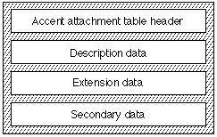

# 'acnt' 表

介绍
重音附件表（标记名称：“ acnt”）提供了一种节省空间的方法，可将组件字形组合为复合字形以形成重音。 重音字形是复合字形的一个非常受限制的子类。 它们的特征描述如下：

* 重音字形由一种主要成分和一种或多种辅助成分形成。
* 除了实际轮廓外，带重音符号的字形的所有属性都与主要成分共享，或者可以从主要字形和辅助字形的属性派生。 示例包括指标，字距调整值和后记名称。
* 组件不能为带重音的字形。
* 组件必须是轮廓，而不是bitmaps。
* 每个重音字形都必须具有唯一的字形索引。 重音字形的字形索引必须是连续的，并且必须以大于常规字形的最高索引的索引开头。
* 字体的主要组成部分不能超过32,768。
* 字体不能包含超过255个辅助成分。
* 将次要组件定位在主要组件上的唯一机制是连接点的匹配。
* 次要组件只能有一个连接点。
* 每个不同的带重音符号的字形都必须具有唯一的字形索引，并且必须提供数据以指定每个次级分量如何与每个重音符号的主分量相连。
口音附件表需要以下存储空间：
* 单个重音符号：4个字节。
* 多个重音符号：每个重音4个字节+ 2个字节。
* 次要字形：3个字节。

## 口音附件表格式

重音附件表由标题，描述数据，扩展数据和辅助数据组成。 下图显示了口音附件表的整体结构： 

口音附件表格式如下：

|类型|名称|描述|
|-|-|-|
|fixed32|version|重音附件表的版本号（当前版本为0x00010000）。|
|uint16|firstAccentGlyphIndex|第一个带重音的字形索引。|
|uint16|lastAccentGlyphIndex|最后一个带重音的字形索引。|
|uint32|descriptionOffset|相对于描述数据的字节偏移量。|
|uint32|extensionOffset|扩展数据的字节偏移量。|
|uint32|secondaryOffset|相对于辅助数据的字节偏移量。|
|variable|glyphs[numberOfAccentedGlyphs]|
|variable|ext[numberOfGlyphsWithMoreThan2Components]|
|variable|accents[numberOfSecondaryGlyphs]|

## 格式0描述

|类型|名称|描述|
|-|-|-|
|uint1|description|值= 0表示只有两个部分。|
|uint15|primaryGlyphIndex|数据列（列的数据结构为number）。
|uint8|primaryAttachmentPoint|主附件控制点编号。|
|uint8|secondaryInfoIndex|次要附件控制点编号。|

## 格式1说明

|类型|名称|描述|
|-|-|-|
|uint1|description|值= 1表示存在两个以上的组件|
|uint15|primaryGlyphIndex|主字形索引号。|
|uint16|extensionOffset|扩展子表开头的字节偏移量。|

## 扩展格式

|类型|名称|描述|
|-|-|-|
|uint1|components|值= 0表示存在更多组件。 值= 1表示这是最后一个组件。|
|uint7|secondaryInfoIndex[numberComponents]|第一个组件的辅助信息索引。|
|uint8|primaryAttachmentPoint[numberComponents]|第一个组件的主要附件控制点。|

## 次要数据格式

|类型|名称|描述|
|-|-|-|
|uint16|secondaryGlyphIndex|次要字形索引。 最多允许255个条目。|
|uint8|secondaryGlyphAttachmentNumber|次要字形附件索数。|

## 普通的贡献(comments)

每个重音符号由该表的字形数组中的一个描述条目描述。 如果字形仅由基本形式和单个重音组成，则格式0用于描述。 它指定“ glyf”表中主要字形的索引，主要字形中的附件点的点索引，以及指向重音的辅助数据表中的索引。 辅助数据表中的索引条目指定“ glyf”表中重音符号的索引和重音符号中的附着点的点索引。

如果重音字形具有基本形式和两个或多个重音，则通过格式1描述进行描述。 此描述指定了“ glyf”表中主字形的索引以及扩展子表中的字节偏移量（该偏移量是从扩展数据的开头开始）。 扩展表中的条目指定要附加到主要表单的任意数量的重音符号。 每个子条目在重音符号的次要数据中指定索引，在主要字形中指定附着点的点索引，以及是否存在更多条目的标志。 重音添加到主要字形，直到遇到标志值1，这意味着这是最后一个组成部分。

## 可用性

OS X或iOS当前不支持“ acnt”表。 不鼓励使用它。