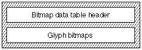
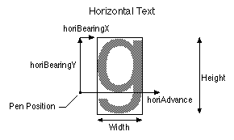
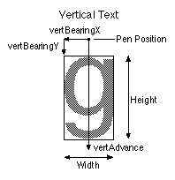

# "bdat"表
## 介绍
位图数据表（标签名称：'bdat' bitmap data table）是一个非常简单的结构； 版本号后跟数据。 数据可以采用多种格式。 某些格式包含度量信息，而其他格式仅包含图像。 某些数据可能会被压缩，而其他数据可能不会。 [位图位置表('bloc')]()包含用于定位和理解如何解释该表中包含的数据的信息。 特定位图与特定字形和点大小的关联由位图位置表处理。 位图位置表提供有关该表中位图数据在请求的大小下的可用性的信息，并指示位图是否可用。 它还给出了特定字形的位图数据在该表中的偏移位置。 对于等宽字形，位图位置表包含度量信息。

## 位图数据表格式
位图数据表的整体结构如下图所示：

位图数据表头的格式如下：

|类型|名称|描述|
|-|-|-|
|fixed32|version|位图数据表的版本号（初始版本为0x00020000）。|
|variable|字形位图[位图索引]（glyphbitmap[numberBitMaps]）|该字体包含的位图字形集。 格式为 1、2、4、5、6 和 7。|

AAT 支持六种字形位图格式。 某些格式旨在处理比例字形，其他格式更适用于等距字形。 在给定的字体内，可以使用各种格式。 例如，汉字字体的前几百个字形采用格式 7（比例位），接下来的 7000 个字形采用格式 5（等宽）。

位图数据格式代码如下：

|格式|名称|描述|
|-|-|-|
|1|比例格式1|小指标和字节对齐图像。（Small metrics and byte-aligned images.）|
|2|比例格式2|小指标和位对齐图像。（	Small metrics and bit-aligned images.）|
|3|（没有使用）|（没有使用）|
|4|比例格式4|只是压缩图像，度量位于位图位置表中。（Just compressed images, metrics are in the bitmap location table.）|
|5|比例格式5|只是位对齐的图像，度量位于位图位置表中。（Just bit-aligned images, metrics are in the bitmap location table.）|
|6|比例格式6|大指标和字节对齐图像。（Big metrics and byte-aligned images.）|
|7|比例格式7|大指标和位对齐图像。（Big metrics and bit-aligned images.）|

 

**请注意，其中四种格式处理比例位图数据。**

* 除了位图数据的对齐方式之外，格式 1 和 2 相同。 两者都有较小的指标。
* 格式 4 是改进的霍夫曼编码方案，包含度量信息以及二叉搜索树和字形数据的偏移量。
* 格式 5 是位对齐位图的简单格式，填充到字节边界。 所有的度量信息都位于位图位置表的格式2索引子表中。 对于共享相同规格的字形（例如，等宽中文、日文或韩文字形），此格式确实可以节省空间。 它与格式 2 和 7 类似，但不包含度量信息，仅包含位打包位图。

**注意：** 格式 5 表的数据很可能在某些字形的上方和下方有一些白线。 换句话说，位图在字形的黑色位周围不会有紧密的边界框。 这是一个很小的代价，因为大多数字形应该是紧凑的，并且能够共享度量的节省弥补了额外的白色像素。 如果没有，则不应使用此格式。

* 除了位图数据的对齐方式之外，格式 6 和 7 相同。 两者都有很大的指标。

大多数格式都在 bigGlyphMetrics 或smallGlyphMetrics 中包含度量信息。 大指标包含水平指标和垂直指标，而小指标仅包含一个方向的指标。

**bigGlyphMetrics** 的结构如下表所示：

|类型|名称|描述|
|-|-|-|
|uint8|height|数据行数。|
|uint8|width|数据列数。|
|sint8|horiBearingX|从水平原点到位图左边缘的距离（以像素为单位）。|
|sint8|horiBearingY|从水平原点到位图上边缘的距离（以像素为单位）。|
|uint8|horiAdvance|水平间距宽度（以像素为单位）。|
|sint8|vertBearingX|从垂直原点到位图左边缘的距离（以像素为单位）。|
|sint8|vertBearingY|从垂直原点到位图上边缘的距离（以像素为单位）。|
|uint8|vertAdvance|垂直间距宽度（以像素为单位）。|

**SmallGlyphMetrics** 的结构如下表所示：

|类型|名称|描述|
|-|-|-|
|uint8| height| 数据行数。|
|uint8| width| 数据列数。|
|sint8|bearingX| 从水平原点到位图左边缘的距离（以像素为单位）（对于水平文本）； 或从垂直原点到位图顶部边缘的距离（对于垂直文本）。|
|sint8|bearingY| 从水平原点到位图顶部边缘的距离（以像素为单位）（对于水平文本）； 或从垂直原点到位图左边缘的距离（对于垂直文本）。|
|uint8| advance| 水平或垂直间距宽度（以像素为单位）。|

下图显示了指标的含义。 下面"g"字形的可能值为：horiBearingX = 2，horiBearingY = 11； 水平间距 = 12; 垂直支撑X = -3; 垂直支撑Y = -2; vertAdvance = 20（注意：虽然间距是在-y方向，但它仍然是无符号的，因为它是距离而不是方向；假设垂直文本的方向是从上到下）； 高度=16； 宽度 = 9。请记住，我们正在处理整数度量。

如果使用smallGlyphMetrics，则必须设置位图位置表的bitmapSizeTable.flags 中的位，以通知缩放器有关度量的方向（使用bitmapFlags）。

格式 1 字形位图具有以下格式：
|类型|名称|描述|
|-|-|-|
|smallGlyphMetrics|	smallMetrics| 字形的度量信息。|
|variable|	imageData| 字节对齐的位图数据。|

格式 2 字形位图具有以下格式：
|类型|名称|描述|
|-|-|-|
|smallGlyphMetrics|	smallMetrics| 字形的度量信息。|
|variable|	imageData| 位对齐的位图数据填充到字节边界。|

格式 4 字形位图具有以下格式：
|类型|名称|描述|
|-|-|-|
|uint32|	whiteTreeOffset|	偏移到白树。|
|uint32|	blackTreeOffset|	到黑树的偏移。|
|uint32|	glyphDataOffset|	字形数据的偏移量。|
|variable|	trees and glyph data|	白树、黑树和字形位于所有字形位图 4 数据数组之后。|

格式 5 字形位图具有以下格式：
|类型|名称|描述|
|-|-|-|
|variable|	imageData| 位对齐的位图数据填充到字节边界。|

格式 6 字形位图具有以下格式：
|类型|名称|描述|
|-|-|-|
|bigGlyphMetrics|bigMetrics|字形的度量信息。|
|variable|	imageData| 字节对齐的位图数据。|

格式 7 字形位图具有以下格式：
|类型|名称|描述|
|-|-|-|
|bigGlyphMetrics|bigMetrics|字形的度量信息。|
|variable|	imageData| 字节对齐的位图数据。|

## 依赖关系
"bdat"表与字体的"bloc"（位图位置）表有着千丝万缕的联系。 如果其中一个存在，另一个也一定存在，并且其中一个的改变几乎不可避免地会引发另一个的改变。

通常，大多数字体编辑工具可能会发现同时读写两个表比单独处理它们更方便。 例如，使用 Apple 的 ftxdumperfuser 工具。