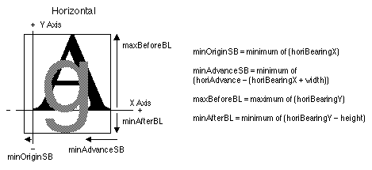
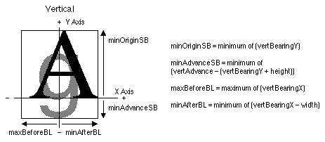

# "bloc" 表
## 一般表信息
### 介绍

位图位置表（标记名称：'bloc' bitmap location table）提供有关所请求点大小的位图可用性的信息。 如果字体中包含位图，它还会告诉数据位于位图数据表中的位置。 位图位置和位图数据表支持各种格式。

虽然该格式理论上允许某些功能（例如稀疏字形集），但实现可能不支持这些功能。 通常最好与软件提供商联系，了解该表（或者实际上是任何表）的支持程度。

### 位图位置表格式

位图位置表的整体结构如下图所示：

位图位置表的标头如下表所示：

|类型|名称|描述|
|-|-|-|
|fixed|	version|位图位置表的版本号（初始版本为 0x00020000）。|
|uint32|	numSizes|该表中 bitmapSizeTable 的数量。|
|variable|	bitmapSizeTable[numSizes]|描述此字体中位图字形的一般特征的子表。 还包含indexSubTableArrayOffset。|

每个 bitmapSizeTable 子表提供有关特定位图集的全局特征的信息。

**注意：** 尺寸必须按升序排列。

bitmapSizeTable（指的是indexSubTableArray，而indexSubTableArray又指的是indexSubTable）的格式如下表所示：

|类型|名称|描述|
|-|-|-|
|uint32|indexSubTableArrayOffset|从开头到对应索引子表数组的偏移量
|uint32|indexTableSize|对应索引子表和数组的长度
|uint32|numberOfIndexSubTables|索引子表数量（每个范围或格式有一个）
|uint32|colorRef|设置为 0，暂时忽略。
|sbitLineMetrics|hori|水平线度量。
|sbitLineMetrics|vert|垂直线度量。
|uint16|startGlyphIndex|此尺寸的最低字形索引。
|uint16|endGlyphIndex|此尺寸的最高字形索引。
|uint8|ppemX|目标水平 ppm。
|uint8|ppemY|目标垂直 ppm。
|uint8|bitDepth|停止的位深度。
|uint8|flags|见下表; 前两位用于方向（strike），垂直或水平。

indexSubTableArrayOffset 是从“bloc”表的开头到indexSubTableArray 的偏移量。 每个方向（strike）都有这些数组之一来支持各种格式和不连续的位图范围。 下面更详细地描述该阵列。

indexTableSize 是索引子表数组和关联索引表中的字节总数。

numberOfIndexSubTables 是此方向（strike）的索引表的计数。

colorRef 是为了将来的增强而引入的，目前 TrueType 缩放器不支持这些增强功能，但这些字段已被其他平台使用，定义如下。

* 如果 bitDepth = 1 且 colorRef = 0，则字形为每像素 1 位。 （AAT 字体应仅使用这组值）。
* 如果 bitDepth = n 且 colorRef = 0，则字形为黑白，但已预先扩展以绘制到特定位深度（例如 2、4、8、16、24 位屏幕）。
* 如果 bitDepth = n 且 colorRef = m，则这些是复杂的多位字形，并且 colorRef 指向的数据决定它们的含义。 这些可以是彩色字体、抗锯齿字体、灰度或其他任何字体。 如果 colorRef 不为零，则 sfnt 必须有一个“colr”表。 colorRef 与该表一起使用以获得有关 sbit 的更多信息。 使用单独的表（而不是“bloc”表中的偏移量），因为颜色表的含义超出了 sbits 的范围。

回顾一下，bitDepth 就是它所说的，颜色的深度。 这对于灰度或彩色字体很有用。 为了保持与读取 sbit 数据的缩放器的兼容性，下表显示了 colorRef 和 bitDepth 值的使用方式：

|位深 bitDepth|颜色参考 colorRef|含义 Meaning|
|-|-|-|
|1|0|标准 1 位字体。|
|n|0|多位黑白字体。|
|n|m|颜色、灰度、抗锯齿等。|

接下来是水平线和垂直线指标。 它们包含上升部分、下降部分和最大像素宽度信息。 此外，还包括 AAT 行布局使用的插入符号信息。 斜率用于确定绘制插入符号的角度，偏移量是移动插入符号的像素数（正或负）。 这是一个有符号字符值（而不是固定值），因为我们正在处理整数指标。 minOriginSB、minAdvanceSB、maxBeforeBL 和 minAfterBL 值如下所述。 这些值主要由可能需要预分配内存和/或需要更多度量信息来定位字形的缩放器使用。 Macintosh 上的 sbit 定标器不使用这些数字，但可以在其他平台上使用。

有关方向（strike）的全局指标信息保存在 sbitLineMetrics 记录中，一个用于水平指标，一个用于垂直指标。 sbitLineMetrics记录的格式如下表所示：

|类型|名称|描述|
|-|-|-|
|int8|ascender|这是基线之前的线间距。
|int8|descender|这是基线之后线的间距。
|uint8|widthMax|strike字形的最大像素宽度。 （AAT 未使用，其他平台可能使用。）
|int8|caretSlopeNumerator|插入符号斜率的上升，对于非斜体字体通常设置为 1。
|int8|caretSlopeDenominator|插入符号斜率的运行，对于非斜体字体通常设置为 0。
|int8|caretOffset|以像素为单位的偏移量以移动插入符以实现正确定位。
|int8|minOriginSB|horiBearingX（或垂直字体的 vertBearingY）的最小值。
|int8|minAdvanceSB|horiAdvance - horiBearingX + 宽度（或垂直字体的 vertAdvance - vertBearingY + 高度）的最小值。 （AAT未使用，其他平台可能使用）
|int8|maxBeforeBL|horiBearingY 的最大值（或垂直字体的 vertBearingY）。 （AAT未使用，其他平台可能使用）
|int8|minAfterBL|horiBearingY - 高度（或 vertBearingX - 垂直字体的宽度）的最小值。 （AAT未使用，其他平台可能使用）
|int16|pad|填充以使长对齐。

下图给出了水平文本的 minOriginSB、minAdvanceSB、maxBeforeBL 和 minAfterBL 值的示例。 这些值是根据字形度量的最小值和最大值计算得出的，这些值来自位图数据表。

垂直文本中使用的相同字段如图 20-3 所示。

大多数格式都在 bigGlyphMetrics 或smallGlyphMetrics 中包含度量信息。 大指标包含水平指标和垂直指标，而小指标仅包含一个方向的指标。 bitmapSizeTable.flag 字段指示对于给定的strike，小度量是水平的还是垂直的（有关标志值，请参阅下表）。 缩放器为未包含的方向构建虚假度量。

|标识|名称|含义|
|-|-|-|
|0x01|flgHorizontal|对于给定的strike，小指标是水平的。|
|0x02|flgVertical|小指标对于给定的strike是垂直的。|

索引子表数组包含该表内索引的字形范围和偏移量。 确定要使用的strike后，缩放器将转到该数组来搜索包含字形编号的索引。 当找到索引时，它将是索引子表的偏移量。 索引子表数组通过相应的bitmapSizeTable中的indexSubTableArrayOffset来定位。 第一个indexSubTableArray 位于最后一个bitmapSizeTable 条目之后。 接下来是strike的指数子表。 下一个indexSubTableArray（如果存在多个strike）及其索引子表是下一个。 每个索引必须从一个长边界开始； 使用格式 3 时，有时需要在偏移数组中添加一个额外的 uint16 进行填充。 然后，该表继续使用该数组和每次strike的索引。

indexSubTableArray的格式如下表所示：
|类型|名称|描述|
|-|-|-|
|uint16|firstGlyphIndex|该范围内第一个字形的索引。|
|uint16|lastGlyphIndex|该范围内最后一个字形的索引。|
|uint32|additionalOffsetToIndexSubtable|用于到达indexSubTable； 添加到indexSubTableArrayOffset以获取距“bloc”表开头的偏移量。|

