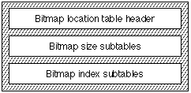

# "bloc" 表
## 一般表信息
### 介绍

位图位置表（标记名称：'bloc' bitmap location table）提供有关所请求点大小的位图可用性的信息。 如果字体中包含位图，它还会告诉数据位于位图数据表中的位置。 位图位置和位图数据表支持各种格式。

虽然该格式理论上允许某些功能（例如稀疏字形集），但实现可能不支持这些功能。 通常最好与软件提供商联系，了解该表（或者实际上是任何表）的支持程度。

### 位图位置表格式

位图位置表的整体结构如下图所示：

位图位置表的标头如下表所示：

|类型|名称|描述|
|-|-|-|
|fixed|	version|位图位置表的版本号（初始版本为 0x00020000）。|
|uint32|	numSizes|该表中 bitmapSizeTable 的数量。|
|variable|	bitmapSizeTable[numSizes]|描述此字体中位图字形的一般特征的子表。 还包含indexSubTableArrayOffset。|

每个 bitmapSizeTable 子表提供有关特定位图集的全局特征的信息。

**注意：** 尺寸必须按升序排列。

bitmapSizeTable（指的是indexSubTableArray，而indexSubTableArray又指的是indexSubTable）的格式如下表所示：

|类型|名称|描述|
|-|-|-|