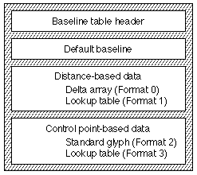
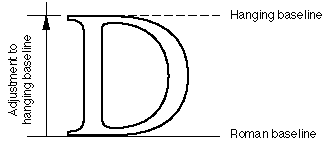
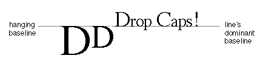
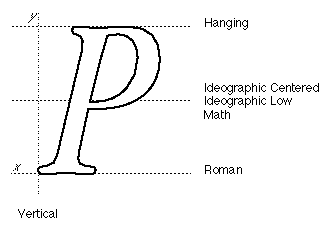
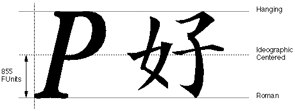

# "bsln" 表

## 介绍

基线表(baseline)（标签名称：'bsln'）允许您设计 AAT 字体以适应文本与不同基线的自动对齐。 所有字体都有一个自然基线，该基线由字体em-square中每个字形的位置定义。 AAT 字体可以包括标识字形可以对齐的其他基线位置的附加信息。

可以包括表示罗马基线、表意基线（居中或降低）、悬挂基线和数学基线的基线位置。

基线表中包含两种信息： 基线位置，允许对齐文本串； 和基线值，对于字体中的每个字形，标识哪个基线位置是其默认基线位置。 在包含多种语言（例如英语和日语）字形的字体中，基线值可以识别哪些字形属于哪些默认基线位置——英语字形属于罗马默认基线，日语字形属于表意居中默认基线。

有 32 个预定义的基线值。 应为所有水平 AAT 字体提供值为 0 到 4 的基线。 剩余的值保留供将来使用：

|值|描述|
|-|-|
|0| 罗马基线。 这定义了大多数拉丁脚本语言中使用的对齐方式，其中大部分字形位于基线之上，部分（例如下降部分）可能位于基线之下。 基线出现在整条线的底部附近。
|1| 表意文字居中基线。 这定义了中文、日文和韩文表意文字所使用的行为，它们在行高的一半处居中。
|2| 表意文字低基线。 这也定义了中文、日文和韩文中使用的行为，与之前的值类似，但字形稍微降低，以便与拉丁字符相邻的表意文字看起来略低于罗马基线。
|3| 悬挂基线。 这定义了梵文和派生脚本中使用的对齐方式，其中大部分字形位于基线下方，某些部分可能位于基线上方，并且基线本身出现在行顶部附近。 该值也用于删除资本。
|4| 数学基线。 这定义了用于设置数学的对齐方式，其中像减号这样的运算符需要居中。 它通常设置为字体 x 高度的一半。

## 基线表格式

基线表由基线表头、默认基线以及包含特定于格式的基线数据的基于距离的数组（格式 0 或 1）或基于控制点的数组（格式 2 或 3）组成。 字体开发人员必须在使用基于距离的数据或基于控制点的数据之间进行选择。 任何一种字体中仅存在其中一种。 基线表的整体结构如下所示：

基线表格式如下：

|类型|名称|描述|
|-|-|-|
|fixed32|version| 基线表的版本号（当前版本为 0x00010000）。
|uint16|format| 基线表的格式。 只能为字体选择一种基线格式。
|uint16|defaultBaseline| 所有字形的默认基线值。 该值可以从 0 到 31。
|variable|parts| 特定于格式的数据。 这将是 Format0Part、Format1Part、Format2Part 或 Format3Part，具体取决于格式字段的值。

“bsln”表的格式字段有四个定义的值，并且与每个值相关联的是包含特定于格式的数据的记录。 基线表可以采用以下格式之一：

|值|描述|
|-|-|
|0| 基于距离，无映射。|
|1| 基于距离，带有地图。|
|2| 基于控制点，无映射。|
|3| 基于控制点，带有映射。|

根据格式字段的值，defaultBaseline 字段的值可能适用于字体的所有字形（格式 0 或 2），也可能仅适用于没有特定映射数据的字体字形（格式 1 和 3)。

格式 1 和格式 3 基线表使用查找表将基线值与特定字形关联起来。 这是如何解释五种查找表格式中每一种的查找值：

|查找格式|解释|
|-|-|
|0| 16 位基线值数组，一个对应字体中的每个字形。|
|2| 每个lookupSegment的值是一个16位的基线值。|
|4| 每个lookupSegment 的值是从查找表开头到16 位基线值数组的16 位偏移量，段中的每个字形都有一个偏移量。|
|6| 每个lookupSingle 的值是该字形的16 位基线值。|
|8| valueArray 是一个 16 位基线值的数组，一个对应于修剪数组中的每个字形。|

### 格式 0 基线表

格式 0 基线表对于字体中的所有字形都有一个默认基线值（标头的 defaultBaseline 字段）。 基线位置——从自然基线到给定基线的距离——以 FUnit 距离单位给出。 没有与此格式关联的映射表。 没有与此格式关联的查找表。 特定于格式的部分称为 Format0Part，并具有以下格式：

|类型|名称|描述|
|-|-|-|
|int16|deltas[]|这些是从字体的自然基线到字体中使用的其他基线的 FUnit 距离增量。 总共必须分配 32 个增量。|

### 格式 1 基线表

格式 1 基线表具有为字体中的所有字形指定的单个默认基线（defaultBaseline 字段）和一个允许字体中的不同字形具有不同主导基线的查找表。 映射表未涵盖的字形使用默认基线。 特定于格式的部分称为 Format1Part，并具有以下格式：

|类型|名称|描述|
|-|-|-|
|int16|deltas[]|这些是从字体的自然基线到字体中使用的其他基线的 FUnit 距离增量。 总共必须分配 32 个增量。|
|LookupTable|mappingData|将字形映射到其基线值的查找表。 有关查找值的解释，请参阅上文。|

### 格式 2 基线表

格式 2 基线表为字体中的所有字形指定一个默认基线值。 它还将字体中的一个特定字形（称为标准字形）指定为具有一组控制点。 将指令应用于该字形后，这些控制点定义基线位置。 没有与此格式关联的查找表。 特定于格式的部分称为 Format2Part，并具有以下格式：

|类型|名称|描述|
|-|-|-|
|uint16|	stdGlyph|	该字体中用于设置基线值的特定字形索引号。 这是标准字形。 该字形必须包含一组控制点（其编号包含在 ctlPoints 字段中），用于确定基线距离。|
|uint16|	ctlPoints[]|与标准字形关联的控制点编号集。 值 0xFFFF 表示标准字形中没有相应的控制点。 总共必须分配 32 个控制点。|

### 格式 3 基线表

格式3基线表为字体中的所有字形指定单个默认基线值，以及允许字体中的不同字形具有不同的指定默认基线的查找表。 它还指定字体中的一个特定字形（称为标准字形），因为它具有一组控制点，在提示后将用于定义基线位置。 特定于格式的部分称为 Format3Part，并具有以下格式：

|类型|名称|描述|
|-|-|-|
|uint16|	stdGlyph|此字体中字形的字形索引，用于设置基线值。 该字形必须包含一组确定基线距离的控制点（其编号包含在以下字段中）。|
|uint16|ctlPoints[]|32 个控制点编号的数组，与标准字形相关。 值 0xFFFF 表示标准字形中没有相应的控制点。|
|LookupTable|mappingData|将字形映射到其基线值的查找表。 有关查找值的解释，请参阅上文。|

## 基线表示例

### 示例：使用基线

您可以使用“bsln”表来定义字体内的多个基线。 在下图中，大写字形“D”位于全角方形中。 自然基线位于字体坐标中的 y = 0 处。 在没有任何其他信息的情况下，不同大小的该字形渲染与该线有共同之处——也就是说，笔将始终停留在该线上。 此示例使用距离格式。

下图显示第二条基线（标记为悬挂基线）已添加到第一条基线中。 罗马基线与字体的自然基线相同，因此两者之间的增量为零。 悬挂基线高于自然基线一定距离。 在该字体的坐标系中，“向上”指向更正的坐标，因此偏移是正值。

让我们看一个如何应用这些距离的示例。 在下图中，初始文本以三个不同大小的大写 D 字形开头。 用户指定前两个大写 D 字形应具有悬挂基线。

第一步是将所有基线解析为文本行的主导基线（在本例中为罗马基线）。 在下图中，前两个大写 D 字形现在悬挂在悬挂基线上，该基线与正文的基线对齐。

最后一步如下图所示。 前两个大写 D 字形的悬挂基线与正文的悬挂基线对齐。 这一系列文本的主要基线仍然是罗马基线。

### 示例：分配基线增量值和控制点

AAT 字体需要在基线表中为字体中使用的所有基线分配增量值或控制点。 值可以是基于距离的或基于控制点的。 与使用基于距离的基线表的字体相比，使用控制点的字体在小点尺寸下可以更好地在屏幕上保留基线信息。

### 基于距离的格式

格式 0 和 1 基线表是基于距离的，因为它们以纯 FUnit 指定基线增量值。 增量值是从自然基线到指定基线的距离。 AAT 字体需要在基线表中为字体中使用的所有基线分配增量值。

考虑一个“P”的字形，其 em 平方为 1000，上升部分为 932，下降部分为 -482，以及罗马基线。 该字形和其他字形的基线增量的可能分配如下图所示：

下表总结了基于距离的基线表的基线数据。

|基线|基线值|增量值（FUnits）
|-|-|
|Roman 罗马| 0| 0|
|Ideographic Centered 表意文字居中| 1| 352|
|Ideographic Low 表意低| 2| 352|
|Hanging 悬挂| 3| 705|
|Math 数学| 4| 352|

### 示例：格式 1 基线表
也许您想为包含混合汉字和罗马字形的字体创建基线表。 所有罗马字形都应具有罗马基线值，所有汉字字形应具有表意居中基线值。

本例中所做的假设如下：

* 罗马字形占用字形索引 2 到 270，汉字字形占用字形索引 271 到 8200。
* 汉字字形的内在基线是罗马风格的（即字形位于全角形的底部）。
* 以罗马和表意文字为中心的基线之间存在 855 FUnit 的差异。
* 罗马字母的大写高度为 1520 FUnits。 （在此示例中，瓶盖高度等于悬挂基线测量值。）

下图显示了此示例字体的基线表格式 1 基线分配。

下表显示了如何为示例字体构建格式 1 基线表。

<table border="1" cellspacing="2" cellpadding="0">
  <tbody>
  <tr align="left" valign="middle">
		<th align="middle">
			
偏移 
			/长度

		</th>
		<th align="middle">
			
值

		</th>
		<th align="middle">
			
名称

		</th>
		<th align="left">
			
注释

		</th>
		</tr>
		<tr align="left" valign="middle">
		<td>0/4</td>
		<td>0x00010000</td>
		<td>version</td>
		<td class="description">基线表的版本号，采用定点格式。</td>
		</tr>
		<tr align="left" valign="middle">
		<td>4/2</td>
		<td>1</td>
		<td>format</td>
		<td class="description">基线表的格式。 该基线表将使用基于距离的增量和查找表。</td>
		</tr>
		<tr align="left" valign="middle">
		<td>6/2</td>
		<td>1</td>
		<td>defaultBaseline</td>
		<td class="description">默认基线是表意文字居中基线，其基线值= 1。通过指定该值，我们只需要在查找表中包含罗马字形。 汉字字形已经位于默认基线上。</td>
		</tr>
		<tr align="left" valign="middle">
		<td colspan="4">（基线表的 <code>Format1Part</code> 从这里开始）</td>
		</tr>
		<tr align="left" valign="middle">
		<td>8/2</td>
		<td>0</td>
		<td>delta</td>
		<td class="description">从默认基线到罗马基线的 FUnit 增量（基线值 = 0）。</td>
		</tr>
		<tr align="left" valign="middle">
		<td>10/2</td>
		<td>855</td>
		<td>delta</td>
		<td class="description">FUnits 中从默认基线到表意文字中心基线的增量 (1)。</td>
		</tr>
		<tr align="left" valign="middle">
		<td>12/2</td>
		<td>0</td>
		<td>delta</td>
		<td class="description">表意低基线没有增量值 (2)。</td>
		</tr>
		<tr align="left" valign="middle">
		<td>14/2</td>
		<td>1520</td>
		<td>delta</td>
		<td class="description">FUnits 从默认基线到悬挂基线的增量 (3)。</td>
		</tr>
		<tr align="left" valign="middle">
		<td>16/56</td>
		<td>0</td>
		<td>No</td>
		<td class="description">基线值 4 到 31 的增量值。</td>
		</tr>
		<tr align="left" valign="middle">
		<td colspan="4">（<code>Format1Part</code> 的查找表从这里开始）</td>
		</tr>
		<tr align="left" valign="middle">
		<td>72/2</td>
		<td>2</td>
		<td>format</td>
		<td class="description">查找表格式 2（表示<a href="Chap6Tables.html#LookupFormat2">分段单个</a>表格式）。</td>
		</tr>
		<tr align="left" valign="middle">
		<td colspan="4">（接下来的 5 个字段是查找表的 <code>BinSrchHeader</code>）</td>
		</tr>
		<tr align="left" valign="middle">
		<td>74/2</td>
		<td>6</td>
		<td>unitSize</td>
		<td class="description">LookupSegment 记录的大小（起始字形索引为 2 个字节，结束字形索引为 2 个字节，基线值为 2 个字节）。</td>
		</tr>
		<tr align="left" valign="middle">
		<td>76/2</td>
		<td>1</td>
		<td>nUnits</td>
		<td class="description">要搜索的先前大小的单元数。</td>
		</tr>
		<tr align="left" valign="middle">
		<td>78/2</td>
		<td>6</td>
		<td>searchRange</td>
		<td class="description">unitSize 乘以小于或等于 nUnits 的最大二的幂。</td>
		</tr>
		<tr align="left" valign="middle">
		<td>80/2</td>
		<td>0</td>
		<td>entrySelector</td>
		<td class="description">小于或等于 nUnits 的最大的两个幂的对数以 2 为底。</td>
		</tr>
		<tr align="left" valign="middle">
		<td>82/2</td>
		<td>0</td>
		<td>rangeShift</td>
		<td class="description">unitSize 乘以 nUnits 的差值减去两个小于或等于 nUnits 的最大幂。</td>
		</tr>
		<tr align="left" valign="middle">
		<td colspan="4">（第一个 <code>LookupSegment</code> 用于罗马字形）</td>
		</tr>
		<tr align="left" valign="middle">
		<td>84/2</td>
		<td>270</td>
		<td>lastGlyph</td>
		<td class="description">罗马字形的结束字形索引。</td>
		</tr>
		<tr align="left" valign="middle">
		<td>86/2</td>
		<td>2</td>
		<td>firstGlyph</td>
		<td class="description">罗马字形的起始字形索引。</td>
		</tr>
		<tr align="left" valign="middle">
		<td>88/2</td>
		<td>0</td>
		<td>value</td>
		<td class="description">对于此范围内的罗马字形，罗马基线值 = 0。</td>
		</tr>
		<tr align="left" valign="middle">
		<td colspan="4">（最后一个<code>LookupSegment</code>）</td>
		</tr>
		<tr align="left" valign="middle">
		<td>90/2</td>
		<td>0xFFFF</td>
		<td>lastGlyph</td>
		<td class="description">最后一个查找段中最后一个字形的特殊值。</td>
		</tr>
		<tr align="left" valign="middle">
		<td>92/2</td>
		<td>0xFFFF</td>
		<td>firstGlyph</td>
		<td class="description">最后一个查找段中第一个字形的特殊值。</td>
		</tr>
		<tr align="left" valign="middle">
		<td>94/2</td>
		<td>0</td>
		<td>value</td>
		<td class="description">终止值。</td>
		</tr>
	</tbody>
</table>

### 示例：格式 3 基线表

此示例使用与前面的基线表格式 1 示例相同的基本设置，并添加了控制点信息以更准确地放置基线偏移。 假设我们已将字形 22 指定为包含控制点信息的字形。 该字形将在罗马基线处具有控制点 #80，在表意文字中心基线处具有控制点 #81，在悬挂基线处具有控制点 #82。

表 3-9 显示了如何为示例字体构建 Format 3 基线表。

<table border="1" cellspacing="2" cellpadding="0">
		<tbody><tr align="left" valign="middle">
		<th align="middle">
			
偏移 
			/长度

		</th>
		<th align="middle">
			
值

		</th>
		<th align="middle">
			
名称

		</th>
		<th align="left">
			
注释

		</th>
		</tr>
		<tr align="left" valign="middle">
		<td>0/4</td>
		<td>0x00010000</td>
		<td>version</td>
		<td class="description">基线表的版本号（定点格式）为1.0。</td>
		</tr>
		<tr align="left" valign="middle">
		<td>4/2</td>
		<td>3</td>
		<td>format</td>
		<td class="description">格式 3 基线表。</td>
		</tr>
		<tr align="left" valign="middle">
		<td>6/2</td>
		<td>1</td>
		<td>defaultBaseline</td>
		<td class="description">默认基线是表意文字居中基线。</td>
		</tr>
		<tr align="left" valign="middle">
		<td colspan="4">（基线表的 <code>Format3Part</code> 从这里开始）</td>
		</tr>
		<tr align="left" valign="middle">
		<td>8/2</td>
		<td>22</td>
		<td>stdGlyph</td>
		<td class="description">标准字形的字形索引，其中包含控制点信息。</td>
		</tr>
		<tr align="left" valign="middle">
		<td>10/2</td>
		<td>80</td>
		<td>ctlPoint</td>
		<td class="description">标准字形中罗马基线的控制点（基线值 0）。</td>
		</tr>
		<tr align="left" valign="middle">
		<td>12/2</td>
		<td>81</td>
		<td>ctlPoint</td>
		<td class="description">标准字形中表意居中基线的控制点（基线值 1）。</td>
		</tr>
		<tr align="left" valign="middle">
		<td>14/2</td>
		<td>0xFFFF</td>
		<td>ctlPoint</td>
		<td class="description">这个特殊值意味着表意低基线类（基线值2）没有控制点。</td>
		</tr>
		<tr align="left" valign="middle">
		<td>16/2</td>
		<td>82</td>
		<td>ctlPoint</td>
		<td class="description">标准字形中悬挂基线的控制点（基线值 3）。</td>
		</tr>
		<tr align="left" valign="middle">
		<td>18/56</td>
		<td>0xFFFF</td>
		<td>ctlPoint</td>
		<td class="description">此特殊值意味着基线类别 4 至 31 没有控制点。</td>
		</tr>
		<tr align="left" valign="middle">
		<td colspan="4">（<code>Format3Part</code> 的查找表从这里开始）</td>
		</tr>
		<tr align="left" valign="middle">
		<td>74/2</td>
		<td>2</td>
		<td>format</td>
		<td class="description">查找表格式 2（<a href="Chap6Tables.html#LookupFormat2">单段</a>表）。</td>
		</tr>
		<tr align="left" valign="middle">
		<td colspan="4">（接下来的 5 个字段是查找表的 <code>BinSrchHeader</code>）</td>
		</tr>
		<tr align="left" valign="middle">
		<td>76/2</td>
		<td>6</td>
		<td>unitSize</td>
		<td class="description">LookupSegment 记录的大小（起始字形索引为 2 个字节，结束字形索引为 2 个字节，基线值为 2 个字节）。</td>
		</tr>
		<tr align="left" valign="middle">
		<td>78/2</td>
		<td>1</td>
		<td>nUnits</td>
		<td class="description">要搜索的先前大小的单元数。</td>
		</tr>
		<tr align="left" valign="middle">
		<td>80/2</td>
		<td>6</td>
		<td>searchRange</td>
		<td class="description">unitSize 乘以小于或等于 nUnits 的最大 2 次方。</td>
		</tr>
		<tr align="left" valign="middle">
		<td>82/2</td>
		<td>0</td>
		<td>entrySelector</td>
		<td class="description">小于或等于 nUnits 的最大的两个幂的对数以 2 为底。</td>
		</tr>
		<tr align="left" valign="middle">
		<td>84/2</td>
		<td>0</td>
		<td>rangeShift</td>
		<td class="description">unitSize 乘以 nUnits 的差值减去两个小于或等于 nUnits 的最大幂。</td>
		</tr>
		<tr align="left" valign="middle">
		<td colspan="4">（第一个 <code>LookupSegment</code> 用于罗马字形）</td>
		</tr>
		<tr align="left" valign="middle">
		<td>86/2</td>
		<td>270</td>
		<td>lastGlyph</td>
		<td class="description">罗马字形的结束字形索引。</td>
		</tr>
		<tr align="left" valign="middle">
		<td>88/2</td>
		<td>2</td>
		<td>firstGlyph</td>
		<td class="description">罗马字形的起始字形索引。</td>
		</tr>
		<tr align="left" valign="middle">
		<td>90/2</td>
		<td>0</td>
		<td>value</td>
		<td class="description">对于此范围内的罗马字形，罗马基线值 = 0。</td>
		</tr>
		<tr align="left" valign="middle">
		<td colspan="4">（最后一个<code>LookupSegment</code>）</td>
		</tr>
		<tr align="left" valign="middle">
		<td>92/2</td>
		<td>0xFFFF</td>
		<td>lastGlyph</td>
		<td class="description">最后一个查找段中最后一个字形的特殊值。</td>
		</tr>
		<tr align="left" valign="middle">
		<td>94/2</td>
		<td>0xFFFF</td>
		<td>firstGlyph</td>
		<td class="description">最后一个查找段中第一个字形的特殊值。</td>
		</tr>
		<tr align="left" valign="middle">
		<td>96/2</td>
		<td>0</td>
		<td>value</td>
		<td class="description">终止值</td>
		</tr>
	</tbody></table>