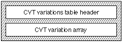

# "cvar" 表

## 介绍

应为所有指示的字体提供带有标签名称“cvt”的控制值表（CVT）。 它包含可以通过指令访问的字体控制值的索引列表。 示例值包括衬线高度、衬线宽度和大写字干宽度。 并非所有定义字体中字形的轮廓点都需要包含在“cvt”表中。 根据指示，关键点将移动到所需的点。 AAT 提供插值来“保留”字形轮廓中的剩余点。

CVT 变体表（标签名称：“cvar”）允许您包含对 CVT 进行样式化以匹配轮廓样式所需的所有数据。 该表反映了字形变体表，因为它包含为字体样式空间中的任何位置创建样式所需的更改。 因此，CVT 可以反映字形轮廓所经历的高度和笔划粗细的变化。 这允许相同的指令对所有样式变化进行操作。

* **注意：** 本章中的材料仅适用于 TrueType 字体。

## CVT 变体表格式

CVT变体表由CVT变体表头和CVT变体数组组成。 CVT变型表的整体结构如下图所示：

CVT变型表格式如下表所示：

|类型|名称|描述|
|-|-|-|
|fixed32|	version	|设置为 0x00010000 (1.0)。|
|uint16|	tupleCount	|标志位高4位，计数低12位。|
|uint16|	offsetToData	|从 CVT Variations 表的开头到元组数据的开头的偏移量。|
|tupleVariation|	tuple[tupleCount]	|元组数组。|
|uint8|	pointNumbers[]	|点编号的压缩数组。|
|uint8|	tupleData[]	|每个元组的打包增量。|

CVT 变体类似于字形变体。 点编号数组被解释为 CVT 索引而不是点索引。 tupleData 中的增量仅包含每个元组的一组打包增量，而不是字形变体中的两个数组（X 和 Y）。