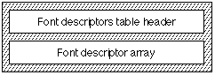

# "fdsc" 表

## 介绍

字体描述符表（标签名称：“fdsc”）允许应用程序获取现有的文本运行并允许用户为该文本运行指定新的字体系列。 将使用您提供的样式信息创建使用新字体系列最好地保留字体样式信息的新样式运行。

所有字体都应具有“fdsc”表，以确保与支持字体系列转换的应用程序兼容。

苹果电脑公司定义了标准的标签列表。其中包括常见的描述符，如重量、宽度、光学尺寸等。 可以通过向 Apple 注册来定义其他字体标签。

“fdsc”表包含提供字体系列替换所需的描述性信息。 字体描述符数组由 <tag, value> 对组成。 每对都描述了字体的特定属性。

简介提供了一些案例示例，其中使用支持文本样式匹配的应用程序将旧样式运行替换为新字体系列以提供新样式运行。

## 字体描述符表格式

字体描述符表由字体描述符表头和字体描述符数组组成。 字体描述符表的整体结构如下图所示：

|类型|名称|描述|
|-|-|-|
|fixed32|	version|	字体描述符表的版本号（当前版本为 0x00010000）。
|uint32|	descriptorCount|	将包含的用于表征此字体的样式描述符的数量。 每个描述符由<tag, value>对组成。 这些对位于后面的 gxFontDescriptor 数组中。
|gxFontDescriptor|	descriptor[]|	标记坐标对的列表。

字体描述符数组的格式如下表所示：

|类型|名称|描述|
|-|-|-|
|uint32|	tag|4 字节表标记名称。
|fixed32|	value|描述符标记的值。

当前定义的描述符如下：

|名称|标签|值|描述|
|-|-|-|-|
|Weight|	wght|	1.0|相对于正常体重的重量百分比。|
|Width|	wdth|	1.0|相对于常规宽度的百分比宽度。|
|Slant|	slnt|	0.0|倾斜角度（以度为单位），其中正值是从直线向上顺时针旋转。|
|Optical size|	opsz|	12.0|字体设计的磅值。|
|Non-alphabetic|	nalf|	0|这些值被视为整数，而不是固定的 32 位。 0 表示字母，更大的整数表示字体非字母（例如符号）。|

非字母代码值为：

|代码|含义|
|-|-|
|0| 按字母顺序|
|1| 标志|
|2| 个 Pi 字符|
|3| 特殊符号（包括表情符号）|
|4| 装饰边框|
|5| 国际符号|
|6| 数学符号|

## 字体描述符表示例

此示例字体有两个样式描述符。 下表总结了该字体的字体描述符数据。

|描述符标签|描述符值|
|-|-|
|'wght'|+0.8|
|'wdth'|+1.0|

此表中给出了此示例字体的字体描述符表：

<table border="1" cellspacing="2" cellpadding="0">
		<tbody><tr align="left" valign="middle">
		<th align="middle">
			
Offset/ 
			length

		</th>
		<th align="middle">
			
值

		</th>
		<th align="middle">
			
名称

		</th>
		<th align="left">
			
备注

		</th>
		</tr>
		<tr align="left" valign="middle">
		<td>0/4</td>
		<td>0x00010000</td>
		<td>版本</td>
		<td class="description">字形属性表的版本号，采用定点格式。</td>
		</tr>
		<tr align="left" valign="middle">
		<td>4/4</td>
		<td>2</td>
		<td>描述符计数</td>
		<td class="description">用于描述该字体的样式描述符（<标签，值>对）的数量为 2。</td>
		</tr>
		<tr align="left" valign="middle">
		<td colspan="4">（后面是字体描述符数组。数组中有两个样式描述符）</td>
		</tr>
		<tr align="left" valign="middle">
		<td>8/4</td>
		<td>0x77676874</td>
		<td>标签</td>
		<td class="description">描述符标签是“wght”。</td>
		</tr>
		<tr align="left" valign="middle">
		<td>12/4</td>
		<td>0x0000CCCC</td>
		<td>值</td>
		<td class="description">“重量”的描述符值为+0.8。</td>
		</tr>
		<tr align="left" valign="middle">
		<td>16/4</td>
		<td>0x77647468</td>
		<td>标签</td>
		<td class="description">描述符标签是“宽度”。</td>
		</tr>
		<tr align="left" valign="middle">
		<td>20/4</td>
		<td>0x00010000</td>
		<td>值</td>
		<td class="description">“wdth”的描述符值为+1.0。</td>
		</tr>
	</tbody></table>