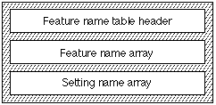

# "特征" 表

## 一般表信息

### 介绍

功能名称表（标签名称：“feat”）允许您包含字体的文本功能、每个文本功能的设置以及功能和设置的常见（人类可读）名称的名称表索引。

Apple 定义了一组标准的文本功能。 您可以包含其中一项或多项或创建您自己的文本功能。 您的字体支持的字体功能必须是 Apple Inc. 维护的字体功能注册表的一部分。您可以通过发送电子邮件建议对此注册表进行添加：

applefonts@apple.com

### 特征名称表格式

特征名称表由特征名称表头、特征名称数组、设置名称数组和特征集记录组成。 特征名称表的整体结构如下图所示：

特征名称表头的格式如下：

|类型|名称|描述|
|-|-|-|
|fixed32|version|功能名称表的版本号（当前版本为 0x00010000）。|
|uint16|featureNameCount| 功能名称数组中的条目数。|
|uint16|(none)|保留（设置为零）。|
|uint32|(none)|保留（设置为零）。|
|FeatureName| names[featureNameCount]| 功能名称数组。|

功能名称数组位于功能名称标题后面。 要素名称数组按要素类型排序。 featureName 记录指定要素 ID、要素名称的名称表索引以及名称表中要素名称的偏移量（以字节为单位）。 特征名称数组的格式如下：

|类型|名称|描述|
|-|-|-|
uint16|	feature|特征类型。|
uint16|	nSettings|设置名称数组中的记录数。|
uint32|	settingTable|从该表的开头到该功能的设置名称数组的偏移量（以字节为单位）。 该偏移量所指的实际记录类型将取决于排他性值，如下所述。|
uint16|	featureFlags|与要素类型关联的单位标志。|
int16|	nameIndex|要素名称的名称表索引。 该索引的值大于 255 且小于 32768。|

featureFlags 字段包含与要素类型关联的单位标志。 下表显示了标志及其解释：

|掩码值|解释|
|-|-|
|0x8000|独占设置。 如果设置，则功能设置是互斥的。
|0x4000|如果清除，则该功能的设置名称数组中索引为 0 的设置应被视为该功能的默认设置（如果需要）。 如果设置，则此 featureFlags 字段的位 0-15 包含将被视为默认值的设置的索引。
|0x3F00|未使用，必须设置为0。
|0x00FF|如果设置了第 30 和 31 位，则这 16 位表示此功能的设置名称数组中的设置索引，应将其视为默认值。

设置名称数组位于功能名称数组之后。 设置名称数组的格式如下：

|类型|名称|描述|
|-|-|-|
|uint16|	setting|设置。
|int16|	nameIndex|设置名称的名称表索引。 nameIndex 必须大于 255 且小于 32768。

对于没有独占设置的要素类型，总是有一对值。 第一个值打开选择器，第二个值关闭选择器。 开启设置必须均匀，关闭设置必须比相应的开启设置大 1。 因此，关闭设置总是奇数。 因此，只有 on 设置应该在设置名称数组中具有条目。

设置名称数组必须位于功能名称数组之后。 每个设置名称数组均按设置排序。 然而，设置名称数组可以按任何顺序排列。

### 功能和设置
字体中使用的所有功能和设置都应在字体功能注册表中注册。 请参阅该文档了解当前的功能和选择器常量集。

### 默认功能设置
如果某个功能在 featureFlags 字段中被标记为“独占”（设置了位 31），则其设置之一将对应于根本没有应用任何设置时字形数组的状态。

### 功能和语言代码
特征类型 39 与“ltag”表结合使用以提供特定于语言的字形。 它必须始终被标记为专有功能。

对于功能类型 39，选择器值 0 表示与其他地方一样“无变化”，并且通常用于与语言无关的字形（例如通用西里尔字母）。 其他选择器值比“ltag”表中的索引多一个，可用于指示切换到一组特定于语言的字形（例如塞尔维亚语）。 有关详细信息，请参阅“ltag”表的文档。

请注意，由字体设计者决定哪些字形与语言无关，哪些字形特定于语言。

### 功能名称表示例
该示例字体具有在名称表中列出的四个特征，其偏移量在此特征名称表中指定。 表 17-26 总结了该字体要包含的功能名称数据。

例如，字母大小写功能 (ID 3) 定义了六个选择器（大写和小写、全部大写、全部小写、小写大写、首字母大写、首字母大写加小写）。 当没有对字母大小写功能的文本应用选择器时，文本将以混合大小写形式显示，就像应用了显式大小写选择器一样。

这很重要，因为菜单或其他 UI 元素需要能够在没有应用选择器时指示哪个选择器处于“打开”状态。

哪个选择器相当于默认行为通常可以（但并非总是）从“morx”表的内容中推断出来。 为了处理并非如此的情况，可以使用 featureFlags 字段的位 30 和 0-16 来确定应将哪个选择器视为默认选择器。 如果位 31 已清除（因此该功能被标记为“非排他性”），则这些位的值将被忽略。 如果设置了位 31，并且清除了位 30，则此功能的第一个选择器（即，其设置名称数组中索引为 0 的选择器）是默认选择器。 如果位 31 和 30 均已设置，则位 0-16 包含默认功能的设置名称数组中的索引。

|文字特征|特征|环境|设定值
|-|-|-|-|
|All typographic features|0|On|0|
|Ligatures|1|Common on|2|
|Letter case|3|Upper and Lower|0|
|Letter case|3|Small caps|3|
|Letter case|3|Initial caps|4|
|Number spacing|6|Monospaced|0|
|Number spacing|6|Proportional|1|

该示例字体的特征名称表如下：

<table border="1" cellspacing="2" cellpadding="0">
		<tbody><tr align="left" valign="middle">
		<th>
			

			Offset/ 
			length
			

		</th>
		<th>
			

			值
			

		</th>
		<th>
			

			名称
			

		</th>
		<th align="left">
			

			备注
			

		</th>
		</tr>
		<tr align="left" valign="middle">
		<td>0/4</td>
		<td>0x00010000</td>
		<td>version</td>
		<td class="description">特征名称表的版本号，采用定点格式。</td>
		</tr>
		<tr align="left" valign="middle">
		<td>4/2</td>
		<td>4</td>
		<td>featureNameCount</td>
		<td class="description">该特征名称表中的特征数量为4。</td>
		</tr>
		<tr align="left" valign="middle">
		<td>6/2</td>
		<td>0</td>
		<td>(reserved)</td>
		<td class="description">保留，必须为零。</td>
		</tr>
		<tr align="left" valign="middle">
		<td>8/4</td>
		<td>0</td>
		<td>(reserved)</td>
		<td class="description">保留，必须为零。</td>
		</tr>
		<tr align="left" valign="middle">
		<td colspan="4" class="description">（<code>featureName</code> 数组从这里开始。第一个特征是“所有印刷特征”，特征 0）</td>
		</tr>
		<tr align="left" valign="middle">
		<td>12/2</td>
		<td>0</td>
		<td>feature</td>
		<td class="description">特征码为0。</td>
		</tr>
		<tr align="left" valign="middle">
		<td>14/2</td>
		<td>1</td>
		<td>nSettings</td>
		<td class="description">功能 0 有 1 个设置。</td>
		</tr>
		<tr align="left" valign="middle">
		<td>16/4</td>
		<td>60</td>
		<td>settingTable</td>
		<td class="description">从该表的开头到功能 0 的设置名称数组的偏移量为 60 字节。</td>
		</tr>
		<tr align="left" valign="middle">
		<td>20/2</td>
		<td>0</td>
		<td>featureFlags</td>
		<td class="description">零表示非独占设置。</td>
		</tr>
		<tr align="left" valign="middle">
		<td>22/2</td>
		<td>260</td>
		<td>nameIndex</td>
		<td class="description">该功能名称的名称表索引。</td>
		</tr>
		<tr align="left" valign="middle">
		<td colspan="4" class="description">（第二个 <code>featureName</code> 从这里开始。第二个功能是“连字”，即功能 1）</td>
		</tr>
		<tr align="left" valign="middle">
		<td>24/2</td>
		<td>1</td>
		<td>feature</td>
		<td class="description">特征码为1。</td>
		</tr>
		<tr align="left" valign="middle">
		<td>26/2</td>
		<td>1</td>
		<td>nSettings</td>
		<td class="description">功能 1 有 1 个设置。</td>
		</tr>
		<tr align="left" valign="middle">
		<td>28/4</td>
		<td>64</td>
		<td>settingTable</td>
		<td class="description">从该表的开头到该功能的设置名称数组的偏移量（以字节为单位）。</td>
		</tr>
		<tr align="left" valign="middle">
		<td>32/2</td>
		<td>0</td>
		<td>featureFlags</td>
		<td class="description">零表示非独占设置。</td>
		</tr>
		<tr align="left" valign="middle">
		<td>34/2</td>
		<td>256</td>
		<td>nameIndex</td>
		<td class="description">该功能名称的名称表索引。</td>
		</tr>
		<tr align="left" valign="middle">
		<td colspan="4" class="description">（第三个 <code>featureName</code> 记录从这里开始。第三个功能是“字母大小写”，功能 3）</td>
		</tr>
		<tr align="left" valign="middle">
		<td>36/2</td>
		<td>3</td>
		<td>feature</td>
		<td class="description">特征代码为3。</td>
		</tr>
		<tr align="left" valign="middle">
		<td>38/2</td>
		<td>3</td>
		<td>nSettings</td>
		<td class="description">功能 3 有 3 个设置。分别是 0、3 和 4。</td>
		</tr>
		<tr align="left" valign="middle">
		<td>40/4</td>
		<td>68</td>
		<td>settingTable</td>
		<td class="description">从该表的开头到该功能的设置名称数组的偏移量（以字节为单位）。</td>
		</tr>
		<tr align="left" valign="middle">
		<td>44/2</td>
		<td>0x8000</td>
		<td>featureFlags</td>
		<td class="description">高位亮表示该功能具有互斥设置； 由于位 30 已清除，因此第一个设置（大写和小写）是默认设置。</td>
		</tr>
		<tr align="left" valign="middle">
		<td>46/2</td>
		<td>262</td>
		<td>nameIndex</td>
		<td class="description">该功能名称的名称表索引。</td>
		</tr>
		<tr align="left" valign="middle">
		<td colspan="4" class="description">（第四个也是最后一个 <code>featureName</code> 从这里开始。第四个功能是“数字间距”，功能 6）</td>
		</tr>
		<tr align="left" valign="middle">
		<td>48/2</td>
		<td>6</td>
		<td>feature</td>
		<td class="description">特征代码为6</td>
		</tr>
		<tr align="left" valign="middle">
		<td>50/2</td>
		<td>1</td>
		<td>nSettings</td>
		<td class="description">功能 6 有 1 个设置。</td>
		</tr>
		<tr align="left" valign="middle">
		<td>52/4</td>
		<td>80</td>
		<td>settingTable</td>
		<td class="description">从该表的开头到该功能的设置名称数组的偏移量（以字节为单位）。</td>
		</tr>
		<tr align="left" valign="middle">
		<td>56/2</td>
		<td>0xC001</td>
		<td>featureFlags</td>
		<td class="description">高位打开意味着该功能具有互斥的设置。位 30 被设置，因此位 0-16 包含该功能的默认设置的索引，在本例中设置索引 1（值 1，比例数字）。</td>
		</tr>
		<tr align="left" valign="middle">
		<td>58/2</td>
		<td>258</td>
		<td>nameIndex</td>
		<td class="description">该功能名称的名称表索引。</td>
		</tr>
		<tr align="left" valign="middle">
		<td colspan="4" class="description">（<code>settingName</code> 数组如下；第一个设置数组用于“所有印刷功能”功能）</td>
		</tr>
		<tr align="left" valign="middle">
		<td>60/2</td>
		<td>0</td>
		<td>setting</td>
		<td class="description">设定值0（开）。</td>
		</tr>
		<tr align="left" valign="middle">
		<td>62/2</td>
		<td>261</td>
		<td>nameIndex</td>
		<td class="description">此功能设置名称的名称表索引。</td>
		</tr>
		<tr align="left" valign="middle">
		<td colspan="4" class="description">（第二个 <code>settingName</code> 数组用于“连字”功能）</td>
		</tr>
		<tr align="left" valign="middle">
		<td>64/2</td>
		<td>2</td>
		<td>setting</td>
		<td class="description">设置值 2（公共端亮起）。</td>
		</tr>
		<tr align="left" valign="middle">
		<td>66/2</td>
		<td>257</td>
		<td>nameIndex</td>
		<td class="description">此功能设置名称的名称表索引。</td>
		</tr>
		<tr align="left" valign="middle">
		<td colspan="4" class="description">（第三个 <code>settingName</code> 数组用于“字母大小写”功能）</td>
		</tr>
		<tr align="left" valign="middle">
		<td>68/2</td>
		<td>0</td>
		<td>setting</td>
		<td class="description">设置值0（大小写）。</td>
		</tr>
		<tr align="left" valign="middle">
		<td>70/2</td>
		<td>268</td>
		<td>nameIndex</td>
		<td class="description">此功能设置名称的名称表索引。</td>
		</tr>
		<tr align="left" valign="middle">
		<td>72/2</td>
		<td>3</td>
		<td>setting</td>
		<td class="description">设置值 3（小写字母）。</td>
		</tr>
		<tr align="left" valign="middle">
		<td>74/2</td>
		<td>264</td>
		<td>nameIndex</td>
		<td class="description">此功能设置名称的名称表索引。</td>
		</tr>
		<tr align="left" valign="middle">
		<td>76/2</td>
		<td>4</td>
		<td>setting</td>
		<td class="description">设置值 4（初始上限）。</td>
		</tr>
		<tr align="left" valign="middle">
		<td>78/2</td>
		<td>265</td>
		<td>nameIndex</td>
		<td class="description">此功能设置名称的名称表索引。</td>
		</tr>
		<tr align="left" valign="middle">
		<td colspan="4" class="description">（第四个 <code>settingName</code> 数组用于“数字大小写”功能）</td>
		</tr>
		<tr align="left" valign="middle">
		<td>80/2</td>
		<td>0</td>
		<td>setting</td>
		<td class="description">设置值 0（等宽）。</td>
		</tr>
		<tr align="left" valign="middle">
		<td>82/2</td>
		<td>259</td>
		<td>nameIndex</td>
		<td class="description">此功能设置名称的名称表索引。</td>
		</tr>
		<tr>
		<td>84/2</td>
		<td>1</td>
		<td>setting</td>
		<td class="description">设定值1（比例）。</td>
		</tr>
		<tr>
		<td>86/2</td>
		<td>260</td>
		<td>nameIndex</td>
		<td class="description">此功能设置名称的名称表索引。</td>
		</tr>
	</tbody></table>

### 依赖关系

“feat”表与扩展字形变形（“morx”）表密切相关。 对一个的编辑通常会导致对另一个的编辑。 请特别注意，featureFlags 字段的位 0-15 和 30 标识的任何默认设置应与从“morx”表中确定的内容一致。