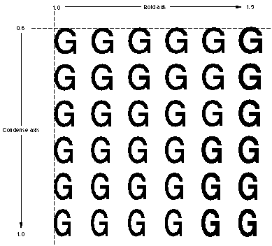

# "fvar"表

## 一般表信息

Apple Advanced Typography 变体允许字体设计师在字体本身中构建高质量的样式。 这减少了对图形系统中算法样式的依赖。 要包含字体变体，您必须包含字体变体表。 如果您正在构建 TrueType 字体，您还需要一个字形变体表。

字体变体表（标签名称："fvar"）定义了有关字体中包含哪些变体轴以及变体空间中任何命名坐标（称为实例）的全局信息。 实例为应用程序提供了一个简短的"预选"坐标列表以提供给用户。

下图显示了沿"wght"轴在各个点绘制的大写"Q"字形。 由于最小值和最大值已分别定义为+0.7和+1.3，因此样式坐标1.0的规范指的是中心"Q"的样式。

可以组合多个轴。 例如，您可能想要创建一个“wght”轴和一个“wdth”轴。 然后，用户可以选择粗细和宽度的任意组合，例如 75% 粗体和 50% 压缩。 下图显示了双轴字体变化的示例，其中粗细轴的最小值为 1.0，最大值为 1.5，宽度轴的最小值为 0.6，最大值为 1.0。

## 变化轴标签

Apple 定义了一组“标准”轴标签。 可以定义其他标签，但应向 Apple DTS（开发人员技术支持）注册。

|标签|名称|默认|描述|
|-|-|-|-|
|'wght'|	Weight|	1.0|用于制作从浅色到黑色的字体范围。|
|'wdth'|	Width|	1.0|用于从窄到宽的字体。|
|'slnt'|	Slant|	0.0|指定斜体倾斜的角度（以度为单位）。|
|'opsz'|	Optical Size|	12.0|指定光点大小。|

所有实数（例如 1.0 和 12.0）实际上都存储为 16.16 定点数，因此 1.0 实际上是 0x10000，12.0 实际上是 0xC0000。

## 字体变化表格式

字体变体表由字体变体表标题、后跟变体轴记录列表、再后跟实例记录列表组成。 该表的整体结构如下图所示：

字体变体表头的格式如下表所示：

|类型|名称|描述|
|-|-|-|
|uint16|	majorVersion|设置为 1。
|uint16|	minorVersion|设置为 0。
|uint16|	offsetToData|从表的开头到第一个轴数据的开头的偏移量（以字节为单位）。
|uint16|	countSizePairs|坐标轴 + 实例 = 2。
|uint16|	axisCount|该字体中样式轴的数量。
|uint16|	axisSize|每个 gxFontVariationAxis 记录中的字节数。 设置为 20 字节。
|uint16|	instanceCount|在 sfntInstance 数组中找到的字体的命名实例数。
|uint16|	instanceSize|每个 sfntInstance 中的字节数。 见下文。
|sfntVariationAxis|	axis[axisCount]|字体变化轴数组。
|sfntInstance|	instance[instanceCount]|实例数组。

注意：countSizePairs 当前为 2，表示后面有两个计数-大小对：轴计数-大小对和偏移计数-大小对。 “fvar”表的未来版本可能会增加这个数字。

instanceSize 将具有以下两个值之一：2 × sizeof(uint16_t) + axisCount × sizeof(Fixed)，或 3 × sizeof(uint16_t) + axisCount × sizeof(Fixed)。 如果是后者，则每个 sfntInstance 中的轴坐标后跟与该实例关联的 PostScript 名称的“名称”表条目。 见下文。

sfntVariationAxis 数组的格式如下：

注意：countSizePairs 当前为 2，表示后面有两个计数-大小对：轴计数-大小对和偏移计数-大小对。 “fvar”表的未来版本可能会增加这个数字。

instanceSize 将具有以下两个值之一：2 × sizeof(uint16_t) + axisCount × sizeof(Fixed)，或 3 × sizeof(uint16_t) + axisCount × sizeof(Fixed)。 如果是后者，则每个 sfntInstance 中的轴坐标后跟与该实例关联的 PostScript 名称的“名称”表条目。 见下文。

sfntVariationAxis 数组的格式如下：

|类型|名称|描述|
|-|-|-|
|uint32|	axisTag|坐标轴名称。
|fixed32|	minValue|坐标轴的最小样式坐标。
|fixed32|	defaultValue|坐标轴的默认样式坐标。
|fixed32|	maxValue|坐标轴的最大样式坐标。
|uint16|	flags|设置为零。
|uint16|	nameID|“名称”表中的名称。

每个轴都包含一个带有注册名称的标签。 每个轴均由其最小值和最大值定义。 这是轴的动态范围。 还定义了默认值。 nameID 指定要在应用程序样式菜单和字体选择器中使用的名称。 nameID 必须大于 255 且小于 32768。

sfntInstance 数组是命名坐标的列表。 例如，可能需要定义和命名粗体、半、压缩、半压缩或其他适当样式的特定坐标。

sfntInstance数组的格式如下表所示：

|类型|名称|描述|
|-|-|-|
|uint16|	nameID|定义的实例坐标的名称。 与变化轴记录中的 nameID 类似，它标识字体的“名称”表中的名称。
|uint16|	flags|设置为零。
|fixed32|	coord[axisCount]|	这是定义实例的坐标。
|uint16|	psNameID|	（可选）已定义实例坐标的 PostScript 名称。 与上面的 nameID 类似，它标识字体“名称”表中的名称。 相应的“名称”表条目应该是有效的 PostScript 名称。

## 字体变体表示例

该示例字体有两个变化轴。 下表总结了该字体要包含的字体变体数据：

|坐标轴标签|最小值|默认值|最大值|名称ID|
|-|-|-|-|-|
|'wght'|0.5|1.0|2.0|256|
|'wdth'|0.5|1.0|2.0|257|

下表给出了该示例字体的字体变体表。 两个轴的标志均为 0。

<table border="1" cellspacing="2" cellpadding="0">
		<tbody><tr align="left" valign="middle">
		<th>
			

			Offset/ 
			length
			

		</th>
		<th>
			

			值
			

		</th>
		<th>
			

			名称
			

		</th>
		<th align="left">
			

			备注
			

		</th>
		</tr>
		<tr align="left" valign="middle">
		<td>0/4</td>
		<td>0x00010000</td>
		<td>version</td>
		<td class="description">字体变体表的版本号，采用定点格式。</td>
		</tr>
		<tr align="left" valign="middle">
		<td>4/2</td>
		<td>20</td>
		<td>offsetToData</td>
		<td class="description">从表格开头到第一个坐标轴数据开头的偏移量为 20 个字节。</td>
		</tr>
		<tr align="left" valign="middle">
		<td>6/2</td>
		<td>2</td>
		<td>countSizePairs</td>
		<td class="description">设置2。</td>
		</tr>
		<tr align="left" valign="middle">
		<td>8/2</td>
		<td>2</td>
		<td>axisCount</td>
		<td class="description">该字体变体有两个坐标轴。</td>
		</tr>
		<tr align="left" valign="middle">
		<td>10/2</td>
		<td>20</td>
		<td>axisSize</td>
		<td class="description">每个 gxFontVariation 坐标轴描述需要 20 个字节。</td>
		</tr>
		<tr align="left" valign="middle">
		<td>12/2</td>
		<td>3</td>
		<td>instanceCount</td>
		<td class="description">共有三个命名实例。</td>
		</tr>
		<tr align="left" valign="middle">
		<td>14/2</td>
		<td>12</td>
		<td>instanceSize</td>
		<td class="description">每个 sfntInstance 需要 12 个字节。 没有与实例关联的 PostScript 名称。</td>
		</tr>
		<tr align="left" valign="middle">
		<td colspan="4">（第一个 <a href="#sfntVariationAxis"><code>sfntVariationAxis</code></a> 如下）</td>
		</tr>
		<tr align="left" valign="middle">
		<td>16/4</td>
		<td>0x77676874</td>
		<td>axisTag</td>
		<td class="description">ASCII 中的坐标轴标签是“wght”。</td>
		</tr>
		<tr align="left" valign="middle">
		<td>20/4</td>
		<td>0x00008000</td>
		<td>minValue</td>
		<td class="description">为此坐标轴定义的最小坐标值为 0.5。</td>
		</tr>
		<tr align="left" valign="middle">
		<td>24/4</td>
		<td>0x00010000</td>
		<td>defaultValue</td>
		<td class="description">为此坐标轴定义的默认实例坐标值为 1.0。</td>
		</tr>
		<tr align="left" valign="middle">
		<td>28/4</td>
		<td>0x00020000</td>
		<td>maxValue</td>
		<td class="description">为此坐标轴定义的最大值为 2.0。</td>
		</tr>
		<tr align="left" valign="middle">
		<td>32/2</td>
		<td>0x0000</td>
		<td>flag</td>
		<td class="description">没有设置标志。</td>
		</tr>
		<tr align="left" valign="middle">
		<td>34/2</td>
		<td>256</td>
		<td>nameID</td>
		<td class="description">名称表中的 nameID 值。</td>
		</tr>
		<tr align="left" valign="middle">
		<td colspan="4">（第二个 <a href="#sfntVariationAxis"><code>sfntVariationAxis</code></a> 如下）</td>
		</tr>
		<tr align="left" valign="middle">
		<td>36/4</td>
		<td>0x77647468</td>
		<td>axisTag</td>
		<td class="description">ASCII 中的坐标轴标签是“宽度”。</td>
		</tr>
		<tr align="left" valign="middle">
		<td>40/4</td>
		<td>0x00008000</td>
		<td>minValue</td>
		<td class="description">为此坐标轴定义的最小坐标值为 0.5。</td>
		</tr>
		<tr align="left" valign="middle">
		<td>44/4</td>
		<td>0x00010000</td>
		<td>defaultValue</td>
		<td class="description">为此坐标轴定义的默认实例坐标值为 1.0。</td>
		</tr>
		<tr align="left" valign="middle">
		<td>48/4</td>
		<td>0x00020000</td>
		<td>maxValue</td>
		<td class="description">为此坐标轴定义的最大值为 2.0。</td>
		</tr>
		<tr align="left" valign="middle">
		<td>52/2</td>
		<td>0x0000</td>
		<td>flag</td>
		<td class="description">没有设置标志。</td>
		</tr>
		<tr align="left" valign="middle">
		<td>54/2</td>
		<td>257</td>
		<td>nameID</td>
		<td class="description">名称表中的 nameID 指定。</td>
		</tr>
		<tr align="left" valign="middle">
		<td colspan="4">（<a href="#sfntInstance"><code>sfntInstance</code></a> 数组如下）</td>
		</tr>
		<tr align="left" valign="middle">
		<td>56/2</td>
		<td>258</td>
		<td>nameID[1]</td>
		<td class="description">第一个实例的名称表中的 nameID 指定。</td>
		</tr>
		<tr align="left" valign="middle">
		<td>58/2</td>
		<td>0</td>
		<td>flags</td>
		<td class="description">设置为零。</td>
		</tr>
		<tr align="left" valign="middle">
		<td>60/4</td>
		<td>0x00008000</td>
		<td>coordinate[1]</td>
		<td class="description">第一个实例沿第一个坐标轴的坐标。</td>
		</tr>
		<tr align="left" valign="middle">
		<td>64/4</td>
		<td>0x00010000</td>
		<td>coordinate[1]</td>
		<td class="description">第一个实例沿第二个坐标轴的坐标。</td>
		</tr>
		<tr align="left" valign="middle">
		<td>68/2</td>
		<td>259</td>
		<td>nameID[2]</td>
		<td class="description">第二个实例的名称表中的 nameID 指定。</td>
		</tr>
		<tr align="left" valign="middle">
		<td>70/2</td>
		<td>0</td>
		<td>flags</td>
		<td class="description">设置为零。</td>
		</tr>
		<tr align="left" valign="middle">
		<td>72/4</td>
		<td>0x00020000</td>
		<td>coordinate[2]</td>
		<td class="description">第二个实例沿第一个坐标轴的坐标。</td>
		</tr>
		<tr align="left" valign="middle">
		<td>76/4</td>
		<td>0x00018000</td>
		<td>coordinate[2]</td>
		<td class="description">第二个实例沿第二坐标轴的坐标。</td>
		</tr>
		<tr align="left" valign="middle">
		<td>80/2</td>
		<td>260</td>
		<td>nameID[3]</td>
		<td class="description">第一个实例的名称表中的 nameID 指定。</td>
		</tr>
		<tr align="left" valign="middle">
		<td>82/2</td>
		<td>0</td>
		<td>flags</td>
		<td class="description">设置为零。</td>
		</tr>
		<tr align="left" valign="middle">
		<td>84/4</td>
		<td>0x00020000</td>
		<td>coordinate[3]</td>
		<td class="description">第三个实例沿第一个坐标轴的坐标。</td>
		</tr>
		<tr align="left" valign="middle">
		<td>88/4</td>
		<td>0x00008000</td>
		<td>coordinate[3]</td>
		<td class="description">第三个实例沿第二个坐标轴的坐标。</td>
		</tr>
	</tbody></table>

## 依赖关系

“fvar”表应具有与“gvar”表相同的轴数。 名称引用应与“名称”表中的正确条目相对应。

