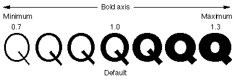
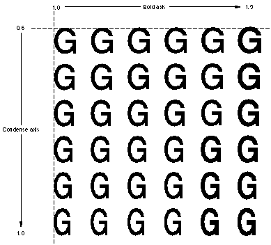

# "gvar" 表

## 一般表信息

Apple Advanced Typography 样式变体允许字体设计师在字体本身中构建高质量样式。 这减少了对图形系统中算法样式的依赖。 要在字体中包含字体变体，您还必须包含字体变体表。

字形变体表（标签名称：“gvar”）允许您包含对字体中的字形进行样式化所需的所有数据。

* **注意：** 本章内容仅适用于 TrueType 字体； 具有变体的 Type 1 字体（即多个主字体）以不同的方式编码其字形变体数据。 有关更多信息，请参阅 Adobe 关于 Type 1 Multiple Master 字体的文档。
从概念上讲，变体字体定义了字体特征可以变化的轴。 因此，在下图中，我们看到 Skia 的 Q 字形绘制在沿“wght”轴的各个点处。 由于最小值和最大值已分别定义为+0.7和+1.3，因此样式坐标1.0的规范指的是中心“Q”的样式。

多个轴可以组合在一个字体中。 例如，您可能想要创建一个“wght”轴和一个“wdth”轴。 然后，用户可以选择粗细和宽度的任意组合，例如 75% 粗体和 50% 压缩。 下图显示了双轴字体变化的示例，其中粗细轴的最小值为 1.0，最大值为 1.5，宽度轴的最小值为 0.6，最大值为 1.0。

