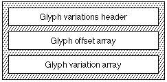

# "gvar" 表

## 一般表信息

Apple Advanced Typography 样式变体允许字体设计师在字体本身中构建高质量样式。 这减少了对图形系统中算法样式的依赖。 要在字体中包含字体变体，您还必须包含字体变体表。

字形变体表（标签名称：“gvar”）允许您包含对字体中的字形进行样式化所需的所有数据。

* **注意：** 本章内容仅适用于 TrueType 字体； 具有变体的 Type 1 字体（即多个主字体）以不同的方式编码其字形变体数据。 有关更多信息，请参阅 Adobe 关于 Type 1 Multiple Master 字体的文档。
从概念上讲，变体字体定义了字体特征可以变化的轴。 因此，在下图中，我们看到 Skia 的 Q 字形绘制在沿“wght”轴的各个点处。 由于最小值和最大值已分别定义为+0.7和+1.3，因此样式坐标1.0的规范指的是中心“Q”的样式。


多个轴可以组合在一个字体中。 例如，您可能想要创建一个“wght”轴和一个“wdth”轴。 然后，用户可以选择粗细和宽度的任意组合，例如 75% 粗体和 50% 压缩。 下图显示了双轴字体变化的示例，其中粗细轴的最小值为 1.0，最大值为 1.5，宽度轴的最小值为 0.6，最大值为 1.0。


有关如何向用户呈现这些轴的数据包含在字体变体表中。 字形变化表包含用于在给定各个轴的设置组合的情况下确定字形轮廓的数据。
这是通过使用元组来完成的。 该术语源自数学，但其含义（n 元组定义为 n 个数字的有序列表）可能无法阐明其在“gvar”表中的用途。 对于变体字体，元组是应用于“glyf”表中的字形中的点的增量列表。 结果确定了要渲染的字形轮廓上点的实际坐标。 然后可以将提示应用于此修改后的轮廓。 提示本身可能因字形而异； 这是由“cvar”表控制的。

每个元组都与一组坐标相关联，每个坐标对应一个坐标。 这些坐标确定是否应用元组并提供应用于增量的乘数。 因此，当用户调整轴的设置时，字形的形状可以平滑地变化。

因此，字形的尺寸和形状都可以变化，元组具有字形中每个点的条目以及四个“幻像点”的条目，这四个“幻像点”代表字形的侧轴承。 这些幻像点依次为左侧幻像点、右侧幻像点、顶部幻像点和底部幻像点。

## "gvar" 表的结构

从概念上讲，“gvar”表非常简单。 其明显的复杂性是用于压缩数据的技术的结果。

对于字体中的每个字形，“gvar”表存储一组元组。 （该集合可能为空。）元组具有坐标，每个轴一个。 可选地，它们还具有中间坐标； 如果有，则每个轴都有一个。 该元组还有一个它移动的点的列表，以及这些点的增量。

**标头**

字形变体表由字形变体表头、字形偏移数组、字形样式坐标数组和字形变体数组组成。 字形变化表的整体结构如下图所示：



该表中显示了字形变体表标头格式：

|类型|名称|描述|
|-|-|-|
|uint16|version|字形变体表的版本号（1 表示当前版本）。
|uint16|保留（reserved）|目前未使用； 设置为 0。
|uint16|axisCount|该字体的样式轴数量。 该数字必须与“fvar”表中的 axisCount 相同。
|uint16|sharedCoordCount|共享坐标的数量。
|uint32|offsetToCoord|从该表的开头到共享样式坐标列表的字节偏移量。
|uint16|glyphCount|该字体中的字形数量； 这应该与字体中其他位置存储的字形数量相匹配。
|uint16|flags|给出后续偏移数组格式的位字段。 如果标志为 0，则类型为 uint16。 如果标志为 1，则类型为 unit32。
|uint32|	offsetToData|从该表的开头到第一个字形 glyphVariationData 的字节偏移量。
|uint16 or uint32|offset[glyphCount+1]|从 glyphVariationData 数组开头到字体中每个字形的 glyphVariationData 的字节偏移量。 该字段的格式由标志字段设置。

globalCoordCount 指向的共享坐标是一种节省空间的机制。 元组可以不存储自己的坐标，而是在全局坐标空间中具有索引。

全局坐标占用的字节数可以使用表达式offsetToData - offsetToCoord 找到。 该大小应等于 globalCoordCount * axisCount * sizeof(shortFrac)。 也就是说，字体中的每个轴都有 globalCoord ShortFrac&s。

如果标志位字段设置为 1，则每个字形数据的偏移量大小为 4 个字节。 如果标志位字段设置为 0，则偏移量为两个字节。

偏移数组遵循字形变体标头。 偏移数组给出了距 glyphVariationData 数组开头的偏移量。 该数据指定每个字形变体的开始位置。 变体数据的顺序与字形顺序相同。 这允许通过从当前变化减去下一个变化的偏移来计算特定字形变化的长度。 这意味着偏移数组中必须有 glyphCount + 1 个条目。

## 坐标

CoreText 使用元组坐标来确定在给定用户的变化轴设置的情况下应用哪些元组。

此过程的第一步是标准化给定轴的设置； 也就是说，将“fvar”表定义的范围中的值映射到范围 [-1, 1]。 （请注意，这正是可以用shortFrac表示的值的范围。）

默认映射是这样做的，以便轴的最小值映射到 -1，默认值映射到 0，最大值映射到 1。这三个键值中的两个之间的值将线性映射到范围 [-1 , 0)（如果小于默认值）或范围 (0, 1]（如果大于默认值）。可以通过“avar”表细化此线性映射。

以Skia为例，Skia有两个轴，重量和宽度。 权重轴的范围是“fvar”表中定义的 [0.48, 3.2]，默认值为 1.0。 宽度轴的范围为 [0.62, 1.3]，默认值为 1.0。

如果用户将权重设置为 0.5，则会标准化为 ( 1.0 - 0.5 ) / ( 1.0 - 0.48 ) = -0.96。 如果用户将权重设置为 1.25，则会标准化为 ( 1.25 - 1.0 ) / ( 3.2 - 1.0 ) = 0.11。

如果给定轴的元组坐标为 0，则在确定是否应用该元组时将忽略该轴的标准化设置。

否则，当且仅当每个轴的当前标准化设置位于该轴的坐标和 0（含）之间时，才应用元组。

对于每个轴（除了被忽略的轴），线性计算标量。 因此，如果标准化设置为 0.5，坐标为 1，则标量为 0.5。 非忽略轴的所有标量的乘积是元组的标量。 对于元组移动的每个点，增量乘以元组的标量，然后添加到该点的位置。 最终结果是绘制字形的点的实际位置。

## GlyphvariationData结构

GlyphvariationData阵列遵循Glyph变化偏移阵列。 每个字形的数据结构如下：

|类型|名称|描述|
|-|-|-|
|uint16|tupleCount| 压缩字段。 高 4 位是标志，低 12 位是该字形的元组数。 元组的数量可以是 1 到 4095 之间的任意数字。|
|uint16|offsetToData| 从 glyphVariationData 开头到序列化字形数据的字节偏移量（见下文）。|
|tuple|tuple[tupleCount]| 元组数组。|

tupleCount 是一个包含标志和元组数量的打包字段。 tupleCount 字段的格式如下所示：

|值|名称|描述|
|-|-|-|
|0x8000|tuples_share_point_numbers|指示某些或所有元组引用后面的一组公共打包点编号的标志。|
|0x7000|served_tuple_count_flags|保留供将来使用的标志。|
|0x0FFF|tuple_count_mask|使用低位来给出元组计数的掩码。|

目前，唯一支持的标志位是 0x8000，tuples_share_point_numbers。 这意味着所有元组都引用紧跟在元组数组之后的一组公共压缩点数。

## tupleHeader结构

字形变化数据头后面跟着一系列元组。 每个元组都以元组标头开始。 元组头的格式如下：

|类型|名称|描述|
|-|-|-|
|uint16|tupleSize|此元组的序列化数据的大小（以字节为单位）。|
|uint16|tupleIndex|压缩字段。 高 4 位是标志位。 表 14-5 提供了这些标志的解释。 低 12 位是全局元组坐标的索引。|
|shortFrac|embeddedCoord[]| 嵌入坐标元组（如果有）。|
|ShortFrac|middleCoord[]| 中间坐标元组（如果有）。|

tupleSize 字段不是该元组的完整元组变体数据的大小。 相反，它指的是该元组在字形的序列化数据中使用的字节数。 实际上可以使用如下代码来计算下一个元组数据：

```
const FTTupleHeader_gvar*
NextTupleVariation( const FTTupleHeader_gvar* iTupleVar, int iAxisCount )
{
		 int tBump = sizeof( FTTupleHeader_gvar ); /* four bytes == two * sizeof( UInt16 ) */
		 int tTupleIndex = iTupleVar->tupleIndex;
		 if ( tTupleIndex & embedded_tuple_coord )
				 tBump += iAxisCount * sizeof( shortFrac );
		 if ( tTupleIndex & intermediate_tuple )
				 tBump += 2 * iAxisCount * sizeof( shortFrac );
		 return (const FTTupleHeader_gvar*)((char*)iTupleVar + tBump);
}

```

tupleIndex 是一个打包字段，由全局元组坐标数组中的标志和索引掩码组成。 tupleIndex字段格式如下表所示：

|值|名称|描述|
|-|-|-|
|0x8000|Embedded_tuple_coord| 指示该元组的坐标紧跟在 tupleIndex 之后的标志。 tupleIndex 的低 12 位被忽略。|
|0x4000|middle_tuple| 指示这是一个中间元组的标志。 tupleIndex 后面的两个坐标（以及可选的嵌入坐标）指定该元组的域。|
|0x2000|private_point_numbers| 指示该元组的前面的元组数据是该元组操作的一组打包点号的标志。 如果该位清零，则该元组使用共享点编号。|
|0x1000|served_tuple_index_flag| 保留标志以供将来使用。|
|0x0FFF|tuple_index_mask| 使用低位来给出元组索引的掩码。|

## 序列化数据

在字形元组的坐标数据之后是一个序列化数据块。 该数据包含元组操作的点及其增量。

如果设置了 tuples_share_point_numbers 标志，则序列化数据以一组打包的点号开始，这些点号由所有字形的元组使用。 压缩点数的格式如下。

其余的序列化数据包含特定于各个元组的信息（按顺序）。 由于 tupleHeader 包含元组使用的序列化数据的字节数，因此无需解析未应用的元组的序列化数据。

如果 tuples_share_point_numbers 被清除，则每个元组的序列化数据以元组操作的点的打包列表开始。 接下来是点的 x 坐标的压缩增量，然后是点的 y 坐标的压缩增量。

## 压缩点数

点编号存储为计数，后跟第一个点编号。 每个后续点都存储为它与前一个点编号之间的差值。 数据被打包成字节和字。

如果计数适合 7 位，则点计数将打包到一个字节中。 如果计数无法容纳 7 位，则将其存储在 2 个字节中，并设置第一个字节的高位。 如果 count = 0，则使用字形上的每个点，并且后面没有数据。 如果 count 非零，则接下来是一系列字节和字的运行。 在这种情况下，每次运行都以一个控制字节开始。 控制字节的高位指定运行是字节还是字，低 7 位指定运行中元素的数量减 1。

打包点计数标志格式如下：

|标识|名称|描述|
|-|-|-|
|0x80|points_are_words|指示点号运行是一个字的标志。|
|0x7F|point_run_count_mask|表示低 7 位为元素数量减 1 的掩码。|

## 打包增量

打包的增量数据不包括要遵循的增量数。 这是因为打包的增量数据每个点包含一个增量。 除此之外，增量打包技术与点所使用的技术类似。 增量存储为一系列运行。 每次运行都是一个控制字节，后跟实际的增量。 控制字节在高两位中指定运行中数据的大小，在低六位中指定增量的数量。

打包元组增量字段格式如下表所示。 请注意，如果 0x80 或 0x40 标志均未设置，则运行包含有符号字节增量。

|标识|名称|描述|
|-|-|-|
|0x80| deltas_are_zero| 指示此运行不包含数据的标志。 这意味着本次运行中的所有增量均为零，因此不会存储显式增量。|
|0x40| deltas_are_words| 指示运行包含 16 位有符号增量的标志。|
|0x3F| delta_run_count_mask| 使用低 6 位的标志和掩码来提供运行中增量的数量减 1。|

## 组件字形变体的点数

前面的讨论适用于简单的字形。 组件字形变体的结构类似。 区别在于简单字形由点定义，而组件字形由其他字形定义。 组件字形变化描述了偏移指定的每个组件的位置如何变化以及父复合字形的度量如何变化。 这些变化由假点数表示。 为每个组件分配一个假点编号，然后为最终字形的度量再分配 4 个假点编号。

考虑组件字形“é”。 如果使用锚点指定重音，则变体数据将没有用处。 可以通过移动基本字形或重音中的附着点来重新定位重音。 然而，如果重音是通过偏移指定的，则变体数据可用于描述其位置如何变化。

示例组件字形的假点数分配和增量分配如下：

|假点数|增量任务|
|-|-|
|0|基本字形。|
|1|重音字形。|
|2|左侧轴承公制点。|
|3|右侧轴承公制点。|
|4|顶部轴承公制点。|
|5|底部轴承公制点。|

## 例子

举个例子，考虑 Skia，OS X 附带的变体字体。它以标题开头：

|值|名称|描述|
|-|-|-|
|1| 版本version|表版本号
|0| 保留reserved| 目前未使用； 设置为 0。
|2| axisCount| 字体有两个轴； 有关它们的详细信息可以在“fvar”表中找到。
|8| globalCoordCount| 有八个共享坐标。
|00000954| offsetToCoord| 从该表的开头到共享坐标的字节偏移量。
|591| glyphCount| 此字体中的字形数量。
|1| 标志flags| glyphVariationDatas 的偏移量为四个字节。
|00000974| offsetToData| 从该表的开头到第一个字形 glyphVariationData 的字节偏移量。

标头意味着共享坐标使用 32 个字节（0x0974 - 0x0954 = 0x0020 = 32）。 每个共享坐标由两个shortFrac组成，每个轴一个，每个shortFrac的大小为两个字节。 由于有八个共享坐标，我们预计它们需要 8 x 2 x 2 = 32 字节来存储，因此这个数字是正确的。

glyphVariationDatas 的前五个偏移量是：
|偏移|字形|
|-|-|
|00000000| .notdef 字形数据的偏移量（字形 0）|
|00000000| .null 字形数据的偏移量（字形 1）|
|00000000| 非标记返回字形数据的偏移量（字形 2）|
|00000050| 空间字形数据的偏移量（字形 3）|
|00000009E| empty.1 字形（字形 4）的数据偏移量|

由此，我们可以看出前两个字形根本没有变化数据。 字形三具有 80 字节的变化数据 (0x0050 - 0x0000)，而空间字形具有 78 字节 (0x009E - 0x0050)。

最初，没有视觉外观的字形具有变化数据可能会令人惊讶。 但请记住，每个字形都有四个“虚拟”点，指示其指标如何变化。 即使非打印字形也可能需要改变它们的度量。

接下来，我们有 32 个字节用于八个共享坐标：

```
4000 0000
C000 0000
0000 4000
0000 C000
C000 C000
4000 C000
4000 4000
C000 4000
```

根据“fvar”表，第一个轴是粗细轴（“wght”），第二个轴是宽度轴（“wdth”）。 从shortFracs转换为浮点数，这给了我们八个坐标：

|粗细|宽度|
|-|-|
|1.0|	0.0|
|-1.0|	0.0|
|0.0|	1.0|
|0.0|	-1.0|
|-1.0|	-1.0|
|1.0|	-1.0|
|1.0|	1.0|
|-1.0|	1.0|

## 字形数据

让我们看一下一些特定字形的数据。 让我们从“I”的字形开始，字形编号 73。

glyphVariationData 数组的字形 73 的偏移量为 00006B68，字形 74 的偏移量为 00006C76。因此，字形 73 具有 0x6C76 - 0x6B68，即 270 字节的数据。

我们将 0x00006B68 添加到标头的 offsetToData 字段 (0x00000974) 以获取 I 数据的偏移量 (0x000074DC) 并获取接下来的 270 个字节：

```
 0008 0024 0033 2000 0015 2001 001B 2002
 0024 2003 0015 2004 0026 2007 000D 2006
 001A 2005 0040 0101 0181 8043 FF7E FF7E
 FF7E FF7E 0081 4501 0101 0301 0401 0401
 0401 0280 4000 8281 8104 3A5A 3E43 2081
 040E 4015 457C 8300 0D9E F3F2 F0F0 F0F0
 F39E A0A1 A1A1 9F80 0091 8191 000D 0A0A
 090A 0A0A 0A0A 0A0A 0A0A 0A0B 8000 1581
 8100 C489 00C4 8300 0D80 9998 9696 9696
 9980 8283 8383 8180 40FF 1881 8104 E6F9
 1021 0281 04E8 E5EB 4DDA 8300 0DCE D3D4
 D3D3 D3D5 D2CE CCCD CDCD CD80 00A1 8191
 000D 0703 0402 0202 0303 0707 0808 0807
 8000 0981 8100 2840 00A4 0224 2466 8104
 08FA FAFA 2883 0082 02FF FFFF 8302 0101
 0184 9100 8006 0708 0808 080A 0780 03FE
 FFFF FF81 0008 8182 02EE EEEE 8B6D 00
```

第一个单词告诉我们后面有八个元组，并且该字形的变体数据不使用共享点（tuples_share_point_numbers 很清楚）。 该元组的数据大小为 0x0024 == 36 字节。由于标头占用 4 个字节，而元组的最小大小为 4 个字节，因此我们可以从中推断出每个元组正好占用 4 个字节。

这八个元组的数据如下：

```
 0033 2000
 0015 2001
 001B 2002
 0024 2003
 0015 2004
 0026 2007
 000D 2006
 001A 2005
```

我们注意到所有八个元组都设置了 private_point_numbers 标志，因此所有八个元组的点编号都嵌入到字形变化数据中。 （当然，我们期望如此，因为字形变体标头表明没有共享点编号。）

根据记录，这些元组声称总共使用 233 个字节。 将其添加到标头和元组的 36 个字节中，我们得到 269 个字节。 剩余的字节是填充。

第一个元组将使用 51 字节的序列化数据。 它的 private_point_numbers 已设置，因此其序列化数据包括其点。 它的embedded_tuple_coord标志是明确的，所以底部12位给出了共享坐标的索引，即0，所以它的坐标是('wght': 1.0, 'wdth': 0.0)。 本质上，这意味着仅当权重变化大于默认值时才使用该元组。

51字节的序列化数据是：

```
00 40 01 01 01 81 80 43 FF 7E FF 7E FF 7E FF 7E 00 81 45 01 01 01 03 01 04 01 04 01 04 01 02 80 40 00 82 81 81 04 3A 5A 3E 43 20 81 04 0E 40 15 45 7C 83
```

点编号从元组的序列化数组的开头开始。 我们的第一个字节是 00，这是一个特殊值，意思是“字形的所有点”。 （在本例中，即点 0 到 13，加上四个虚拟点，即 14 到 17。）

该元组的剩余 50 字节数据是增量。 十八个点中的每一个都需要两个增量，一个 x 增量和一个 y 增量。 十八个 x 三角洲排在第一位。

我们的 x-delta 数据的第一个字节是 0x40。 前两位是标志，余数比运行中的增量数减 1。 因此，我们有一个增量的运行，其大小是一个字（设置了标志 deltas_are_words）。 因此，增量为 0x0101 或 257（增量是有符号整数）。 下一个字节是 0x01，表示两个短增量，分别为 0x81 和 0x80。 接下来是 0x43，这意味着四个长增量 (FF7E FF7E FF7E FF7E)，然后 00 代表一个短增量 (81)，然后 45 代表六个长增量 (0101 0103 0104 0104 0104 0102)，然后 0x80 代表一个零增量，然后 0x40 一个长增量 (0082)，然后 0x81 表示两个零增量。 这些是 x 增量，并且（如果您进行跟踪的话）实际上有 18 个。

y-delta 的解析类似：0x81 表示两个零增量，0x04 表示五个一字节增量 (3A 5A 3E 43 20)，0x81 表示两个零增量，0x04 表示五个一字节增量 (0E 40 15 45 7C)，以及 然后 0x83 代表四个零字节增量，总共十八个。

增量都是由字体定义的 em 单位的 int16。

在 ftxdumperfuser 使用的 XML 格式中，这一元组的总体数据为：

```
<tuple size="51" index="0" embeddedTupleCoordinates="false" intermediateTuple="false" privatePointNumbers="true" >
	<tupleCoordinate axisRefID="0" axisTag="wght" value="1" />
	<tupleCoordinate axisRefID="1" axisTag="wdth" value="0" />
	<tuplePoint number="0" xDelta="257" yDelta="0" />
	<tuplePoint number="1" xDelta="129" yDelta="58" />
	<tuplePoint number="2" xDelta="128" yDelta="90" />
	<tuplePoint number="3" xDelta="-130" yDelta="62" />
	<tuplePoint number="4" xDelta="-130" yDelta="67" />
	<tuplePoint number="5" xDelta="-130" yDelta="32" />
	<tuplePoint number="6" xDelta="-130" yDelta="0" />
	<tuplePoint number="7" xDelta="129" yDelta="14" />
	<tuplePoint number="8" xDelta="257" yDelta="64" />
	<tuplePoint number="9" xDelta="259" yDelta="21" />
	<tuplePoint number="10" xDelta="260" yDelta="69" />
	<tuplePoint number="11" xDelta="260" yDelta="124" />
	<tuplePoint number="12" xDelta="260" yDelta="0" />
	<tuplePoint number="13" xDelta="258" yDelta="0" />
	<tuplePoint number="14" xDelta="0" yDelta="0" />
	<tuplePoint number="15" xDelta="130" yDelta="0" />
	<tuplePoint number="16" xDelta="0" yDelta="0" />
	<tuplePoint number="17" xDelta="0" yDelta="0" />
</tuple>
```

## 依赖关系

“gvar”表应具有与“fvar”表相同的轴数。 字形和字形点索引应与“glyf”表中的相同。
