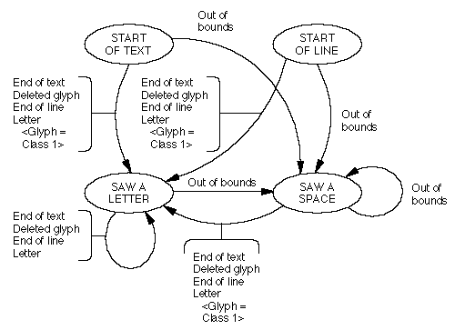
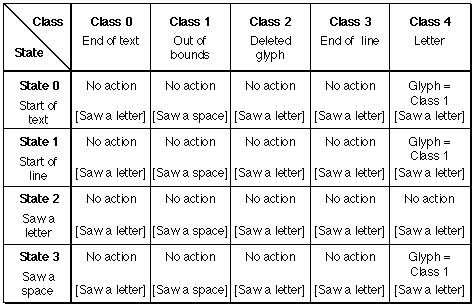

# "just"表
## 一般表信息
### 介绍
对齐表（标签名称：“just”）允许您设计 AAT 字体以适应特殊的对齐功能。 对齐是在印刷上拉伸或收缩一行文本以适合给定高度或宽度的过程。 一行文本是字形的集合，该行上的每个字形都与左右（或顶部和底部）宽度delta因子、对齐类别和对齐优先级相关联。

您可以选择许多不同的选项来控制字体中文本的对齐方式，包括以下选项：

* 任何字形左侧和右侧的单独对齐因素。
* 在需要放松线的情况以及需要收紧线的情况下，使用不同的调整因子集。
* Kashida 字形，用于连接连接脚本（例如阿拉伯语或草书罗马字）中其他字形的字形。
* 控制字形参与对齐过程的顺序。
* 选择“无限”的某些字形，以便它们在对齐过程中始终吸收所有剩余的间隙。
* 基于上下文的、基于状态表的对齐行为指定，因此相同的字形在不同的上下文中可能有完全不同的行为。
* 通过简单拉伸或使用字体变化机制，使字形改变形状以填充间隙（复制拟合）。
* 如果在对齐过程中添加了太多空白，则能够将连字撤回到其组成部分。

宽度delta因子是字形可以在每一侧扩展或收缩的分数测量值。 （对于某些脚本，字形的侧面位于左侧和右侧；对于其他脚本，它们位于顶部和底部。）您可以将宽度delta因子确定为相对于单点字形的距离（以点为单位测量）。 为了计算较大点大小的字形的宽度delta因子值，请将此距离乘以该点大小。 例如，右侧增长因子的宽度delta因子值为 2.5，这意味着可以将 2.5 点的空白添加到大小为 1 磅的字形右侧。 例如，如果 12 点字形的右侧增长宽度delta因子为 2.5，则可以将 30 点的空白添加到字形的右侧。 有些字形也被指定为无限的，这意味着它们占据了一行上的所有可用间隙。 例如，如果您不想添加字形间距，则可以将一个或多个空白字形指定为无限制。

对齐类别允许与字形一起使用的宽度delta因子集在线上的不同位置发生变化。 例如，字形可能会根据它出现在单词的开头还是结尾而表现出不同的行为。 允许字形在一行或一个单词的不同位置具有不同的宽度delta因子对于非罗马语言（例如阿拉伯语）尤其重要。 您包括一个对齐类别状态表，以便为字形分配适当的对齐类别。

对齐优先级标识字形开始参与对齐过程的阶段。 四个优先事项是：

* kashida 优先。 这是辩护期间的最高优先级。 首先处理具有此优先级的任何字形。 此优先级主要用于阿拉伯语，它标识要使用 kashida 扩展条扩展的字形，而不是通过添加空格来扩展。
* 空白优先。 这是下一个最高优先级。 您应该给予空白字形（如字形属性表中所标识）此优先级。
* 字形间优先级。 此优先级应用于任何剩余的字形。 此优先级的字形晚于前两个优先级的字形参与调整过程。
* null空优先级。 该优先级通常不包含在字体中； 相反，它被应用程序用来在文本布局时覆盖对齐优先级，因此不应用于字体中的任何实际字形。
对齐表存储字体字形和整个字体的对齐信息。 您可以存储水平和垂直调整或一个方向的调整。

### 原因表格式
调整表如图4-1所示。 该表以指向单独的水平和垂直对齐标题的整体表标题开始。 这些标题中的每一个都指向包含在水平或垂直方向上对齐字体所需的信息的子表。

图 4-1 调整表

对齐表的顶层包含表的版本号、对齐表的格式号以及水平和垂直对齐表的偏移量。 调整表的顶层格式如表 4-1 所示。

|类型|名称|描述|
|-|-|-|
|Fixed|version|调整表的版本号（当前版本为 0x00010000）。|
|UInt16|format|原因表的格式（设置为 0）。|
|UInt16|horizOffset|从调整表开头到表头的字节偏移量contain justification 水平文本的信息。 如果您不包含此信息，请存储 0。|
|UInt16|vertOffset|从调整表开头到表头的字节偏移量contain justification 垂直文本的信息。 如果您不包含此信息，请存储 0。|

您可以存储单独的表格，以获取有关字体如何处理水平对齐（而不是垂直对齐）的信息。 标头的 horizOffset 和 vertOffset 字段指向 JustificationHeader 类型的特定方向的对齐标头。 这些特定于方向的对齐标头包含表的偏移量，这些表描述了字体在对齐过程中所需的数据：对齐类别、字体的宽度delta因子和后补偿子表，这是一个可选表，允许您指定字体可以执行的对齐行为 特定情况下显示。 JustificationHeader的格式如下表所示：

|类型|名称|描述|
|-|-|-|
|UInt16|	justClassTableOffset|	调整类别状态表的偏移量。
|UInt16|	wdcTableOffset|	从对齐表开始到包含字体字形宽度delta因子的子表开始的偏移量。
|UInt16|	pcTableOffset|	从调整表开始到补偿后子表开始的偏移量（如果没有则设置为零）。
|variable|	lookupTable|	将字形与宽度delta簇关联起来的查找表。 有关如何解释查找值的详细信息，请参阅“宽度delta簇”表的说明。
|variable|	widthDeltaClusters|	宽度delta簇表。
|variable|	postcompTable|	后补偿子表（如果存在于字体中）。

### 理由类别状态表
对齐类别状态表允许您将字形与取决于字形上下文的对齐类别相关联。 状态表的格式如下：

|类型|名称|描述|
|-|-|-|
|MorphSubtableHeader|	morphHeader|变形风格的子表头。|
|StateHeader|	stHeader|调整插入状态表头|

对于该状态表，条目子表中的条目仅包括newState字段和flags字段； glyphOffsets 数组中没有值。 下表给出了该状态表的标志字段的解释：

|掩码值|名称|解释|
|-|-|-|
|0x8000|	setMark|如果设置，则使当前字形成为标记字形。
|0x4000|	dontAdvance|如果设置，则在进入新状态之前不要前边到下一个字形。
|0x3F80|	markCategory|如果非零，则标记字形的对齐类别。
|0x007F|	currentCategory|当前字形的调整类别（如果非零）。
对齐类别是一个 7 位值，允许与该字形一起使用的因子集在线上的不同位置发生变化。 当分析一条线时，根据字形索引和上下文，为每个字形分配一个对齐类别。 通过这种方式，您可以在同一字形的对齐行为中提供细微的差异。 例如，单词末尾的小写“e”的行为可能与单词开头或中间的小写“e”不同。 然后，将此对齐类别与宽度delta记录相匹配，该记录包含字形增长和收缩的限制。

如果对齐类别字段（markCategory 和 currentCategory）非零，则它们用于设置相应字形的对齐类别。 如果设置了 setMark 标志，则会记住当前字形在字形数组中的位置，使其成为标记字形。

### 宽度deltaDelta表
对齐类别的宽度delta因子存储在宽度delta簇中。 每个簇包含许多宽度delta对。 每对将一个对齐类别映射到一个宽度delta记录，其中包含有关您对该对齐类别中的字形增大和缩小的能力设置的限制的信息。

查找表用于查找与特定字形关联的宽度delta簇。 这是解释五种查找表格式中每一种的查找值的方法：

|查找表格式|解释|
|-|-|
|0|	16 位偏移量数组，每个偏移量对应字体中的每个字形。 每个偏移量是从宽度delta簇表的开始到该字形的特定宽度delta簇。|
|2|	每个lookupSegment的值是从宽度delta簇表的开始到该段中字形的特定宽度delta簇的16位偏移量。|
|4|	每个lookupSegment的值是从查找表的开头到一个16位偏移量数组的16位偏移量，段中的每个字形都有一个偏移量。 每个偏移量是从宽度delta簇表的开始到特定宽度delta簇|
|6|	每个lookupSingle 的值是从宽度delta簇表的开头到该字形的特定宽度delta簇的 16 位偏移量。|
|8|	valueArray 是一个 16 位偏移量的数组，一个偏移量对应于修剪数的组中每个字形。 每个偏移量是从宽度Delta 集合表的开始到该字形的特定宽度Delta集合。|

宽度delta簇由 WidthDeltaCluster 记录表示，是一个或多个宽度delta对的集合，按 justClass 字段的值排序，从 0 开始。簇必须从长字边界开始。 宽度delta簇的格式如下：

|类型|名称|描述|
|-|-|-|
|UInt32|count|随后的宽度delta对记录的数量。|
|WidthDeltaPair|wdPairs|宽度delta对记录|

由 WidthDeltaPair 记录表示的宽度delta对将对齐类别与宽度delta记录相关联。 宽度delta对的格式如下：

|类型|名称|描述|
|-|-|-|
|UInt32|justClass|与 wdRecord 字段关联的理由类别。 该字段仅使用 7 位。 （其他位用作填充以保证后续记录的长字对齐）。|
|JustWidthDeltaEntry|wdRecord|实际宽度delta记录。|

您可以使用宽度delta记录（JustWidthDeltaEntry 类型）来存储有关分配给此类字形的增长和收缩因子的信息。 记录的格式如下：

|类型|名称|描述|
|-|-|-|
|Fixed|	beforeGrowLimit|允许字形前边宽度在左侧或顶侧增长的比率。
|Fixed|	beforeShrinkLimit|允许字形的前边宽度在左侧或顶侧收缩的比率。
|Fixed|	afterGrowLimit|允许字形前边宽度在右侧或底侧增长的比率。
|Fixed|	afterShrinkLimit|字形前边宽度最多允许在右侧或底侧收缩的比率。
|UInt16|	growFlags|控制增长情况的标志。
|UInt16|	shrinkFlags|控制收缩情况的标志。

GrowthFlags和shrinkFlags位掩码值如下：

|掩码值|解释|
|-|-|
|0xE000| 保留。 您应该将这些位设置为零。|
|0x1000| 字形可以采用无限间隙。 当此字形参与对齐过程时，它和具有此位设置的行上的任何其他字形吸收所有剩余间隙。|
|0x0FF0| 保留。 您应该将这些位设置为零。|
|0x000F| 字形的对齐优先级。|

字形的对齐优先级控制该字形何时进入对齐过程。 该值越低，字形开始参与的时间越早。 下表描述了理由优先级：

|优先事项|含义|
|-|-|
|0|Kashida优先。 这是辩护期间的最高优先级。
|1| 空白优先。 任何空白字形（如字形属性表中所标识）都将获得此优先级。
|2| 字符间优先级。 将此赋予任何剩余的字形。
|3| 空优先级。 您应该为仅参与上述优先级之后的对齐的字形设置此优先级。 通常，所有字形都具有前三个值之一。 如果您不希望字形参与对齐，并且不想将其因子设置为零，则可以将其分配给空优先级。

### 后补偿子表
您可以在某些条件下指定替代字形行为。 例如，您可以指定当向对齐行添加过多空间时，连字应分解为其组成部分。 这些替代行为称为后补偿动作并存储在后补偿子表中。 您可以将字体中的一个或多个字形索引映射到单一类型的后补偿操作记录。 您不必将所有字形索引映射到一个操作。 包含这些操作的后补偿子表在您的字体中是可选的。

后补偿表的格式如下：

|类型|名称|描述|
|-|-|-|
|variable|pcLookupTable|将字形与补偿后动作记录相关联的查找表。 有关如何解释查找值的详细信息，请参阅下文。|
|variable|pcActionRecords|其偏移量包含在先前查找表中的操作记录。|

查找表用于查找与特定字形相关联的补偿后动作记录。 请注意，对于该表，查找值 0 被解释为意味着不应对该字形执行后补偿操作。 以下是解释 5 种查找表格式中每种格式的查找值的方法：

|查找表格式|解释|
|-|-|
|0|16 位偏移量数组，一个对应于字体中的每个字形。 每个偏移量是从后补偿查找表的开始到该字形的特定后补偿动作记录。
|2|每个lookupSegment 的值是从后补偿查找表的起始位置到该段中字形的特定后补偿操作记录的16 位偏移量。
|4|每个lookupSegment 的值是从查找表的开头到一个16 位偏移量数组的16 位偏移量，段中的每个字形都有一个偏移量。 每个偏移量是从后补偿查找表的开始到该字形的特定后补偿动作记录。
|6|每个lookupSingle 的值是从后补偿查找表的开头到该字形的特定后补偿操作记录的16 位偏移量。
|8|valueArray 是一个 16 位偏移量的数组，一个对应于修剪数组中的每个字形。 每个偏移量是从后补偿查找表的开始到该字形的特定后补偿动作记录。

PostcompensationAction 记录具有以下格式：

|类型|名称|描述|
|-|-|-|
|UInt32|	actionCount|以下数组中的 ActionSubrecord 记录数。|
|ActionSubrecord|	actSubrecord[]|ActionSubrecord 记录数组。|

ActionSubrecord 具有以下格式：

|类型|名称|描述|
|-|-|-|
|UInt16|	actionClass|与此 ActionSubrecord 关联的 JustClass 值。
|UInt16|	actionType|后补偿动作的类型。
|UInt32|	actionLength|此 ActionSubrecord 记录的长度，必须是 4 的倍数。
|variable|	actionData|数据。 该数据的格式取决于actionType 字段的值。
|variable|	padding|如果需要的话，额外的字节可以保证这个 ActionSubrecord 的长度是 4 的倍数。

下表显示了支持的操作类型：

|动作类型|描述|
|-|-|
|0| 分解作用。|
|1| 无条件添加字形操作。|
|2| 有条件添加字形操作。|
|3| 拉伸字形动作。|
|4| 延展字形动作。|
|5| 重复添加字形动作。|

#### 分解作用
如果对齐过程添加的额外字形间空间量太大，则连字可能会被分解成其组成部分。 距离因子是您想要的相对于 1 磅大小的字形的增长比率。 额外的字形间空间量由距离因子决定。 例如，如果增长上限为 0.5，则如果必须添加超过 6 个点的空白，则 12 点连字就会被分解。

此类后补偿操作的 ActionSubrecord 记录的 actionData 字段的格式如下表所示：

|类型|名称|描述|
|-|-|-|
|fixed|	lowerLimit|如果距离因子小于该值，则连字将被分解。
|fixed|	upperLimit|如果距离因子大于该值，则连字将被分解。
|UInt16|	order|分解该连字的数字顺序； 您可能需要不频繁的连字to decompose before more frequent ones. The ligatures on the line of text will decompose in increasing value of this field.
|UInt16|	decomposedCount|后面的 16 位字形索引数； 连字将被分解为these glyphs.
|UInt16|	glyphs[]| 分解字形数组。

#### 无条件添加字形操作

如果字形的前进宽度正在增长，则在该字形之后添加指定的单个字形（例如简单的水平 kashida）。

对于 actionType 值为 1 的 ActionSubrecord 的 actionData 部分具有以下格式：

|类型|名称|描述|
|-|-|-|
|UInt16| addGlyph| 如果距离因子正在增长，则应添加的字形。|

#### 有条件添加字形操作

actionType 为 2 是条件添加字形操作。 这个动作有两个效果。 首先，与无条件添加字形操作一样，在增长情况下的字形后面添加一个额外的字形（而不是空格）。 然而，并不是总是添加这个额外的字形，而是针对指定的因素执行测试。 如果要添加的额外空间量小于此因子，则此操作与无条件添加字形操作完全相同。

然而，如果添加的额外空间量大于或等于该因子，则除了添加指定的额外字形之外，原始字形本身也将被更改为不同的字形。 这很有用，例如，在阿拉伯语中，如果要在行中添加大量额外空间，则出现在单词末尾的某些字母形式（例如，最后的修女）会更改为特殊的更宽形式。

此 actionType 的 ActionSubrecord 的 actionData 部分的格式如下：

|类型|名称|描述|
|-|-|-|
|fixed|	substThreshold|替换该字形并重新计算增长因子的距离增长因子（以 ems 为单位）。
|UInt16|	addGlyph|字形添加为 kashida。 如果该值为 0xFFFF，则不会添加额外的字形。 请注意，通常添加字形时，需要重新进行对齐。
|UInt16|	substGlyph|如果增长因子等于或超过 substThreshold 的值，则要替换此字形的字形。

#### 拉伸字形动作
动作类型 3 是拉伸字形动作。 没有插入额外的字形； 相反，拉伸因子应用于现有字形，而不是向其添加空格。 例如，您可以将连字符指定为可以拉伸以占据文本行中所有空白的字形。

对于 actionType 为 3 的 ActionSubrecord 没有 actionData 部分； 不应出现任何数据。

CoreText 不支持拉伸字形操作。 应避免使用它们。

#### 延展字形动作
actionType 为 4 是延展字形动作。 这会导致字形的实际形状通过使用字体变化机制而改变。 actionType 4 的 ActionSubrecord 的 actionData 部分如下：

|类型|名称|描述|
|-|-|-|
|UInt32|	variationAxis|	标识延性轴的 4 字节标签。 通常为 0x64756374（“duct”），但您可以使用字体包含的任何轴。
|Fixed|	minimumLimit|	仍能产生可接受外观的延展性轴的最低值。 通常该值为 1.0。
|Fixed|	noStretchValue|	这是对应于外观没有变化的默认值。 通常，该值为 1.0。
|Fixed|	maximumLimit|	仍能产生可接受外观的延展性轴的最高值。
*CoreText 不支持延展字形操作。 应避免使用它们。*

#### 重复添加字形操作
如果字形的前进宽度正在增长，则在该字形之后添加指定的单个字形（例如简单的水平 kashida）。 如有必要，可多次添加以填补空白。

对于 actionType 值为 5 的 ActionSubrecord 的 actionData 部分具有以下格式：

|类型|名称|描述|
|-|-|-|
|UInt16|flags|目前未使用； 设置为 0。
|UInt16|glyph|如果距离因子正在增长，则应添加的字形。

### 理由表示例

#### 示例：简单理由表

考虑一个包含常用字形的罗马字体的简单示例。 在此示例中，有一组用于空格字符的调整因子，以及一组不同的用于其他字符的因子。 这不是草书字体，因此没有 kashida 优先的字形。 此外，没有特殊处理字形，因此使用的唯一对齐类别为零。 出于本示例的目的，假设字形 2 是空格字形，字形 3 到 275 构成字体中的非空白字形。 该理由表中没有后补偿子表。

此示例字体的调整表如下：
<table>
  <tr>
    <th>偏移/长度</th>
    <th>值</th>
    <th>名称</th>
    <th>注释</th>
  </tr>
  <tr>
    <td>0/4</td>
    <td>0x00010000</td>
    <td>version</td>
    <td>定点格式的调整表的版本号。 版本是1.0。</td>
  </tr>
  <tr>
    <td>4/2</td>
    <td>0</td>
    <td>format</td>
    <td>理由表格式。</td>
  </tr>
  <tr>
    <td>6/2</td>
    <td>10</td>
    <td>horizOffset</td>
    <td>水平对齐标头表起始处的字节偏移量。</td>
  </tr>
  <tr>
    <td>8/2</td>
    <td>0</td>
    <td>vertOffset</td>
    <td>垂直 JustificationHeader 子表开始的字节偏移量。 值为 0 表示没有垂直子表。</td>
  </tr>
  <tr>
    <td colspan="4" >（水平 JustificationHeader 从这里开始）</td>
  </tr>
  <tr>
    <td>10/2</td>
    <td>0</td>
    <td>justClassTableOffset</td>
    <td>调整类别状态表的字节偏移量。 值 0 表示每个字形的 justClass 值为零。</td>
  </tr>
  <tr>
    <td>12/2</td>
    <td>48</td>
    <td>wdcTableOffset</td>
    <td>宽度delta簇开始的字节偏移量。</td>
  </tr>
  <tr>
    <td>14/2</td>
    <td>0</td>
    <td>pcTableOffset</td>
    <td>后补偿子表开始的字节偏移量。 值为 0 表示没有后补偿子表。</td>
  </tr>
  <tr>
    <td colspan="4" >（查找表从这里开始）</td>
  </tr>
  <tr>
    <td>16/2</td>
    <td>2</td>
    <td>format</td>
    <td>查找表格式2（段单表格式）。</td>
  </tr>
  <tr>
    <td colspan="4" >（接下来的 5 个字段是 BinSrchHeader）</td>
  </tr>
  <tr>
    <td>18/2</td>
    <td>6</td>
    <td>unitSize</td>
    <td>LookupSegment 记录的大小（起始字形索引为 2 个字节，结束字形索引为 2 个字节，宽度delta簇记录的偏移量为 2 个字节）。</td>
  </tr>
  <tr>
    <td>20/2</td>
    <td>2</td>
    <td>nUnits</td>
    <td>要搜索的先前大小的单元数。</td>
  </tr>
  <tr>
    <td>22/2</td>
    <td>12</td>
    <td>searchRange</td>
    <td>unitSize 乘以小于或等于 nUnits 的最大二的幂。</td>
  </tr>
  <tr>
    <td>24/2</td>
    <td>1</td>
    <td>entrySelector</td>
    <td>小于或等于 nUnits 的最大的两个幂的对数以 2 为底。</td>
  </tr>
  <tr>
    <td>26/2</td>
    <td>0</td>
    <td>rangeShift</td>
    <td>unitSize 乘以 nUnits 的差值减去两个小于或等于 nUnits 的最大幂。</td>
  </tr>
  <tr>
    <td colspan="4" >（第一个LookupSegment从这里开始）</td>
  </tr>
  <tr>
    <td>28/2</td>
    <td>2</td>
    <td>lastGlyph</td>
    <td>第一段中的结束字形索引（空格字形）。</td>
  </tr>
  <tr>
    <td>30/2</td>
    <td>2</td>
    <td>firstGlyph</td>
    <td>该段中的起始字形索引（空间字形）。</td>
  </tr>
  <tr>
    <td>32/2</td>
    <td>0</td>
    <td>value</td>
    <td>从 WidthDeltaClusters 记录表的开头（偏移量 48）到第一个 WidthDeltaCluster 记录（也是偏移量 48）的字节偏移量。</td>
  </tr>
  <tr>
    <td colspan="4" >（第二个LookupSegment从这里开始）</td>
  </tr>
  <tr>
    <td>34/2</td>
    <td>275</td>
    <td>lastGlyph</td>
    <td>第二段中的结束字形索引（非空白）。</td>
  </tr>
  <tr>
    <td>36/2</td>
    <td>3</td>
    <td>firstGlyph</td>
    <td>第二段中的起始字形索引（非空白）。</td>
  </tr>
  <tr>
    <td>38/2</td>
    <td>28</td>
    <td>value</td>
    <td>从 WidthDeltaClusters 记录表的开头（偏移量 48）到第二个 WidthDeltaCluster 记录（偏移量 76）的偏移量（以字节为单位）。</td>
  </tr>
  <tr>
    <td colspan="4" >（最后一个LookupSegment从这里开始）</td>
  </tr>
  <tr>
    <td>40/2</td>
    <td>0xFFFF</td>
    <td>lastGlyph</td>
    <td>最后一个查找段中最后一个字形的特殊值。</td>
  </tr>
  <tr>
    <td>42/2</td>
    <td>0xFFFF</td>
    <td>firstGlyph</td>
    <td>最后一个查找段中第一个字形的特殊值。</td>
  </tr>
  <tr>
    <td>44/2			</td>
    <td>0</td>
    <td>value</td>
    <td>从 WidthDeltaClusters 记录表的开头到此特定 WidthDeltaCluster 记录的字节偏移量。</td>
  </tr>
  <tr>
    <td>46/2</td>
    <td>0</td>
    <td>padding</td>
    <td>填充以保证此字段后面的 WidthDeltaCluster 表从长字边界（4 的倍数）开始。</td>
  </tr>
  <tr>
    <td colspan="4" >（WidthDeltaCluster 记录从这里开始）</td>
  </tr>
  <tr>
    <td>48/4</td>
    <td>1</td>
    <td>count</td>
    <td>随后的对齐类别和 JustWidthDeltaEntry 对的数量。</td>
  </tr>
  <tr>
    <td>52/4</td>
    <td>0</td>
    <td>justClass</td>
    <td>理由类别为零。</td>
  </tr>
  <tr>
    <td>56/4</td>
    <td>0x00008000</td>
    <td>beforeGrowLimit</td>
    <td>字形在左侧可以增长的最大 em 数是二分之一 em。</td>
  </tr>
  <tr>
    <td>60/4</td>
    <td>0xFFFFF500</td>
    <td>beforeShrinklimit</td>
    <td>字形在左侧可以收缩的 em 数大约为 -0.043 em。</td>
  </tr>
  <tr>
    <td>64/4</td>
    <td>0x00008000</td>
    <td>afterGrowLimit</td>
    <td>字形在右侧可以增长的最大 em 数是二分之一 em。</td>
  </tr>
  <tr>
    <td>68/4</td>
    <td>0xFFFFF500</td>
    <td>afterShrinkLimit</td>
    <td>字形在右侧可以收缩的 em 数大约为 -0.043 em。</td>
  </tr>
  <tr>
    <td>72/2</td>
    <td>0x0001</td>
    <td>growFlags</td>
    <td>空白优先。</td>
  </tr>
  <tr>
    <td>72/2</td>
    <td>0x0001</td>
    <td>shrinkFlags</td>
    <td>空白优先。</td>
  </tr>
  <tr>
    <td>76/4</td>
    <td>1</td>
    <td>count</td>
    <td>随后的对齐类别和 JustWidthDeltaEntry 对的数量。</td>
  </tr>
  <tr>
    <td>80/4</td>
    <td>0</td>
    <td>justClass</td>
    <td>理由类别为零。</td>
  </tr>
  <tr>
    <td>84/4</td>
    <td>0x00002500</td>
    <td>beforeGrowLimit</td>
    <td>字形在左侧可以增长的最大 em 数大约为 0.14 em。</td>
  </tr>
  <tr>
    <td>88/4</td>
    <td>0xFFFFF500</td>
    <td>beforeShrinklimit</td>
    <td>字形在左侧可以收缩的 em 数大约为 -0.043 em。</td>
  </tr>
  <tr>
    <td>92/4</td>
    <td>0x00002500</td>
    <td>afterGrowLimit</td>
    <td>字形在右侧可以增长的最大 em 数大约为 0.14 em。</td>
  </tr>
  <tr>
    <td>96/4 </td>
    <td>0xFFFFF500</td>
    <td>afterShrinkLimit</td>
    <td>字形在右侧可以收缩的 em 数大约为 -0.043 em。</td>
  </tr>
  <tr>
    <td>100/2</td>
    <td>0x0002</td>
    <td>GrowthFlags</td>
    <td>字符间优先级。</td>
  </tr>
  <tr>
    <td>102/2 </td>
    <td> 0x0002</td>
    <td>shrinkFlags</td>
    <td>字符间优先级。</td>
  </tr>
</table>

#### 示例：复杂调整表（带有后补偿和调整类别状态表）

一个更复杂的示例是您要为其添加 kashida 功能的阿拉伯字体。 此示例中使用的 kashida 字形是字形编号 226。此示例还使用以下字形分配：2 是空白，3 到 225 是常规字形，226 是 kashida。 为简单起见，此字体使用状态表，将对齐类别 1 分配给每个单词中的第一个字形（在本示例中，实际上是单词左侧的字形，而不是右侧），并且 调整类别 0 到所有其他字形。

后补偿子表的查找表不需要列出可能附加 kashida 的每个单独的字形。 通过匹配所有字形，您可以依靠 justClass 值来过滤出 kashida 操作将影响的那些字形。

请记住：该操作发生在三个不同的地方：

支持 kashida 的字形由理由类别表根据上下文进行标识。
对于带有 kashida 的字形，实际提前宽度拉伸因子被指定为无限制。
考虑到这些无限的提前宽度增长因子，后补偿子表捕获这些字形并添加适当宽度的 kashida。
下图显示了此示例字体的调整表有限状态机。 有四种状态。 它们是“文本开始”、“行开始”、“看到一个字母”和“看到一个空格”状态。 请注意，当有限状态机处于“文本开头”、“行开头”或“看到空格”状态并遇到字母（指定字形类别 4）时，该字形将转换为具有对齐类别的字形 1.

<table border="1" cellspacing="2" cellpadding="0">
		<tbody><tr align="left" valign="middle">
		<th>
			

			  偏移/长度
			

		</th>
		<th>
			

			值
			

		</th>
		<th>
			

			名称
			

		</th>
		<th align="left">
			

			注释
			

		</th>
		</tr>
		<tr align="left" valign="middle">
		<td>0/4</td>
		<td>0x00010000</td>
		<td>version</td>
		<td class="description">定点格式的调整表的版本号。 版本是1.0。</td>
		</tr>
		<tr align="left" valign="middle">
		<td>4/2</td>
		<td>0</td>
		<td>format</td>
		<td class="description">理由表格式。</td>
		</tr>
		<tr align="left" valign="middle">
		<td>6/2</td>
		<td>10</td>
		<td>horizOffset</td>
		<td class="description">水平对齐标头表起始处的字节偏移量。</td>
		</tr>
		<tr align="left" valign="middle">
		<td>8/2</td>
		<td>0</td>
		<td>vertOffset</td>
		<td class="description">垂直 JustificationHeader 子表开始的字节偏移量。 值为 0 表示没有垂直子表。</td>
		</tr>
		<tr align="left" valign="middle">
		<td colspan="4" class="description">（水平 <code>JustificationHeader</code> 从这里开始）</td>
		</tr>
		<tr align="left" valign="middle">
		<td>10/2</td>
		<td>0</td>
		<td>justClassTableOffset</td>
		<td class="description">调整类别状态表的字节偏移量。 值 0 表示每个字形的 justClass 值为零。</td>
		</tr>
		<tr align="left" valign="middle">
		<td>12/2</td>
		<td>48</td>
		<td>wdcTableOffset</td>
		<td class="description">宽度delta簇开始的字节偏移量。</td>
		</tr>
		<tr align="left" valign="middle">
		<td>14/2</td>
		<td>0</td>
		<td>pcTableOffset</td>
		<td class="description">后补偿子表开始的字节偏移量。 值为 0 表示没有后补偿子表。</td>
		</tr>
		<tr align="left" valign="middle">
		<td colspan="4" class="description">（查找表从这里开始）</td>
		</tr>
		<tr align="left" valign="middle">
		<td>16/2</td>
		<td>2</td>
		<td>format</td>
		<td class="description">查找表格式2（段单表格式）。</td>
		</tr>
		<tr align="left" valign="middle">
		<td colspan="4" class="description">（接下来的 5 个字段是 <code>BinSrchHeader</code>）</td>
		</tr>
		<tr align="left" valign="middle">
		<td>18/2</td>
		<td>6</td>
		<td>unitSize</td>
		<td class="description">LookupSegment 记录的大小（起始字形索引为 2 个字节，结束字形索引为 2 个字节，宽度delta簇记录的偏移量为 2 个字节）。</td>
		</tr>
		<tr align="left" valign="middle">
		<td>20/2</td>
		<td>2</td>
		<td>nUnits</td>
		<td class="description">要搜索的先前大小的单元数。</td>
		</tr>
		<tr align="left" valign="middle">
		<td>22/2</td>
		<td>12</td>
		<td>searchRange</td>
		<td class="description">unitSize 乘以小于或等于 nUnits 的最大二的幂。</td>
		</tr>
		<tr align="left" valign="middle">
		<td>24/2</td>
		<td>1</td>
		<td>entrySelector</td>
		<td class="description">小于或等于 nUnits 的最大的两个幂的对数以 2 为底。</td>
		</tr>
		<tr align="left" valign="middle">
		<td>26/2</td>
		<td>0</td>
		<td>rangeShift</td>
		<td class="description">unitSize 乘以 nUnits 的差值减去两个小于或等于 nUnits 的最大幂。</td>
		</tr>
		<tr align="left" valign="middle">
		<td colspan="4" class="description">（第一个 <code>LookupSegment</code> 从这里开始）</td>
		</tr>
		<tr align="left" valign="middle">
		<td>28/2</td>
		<td>2</td>
		<td>lastGlyph</td>
		<td class="description">第一段中的结束字形索引（空格字形）。</td>
		</tr>
		<tr align="left" valign="middle">
		<td>30/2</td>
		<td>2</td>
		<td>firstGlyph</td>
		<td class="description">该段中的起始字形索引（空间字形）。</td>
		</tr>
		<tr align="left" valign="middle">
		<td>32/2</td>
		<td>0</td>
		<td>value</td>
		<td class="description">从 WidthDeltaClusters 记录表的开头（偏移量 48）到第一个 WidthDeltaCluster 记录（也是偏移量 48）的字节偏移量。</td>
		</tr>
		<tr align="left" valign="middle">
		<td colspan="4" class="description">（第二个 <code>LookupSegment</code> 从这里开始）</td>
		</tr>
		<tr align="left" valign="middle">
		<td>34/2</td>
		<td>275</td>
		<td>lastGlyph</td>
		<td class="description">第二段中的结束字形索引（非空白）。</td>
		</tr>
		<tr align="left" valign="middle">
		<td>36/2</td>
		<td>3</td>
		<td>firstGlyph</td>
		<td class="description">第二段中的起始字形索引（非空白）。</td>
		</tr>
		<tr align="left" valign="middle">
		<td>38/2</td>
		<td>28</td>
		<td>value</td>
		<td class="description">从 WidthDeltaClusters 记录表的开头（偏移量 48）到第二个 WidthDeltaCluster 记录（偏移量 76）的偏移量（以字节为单位）。</td>
		</tr>
		<tr align="left" valign="middle">
		<td colspan="4" class="description">（最后一个 <code>LookupSegment</code> 从这里开始）</td>
		</tr>
		<tr align="left" valign="middle">
		<td>40/2</td>
		<td>0xFFFF</td>
		<td>lastGlyph</td>
		<td class="description">最后一个查找段中最后一个字形的特殊值。</td>
		</tr>
		<tr align="left" valign="middle">
		<td>42/2</td>
		<td>0xFFFF</td>
		<td>firstGlyph</td>
		<td class="description">最后一个查找段中第一个字形的特殊值。</td>
		</tr>
		<tr align="left" valign="middle">
		<td>44/2</td>
		<td>0</td>
		<td>value</td>
		<td class="description">从 WidthDeltaClusters 记录表的开头到此特定 WidthDeltaCluster 记录的字节偏移量。</td>
		</tr>
		<tr align="left" valign="middle">
		<td>46/2</td>
		<td>0</td>
		<td>padding</td>
		<td class="description">填充以保证此字段后面的 WidthDeltaCluster 表从长字边界（4 的倍数）开始。</td>
		</tr>
		<tr align="left" valign="middle">
		<td colspan="4" class="description">（<code>WidthDeltaCluster</code> 记录从这里开始）</td>
		</tr>
		<tr align="left" valign="middle">
		<td>48/4</td>
		<td>1</td>
		<td>count</td>
		<td class="description">随后的对齐类别和 JustWidthDeltaEntry 对的数量。</td>
		</tr>
		<tr align="left" valign="middle">
		<td>52/4</td>
		<td>0</td>
		<td>justClass</td>
		<td class="description">理由类别为零。</td>
		</tr>
		<tr align="left" valign="middle">
		<td>56/4</td>
		<td>0x00008000</td>
		<td>beforeGrowLimit</td>
		<td class="description">字形在左侧可以增长的最大 em 数是二分之一 em。</td>
		</tr>
		<tr align="left" valign="middle">
		<td>60/4</td>
		<td>0xFFFFF500</td>
		<td>beforeShrinklimit</td>
		<td class="description">字形在左侧可以收缩的 em 数大约为 -0.043 em。</td>
		</tr>
		<tr align="left" valign="middle">
		<td>64/4</td>
		<td>0x00008000</td>
		<td>afterGrowLimit</td>
		<td class="description">字形在右侧可以增长的最大 em 数是二分之一 em。</td>
		</tr>
		<tr align="left" valign="middle">
		<td>68/4</td>
		<td>0xFFFFF500</td>
		<td>afterShrinkLimit</td>
		<td class="description">字形在右侧可以收缩的 em 数大约为 -0.043 em。</td>
		</tr>
		<tr align="left" valign="middle">
		<td>72/2</td>
		<td>0x0001</td>
		<td>growFlags</td>
		<td class="description">空白优先。</td>
		</tr>
		<tr align="left" valign="middle">
		<td>74/2</td>
		<td>0x0001</td>
		<td>shrinkFlags</td>
		<td class="description">空白优先。</td>
		</tr>
		<tr align="left" valign="middle">
		<td>76/4</td>
		<td>1</td>
		<td>count</td>
		<td class="description">随后的对齐类别和 JustWidthDeltaEntry 对的数量。</td>
		</tr>
		<tr align="left" valign="middle">
		<td>80/4</td>
		<td>0</td>
		<td>justClass</td>
		<td class="description">理由类别为零。</td>
		</tr>
		<tr align="left" valign="middle">
		<td>84/4</td>
		<td>0x00002500</td>
		<td>beforeGrowLimit</td>
		<td class="description">字形在左侧可以增长的最大 em 数大约为 0.14 em。</td>
		</tr>
		<tr align="left" valign="middle">
		<td>88/4</td>
		<td>0xFFFFF500</td>
		<td>beforeShrinklimit</td>
		<td class="description">字形在左侧可以收缩的 em 数大约为 -0.043 em。</td>
		</tr>
		<tr align="left" valign="middle">
		<td>92/4</td>
		<td>0x00002500</td>
		<td>afterGrowLimit</td>
		<td class="description">字形在右侧可以增长的最大 em 数大约为 0.14 em。</td>
		</tr>
		<tr align="left" valign="middle">
		<td>96/4</td>
		<td>0xFFFFF500</td>
		<td>afterShrinkLimit</td>
		<td class="description">字形在右侧可以收缩的 em 数大约为 -0.043 em。</td>
		</tr>
		<tr align="left" valign="middle">
		<td>100/2</td>
		<td>0x0002</td>
		<td>growFlags</td>
		<td class="description">字符间优先级。</td>
		</tr>
		<tr align="left" valign="middle">
		<td>102/2</td>
		<td>0x0002</td>
		<td>shrinkFlags</td>
		<td class="description">字符间优先级。</td>
		</tr>
	</tbody></table>

#### 示例：复杂调整表（带有后补偿和调整类别状态表）
一个更复杂的示例是您要为其添加 kashida 功能的阿拉伯字体。 此示例中使用的 kashida 字形是字形编号 226。此示例还使用以下字形分配：2 是空白，3 到 225 是常规字形，226 是 kashida。 为简单起见，此字体使用状态表，将对齐类别 1 分配给每个单词中的第一个字形（在本示例中，实际上是单词左侧的字形，而不是右侧），并且 调整类别 0 到所有其他字形。

后补偿子表的查找表不需要列出可能附加 kashida 的每个单独的字形。 通过匹配所有字形，您可以依靠 justClass 值来过滤出 kashida 操作将影响的那些字形。

请记住：该操作发生在三个不同的地方：

1. 支持 kashida 的字形由理由类别表根据上下文进行标识。
2. 对于带有 kashida 的字形，实际提前宽度拉伸因子被指定为无限制。
3. 考虑到这些无限的提前宽度增长因子，后补偿子表捕获这些字形并添加适当宽度的 kashida。

下图显示了此示例字体的调整表有限状态机。 有四种状态。 它们是“文本开始”、“行开始”、“看到一个字母”和“看到一个空格”状态。 请注意，当有限状态机处于“文本开头”、“行开头”或“看到空格”状态并遇到字母（指定字形类别 4）时，该字形将转换为具有对齐类别的字形 1.

下图显示了此示例字体的对齐状态表。 显示了四个状态（行）和五个类别（列）。 数组的每个单元格包含操作（顶部）和下一个状态（底部）。 下一个状态由括号括起来。

请注意，“文本开头”、“行开头”和“看到一个空格”状态是相同的，因为该字体的这三种状态之间没有区别。 下表总结了这三种状态的类、类名称、条目号、下一个状态和操作。

|类|类名|入口数号|下一个状态|动作|
|-|-|-|-|-|
|0|文本结束|1|看到一字母|无操作|
|1|出界|2|看到一个空间|无操作|
|2|删除字形|1|看到一个字母|无操作|
|3|行尾|1|看到一封信|无操作|
|4|字母|0|看到一个字母|当前字形是对齐类别|

下表列出了“看到一个字母”状态的类、类名称、条目号、下一个状态和操作。

|类|类名|入口数号|下一个状态|动作|
|-|-|-|-|-|
|0|文本结束|1|看到一字母|无操作|
|1|出界|2|看到一个空间|无操作|
|2|删除字形|1|看到一个字母|无操作|
|3|行尾|1|看到一封信|无操作|
|4|字母|1|看到一个字母|无操作|

以下是此示例字体的调整表（长 444 字节）：

<table border="1" cellspacing="2" cellpadding="0">
		<tbody><tr align="left" valign="middle">
		<th>
			

			偏移/长度
			

		</th>
		<th>
			

			值
			

		</th>
		<th>
			

			名称
			

		</th>
		<th align="left">
			

			注释
			

		</th>
		</tr>
		<tr align="left" valign="middle">
		<td>0/4</td>
		<td>0x00010000</td>
		<td>version</td>
		<td class="description">调整表的版本号，采用定点格式</td>
		</tr>
		<tr align="left" valign="middle">
		<td>4/2</td>
		<td>0</td>
		<td>format</td>
		<td class="description">理由表格式值。</td>
		</tr>
		<tr align="left" valign="middle">
		<td>6/2</td>
		<td>10</td>
		<td>horizOffset</td>
		<td class="description">水平 JustificationHeader 子表开始的字节偏移量</td>
		</tr>
		<tr align="left" valign="middle">
		<td>8/2</td>
		<td>0</td>
		<td>vertOffset</td>
		<td class="description">垂直 JustificationHeader 子表开始的字节偏移量。 值为 0 表示没有垂直子表。</td>
		</tr>
		<tr align="left" valign="middle">
		<td colspan="4" class="description">（水平JustificationHeader子表从这里开始）</td>
		</tr>
		<tr align="left" valign="middle">
		<td>10/2</td>
		<td>168</td>
		<td>justClassTableOffset</td>
		<td class="description">从“just”表的开头到类状态表的开头的字节偏移量。</td>
		</tr>
		<tr align="left" valign="middle">
		<td>12/2</td>
		<td>48</td>
		<td>wdcTableOffset</td>
		<td class="description">从“just”表的开头到宽度增量簇表的开头的字节偏移量。</td>
		</tr>
		<tr align="left" valign="middle">
		<td>14/2</td>
		<td>128</td>
		<td>pcTableOffset</td>
		<td class="description">从“just”表开始到后补偿表开始的字节偏移量。</td>
		</tr>
		<tr align="left" valign="middle">
		<td colspan="4" class="description">（将字形映射到 <code>WidthDeltaCluster</code> 表偏移量的查找表从这里开始）</td>
		</tr>
		<tr align="left" valign="middle">
		<td>16/2</td>
		<td>2</td>
		<td>format</td>
		<td class="description">查找表格式2（段单一格式）。</td>
		</tr>
		<tr align="left" valign="middle">
		<td>18/2</td>
		<td>6</td>
		<td>unitSize</td>
		<td class="description">LookupSegment 记录的大小（起始字形索引为 2 个字节，结束字形索引为 2 个字节，宽度增量簇记录的偏移量为 2 个字节）。</td>
		</tr>
		<tr align="left" valign="middle">
		<td>20/2</td>
		<td>2</td>
		<td>nUnits</td>
		<td class="description">查找表中的单位数（一个用于空白，一个用于 kashida 和字符间字形，它们仅通过其对齐类别值来区分）。</td>
		</tr>
		<tr align="left" valign="middle">
		<td>22/2</td>
		<td>12</td>
		<td>searchRange</td>
		<td class="description">unitSize 乘以小于或等于 nUnits 的最大二的幂。</td>
		</tr>
		<tr align="left" valign="middle">
		<td>24/2</td>
		<td>1</td>
		<td>entrySelector</td>
		<td class="description">小于或等于 nUnits 的最大二的幂的对数（以 2 为底）。</td>
		</tr>
		<tr align="left" valign="middle">
		<td>26/2</td>
		<td>0</td>
		<td>rangeShift</td>
		<td class="description">unitSize 乘以 nUnits 的差减去小于或等于 nUnits 的最大的两个幂。</td>
		</tr>
		<tr align="left" valign="middle">
		<td colspan="4" class="description">（第一个 <code>LookupSegment</code> 从这里开始）</td>
		</tr>
		<tr align="left" valign="middle">
		<td>28/2</td>
		<td>2</td>
		<td>lastGlyph</td>
		<td class="description">该段中的结束字形索引（空间字形的索引）。</td>
		</tr>
		<tr align="left" valign="middle">
		<td>30/2</td>
		<td>2</td>
		<td>firstGlyph</td>
		<td class="description">该段中的起始字形索引（空间字形的索引）。</td>
		</tr>
		<tr align="left" valign="middle">
		<td>32/2</td>
		<td>0</td>
		<td>value</td>
		<td class="description">从 WidthDeltaClusters 表的开头到此字形范围（即空间字形）的簇的偏移量。</td>
		</tr>
		<tr align="left" valign="middle">
		<td colspan="4" class="description">（第二个 <code>LookupSegment</code> 从这里开始）</td>
		</tr>
		<tr align="left" valign="middle">
		<td>34/2</td>
		<td>226</td>
		<td>lastGlyph</td>
		<td class="description">该段中的结束字形索引。</td>
		</tr>
		<tr align="left" valign="middle">
		<td>36/2</td>
		<td>3</td>
		<td>firstGlyph</td>
		<td class="description">该段中的起始字形索引。</td>
		</tr>
		<tr align="left" valign="middle">
		<td>38/2</td>
		<td>28</td>
		<td>value</td>
		<td class="description">从 WidthDeltaClusters 表的开头到该范围的字形（即所有其他字形）的簇的偏移量。</td>
		</tr>
		<tr align="left" valign="middle">
		<td colspan="4" class="description">（特殊守护者 <code>LookupSegment</code> 始终排在最后）</td>
		</tr>
		<tr align="left" valign="middle">
		<td>40/2</td>
		<td>0xFFFF</td>
		<td>lastGlyph</td>
		<td class="description">特别监护</td>
		</tr>
		<tr align="left" valign="middle">
		<td>42/2</td>
		<td>0xFFFF</td>
		<td>firstGlyph</td>
		<td class="description">特别监护</td>
		</tr>
		<tr align="left" valign="middle">
		<td>44/2</td>
		<td>0</td>
		<td>value</td>
		<td class="description">特别监护</td>
		</tr>
		<tr align="left" valign="middle">
		<td colspan="4" class="description">（填充到长字，因为 <code>'just'</code> 表中的所有子表必须始终长字对齐）</td>
		</tr>
		<tr align="left" valign="middle">
		<td>46/2</td>
		<td>0</td>
		<td>(none)</td>
		<td class="description">内间距</td>
		</tr>
		<tr align="left" valign="middle">
		<td colspan="4" class="description">（<code>WidthDeltaClusters</code> 表的第一个簇从这里开始）</td>
		</tr>
		<tr align="left" valign="middle">
		<td>48/4</td>
		<td>1</td>
		<td>count</td>
		<td class="description"><对齐类别，JustWidthDeltaEntry>的数量 该簇中包含的对.</td>
		</tr>
		<tr align="left" valign="middle">
		<td colspan="4" class="description">（第一个簇的第一对从这里开始）</td>
		</tr>
		<tr align="left" valign="middle">
		<td>52/4</td>
		<td>0</td>
		<td>justClass</td>
		<td class="description">仅将此对用于 0 类。</td>
		</tr>
		<tr align="left" valign="middle">
		<td>56/4</td>
		<td>0x00008000</td>
		<td>beforeGrowLimit</td>
		<td class="description">字形在左侧最多可以增长 0.5 em。</td>
		</tr>
		<tr align="left" valign="middle">
		<td>60/4</td>
		<td>0xFFFFF500</td>
		<td>beforeShrinkLimit</td>
		<td class="description">字形在左侧最多可以收缩大约 0.043 em。 请注意，收缩因子始终为负。</td>
		</tr>
		<tr align="left" valign="middle">
		<td>64/4</td>
		<td>0x00008000</td>
		<td>afterGrowLimit</td>
		<td class="description">字形在右侧最多可以增长 0.5 em。</td>
		</tr>
		<tr align="left" valign="middle">
		<td>68/4</td>
		<td>0xFFFFF500</td>
		<td>afterShrinkLimit</td>
		<td class="description">字形在右侧最多可以收缩大约 0.043 em。 请注意，收缩因子始终为负。</td>
		</tr>
		<tr align="left" valign="middle">
		<td>72/2</td>
		<td>0x0001</td>
		<td>growFlags</td>
		<td class="description">增长情况优先级是空白，没有设置其他标志。</td>
		</tr>
		<tr align="left" valign="middle">
		<td>74/2</td>
		<td>0x0001</td>
		<td>shrinkFlags</td>
		<td class="description">缩小大小写优先级是空白，没有设置其他标志。</td>
		</tr>
		<tr align="left" valign="middle">
		<td colspan="4" class="description">（<code>WidthDeltaClusters</code> 表的第二个簇从这里开始）</td>
		</tr>
		<tr align="left" valign="middle">
		<td>76/4</td>
		<td>2</td>
		<td>count</td>
		<td class="description"><对齐类别，JustWidthDeltaEntry>的数量 该簇中包含的对</td>
		</tr>
		<tr align="left" valign="middle">
		<td colspan="4" class="description">（第二簇的第一对从这里开始）</td>
		</tr>
		<tr align="left" valign="middle">
		<td>80/4</td>
		<td>0</td>
		<td>justClass</td>
		<td class="description">仅将此对用于 0 类。</td>
		</tr>
		<tr align="left" valign="middle">
		<td>84/4</td>
		<td>0x00002500</td>
		<td>beforeGrowLimit</td>
		<td class="description">字形在左侧最多可以增长大约 0.14 em。</td>
		</tr>
		<tr align="left" valign="middle">
		<td>88/4</td>
		<td>0xFFFFF500</td>
		<td>beforeShrinklimit</td>
		<td class="description">字形在左侧最多可以收缩大约 0.043 em。 请注意，收缩因子始终为负。</td>
		</tr>
		<tr align="left" valign="middle">
		<td>92/4</td>
		<td>0x00002500</td>
		<td>afterGrowLimit</td>
		<td class="description">字形在右侧最多可以增长大约 0.14 em。</td>
		</tr>
		<tr align="left" valign="middle">
		<td>96/4</td>
		<td>0xFFFFF500</td>
		<td>afterShrinkLimit</td>
		<td class="description">字形在右侧最多可以收缩大约 0.043 em。 请注意，收缩因子始终为负。</td>
		</tr>
		<tr align="left" valign="middle">
		<td>100/2</td>
		<td>0x0002</td>
		<td>growFlags</td>
		<td class="description">增长情况优先级是字符间的，没有设置其他标志。</td>
		</tr>
		<tr align="left" valign="middle">
		<td>102/2</td>
		<td>0x0002</td>
		<td>shrinkFlags</td>
		<td class="description">增长情况优先级是字符间的，没有设置其他标志。</td>
		</tr>
		<tr align="left" valign="middle">
		<td colspan="4" class="description">（第二簇的第二对从这里开始）</td>
		</tr>
		<tr align="left" valign="middle">
		<td>104/4</td>
		<td>1</td>
		<td>justClass</td>
		<td class="description">仅将此对用于 Class 1。</td>
		</tr>
		<tr align="left" valign="middle">
		<td>108/4</td>
		<td>0x00002500</td>
		<td>beforeGrowLimit</td>
		<td class="description">字形在左侧最多可以增长大约 0.14 em。</td>
		</tr>
		<tr align="left" valign="middle">
		<td>112/4</td>
		<td>0xFFFFF500</td>
		<td>beforeShrinklimit</td>
		<td class="description">字形在左侧最多可以收缩大约 0.043 em。 请注意，收缩因子始终为负。</td>
		</tr>
		<tr align="left" valign="middle">
		<td>116/4</td>
		<td>0x00002500</td>
		<td>afterGrowLimit</td>
		<td class="description">字形在右侧最多可以增长大约 0.14 em。</td>
		</tr>
		<tr align="left" valign="middle">
		<td>120/4</td>
		<td>0xFFFFF500</td>
		<td>afterShrinkLimit</td>
		<td class="description">字形在右侧最多可以收缩大约 0.043 em。 请注意，收缩因子始终为负。</td>
		</tr>
		<tr align="left" valign="middle">
		<td>124/2</td>
		<td>0x1000</td>
		<td>growFlags</td>
		<td class="description">增长情况优先级是 kashida，并且设置了无限标志。</td>
		</tr>
		<tr align="left" valign="middle">
		<td>126/2</td>
		<td>0x0002</td>
		<td>shrinkFlags</td>
		<td class="description">增长情况优先级是字符间的，没有设置其他标志。</td>
		</tr>
		<tr align="left" valign="middle">
		<td colspan="4" class="description">（后补偿子表从查找表开始。 
请注意，我们已经进行了长字对齐，因此不需要填充）</td>
		</tr>
		<tr align="left" valign="middle">
		<td>128/2</td>
		<td>2</td>
		<td>format</td>
		<td class="description">查找表格式2（段单一格式）。</td>
		</tr>
		<tr align="left" valign="middle">
		<td>130/2</td>
		<td>6</td>
		<td>unitSize</td>
		<td class="description">LookupSegment 记录的大小（起始字形索引为 2 个字节，结束字形索引为 2 个字节，PostcompensationAction 记录的偏移量为 2 个字节）。</td>
		</tr>
		<tr align="left" valign="middle">
		<td>132/2</td>
		<td>1</td>
		<td>nUnits</td>
		<td class="description">要搜索的先前大小的单元数。</td>
		</tr>
		<tr align="left" valign="middle">
		<td>134/2</td>
		<td>6</td>
		<td>searchRange</td>
		<td class="description">unitSize 乘以小于或等于 nUnits 的最大二的幂。</td>
		</tr>
		<tr align="left" valign="middle">
		<td>136/2</td>
		<td>0</td>
		<td>entrySelector</td>
		<td class="description">小于或等于 nUnits 的最大的两个幂的对数以 2 为底。</td>
		</tr>
		<tr align="left" valign="middle">
		<td>138/2</td>
		<td>0</td>
		<td>rangeShift</td>
		<td class="description">unitSize 乘以 nUnits 的差值减去两个小于或等于 nUnits 的最大幂。</td>
		</tr>
		<tr align="left" valign="middle">
		<td colspan="4" class="description">（唯一的 <code>LookupSegment</code> 从这里开始）</td>
		</tr>
		<tr align="left" valign="middle">
		<td>140/2</td>
		<td>226</td>
		<td>lastGlyph</td>
		<td class="description">第一个段中的结束字形索引（非空白字形）。</td>
		</tr>
		<tr align="left" valign="middle">
		<td>142/2</td>
		<td>2</td>
		<td>firstGlyph</td>
		<td class="description">第一个段中的起始字形索引（非空白字形）。</td>
		</tr>
		<tr align="left" valign="middle">
		<td>144/2</td>
		<td>24</td>
		<td>value</td>
		<td class="description">从后补偿表的开头（偏移量 128）到字形 2 到 226（偏移量 152）的后补偿操作记录的字节偏移量。</td>
		</tr>
		<tr align="left" valign="middle">
		<td colspan="4" class="description">（特殊守护者 <code>LookupSegment</code> 始终排在最后）</td>
		</tr>
		<tr align="left" valign="middle">
		<td>146/2</td>
		<td>0xFFFF</td>
		<td>lastGlyph</td>
		<td class="description">特别监护</td>
		</tr>
		<tr align="left" valign="middle">
		<td>148/2</td>
		<td>0xFFFF</td>
		<td>firstGlyph</td>
		<td class="description">特别监护</td>
		</tr>
		<tr align="left" valign="middle">
		<td>150/2</td>
		<td>0</td>
		<td>value</td>
		<td class="description">特别监护</td>
		</tr>
		<tr align="left" valign="middle">
		<td colspan="4" class="description">（<code>PostcompensationAction</code> 记录从这里开始）</td>
		</tr>
		<tr align="left" valign="middle">
		<td>152/4</td>
		<td>1</td>
		<td>actionCount</td>
		<td class="description">随后的 ActionSubrecord 数。</td>
		</tr>
		<tr align="left" valign="middle">
		<td colspan="4" class="description">（<code>ActionSubrecord</code> 从这里开始）</td>
		</tr>
		<tr align="left" valign="middle">
		<td>156/2</td>
		<td>1</td>
		<td>actionClass</td>
		<td class="description">与以下 ActionSubrecord 关联的 JustClass 值。</td>
		</tr>
		<tr align="left" valign="middle">
		<td>158/2</td>
		<td>1</td>
		<td>actionType</td>
		<td class="description">actionType 是无条件添加字形。</td>
		</tr>
		<tr align="left" valign="middle">
		<td>160/4</td>
		<td>12</td>
		<td>actionLength</td>
		<td class="description">此 ActionSubrecord 的长度。</td>
		</tr>
		<tr align="left" valign="middle">
		<td>164/2</td>
		<td>226</td>
		<td>actionData</td>
		<td class="description">要添加的字形是 kashida 字形。</td>
		</tr>
		<tr align="left" valign="middle">
		<td>166/2</td>
		<td>0</td>
		<td>padding</td>
		<td class="description">用于保证长字对齐的填充（必须是 4 的倍数）。</td>
		</tr>
		<tr align="left" valign="middle">
		<td colspan="4" class="description">（理由类别状态表从变形子表头开始）</td>
		</tr>
		<tr align="left" valign="middle">
		<td>168/2</td>
		<td>276</td>
		<td>length</td>
		<td class="description">该理由类别状态表的长度（包括该变态串曲标头）。</td>
		</tr>
		<tr align="left" valign="middle">
		<td>170/2</td>
		<td>0</td>
		<td>coverage</td>
		<td class="description">按升顺序处理字形。0x4000位是唯一为理由表解释的位。</td>
		</tr>
		<tr align="left" valign="middle">
		<td>172/4</td>
		<td>0</td>
		<td>subFeatureFlags</td>
		<td class="description">忽略了理由表。</td>
		</tr>
		<tr align="left" valign="middle">
		<td colspan="4" class="description">（<code> stateheader </code>从这里开始）</td>
		</tr>
		<tr align="left" valign="middle">
		<td>176/2</td>
		<td>5</td>
		<td>stateSize</td>
		<td class="description">这反映了四个固定的类（文本的结尾，符合界限和删除的字形，以及线的结尾），以及我们正在添加的四个（字母）。</td>
		</tr>
		<tr align="left" valign="middle">
		<td>178/2</td>
		<td>8</td>
		<td>classTable</td>
		<td class="description">字节从状态表标头的开头偏移到类表。</td>
		</tr>
		<tr align="left" valign="middle">
		<td>180/2</td>
		<td>236</td>
		<td>stateArray</td>
		<td class="description">字节从状态表标头的开头偏移到状态数组。</td>
		</tr>
		<tr align="left" valign="middle">
		<td>182/2</td>
		<td>256</td>
		<td>entryTable</td>
		<td class="description">字节偏移从状态表标头开始到条目表。</td>
		</tr>
		<tr align="left" valign="middle">
		<td>184/2</td>
		<td>3</td>
		<td>firstGlyph</td>
		<td class="description">班级表格中第一字形的字形索引。</td>
		</tr>
		<tr align="left" valign="middle">
		<td>186/2</td>
		<td>223</td>
		<td>nGlyphs</td>
		<td class="description">计数（带我们穿过glyph 225）。</td>
		</tr>
		<tr align="left" valign="middle">
		<td>188/223</td>
		<td>0x040404...</td>
		<td>classarray[]</td>
		<td class="description">223字节每个包含值4。这是字母的类。请注意，该范围内不包括白色的字形；这意味着它将获得1类。第1类是“超出界限”。</td>
		</tr>
		<tr align="left" valign="middle">
		<td>411/1</td>
		<td>0x00</td>
		<td>padding</td>
		<td class="description">填充以保证长词对齐（必须是4的倍数）。</td>
		</tr>
		<tr align="left" valign="middle">
		<td>412/5</td>
		<td>1,2,1,1,0</td>
		<td>state</td>
		<td class="description">0“启动文本”状态。对于“文本结尾”的类，“删除的字形”和“线的结尾”使用＃1。对于类“字母”，请使用条目＃0。对于“界限”类（即空间），请使用条目＃2。</td>
		</tr>
		<tr align="left" valign="middle">
		<td>417/5</td>
		<td>1,2,1,1,0</td>
		<td>state</td>
		<td class="description">1“线开始”状态。与“文本开始”状态相同。</td>
		</tr>
		<tr align="left" valign="middle">
		<td>422/5</td>
		<td>1,2,1,1,1</td>
		<td>state</td>
		<td class="description">2“看到字母”状态。对于除“范围”以外的所有类，请使用条目＃1。对于类“范围”的课程，使用条目＃2。</td>
		</tr>
		<tr align="left" valign="middle">
		<td>427/5</td>
		<td>1,2,1,1,0</td>
		<td>state</td>
		<td class="description">3“看到一个空间”状态。与“文本开始”状态相同的效果。</td>
		</tr>
		<tr align="left" valign="middle">
		<td>432/2</td>
		<td>246</td>
		<td>entry</td>
		<td class="description">抵消了“看到字母”状态。</td>
		</tr>
		<tr align="left" valign="middle">
		<td>434/2</td>
		<td>0x0001</td>
		<td>action</td>
		<td class="description">行动是将当前字形的辩护类别设置为1。</td>
		</tr>
		<tr align="left" valign="middle">
		<td>436/2</td>
		<td>246</td>
		<td>entry</td>
		<td class="description">抵消了“看到字母”状态。</td>
		</tr>
		<tr align="left" valign="middle">
		<td>438/2</td>
		<td>0</td>
		<td>action</td>
		<td class="description">不采取任何行动。</td>
		</tr>
		<tr align="left" valign="middle">
		<td>440/2</td>
		<td>251</td>
		<td>entry</td>
		<td class="description">抵消了“看到字母”状态。</td>
		</tr>
		<tr align="left" valign="middle">
		<td>442/2</td>
		<td>0</td>
		<td>action</td>
		<td class="description">不采取任何行动。</td>
		</tr>
	</tbody></table>
