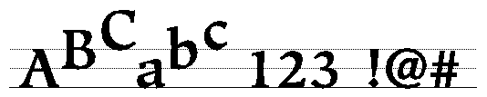
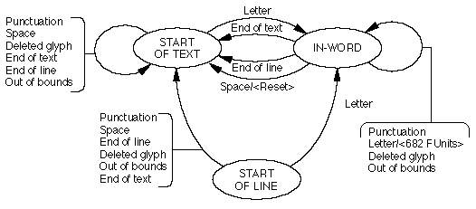
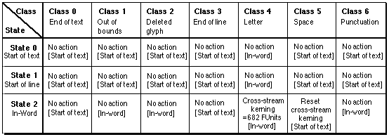

# 'kern' 表

## 一般表信息

'kern' 表包含调整字体中字形字符间距的值。 它可以有多个不同格式的子表，这些子表可以包含垂直或水平文本的信息。 字距调整值用于调整字符间距。

字距调整可以平行于文本流或垂直于文本流，或两者兼而有之。 例如，如果指定了垂直字距调整并且文本通常水平书写，则字距调整将向上或向下。

当前定义了四种字距调整格式，格式 0 到 3。文件格式规范允许定义其他格式以供进一步使用。 格式 4 及以上保留供将来使用。

每个子表可以是下面指定的四种格式之一，并且可以包含垂直或水平文本的信息。 一个字体可以有多个 'kern' 子表，但由于这些表所做的调整是附加的，包含字距调整值的子表的顺序并不重要。

字距调整表有一个标题，其中包含格式编号、存在的子表数量以及子表本身。 表头格式如表 25 所示。

## 重要的提示！

'kern' 表的先前版本将标题中的 version 和 nTables 字段定义为 UInt16 值而不是 UInt32 值。 不鼓励在 OS X 上使用旧格式（尽管 AAT 可以感知旧的字距调整表并仍然正确使用它）。 Microsoft Windows 仍然使用旧格式的 'kern' 表并且不会识别新格式。 仅针对 OS X 的字体应使用新格式； 针对 OS X 和 Windows 的字体应使用旧格式。

**表 25**：'kern' 头部

|类型|名称|描述|
|-|-|-|
|fixed32|version|字距调整表的版本号（当前版本为 0x00010000）。|
|uint32|nTables|字距调整表中包含的子表数。|

字距调整子表还有一个标题，用于标识子表的格式及其包含的信息类型。 子表标题记录在表 26 中。

**表 26**：'kern' 子表标题
|类型|名称|描述|
|-|-|-|
|uint32|length|此子表的长度（以字节为单位），包括此标头。
|uint16|coverage|使用此表的情况。 请参阅下面的说明。
|uint16|tupleIndex|元组索引（用于变体字体）。 此值指定此子表涵盖的元组。

子表覆盖字段分为以下给出的子字段。 大小以位为单位。

**表 27**：coverage
|掩码值|名称|描述|
|-|-|-|
0x8000|kernVertical|设置表是否具有垂直字距调整值
0x4000|kernCrossStream|设置表是否具有跨流(cross-stream)字距调整值
0x2000|kernVariation|设置表是否具有变化字距调整值。
0x1F00|kernUnusedBits|设置为 0。
0x00FF|kernFormatMask|设置此子表的格式（当前定义为 0-3）。

掩码值 0x4000 表示将调用跨流字距调整。 如果文本通常水平书写，则字距调整将是垂直的。 如果字距调整值为正，则文本将被调整。 如果它们是负数，文本将被缩小。 如果文本通常垂直书写，则字距调整将是水平的。 如果字距调整值为正，则文本将向右调整字距。 如果它们是负数，文本将向左调整字距。

## 字距调整子表格式
特定格式的字距调整子表跟在字距调整子表标题之后。 以下部分提供了字距调整表格式 0、1、2 和 3 的详细信息。格式 4 到 255 保留供将来使用。 当前定义了以下字距调整格式：

* 格式 0 是字距对的有序列表
* 格式 1 是用于最多八个字形的上下文字距调整的状态表
* 格式 2 是一个简单的二维字距调整值数组和一个类子表
* 格式 3 是格式 2 的紧凑形式

### 格式 0 字距子表（字距对的有序列表）

格式 0 字距调整子表将字距调整信息存储为字距调整对和值的排序列表。使用存储在字距调整子表标题中的信息，您可以对这些列表执行有效的二进制搜索。

如果搜索范围是 2 的幂，则二进制搜索的编码效率最高，因此可以通过移位而不是除法将搜索范围减少一半。通常，字距调整对的数量 nPairs 不会是 2 的幂。值 searchRange 应该是小于或等于 nPairs 的 2 的最大幂。 searchRange 未涵盖的对数（即 nPairs - searchRange）是值 rangeShift。

在进行二进制搜索循环之前，您需要确定所需的字距调整对是否在列表的 searchRange 部分中。如果是，则二进制搜索从字距调整对列表的开头开始。如果不是，则搜索从列表的开头rangeShift 字节 开始 。这将是一个入口边界。通过字距调整对列表进行的迭代次数由 entrySelector 的值决定，该值计算为小于或等于 nPairs 值的 2 的最大幂的以 2 为底的对数。

尽管这种有序列表格式紧凑且易于生成，但二进制搜索循环需要 entrySelector 迭代才能搜索。

下表给出了格式 0 字距调整子表的格式：

**表 28：**'kern' 格式 0

|类型|名称|描述|
|-|-|-|
|uint16|nPairs|	该款项中的Kerning对数。|
|uint16|searchRange|两个小于或等于Npair的值的最大能量，乘以微妙的条目字节的大小。|
|uint16|entrySelector|这被计算为两个小于或等于npairs值的最大功率的log2。此值表示必须进行搜索循环的迭代数量。例如，在八个项目的列表中，循环会有三个迭代。|
|uint16|rangeShift|Npair的值减去了两个小于或等于NPAIRS的最大能量。这乘以表格中条目的字节大小。|

kerning对和值列表遵循前面表中的最后一个字段。格式0 kerning对和值的格式如下：

**表29：** 'Kern'格式0 Kerning对和值

|类型|名称|描述|
|-|-|-|
|uint16|left|Kerning对中左撇子字形的字形索引。|
|uint16|right|Kerning对中右翼字形的字形索引。|
|sint16|value|左和右对的乐趣中的Kerning价值。如果此值大于零，则字形将分开。如果此值小于零，则将字形移动在一起。|

Kerning对的左侧（高阶单词）和右（低阶单词）的一半是无签名的32位编号，然后用数值来订购Kerning。

该表需要以0xffff的左侧字形的条目，0xffff的右侧字形和0的kerning值为0。

#### 格式1 Kerning款项（用于上下文kerning的状态表）
格式1 kerning表包含一个格式特定的标头和一个状态表，可一次允许多达八个字形。格式1 kerning表的格式特定标头如下：

|类型|名称|描述|
|-|-|-|
|StateHeader|stHeader|上下文字距调整状态表头。|
|uint16|valueTable|从子表开头到字距调整表开头的偏移量（以字节为单位）。|

上下文kerning subtable中的操作包含一个特定表的标志字段。旗帜及其描述如下：

|掩码值|解读|
|-|-|
|0x8000|压入：如果设置，请在kerning堆栈上压入此字形。
|0x4000|如果设置，请不要在进入新状态之前先进入下一个字形。
|0x3fff|值offset：字节偏移从kerning堆栈上字形的字形开始到值表的开始。

如果设置了压入标志，则将当前字形在字形阵列中的位置将其压入最多八个字形的堆栈，称为Thekerning堆栈。如果值offset为非零，则指向值表。值表是有趣的kerning值列表。每个都从Kerning堆栈中弹出一个字形，并将Kerning值应用于它。列表的末尾以奇数值的标记，其确切的解释是由串件标头中的覆盖范围确定的。

由于状态表标头中的符合性offsets（严格来说）是多余的，因此某些“ kern”表使用它来记录不应是startoftext的初始状态。要确定是否完成此操作，请计算应有的索引。如果它与实际的符合性offset不同，请将其用作初始状态。

#### 格式 2 字距调整表（简单的 n x m 字距调整值数组）

格式 2 字距调整子表将字距调整信息存储在字距调整值的二维数组中。 字形映射到类，对左手和右手字形使用不同的映射。 这允许具有相似左手或右手形状的字形一起处理（例如，字母的重音形式）。

数组中的每一行代表一个左侧字形类别，每一列代表一个右侧字形类别，每个单元格都包含一个字距调整值。 第 0 行和第 0 列应指示不紧缩且包含全零的字形。

右侧类值预先乘以单个字距调整值中的字节数（即，2）进行存储。 左侧类值存储时预先乘以一行中的字节数，并按数组距子表开头的偏移量进行偏移。 这样就无需将行值和列值相乘来确定字距调整值的位置。 可以通过完成左侧和右侧类映射、将类值添加到子表的地址并获取新地址指向的字距调整值来对数组进行索引。

格式2简单数组头子表的表头如下：

**表 30：** 简单数组头
|类型|名称|描述|
|-|-|-|
|uint16|rowWidth|子表中行的宽度（以字节为单位）。|
|uint16|leftOffsetTable|从该子表的开头到左侧偏移表的偏移量。|
|uint16|rightOffsetTable|从该子表的开头到右侧偏移表的偏移量。|
|uint16|array|从该子表的开头到字距调整数组的开头的偏移量。|

**表31：** 类表头
|类型|名称|描述|
|-|-|-|
|uint16|firstGlyph|类范围中的第一个字形。|
|uint16|nGlyphs|类范围内的字形数量。|
|UInt16|offsets[nGlyphs]|该范围内所有字形的偏移数组。|

不在左侧偏移表范围内的字形的默认左侧偏移量是距子表头的字距调整数组偏移量。 左侧偏移表中的值不应小于字距调整数组偏移量。 不在右侧偏移表范围内的字形的默认右侧偏移为 0。

要查找字间距调整值，请首先计算左侧字形的偏移量，然后将其添加到右侧字形的偏移量中。 该总和是从字距调整子表的开头到该对的 SInt16 字距调整值的偏移量。

#### 格式 3 字距调整表（简单的 n x m 字距调整索引数组）
格式 3 字距调整子表将字距调整信息的索引存储在二维数组中。 字形映射到类，类似于格式 2，但对左手和右手字形使用不同的映射。

为了找到一对字形的字距调整值，首先通过左手或右手类映射来映射每个字形。 这给出了每个字形的索引值。 然后，通过将左侧类乘以右侧类的数量，然后加上右侧类，这些值被用于索引字距调整索引的二维数组。 数组中该位置的值又是字距调整值列表的索引。

格式3简单数组头子表的表头如下：

|类型|名称|描述|
|-|-|-|
|uint16|glyphCount|该字体中的字形数量。|
|uint8|kernValueCount|字距调整值的数量。|
|uint8|leftClassCount|左手类的数量。|
|uint8|rightClassCount|右手类的数量。|
|uint8|flags|设置为零（保留以供将来使用）。|

紧接着上述标头的是四个可变长度数组，如下表所示：

|类型|名称|描述|
|-|-|-|
|FWord|kernValue[kernValueCount]|字距调整值。|
|uint8|leftClass[glyphCount]|左手类。|
|uint8|rightClass[glyphCount]|右手类|
|uint8|kernIndex[leftClassCount * rightClassCount]|kernValue 数组的索引。|

假设您有两个字形 L 和 R，并且您希望确定字距调整值。 您可以使用以下伪表达式来执行此操作：<code>value = kernValue[kernIndex[leftClass[L] * rightClassCount + rightClass[R]]].</code>

这种格式的计算速度比格式 2 更快，并且可以更小，具体取决于类的数量。 此格式的一个缺点是它最多仅支持 256 个左手类、256 个右手类和 256 个字距调整值。 如果您的字体超过这些值，则应使用格式 2。

## 字距调整表示例
以下是演示跨流字距调整的格式 1 字距调整表的示例。 该字体的规则集如下：

该字体每 em 方块有 2048 个 FUnit。
所有大写和小写字形都应具有垂直跨流字距调整。 跨流增量将为 683 FUnit。 这对应于 683/2048，或每个字形 0.3 em。
标点字形不会进行跨流字距调整，并且保留在前一个字形的水平轴上。
空间字形将跨流垂直间距重置为基线值。
为了创建满足这些要求的字距调整表，您将所有大写和小写字母字形分配给类别 4，将空格字形分配给类别 5，将标点符号字形分配给类别 6。

下图显示了示例字体的跨流文本的文本运行示例：

下图显示了此示例字体的字距调整表有限状态机。 共有三种状态。 它们是“文本开始”、“词内”和“行开始”。 当有限状态机处于“单词内”状态时，标点符号的字形类别、删除的字形和越界不会导致状态变化和无操作，而字母会导致 682 个 FUnit 的跨流字距调整。 请注意，空格字形会导致状态从“词内”更改为“文本开头”，并且会将文本运行“重置”到原始基线。

下图显示了此示例字体的字距调整状态表。 显示了三个状态（行）和七个类别（列）。 数组的每个单元格包含操作（顶部）和下一个状态（底部）。 下一个状态由括号括起来。

请注意，文本开头和行开头状态是相同的，因为该字体的这两种状态之间没有区别。 该表总结了类、类名称、条目号、新状态以及这两种状态的操作。

|类|类名|入口|下一个状态|操作|
|-|-|-|-|-|
|0|End-of-text	2|	Start-of-text	|无操作|
|1|Out-of-bounds	0|	Start-of-text	|无操作|
|2|Deleted-glyph	0|	Start-of-text	|无操作|
|3|End-of-line	2|	Start-of-text	|无操作|
|4|Letter	1|	In-word	|无操作|
|5|Space	0|	Start-of-text	|无操作|
|6|Punctuation	0|	Start-of-text	|无操作|

此表列出了类、类名称、条目号、新状态和“in-word”状态的操作。

|类|类名|入口|下一个状态|操作|
|-|-|-|-|-|
|0|End-of-text|2|Start-of-text|无操作|
|1|Out-of-bounds|3|In-word|无操作|
|2|Deleted-glyph|3|In-word|无操作|
|3|End-of-line|2|Start-of-text|无操作|
|4|Letter|4|In-word|按 682 个 FUnit 进行交叉紧排。|
|5|Space|5|Start-of-text|重置跨流字距调整。|
|6|Punctuation|1|In-word|无操作|

此示例字体的字距调整表如下：

<table border="1" cellspacing="2" cellpadding="0">
		<tbody><tr align="left" valign="middle">
		<th>偏移/ 
		长度</th>
		<th>值</th>
		<th>名称</th>
		<th align="left">注释</th>
		</tr>
		<tr align="left" valign="middle">
		<td>0/4</td>
		<td>0x00010000</td>
		<td>version</td>
		<td class="description">kerning表的版本号，定点格式。</td>
		</tr>
		<tr align="left" valign="middle">
		<td>4/4</td>
		<td>1</td>
		<td>nTables</td>
		<td class="description">此Kerning表中的字样数为1。</td>
		</tr>
		<tr align="left" valign="middle">
		<td>8/4</td>
		<td>288</td>
		<td>length</td>
		<td class="description">该子表的长度为288字节（总表长度减去上述标头）。</td>
		</tr>
		<tr align="left" valign="middle">
		<td>12/2</td>
		<td>0x4001</td>
		<td>coverage</td>
		<td class="description">0x4000 掩码表示字距调整表用于跨数据流。 单位位处的 0x1 表示字距调整表为格式 1。因此，该表将使用状态表来允许 n 路上下文字距调整。</td>
		</tr>
		<tr align="left" valign="middle">
		<td>14/2</td>
		<td>0</td>
		<td>index</td>
		<td class="description">元组索引为 0。此表不包括变体字距调整值。</td>
		</tr>
		<tr align="left" valign="middle">
		<td colspan="4">（格式 1 字距调整状态表头从这里开始）</td>
		</tr>
		<tr align="left" valign="middle">
		<td>16/2</td>
		<td>7</td>
		<td>stateSize</td>
		<td class="description">为此表定义了七个类。</td>
		</tr>
		<tr align="left" valign="middle">
		<td>18/2</td>
		<td>10</td>
		<td>classTable</td>
		<td class="description">从状态表开头的偏移量 16 到类子表开头的偏移量为 16 + 10 = 26 字节。</td>
		</tr>
		<tr align="left" valign="middle">
		<td>20/2</td>
		<td>228</td>
		<td>stateArray</td>
		<td class="description">从状态表开头到状态数组开头的偏移量为 16 + 228 = 260 字节</td>
		</tr>
		<tr align="left" valign="middle">
		<td>22/2</td>
		<td>250</td>
		<td>entryTable</td>
		<td class="description">从状态表开始到条目子表开始的偏移量为16 + 250 = 244字节</td>
		</tr>
		<tr align="left" valign="middle">
		<td>24/2</td>
		<td>274</td>
		<td>valueOffset</td>
		<td class="description">从状态表开头到状态表值开头的偏移量为 16 + 274 = 290 字节。</td>
		</tr>
		<tr align="left" valign="middle">
		<td colspan="4">（接下来是类子表）</td>
		</tr>
		<tr align="left" valign="middle">
		<td>26/2</td>
		<td>3</td>
		<td>firstGlyph</td>
		<td class="description">第一个字形是字形 3。</td>
		</tr>
		<tr align="left" valign="middle">
		<td>28/2</td>
		<td>212</td>
		<td>nGlyphs</td>
		<td class="description">已分配类别的字形数量为 212。范围从字形 3 到 215。</td>
		</tr>
		<tr align="left" valign="middle">
		<td colspan="4">（类数组如下）</td>
		</tr>
		<tr align="left" valign="middle">
		<td>30/1</td>
		<td>5</td>
		<td>classArray[0]</td>
		<td class="description">数组中的第一个字形，该字体中的空格字形具有类别 5。当状态为 word 时，该类别会重置交叉流。</td>
		</tr>
		<tr align="left" valign="middle">
		<td>31/1</td>
		<td>6</td>
		<td>classArray[1]</td>
		<td class="description">这是一个类别为 6 的标点符号字形。当状态处于 word 中时，此类字形不会进行跨流字距调整。</td>
		</tr>
		<tr align="left" valign="middle">
		<td colspan="4">（后面有 14 个标点符号。全部都是第 6 类，此处未显示）</td>
		</tr>
		<tr align="left" valign="middle">
		<td>46/1</td>
		<td>1</td>
		<td>classArray[16]</td>
		<td class="description">这是一个类别为 1 的数字字形。该类别超出范围，并且不会进行跨数据流字距调整。</td>
		</tr>
		<tr align="left" valign="middle">
		<td colspan="4">（类数组中包含的 212 个字形的其余部分遵循各自的类，此处未显示。该数组中未包含的字体中的所有字形都会自动分配给 Class 1，这表示超出范围。） 
		（数组中的最后一个字形如下）</td>
		</tr>
		<tr align="left" valign="middle">
		<td>242/1</td>
		<td>4</td>
		<td>classArray[211]</td>
		<td class="description">这是 212 个字形数组中的最后一个字形。</td>
		</tr>
		<tr align="left" valign="middle">
		<td>243/1</td>
		<td>0x00</td>
		<td>padding</td>
		<td class="description">这是返回长字对齐的填充。</td>
		</tr>
		<tr align="left" valign="middle">
		<td colspan="4">（状态数组从这里开始）</td>
		</tr>
		<tr align="left" valign="middle">
		<td>244/7</td>
		<td>2,0,0,2,1,0,0</td>
		<td>stateArray</td>
		<td class="description">这是初始状态，“文本开始”状态，状态 0。</td>
		</tr>
		<tr align="left" valign="middle">
		<td>251/7</td>
		<td>2,0,0,2,1,0,0</td>
		<td>stateArray</td>
		<td class="description">这是“行首”状态，状态 1。</td>
		</tr>
		<tr align="left" valign="middle">
		<td>258/7</td>
		<td>2,3,3,2,4,5,1</td>
		<td>stateArray</td>
		<td class="description">这是“in word”状态，状态 2。</td>
		</tr>
		<tr align="left" valign="middle">
		<td>265/1</td>
		<td>0</td>
		<td>padding</td>
		<td class="description">这个填充是为了返回长字对齐。</td>
		</tr>
		<tr align="left" valign="middle">
		<td colspan="4">（条目表从这里开始，条目#0）</td>
		</tr>
		<tr align="left" valign="middle">
		<td>266/2</td>
		<td>228</td>
		<td>newState</td>
		<td class="description">从状态表开始到新状态的偏移量为 228 字节。 距该表开头的总偏移量为 16 + 228 = 244 字节，状态 0。</td>
		</tr>
		<tr align="left" valign="middle">
		<td>268/2</td>
		<td>0x8112</td>
		<td>flags</td>
		<td class="description">0x8000 标志指示将此字形推入字距调整堆栈。 从状态表开头到操作的偏移量为 0x112 = 274 字节。 距该表开头的总偏移量为 16 + 274 = 290 字节。</td>
		</tr>
		<tr align="left" valign="middle">
		<td colspan="4">(Entry #1)</td>
		</tr>
		<tr align="left" valign="middle">
		<td>270/2</td>
		<td>242</td>
		<td>newState</td>
		<td class="description">从状态表开始到新状态的偏移量是 242 字节。 距该表开头的总偏移量为 16 + 242 = 258，状态 2。</td>
		</tr>
		<tr align="left" valign="middle">
		<td>272/2</td>
		<td>0x8112</td>
		<td>flags</td>
		<td class="description">0x8000 标志指示将此字形推入字距调整堆栈。 从状态表开头到操作的偏移量为 0x112 = 274 字节。 距该表开头的总偏移量为 16 + 274 = 290 字节。</td>
		</tr>
		<tr align="left" valign="middle">
		<td colspan="4">(Entry #2)</td>
		</tr>
		<tr align="left" valign="middle">
		<td>274/2</td>
		<td>228</td>
		<td>newState</td>
		<td class="description">从状态表开始到新状态的偏移量为 228 字节。 距该表开头的总偏移量为 16 + 228 = 244 字节，状态 0。</td>
		</tr>
		<tr align="left" valign="middle">
		<td>276/2</td>
		<td>0x0000</td>
		<td>flags</td>
		<td class="description">无操作</td>
		</tr>
		<tr align="left" valign="middle">
		<td colspan="4">(Entry #3)</td>
		</tr>
		<tr align="left" valign="middle">
		<td>278/2</td>
		<td>242</td>
		<td>newState</td>
		<td class="description">从状态表开始到新状态的偏移量是 242 字节。 距该表开头的总偏移量为 16 + 242 = 258 字节，状态 2。</td>
		</tr>
		<tr align="left" valign="middle">
		<td>280/2</td>
		<td>0x0000</td>
		<td>flags</td>
		<td class="description">无操作</td>
		</tr>
		<tr align="left" valign="middle">
		<td colspan="4">(Entry #4)</td>
		</tr>
		<tr align="left" valign="middle">
		<td>282/2</td>
		<td>242</td>
		<td>entry</td>
		<td class="description">从状态表开始到新状态的偏移量是 242 字节。 距该表开头的总偏移量为 16 + 242 = 258 字节，状态 2。</td>
		</tr>
		<tr align="left" valign="middle">
		<td>284/2</td>
		<td>0x8114</td>
		<td>action</td>
		<td class="description">0x8000 标志指示将此字形推入字距调整堆栈。 从状态表开头到操作的偏移量为 0x114 = 276 字节。 距该表开头的总偏移量为 16 + 276 = 292 字节。</td>
		</tr>
		<tr align="left" valign="middle">
		<td colspan="4">(Entry #5)</td>
		</tr>
		<tr align="left" valign="middle">
		<td>286/2</td>
		<td>228</td>
		<td>entry</td>
		<td class="description">从状态表开头到新状态的偏移量为 228。从该表开头的总偏移量为 16 + 228 = 244 字节，状态 0。</td>
		</tr>
		<tr align="left" valign="middle">
		<td>288/2</td>
		<td>0x8116</td>
		<td>action</td>
		<td class="description">0x8000 标志指示将此字形压入字距调整堆栈。 从状态表开头到操作的偏移量为 0x116 = 278 字节。 距该表开头的总偏移量为 16 + 278 = 294 字节。</td>
		</tr>
		<tr align="left" valign="middle">
		<td colspan="4">（操作如下）</td>
		</tr>
		<tr align="left" valign="middle">
		<td>290/2</td>
		<td>0x0001</td>
		<td>action</td>
		<td class="description">字距调整值为 0。列表末尾。</td>
		</tr>
		<tr align="left" valign="middle">
		<td>292/2</td>
		<td>683</td>
		<td>action</td>
		<td class="description">类 = 4 的字形的跨数据流字距调整值 = 683 FUnit。列表结束。</td>
		</tr>
		<tr align="left" valign="middle">
		<td>294/2</td>
		<td>0x8001</td>
		<td>action</td>
		<td class="description">0x8000 标志表示重置跨数据流字距调整。 低位是指示“列表结束”的标志。 每个条目都是一个值列表。</td>
		</tr>
	</tbody></table>

## 平台特定信息
以前版本的“kern”表将标头中的 version 和 nTables 字段定义为 UInt16 值而不是 UInt32 值。 不鼓励在 OS X 上使用旧格式（尽管 AAT 可以感知旧的字距调整表并仍然正确使用它）。 Microsoft Windows 仍然使用旧格式的“kern”表，并且无法识别新格式。 仅针对 OS X 的字体应使用新格式； 针对 OS X 和 Windows 的字体应使用旧格式。

## 依赖关系
“kern”表通过字形索引引用字形。 这些值不应超过最大配置文件 ('maxp') 表中包含的字体字形数量。