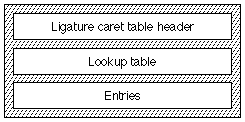
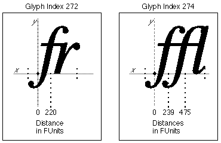
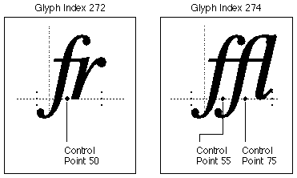

# "lcar" 表

## 介绍

连字插入符表（标签名称：“lcar” ligature caret）允许您设计 AAT 字体，并在部分或全部连字内部包含分割点。 这允许您指定应用程序如何分割连字。 如果没有连字插入符表规范，应用程序可能会使用偶数 n 路分割，从而导致不希望的连字划分。

考虑“wi”连字。 连字的“w”部分较宽，连字的“i”部分相对较窄。 如果应用程序均匀地分割连字，插入符号将太靠近“w”，而不是在字形的两个部分之间适当间隔。 连字插入符表允许您正确指定分割点，以确保线条的外观最佳。

## 连字插入符表格式

连字插入符表的整体结构由连字插入符表头、查找表和实际连字插入符条目组成，如下图所示：



连字插入符表头格式如下：

|类型|名称|描述|
|-|-|-|
|fixed32|	version|连字插入符号表的版本号（初始版本为 0x00010000）。
|uint16|	format|连字插入符号表的格式。 格式0表示距离，格式1表示控制点，如下所述。
|variable|	lookup|将字形与 LigCaretClassEntry 记录相关联的数据查找表。 有关如何解释查找值的详细信息，请参阅下文。

查找表用于查找与特定字形关联的 LigCaretClassEntry 记录。 以下是解释 5 种查找表格式中每种格式的查找值的方法：

|查找格式|解释|
|-|-|
|0|16 位偏移量数组，每个偏移量对应字体中的每个字形。 每个偏移量都是从 Ligature Caret 表的开头到该字形的特定 LigCaretClassEntry 记录。
|2|每个lookupSegment 的值是从Ligature Caret 表的开头到该段中字形的特定LigCaretClassEntry 记录的16 位偏移量。
|4|每个lookupSegment 的值是从Ligature Caret 表的开头到段中每个字形的LigCaretClassEntry 记录的16 位偏移量数组的16 位偏移量。
|6|每个lookupSingle 的值是从Ligature Caret 表的开头到该字形的特定LigCaretClassEntry 记录的16 位偏移量。
|8|valueArray 是一个 16 位偏移量的数组，一个偏移量对应于修剪数组中的每个字形。 每个偏移量都是从 Ligature Caret 表的开头到该字形的特定 LigCaretClassEntry 记录。

查找表中的每个条目都是 LigCaretClassEntry 类型记录的偏移量，并且针对一个特定的连字字形。 该条目包含与字形关联的值的数量，后跟分割点值本身。 请注意，值的数量通常比组成连字的字符数少 1。

LigCaretClassEntry记录的格式如下：

|类型|名称|描述|
|-|-|-|
|uint16|	count|部分数组中的条目数。|
|int16|	partials[count]|单一值。|

格式字段包含当前表的格式类型。 连字插入符表有两种可能的格式：

|格式|描述|
|-|-|
|0|距离。 与特定字形相关联的一个或多个值是 FUnit 值，表示沿着基线的位置，通过该位置与基线正交地进行细分。|
|1|控制点。 与特定字形关联的值（或多个值）是控制点编号，通过控制点编号正交于基线进行细分。|

格式 0 距离指定为沿基线从 x = 0 到连字分割点。 如果要包含多个划分点，则必须相对于 x = 0 指定每个划分点。例如，连字“fr”的划分点距离可以是 x = 221 FUnits，而连字“fr”的划分点距离可以是 x = 221 FUnits。 连字“ffi”对于“ff”可以分别是x = 240 FUnit，对于“fi”可以分别是x = 483 FUnit。

格式 1 分割点由沿基线指定的控制点的编号指定。 如果控制点高于或低于基线，则以控制点到基线的正交投影作为分割点。 然后，它使用与格式 0 距离完全相同的点来指定分割点。 控制点在“glyf”表中指定。

格式 1 控制点格式提供了比格式 0 更高级别的控制。可以提示控制点更改其位置，以改善每面小像素字形的外观。 对于格式 0 距离，无法进行此校正。

## 连字插入符表示例

### 示例：格式 0 连字插入符表

对于此示例，字体包含罗马字体中的“fr”和“ffl”连字。 “fr”连字的字形索引为 272，分割点到字形的距离为 x = 220 FUnits。 “ffl”连字的字形索引为 274。“ff”分割点到字形 274 的距离为 x = 239 FUnits。 “fl”分割点到字形 274 的距离是 x = 475 FUnits。 两个连字的分割点如下图所示：



下表总结了连字插入符数据：

```
Glyph Index	 Division Points	 Ligature	 Distance
	   272				    1			        fr			 220
	   274				    2			        ffl
									                (ff)			 239
									                (fl)			 475

```

下表显示了如何为示例字体构建 Format 0 连字插入符号表：

字形索引的字节，以及从该连字插入符号表开始的偏移量的 2 个字节）。

<table border="1" cellspacing="2" cellpadding="0">
		<tbody><tr align="left" valign="middle">
		<th align="middle">
			<p align="left">Offset/<br>
			length</p>
		</th>
		<th align="middle">
			<p align="left">Value</p>
		</th>
		<th align="middle">
			<p align="left">Name</p>
		</th>
		<th align="left">
			<p align="left">Comment</p>
		</th>
		</tr>
		<tr align="left" valign="middle">
		<td>0/4</td>
		<td>0x00010000</td>
		<td>version</td>
		<td class="description">连字插入符号表的版本号，采用定点格式。</td>
		</tr>
		<tr align="left" valign="middle">
		<td>4/2</td>
		<td>0</td>
		<td>format</td>
		<td class="description">连字插入符号表的格式。 该表将使用格式0，表示划分点是指定的距离。</td>
		</tr>
		<tr align="left" valign="middle">
		<td colspan="4" class="description">(A <a href="##Chap6Tables.html#LookupFormat6">格式6查找表</a> 这里开始)</td>
		</tr>
		<tr align="left" valign="middle">
		<td>6/2</td>
		<td>6</td>
		<td>format</td>
		<td class="description">查找表格式 6（单表格式）。</td>
		</tr>
		<tr align="left" valign="middle">
		<td colspan="4" class="description">（接下来的五个字段是查找表的 <a href="##Chap6Tables.html#BinSrchHeader">BinSrchHeader</a>）</td>
		</tr>
		<tr align="left" valign="middle">
		<td>8/2</td>
		<td>4</td>
		<td>unitSize</td>
		<td class="description">LookupSingle 记录的大小（2 个 16 位字）</td>
		</tr>
		<tr align="left" valign="middle">
		<td>10/2</td>
		<td>2</td>
		<td>nUnits</td>
		<td class="description">要搜索的前一个unitSize的单元数。 表中包含 2 个连字。</td>
		</tr>
		<tr align="left" valign="middle">
		<td>12/2</td>
		<td>8</td>
		<td>searchRange</td>
		<td class="description">unitSize 乘以小于或等于 nUnits 的最大二的幂。</td>
		</tr>
		<tr align="left" valign="middle">
		<td>14/2</td>
		<td>1</td>
		<td>entrySelector</td>
		<td class="description">小于或等于 nUnits 的最大的两个幂的对数以 2 为底。</td>
		</tr>
		<tr align="left" valign="middle">
		<td>16/2</td>
		<td>0</td>
		<td>rangeShift</td>
		<td class="description">unitSize 乘以 nUnits 的差值减去两个小于或等于 nUnits 的最大幂。</td>
		</tr>
		<tr align="left" valign="middle">
		<td colspan="4" class="description">（LookupSingle 记录条目从这里开始）</td>
		</tr>
		<tr align="left" valign="middle">
		<td>18/2</td>
		<td>272</td>
		<td>glyph</td>
		<td class="description">“fr”连字的字形索引。</td>
		</tr>
		<tr align="left" valign="middle">
		<td>20/2</td>
		<td>30</td>
		<td>value</td>
		<td class="description">“fr”连字的 LigCaretClassEntry 记录的偏移量。</td>
		</tr>
		<tr align="left" valign="middle">
		<td>22/2</td>
		<td>274</td>
		<td>glyph</td>
		<td class="description">“ffl”连字的字形索引。</td>
		</tr>
		<tr align="left" valign="middle">
		<td>24/2</td>
		<td>34</td>
		<td>value</td>
		<td class="description">“ffl”连字的 LigCaretClassEntry 记录的偏移量。</td>
		</tr>
		<tr align="left" valign="middle">
		<td>26/2</td>
		<td>0xFFFF</td>
		<td>glyph</td>
		<td class="description">特殊的保护值。</td>
		</tr>
		<tr align="left" valign="middle">
		<td>28/2</td>
		<td>0</td>
		<td>value</td>
		<td class="description">特殊的保护值。</td>
		</tr>
		<tr align="left" valign="middle">
		<td colspan="4" class="description">（<code>LigCaretClassEntry</code> 记录从这里开始）</td>
		</tr>
		<tr align="left" valign="middle">
		<td>30/2</td>
		<td>1</td>
		<td>count</td>
		<td class="description">内部连字的数量。 “fr”连字有 1 个内部连字插入符位置。</td>
		</tr>
		<tr align="left" valign="middle">
		<td>32/2</td>
		<td>220</td>
		<td>partial</td>
		<td class="description">“fr”连字的分割点的 FUnit 距离。</td>
		</tr>
		<tr align="left" valign="middle">
		<td>34/2</td>
		<td>2</td>
		<td>count</td>
		<td class="description">内部连字的数量。 “ffl”连字有 2 个内部连字插入符位置。</td>
		</tr>
		<tr align="left" valign="middle">
		<td>36/2</td>
		<td>239</td>
		<td>partial</td>
		<td class="description">“ffl”连字的“ff”划分的 FUnit 距离。</td>
		</tr>
		<tr align="left" valign="middle">
		<td>38/2</td>
		<td>475</td>
		<td>partial</td>
		<td class="description">“ffl”连字的“fl”划分的 FUnit 距离。</td>
		</tr>
	</tbody></table>

### 示例：格式 1 连字插入符表

对于此格式 1 连字插入符表示例，字体再次包含罗马字体中的“fr”和“ffl”连字。 “fr”连字的字形索引为 272，分割点的控制点为 50。“ffl”连字的字形索引为 274。“ff”分割点的控制点为 55。控制点 'fl' 的分割点是 75。两个连字的插入符号位置如图 5-3 所示。



下表总结了连字插入符数据。

```
Glyph Index	 Division Points	 Ligature	 Control Point
    272				      1			        fr			    50
    274				      2			        ffl
                                  (ff)			  55
                                  (fl)			  75
```

<table border="1" cellspacing="2" cellpadding="0">
		<tbody><tr align="left" valign="middle">
		<th align="middle">
			<p align="left">Offset/<br>
			length</p>
		</th>
		<th align="middle">
			<p align="left">Value</p>
		</th>
		<th align="middle">
			<p align="left">Name</p>
		</th>
		<th align="left">
			<p align="left">Comment</p>
		</th>
		</tr>
		<tr align="left" valign="middle">
		<td>0/4</td>
		<td>0x00010000</td>
		<td>version</td>
		<td class="description">连字插入符号表的版本号，采用定点格式。</td>
		</tr>
		<tr align="left" valign="middle">
		<td>4/2</td>
		<td>1</td>
		<td>format</td>
		<td class="description">连字插入符号表的格式。 该表将使用格式1，表示划分点是控制点。</td>
		</tr>
		<tr align="left" valign="middle">
		<td colspan="4" class="description">（<a href="Chap6Tables.html#LookupFormat6">格式 6 查找表</a>从这里开始）</td>
		</tr>
		<tr align="left" valign="middle">
		<td>6/2</td>
		<td>6</td>
		<td>format</td>
		<td class="description">查找表格式 6（单表格式）。</td>
		</tr>
		<tr align="left" valign="middle">
		<td colspan="4" class="description">（接下来的五个字段是查找表的 <a href="Chap6Tables.html#BinSrchHeader">BinSrchHeader</a>）</td>
		</tr>
		<tr align="left" valign="middle">
		<td>8/2</td>
		<td>4</td>
		<td>unitSize</td>
		<td class="description">LookupSingle 记录的大小（2 个字节用于字形索引，2 个字节用于距此连字插入符号表开头的偏移量）。</td>
		</tr>
		<tr align="left" valign="middle">
		<td>10/2</td>
		<td>2</td>
		<td>nUnits</td>
		<td class="description">要搜索的前一个unitSize的单元数。 表中包含 2 个连字。</td>
		</tr>
		<tr align="left" valign="middle">
		<td>12/2</td>
		<td>8</td>
		<td>searchRange</td>
		<td class="description">unitSize 乘以小于或等于 nUnits 的最大二的幂。</td>
		</tr>
		<tr align="left" valign="middle">
		<td>14/2</td>
		<td>1</td>
		<td>entrySelector</td>
		<td class="description">小于或等于 nUnits 的最大的两个幂的对数以 2 为底。</td>
		</tr>
		<tr align="left" valign="middle">
		<td>16/2</td>
		<td>0</td>
		<td>rangeShift</td>
		<td class="description">unitSize 乘以 nUnits 的差值减去两个小于或等于 nUnits 的最大幂。</td>
		</tr>
		<tr align="left" valign="middle">
		<td colspan="4" class="description">（<code>LookupSingle</code> 记录条目从这里开始）</td>
		</tr>
		<tr align="left" valign="middle">
		<td>18/2</td>
		<td>272</td>
		<td>glyph</td>
		<td class="description">“fr”连字的字形索引。</td>
		</tr>
		<tr align="left" valign="middle">
		<td>20/2</td>
		<td>30</td>
		<td>value</td>
		<td class="description">Offset of LigCaretClassEntry record for the 'fr' ligature.</td>
		</tr>
		<tr align="left" valign="middle">
		<td>22/2</td>
		<td>274</td>
		<td>glyph</td>
		<td class="description">“ffl”连字的字形索引。</td>
		</tr>
		<tr align="left" valign="middle">
		<td>24/2</td>
		<td>34</td>
		<td>value</td>
		<td class="description">“ffl”连字的 LigCaretClassEntry 记录的偏移量。</td>
		</tr>
		<tr align="left" valign="middle">
		<td>26/2</td>
		<td>0xFFFF</td>
		<td>glyph</td>
		<td class="description">特殊的保护值。</td>
		</tr>
		<tr align="left" valign="middle">
		<td>28/2</td>
		<td>0</td>
		<td>value</td>
		<td class="description">特殊的保护值。</td>
		</tr>
		<tr align="left" valign="middle">
		<td colspan="4" class="description">（<code>LigCaretClassEntry</code> 记录从这里开始）</td>
		</tr>
		<tr align="left" valign="middle">
		<td>30/2</td>
		<td>1</td>
		<td>count</td>
		<td class="description">内部连字的数量。 “fr”连字有 1 个内部连字插入符位置。</td>
		</tr>
		<tr align="left" valign="middle">
		<td>32/2</td>
		<td>50</td>
		<td>partial</td>
		<td class="description">“fr”连字的分割点的控制点。</td>
		</tr>
		<tr align="left" valign="middle">
		<td>34/2</td>
		<td>2</td>
		<td>count</td>
		<td class="description">内部连字的数量。 “ffl”连字有 2 个内部连字插入符位置。</td>
		</tr>
		<tr align="left" valign="middle">
		<td>36/2</td>
		<td>55</td>
		<td>partial</td>
		<td class="description">“ffl”连字的“ff”分隔的控制点。</td>
		</tr>
		<tr align="left" valign="middle">
		<td>38/2</td>
		<td>75</td>
		<td>partial</td>
		<td class="description">“ffl”连字的“fl”部分的控制点。</td>
		</tr>
	</tbody></table>