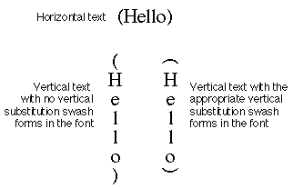

# 'mort' 表

## 警告

'mort' 表已被弃用。 它在 OS X 上受支持，但在 iOS 上不受支持，并且 Apple 字体工具不再生成“mort”。 新的和更新的字体应使用“morx”表。

## 介绍

字形变形表（标签名称：'mort'）允许您指定一组可应用于字体字形的转换。 这些转换称为文本特征，对于阿拉伯语或印地语等需要根据上下文更改字形和单词的书写系统至关重要。 文本功能对于罗马等书写系统也很有用，它可以使用连字和草书连接等效果来增强文本的外观。

Apple 定义了一组标准的文本功能。 您可以包含其中一项或多项或创建您自己的文本功能。 您的字体支持的字体功能必须是 Apple Computer, Inc. 维护的字体功能注册表的一部分。已注册的一些功能类型如下：

* 连字符
* 草书连接
* 字母案例
* 垂直替代
* 语言重排
* 数字间距
* 智能图案
* 音调符号
* 垂直位置
* 分数
* 重叠字符
* 印刷附加功能
* 数学附加内容
* 饰品组合
* 字符替代品
* 设计复杂程度
* 样式选择
* 字形
* 号码情况
* 字母间距

## 字形变形表格式

字形变形表由一个标头和后面的一个或多个变形链组成。 每个变形链包含链头、特征表数组和变形子表。 每个变形子表包含子表头和特定于格式的子表。 一个字形变形表的整体结构如下图所示：

字形变形表头指定当前版本和表中提供的变形链的数量。 字形变形表头的格式为：

|类型|名称|描述|
|-|-|-|
|fixed32|	version|字形变形表的版本号（当前版本为 0x00010000）。
|uint32|	nChains|该表中包含的变态链的数量。

一个或多个字形变形链跟在表头后面。每个变形链都从长字边界开始。链之间必须添加填充，以确保下一条链从可被 4 整除的字节偏移处开始。每个链包含链头、特征表数组和变形子表。变形子表指定一组原子变换。当这些转换以正确的顺序应用于字形数组时，文本将被处理以提供指定的文本特征。

链头的格式为：

|类型|名称|描述|
|-|-|-|
|uint32| defaultFlags| 该链的默认子功能标志。
|uint32| chainLength| 链的长度（以字节为单位），包括此标头。
|uint16| nFeatureEntries| 链的特征子表中的条目数。
|uint16| nSubtables| 链中子表的数量。

单个变形链通常就足够了，除非字体的特征不能用 32 个子特征来指定。链的标头后面是特征表，它是特征条目的数组。特征表中的条目数由链标头中的 nFeatureEntries 字段的值给出。

特性表
功能表用于计算请求的功能和设置列表的子功能标志。

特征表的格式为：单个变形链通常就足够了，除非字体的特征不能用 32 个子特征来指定。链的标头后面是特征表，它是特征条目的数组。特征表中的条目数由链标头中的 nFeatureEntries 字段的值给出。

### 特性表
功能表用于计算请求的功能和设置列表的子功能标志。

特征表的格式为：

|类型|名称|描述|
|-|-|-|
|uint16| featureType| 功能的类型。|
|uint16| featureSetting| 功能的设置。|
|uint32| enableFlags| 此功能和设置启用的设置的标志。|
|uint32| disableFlags| 此功能和设置禁用的设置标志的补充。|

在文本处理过程中，会发生以下顺序。

1. 结果被初始化为链的defaultFlags。
2. 特征表中的条目按顺序处理。如果该设置位于请求的列表中，则结果与条目的disableFlags 进行AND 运算，并与条目的enableFlags 进行OR 运算。如果该设置不在请求的列表中，则结果将是链的defaultFlags。 defaultFlags 指定在没有任何用户指定的情况下将发生的子功能。
3. 当请求完成时，结果包含与请求的功能列表相对应的子功能标志。

所请求的功能列表中的条目顺序是任意的。然而，特征表中条目的顺序很重要。位于特征表中较晚的条目优先于较早的条目。这是必要的，因为只有字体设计者知道功能和子功能之间的关系。

每个功能表必须以“启用字形效果”功能的条目结尾，并设置为“enableEffectOffSelector”。这将关闭链的所有子功能标志。功能表中最后一个条目的启用和禁用标志是：

|启用标志|禁用标志|
|-|-|
|0x00000000|0x00000000 (complement of 0xFFFFFFFF)|

### 变形子表
特征表之后是变形子表。这些链子表描述了构成链子特征的原子转换。这些转换是字形变形表的核心。每个变形链子表由一个子表头和后面的一个或多个变形子表组成。子表类型如下表所示：

|子表类型|描述|
|-|-|
|0| 印度风格的重新排列。
|1| 上下文字形替换。
|2| 连字替换。
|3|（保留）
|4| 非上下文字形替换。
|5| 上下文字形插入

公共子表头后面跟着一个子表头。子表头的格式根据子表类型的不同而不同。

链的子表的长度必须是 4 字节的倍数。如果子表长度不是4字节的倍数，则应在末尾添加填充空格。

尽管每个原子转换都有自己的格式，但每个子表都以一个称为 MorphSubtableHeader 的公共标头开头，其格式如下：

|类型|名称|描述|
|-|-|-|
|uint16|length|子表的长度（以字节为单位），包括此标头。
|uint16|coverage|覆盖标志和原子转换类型。
|uint32|subFeatureFlags|该子表描述的设置的标志。

覆盖字段中的位具有如下表和图所示的解释：

|掩码值|解释|
|-|-|
|0x8000| 如果设置为 1，则该子表应仅应用于垂直文本。如果设置为 0，则该子表应仅应用于水平文本。请注意，0x2000 位可以更改该位的解释方式。
|0x4000| 如果设置为 1，则该子表应按降序处理字形数组。如果设置为 0，则该子表应按升序处理字形数组。
|0x2000| 如果设置为 1，则无论 0x8000 位的状态如何，都应应用该子表。这允许您创建无论文本方向如何都将执行的子表。如果该位为 0，则 0x8000 位将按上述方式解释。从 GX 1.1 开始支持该位；早期版本的软件将忽略它。
|0x1FF8| 这些位是保留的，必须设置为 0。
|0x0007| 这些位指定子表类型（使用上面列出的常量）。

链子表头的 subFeatureFlags 字段为每个子特征设置了一个位，该子特征的转换需要子表指定的原子转换。在用户请求之后，搜索特征子表以确定需要哪些表。然后，将结果与该字段进行比较。如果有任何位是公共的并且非零，则该表被启用。

例如，如果结果为0x00010001，并且该子表的subFeatureFlags字段包含0x00000001，则该表被启用。

印度语重排子表
印度式重排操作指定字形数组中连续范围的字形顺序的重新排列。

印度语重排子表的格式如下图所示。请注意，整个子表只是一个状态表。

|类型|名称|描述|
|-|-|-|
|StateHeader|stHeader|印度语重排状态表标头。|

印度语重排子表中的操作不使用每个字形表。条目子表的标志字段中的表特定标志具有以下格式：

|掩码值|名称|解释|
|0x8000| markFirst| 如果设置，则使当前字形成为要重新排列的第一个字形。|
|0x4000| dontAdvance| 如果设置，则在进入新状态之前不前进到下一个字形。|
|0x2000| markLast| 如果设置，则使当前字形成为要重新排列的最后一个字形。|
|0x1FF0| 保留| 这些位被保留，应设置为 0。|
|0x000F| verb| 指定的重排类型。|

flags二进制字段中各位的位置如下图所示：

下表显示了重新排列动词原子转换。大写字母“A”、“B”、“C”和“D”代表单独的字形，“x”代表任意字形序列。您可以使用 markFirst 和 markLast 标志来记住要重新排列的字形数组。第一个和最后一个字形值是在应用动词字段值指定的重新排列之前设置的。

|动作|结果|
|-|-|
|0|	no change
|1|	Ax => xA
|2|	xD => Dx
|3|	AxD => DxA
|4|	ABx => xAB
|5|	ABx => xBA
|6|	xCD => CDx
|7|	xCD => DCx
|8|	AxCD => CDxA
|9|	AxCD => DCxA
|10|ABxD => DxAB
|11|ABxD => DxBA
|12|ABxCD => CDxAB
|13|ABxCD => CDxBA
|14|ABxCD => DCxAB
|15|ABxCD => DCxBA

### 上下文字形替换子表
上下文字形替换是用其他字形替换字形数组中当前位置的字形和字形数组中较早的字形（称为 themarkedglyph）。替换是使用称为替换表的每个字形表来完成的。如果设置了 setMark 标志，则在进行替换后，当前字形将成为标记字形。

您可以使用上下文字形替换子表来创建简单的连字，例如“fi”和“Æ”，或者用于不寻常的替换，例如：% + 零 = per-mille。如果要从单独的字符创建比两个字符连字更复杂的连字，则应使用连字替换子表。但是，如果字体包含带有字形索引的组件连字，则可以使用上下文字形替换形成更复杂的连字。例如，如果字体中存在“ff”连字，则可以使用上下文替换子表来形成“ffi”连字。

上下文字形替换子表的格式如下。

|类型|名称|描述|
|-|-|-|
|StateHeader| stHeader| 上下文字形替换状态表头
|uint16| replacementTable| 从状态子表的开头到替换表的开头的字节偏移量。

上下文字形替换子表中的操作具有表特定标志和每个字形表的两个偏移量（总共 4 个 16 位字）。这些动作的格式如下：

|类型|名称|描述|
|-|-|-|
|uint16|newState|从状态表开头到新状态的字节偏移量。
|uint16|flags|表特定标志。
|uint16|markOffset|从状态子表的开头到标记字形的替换表的字偏移。
|uint16|currentOffset|从状态子表的开头到当前字形的替换表的字偏移量。

下图显示了上下文字形替换子表的标志二进制字段中的位的位置。

表特定标志字段的格式如下：

|掩码值|名称|解释|
|-|-|-|
|0x8000|setMark|如果设置，则使当前字形成为标记字形。
|0x4000|dontAdvance|如果设置，则在进入新状态之前不前进到下一个字形。
|0x3FFF|保留|这些位已保留，应设置为 0。

### 连字替换子表
连字替换子表指定连字字形对一组组件字形的替换。例如，您可以指定当字形“f”、“f”和“i”彼此相邻放置时，单独的字形将替换为连字字形“ffi”。如果要创建简单的两个字符连字，则应该使用上下文替换子表而不是连字替换表，后者是为更复杂的连字形式而设计的（尽管您当然可以将连字替换子表用于两个字形连字，如果你希望）。

连字替换子表的格式如下：

|类型|名称|描述|
|-|-|-|
|StateHeader|stHeader|连字替换状态表头。
|uint16|ligActionTable|从状态表开头到连字操作列表的字节偏移量。
|uint16|componentTable|从状态表开头到组件偏移表的字节偏移量。
|uint16|ligatureTable|从状态表开头到连字表开头的字节偏移量。

连字替换子表动作的标志字段格式如下图所示。没有每个字形的替换。

连字动作列表指定如何使用组件字形将单词偏移构造到连字字形索引表中。该表按组件排序；也就是说，首先由第一个组件，然后由第二个组件，依此类推。

连字组件堆叠深度为 16。这意味着最多可以使用 16 个组件形成连字线。如果偏移字段的值非零，则它给出 32 位连字操作列表的偏移量。偏移字段是连字动作列表的偏移量，是表特定的标志字段。其格式如下表（以及上图）所示：

|掩码值|名称|解释|
|-|-|-|
|0x8000|setComponent| 如果设置，AAT 应该使当前字形成为连字组件。
|0x4000|dontAdvance| 如果设置，AAT 在进入新状态之前不应前进到下一个字形。
|0x3FFF|offset| 从子表开头到连字操作列表的字节偏移量。该值必须是 4 的倍数。

连字操作列表必须长对齐。该列表中的一项如下图所示：

下表给出了连字动作列表的掩码值：

|掩码值|名称|解释|
|-|-|-|
|0x80000000|最后| 如果设置，这是列表中的最后一个操作，意味着存储。
|0x40000000|store| 如果设置，则用连字替换标记的字形。
|0x3FFFFFFF|offset| 从状态表开头到组件偏移表的字偏移。

通常，一个连字动作列表仅形成一个连字，因此不为任何条目设置存储标志。可以通过在动作列表中的中间条目上设置存储标志来形成多个连字。唯一的限制是组件堆栈只能容纳 16 个组件。

连字表中的偏移量计算为每个组件的偏移量之和。一个偏移量需要包括连字表的偏移量。

连字动作列表中的每个条目都包含每个字形表的偏移量，该表给出了相应组件的偏移量。给定表中从特定组件集开始的第一个连字的偏移量，下一个组件的组件偏移量表将包含到包含特定组件的第一个连字的相对偏移量。

当操作列表中的每个条目被处理时，相应的组件就会从堆栈中弹出。如果条目中的存储和最后标志被清除，则组件字形将被删除的字形索引替换；如果设置了存储或最后标志，则累积的偏移量将用于获取连字的字形索引，该索引将替换组件字形。您可以通过将组件字形替换为连字字形后跟 n-1 个删除的字形来形成 n 组件连字。例如，如果您使用连字替换子表来形成“ffi”连字，则以“f”、“f”和“i”开头，以“ffi”和两个删除的字形结束。

当整个连字动作列表被处理完时，字形数组中每个连字字形的位置被再次压入组件堆栈，以便这些连字可以用作其他连字的组件。例如，“ff”连字可用于“ffi”连字。

例如，下图显示了由“a”、“b”或“c”后跟“d”、“e”或“f”后跟“g”组成的虚构连字集的连字表。 “h”或“i”。请记住，您实际应该在连字表中的各个偏移处存储的是连字的字形索引，而不是连字本身的数据。

连字表中的偏移量计算为每个组件的偏移量之和。连字操作列表中的每个条目都包含每个字形表的偏移量，该表给出了相应组件的字节偏移量。

一旦知道组成特定连字的字形，您就可以构建一个组件偏移表来计算该连字的字形索引的偏移量。使用上图中的连字表，您可以构建各种连字组件的偏移量表。

给定表中从特定组件集开始的第一个连字的偏移量，下一个组件的组件偏移量表将包含到包含特定组件的第一个连字的相对偏移量。连字表中的偏移量计算为每个组件的偏移量之和。连字动作列表中的每个条目都包含每个字形表的偏移量，该表给出了相应组件的偏移量。此示例的字形偏移量如下表所示：

|字形|偏移|
|-|-|
|a|1000|
|b|1018|
|c|1036|
|d|0|
|e|6|
|f|12|
|g|0|
|h|2|
|i|4|

使用此表，您会发现“bfh”的相对偏移量为 1018 + 12 + 2 = 1032，“aei”的相对偏移量为 1000 + 6 + 4 = 1010。该字节偏移量是相对于结扎表。

要生成相对于状态子表开头的偏移量，您需要将连字表的偏移量添加到组件偏移量表之一的值中。

### 非上下文字形替换子表

非上下文字形替换子表是将单个字形索引映射到另一个字形索引的查找表。非上下文字形替换子表的格式如下表所示：

|类型|名称|描述|
|-|-|-|
|LookupTable|表|非上下文字形替换表|

### 字形插入子表

从 GX 1.1 开始，可以使用一种新的变形子表，即实现插入操作的子表。该子表允许将额外的字形（在后备存储中没有相应的字符）插入到布局形状中。有两种可用的插入操作：

类似 Kashida 的插入操作，其中将一个或多个字形附加到特定字形，并使用该字形进行选择。一个例子是 Pig Latin，其中“ay”或“way”插入在相关字母之后。在调整过程中，“基本形式”的宽度将增加所有插入的宽度，并且插入符号分割将包含整个分组。这与 kashidas 目前的工作方式非常相似（因此得名）。

类似分裂元音的插入操作，其中字形附加到给定的字形（如 kashida 类似的情况），但插入的字形不选择该字形，而是选择其他字形。缅甸语分裂元音就是这种插入的一个例子。

单个子表可以根据需要混合和匹配这些类型的操作。

子表仅由状态表组成（类似于印度语重排子表）。操作的长度为 8 个字节，如下所示：

|类型|名称|描述|
|-|-|-|
|uint16|newState| 从状态表开头到新状态的字节偏移量。|
|uint16|flags| 操作标志（定义如下）。|
|uint16|currentInsertList| 从状态表开头到要在当前字形处插入的 16 位字形代码列表的字节偏移量（如果为零，则无）。要插入的字形数量包含在标志的 currentInsertCount 字段中（见下文）。|
|uint16|MarkedInsertList| 从状态表开头到要在标记字形处插入的 16 位字形代码列表的字节偏移量（如果为零，则无）。要插入的字形数量包含在标志的markedInsertCount 字段中（见下文）。|

标志位解释如下：

|掩码值|姓名|解释|
|-|-|-|
|0x8000|setMark|如果设置，则标记当前字形。|
|0x4000|dontAdvance|如果设置，则在进入新状态之前不要前进到下一个字形。|
|0x2000|currentIsKashidaLike|如果设置，并且 currentInsertList 非零，则指定的字形列表将作为类似 kashida 的插入插入到当前字形之前或之后（取决于 currentInsertBefore 标志的状态）。如果清除，并且 currentInsertList 非零，则指定的字形列表将作为类似分割元音的插入插入到当前字形之前或之后（取决于 currentInsertBefore 标志的状态）。|
|0x1000|markedIsKashidaLike|如果设置，并且markedInsertList非零，则指定的字形列表将作为类似kashida的插入插入到标记字形之前或之后（取决于markedInsertBefore标志的状态）。如果清除，并且markedInsertList非零，则指定的字形列表将作为类似分割元音的插入插入到标记字形之前或之后（取决于markedInsertBefore标志的状态）。|
|0x0800|currentInsertBefore|如果设置，则指定要在当前字形的左侧进行插入。如果清晰，它们将位于当前字形的右侧。|
|0x0400|markedInsertBefore|如果设置，则指定要在标记符号的左侧进行插入。如果清晰，它们将位于标记符号的右侧。|
|0x03E0|currentInsertCount|该 5 位字段被视为要在当前位置插入的字形数量的计数。由于零意味着没有插入，因此任何给定当前位置的最大插入数量是 31 个字形。|
|0x001F|markedInsertCount|该 5 位字段被视为要在标记位置插入的字形数量的计数。由于零意味着没有插入，因此任何给定标记位置处的最大插入数量是 31 个字形。|

特殊分裂元音注意事项
分裂元音的两个部分之间的连接是通过当前到标记字形的距离来建立的。例如，假设分裂元音字符出现在辅音之后，并且一旦遇到，分裂元音的第一部分应插入到该辅音之前。在构建插入子表来执行此操作时，您将在每个候选辅音处设置一个标记。然后，如果在辅音之后确实遇到分裂元音，则将关闭markedIsKashidaLike 标志并打开markedInsertBefore 标志。然后，将分割的元音片段插入到辅音之前，AAT 将在两个片段之间建立连接，这样，选择一个片段就会导致两个片段都突出显示（因为它们都与同一个字符相关联） offset，即辅音后面的元音字符的偏移量）。

或者，在此示例中，您可以将子表设置为以相反顺序处理（使用覆盖字段中的适当位），然后元音将是第一个遇到的，因此您的子表将设置为标记元音，然后在移动到辅音之后，在当前字形之前（即辅音之前）进行插入。这些方法中的任何一种都有效；最适合给定字体的选择留给字体设计者。

## 字形变形表示例

### 示例：与上下文无关的字形替换

让我们创建一个适应水平和垂直文本的罗马字体。我们将专门解决垂直使用带有左括号和右括号的水平文本时出现的问题。当文本是水平的时，我们的字体应该使用水平左括号和右括号（分别为字形索引 11 和 12）。当文本为垂直时，我们的字体应使用垂直左括号和右括号（分别为字形索引 135 和 136）。

该图显示了使用此示例字体生成的文本示例。

为了适应这种设计，我们的字体必须包含下表中给出的功能和设置。这将需要一个由三个特征子表和一个变形子表组成的字形变形链。与特定功能类型和选择器相关的常量（例如用于垂直替换的 4）位于当前版本的字体功能注册表中。

|特性|设置|启用标志|禁用标志|
|-|-|-|-|
|垂直替换|开启|0x00000001|0xFFFFFFFF|
|垂直替换|关闭|0x00000000|0xFFFFFFFE|
|字形效果|关闭|0x00000000|0x00000000|

此示例字体的字形变形表如下：

<table border="1" cellspacing="2" cellpadding="0">
		<tbody><tr align="left" valign="middle">
			<th>
				

					偏移/长度
        

			</th>
			<th>
				

					值

			</th>
			<th>
				

					名称

			</th>
			<th align="left">
				

					注释

			</th>
		</tr>
		<tr align="left" valign="middle">
			<td>0/4</td>
			<td>0x00010000</td>
			<td>version</td>
			<td>字形变形表的版本号，采用定点格式。</td>
		</tr>
		<tr align="left" valign="middle">
			<td>4/4</td>
			<td>1</td>
			<td>nChains</td>
			<td>该表中包含的变形链数为1。</td>
		</tr>
		<tr align="left" valign="middle">
			<td colspan="4">（单一变形链如下）</td>
		</tr>
		<tr align="left" valign="middle">
			<td>8/4</td>
			<td>1</td>
			<td>defaultFlags</td>
			<td>该链的默认设置标志为 1。</td>
		</tr>
		<tr align="left" valign="middle">
			<td>12/4</td>
			<td>80</td>
			<td>chainLength</td>
			<td>链长度为 88 - 8 = 80 字节。</td>
		</tr>
		<tr align="left" valign="middle">
			<td>16/2</td>
			<td>3</td>
			<td>nFeatureEntries</td>
			<td>该链的特征子表中的条目数为3。</td>
		</tr>
		<tr align="left" valign="middle">
			<td>18/2</td>
			<td>1</td>
			<td>nSubtables</td>
			<td>该链中特征子表的数量为1。</td>
		</tr>
		<tr align="left" valign="middle">
			<td colspan="4">（特征子表数组中的三个条目中的第一个如下）</td>
		</tr>
		<tr align="left" valign="middle">
			<td>20/2</td>
			<td>4</td>
			<td>featureType</td>
			<td>特征类型为垂直替换。</td>
		</tr>
		<tr align="left" valign="middle">
			<td>22/2</td>
			<td>0</td>
			<td>featureSetting</td>
			<td>功能设置已开启。</td>
		</tr>
		<tr align="left" valign="middle">
			<td>24/4</td>
			<td>0x00000001</td>
			<td>enableFlags</td>
			<td>启用标志。</td>
		</tr>
		<tr align="left" valign="middle">
			<td>28/4</td>
			<td>0xFFFFFFFF</td>
			<td>disableFlags</td>
			<td>禁用标志。</td>
		</tr>
		<tr align="left" valign="middle">
			<td colspan="4">（特征子表数组中的三个条目中的第二个如下）</td>
		</tr>
		<tr align="left" valign="middle">
			<td>32/2</td>
			<td>4</td>
			<td>featureType</td>
			<td>特征类型为垂直替换。</td>
		</tr>
		<tr align="left" valign="middle">
			<td>34/2</td>
			<td>1</td>
			<td>featureSetting</td>
			<td>功能设置已关闭。</td>
		</tr>
		<tr align="left" valign="middle">
			<td>36/4</td>
			<td>0x00000000</td>
			<td>enableFlags</td>
			<td>启用标志。</td>
		</tr>
		<tr align="left" valign="middle">
			<td>40/4</td>
			<td>0xFFFFFFFE</td>
			<td>disableFlags</td>
			<td>禁用标志。</td>
		</tr>
		<tr align="left" valign="middle">
			<td colspan="4">（特征子表数组中的三个条目中的第三个如下）</td>
		</tr>
		<tr align="left" valign="middle">
			<td>44/2</td>
			<td>0</td>
			<td>featureType</td>
			<td>特征类型是字形效果。</td>
		</tr>
		<tr align="left" valign="middle">
			<td>46/2</td>
			<td>1</td>
			<td>featureSetting</td>
			<td>功能设置已关闭。</td>
		</tr>
		<tr align="left" valign="middle">
			<td>48/4</td>
			<td>0x00000000</td>
			<td>enableFlags</td>
			<td>功能子表的最后一个enableFlags字段必须包含0x00000000。</td>
		</tr>
		<tr align="left" valign="middle">
			<td>52/4</td>
			<td>0x00000000</td>
			<td>disableFlags</td>
			<td>功能子表的最后一个disableFlags字段必须包含0x00000000。</td>
		</tr>
		<tr align="left" valign="middle">
			<td colspan="4">（链 子表如下）</td>
		</tr>
		<tr align="left" valign="middle">
			<td>56/2</td>
			<td>32</td>
			<td>length</td>
			<td>链 子表的长度为88 -56 = 32 字节。</td>
		</tr>
		<tr align="left" valign="middle">
			<td>58/2</td>
			<td>0x8004</td>
			<td>coverage</td>
			<td>0x8000 值表示该子表应仅应用于水平文本。 0x0004 值表示链子表类型用于非上下文字形替换。</td>
		</tr>
		<tr align="left" valign="middle">
			<td>60/4</td>
			<td>0x00000001</td>
			<td>subFeatureFlags</td>
			<td>子特征类型是上下文字形替换。</td>
		</tr>
		<tr align="left" valign="middle">
			<td colspan="4">（非上下文字形替换<a href="Chap6Tables.html#LookupTables">查找表</a>如下）</td>
		</tr>
		<tr align="left" valign="middle">
			<td>64/2</td>
			<td>6</td>
			<td>format</td>
			<td>查找表格式6（单 表格式）。</td>
		</tr>
		<tr align="left" valign="middle">
			<td>66/2</td>
			<td>4</td>
			<td>unitSize</td>
			<td>LookupSingle 记录的大小（2 个字节用于字形索引，2 个字节用于距此连字插入符号表开头的偏移量）。</td>
		</tr>
		<tr align="left" valign="middle">
			<td>68/2</td>
			<td>2</td>
			<td>nUnits</td>
			<td>要搜索的前一个unitSize的单元数。表中包含两个字形。</td>
		</tr>
		<tr align="left" valign="middle">
			<td>70/2</td>
			<td>8</td>
			<td>searchRange</td>
			<td>unitSize 乘以小于或等于 nUnits 的最大二的幂。</td>
		</tr>
		<tr align="left" valign="middle">
			<td>72/2</td>
			<td>1</td>
			<td>entrySelector</td>
			<td>小于或等于 nUnits 的最大的两个幂的对数以 2 为底。</td>
		</tr>
		<tr align="left" valign="middle">
			<td>74/2</td>
			<td>0</td>
			<td>rangeShift</td>
			<td>unitSize 乘以 nUnits 的差值减去两个小于或等于 nUnits 的最大幂。</td>
		</tr>
		<tr align="left" valign="middle">
			<td colspan="4">（<a href="Chap6Tables.html#LookupSingle">LookupSingle</a> 记录条目从此处开始）</td>
		</tr>
		<tr align="left" valign="middle">
			<td>76/2</td>
			<td>11</td>
			<td>glyphIndex</td>
			<td>左水平括号“(”的字形索引为 11。</td>
		</tr>
		<tr align="left" valign="middle">
			<td>78/2</td>
			<td>135</td>
			<td>glyphIndex</td>
			<td>左竖括号的字形索引为 135。</td>
		</tr>
		<tr align="left" valign="middle">
			<td>80/2</td>
			<td>12</td>
			<td>glyphIndex</td>
			<td>右水平括号 ')' 的字形索引为 12。</td>
		</tr>
		<tr align="left" valign="middle">
			<td>82/2</td>
			<td>136</td>
			<td>glyphIndex</td>
			<td>右竖括号的字形索引为 136。</td>
		</tr>
		<tr align="left" valign="middle">
			<td colspan="4">（这是特别守卫LookupSingle记录）</td>
		</tr>
		<tr align="left" valign="middle">
			<td>84/2</td>
			<td>0xFFFF</td>
			<td>glyph</td>
			<td>守卫值</td>
		</tr>
		<tr align="left" valign="middle">
			<td>86/2</td>
			<td>0</td>
			<td>value</td>
			<td>守卫值</td>
		</tr>
	</tbody></table>

### 示例：分层连字表
假设您要设置一种具有连字形成文本功能的所有四种设置的字体：强制、正常、可选和抑制。由于该文本特征共享子特征，因此您可以在同一条链上描述这些子特征。

当启用子表时，它会激活层次结构中位于其下方的子表。因此，您可以让每个子表描述一组不同的连字。例如，在此字体中，强制子表描述“fi”和“fl”连字，普通子表描述“æ”和“œ”连字，可选子表描述“Æ”和“Œ”连字。每当用户选择该字体的普通连字时，强制子表和普通子表的连字都可用。当用户选择可选连字时，强制、正常和可选子表的连字可用。抑制子表取消所有连字的使用。

该表描述了这些子表的功能子表条目：

|设置|启用标志|禁用标志|
|-|-|-|
|强制|0x00000001|0xFFFFFFF9（0x00000006 的补码|
|正常|0x00000003|0xFFFFFFFB（0x00000004 的补码|
|可选|0x00000007|0xFFFFFFFF（0x00000000 的补码|
|抑制|0x00000000|0xFFFFFFF8（0x00000007 的补码|

强制设置的启用标志仅适用于该子表，其禁用标志停用普通表和可选表。正常设置的启用标志激活正常表和强制表，其禁用标志仅禁用可选表。可选表的启用标志激活所有表，其禁用标志不禁用任何表。抑制表的启用标志不启用任何表，而其禁用标志则停用所有表。

例如，如果使用上表中的要素表，则存在三个子表：一个子表的 subFeatureFlags 设置为 0x00000001，表示强制连字；一个子表的 subFeatureFlags 设置为 0x00000002，表示非强制的普通连字；一个子表的 subFeatureFlags 设置为 0x00000002，表示非强制的正常连字。对于既不是强制也不是正常的可选连字，设置为 0x00000004。因此，如果连字形成设置是强制的、正常的或可选的，则应用强制子表；如果连字形成设置为正常或可选，则应用正常子表；如果连字形成设置为可选，则应用可选子表。

### 示例：独立连字表

在前面的示例中，连字形成文本功能的每个设置都建立在前一个连字子表的内容之上。对可选连字的请求意味着应用三个子表。

但是，如果您使每个连字子表独立于其他子表，则当用户请求特定类型的连字时，仅应用一个子表。尽管您必须复制连字信息（例如，将用于创建“fi”连字的字形代码放入每个表中），但表访问速度更快，因为仅使用一个表。您可以设置特征子表，以便对一个连字形成子表的请求会禁用所有其他连字子表，如下表所示：

|设置|启用标志|禁用标志|
|-|-|-|
|强制|0x00000001|0xFFFFFFF9（0x00000006 的补码|
|正常|0x00000002|0xFFFFFFFA（0x00000005 的补码|
|可选|0x00000004|0xFFFFFFFC（0x00000003 的补码|
|抑制|0x00000000|0xFFFFFFF8（0x00000007 的补码|

任何连字形成请求都会导致为具有最高优先级的请求设置设置单个子功能标志。

同样，存在三个子表：一个子表头的 subFeatureFlags 字段设置为 0x00000001 以用于强制连字；另一个子表的子表头的 subFeatureFlags 字段设置为 0x00000001，用于强制连字；一个将 subFeatureFlags 设置为 0x00000002 的强制连字和正常连字；一种将 subFeatureFlags 设置为 0x00000004，用于强制、正常和可选连字。

普通子表和可选子表比较复杂（因为普通子表复制强制子表中的连字，可选子表复制普通子表中的连字），但最多将一个子表应用于字形数组，这比应用三个子表。

您还可以将此功能表与示例中的子表一起使用，方法是将其 subFeatureFlags 分别更改为 0x00000007、0x00000006 和 0x00000004。

## 平台特定信息
任何版本的 iOS 都不支持“mort”表。所有版本的 OS X 都支持它，但强烈建议不要使用它。如果字体同时具有“mort”表和“morx”（扩展变形）表，则“mort”表将被忽略。

## 工具
“mort”表由 ftxdumperfuser 转储（但未融合）。支持转储到 MIF 和 ATIF。 ftxenhancer 不会生成“mort”表。