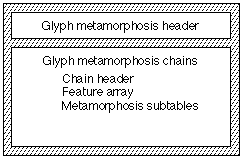
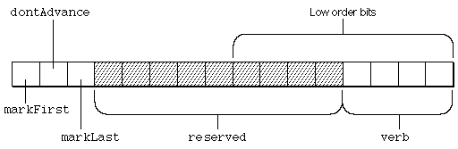
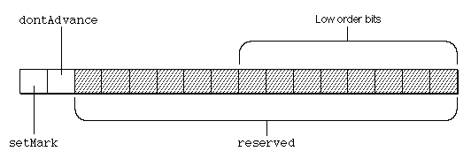

# morx 表

## 介绍

扩展字形变形表（标签名称：“morx”）允许您指定一组可应用于字体字形的转换。这些转换称为文本特征，对于阿拉伯语或印地语等需要根据上下文更改字形和单词的书写系统至关重要。文本功能对于罗马等书写系统也很有用，它可以使用连字和草书连接等效果来增强文本的外观。

Apple 定义了一组标准的文本功能。您可以包含其中一项或多项或创建您自己的文本功能。您的字体支持的字体功能必须是 Apple Inc. 维护的字体功能注册表的一部分。已注册的一些功能类型如下：

* 连字
* 草书连接
* 信箱
* 垂直替代
* 语言重排
* 数字间距
* 智能图案
* 变音符号
* 垂直位置
* 分数
* 重叠字符
* 印刷附加功能
* 数学附加内容
* 饰品套装
* 字符替代品
* 设计复杂性
* 款式选择
* 字形号码情况
* 字母间距
* 表格格式

## 表格格式

扩展字形变形表由一个标头和后跟的一个或多个变形链组成。每个变形链包含链头、特征表数组和变形子表。每个变形子表包含子表头和特定于格式的子表。扩展字形变形表的整体结构如下所示：

扩展字形变形表头指定当前版本和表中提供的变形链的数量。扩展字形变形表头的格式为：

### 表头：

|类型|名称|描述|
|-|-|-|
|uint16|version| 扩展字形变形表的版本号（2 或 3）|
|uint16|未使用| 设置为 0|
|uint32|nChains| 该表中包含的变形链的数量。|

该标头后面是链。每个链都以链头开始：

|类型|名称|描述|
|-|-|-|
|uint32|defaultFlags|子表的默认规范。|
|uint32|chainLength|总字节数，包括此标头；必须是4的倍数。|
|uint32|nFeatureEntries|功能子表条目数。|
|uint32|nSubtables|链中子表的数量。|

如果“morx”表版本为 3 或更高，则链中的最后一个子表后面跟着一个 subtableGlyphCoverageArray，如下所述。

### 特性表

功能表用于计算请求的功能和设置列表的子功能标志。

特征表的格式为：

|类型|名称|描述|
|-|-|-|
|uint16|featureType|功能的类型。|
|uint16|featureSetting|功能的设置（也称为选择器）|
|uint32|enableFlags|此功能和设置启用的设置的标志。|
|uint32|disableFlags|此功能和设置禁用的设置标志的补充。|

在文本处理过程中，会发生以下顺序。

1. 结果被初始化为链的defaultFlags。
2. 特征表中的条目按顺序处理。如果该设置位于请求的列表中，则结果与条目的disableFlags 进行AND 运算，并与条目的enableFlags 进行OR 运算。如果该设置不在请求的列表中，则结果将是链的defaultFlags。 defaultFlags 指定在没有任何用户指定的情况下将发生的子功能。
3. 当请求完成时，结果包含与请求的功能列表相对应的子功能标志。
所请求的功能列表中的条目顺序是任意的。然而，特征表中条目的顺序很重要。位于特征表中较晚的条目优先于较早的条目。这是必要的，因为只有字体设计者知道功能和子功能之间的关系。

每个功能表必须以“启用字形效果”功能的条目结尾，并设置为“enableEffectOffSelector”。这将关闭链的所有子功能标志。功能表中最后一个条目的启用和禁用标志是：

|启用标志|禁用标志|
|-|-|
|0x00000000|0x00000000 (complement of 0xFFFFFFFF)|

### 功能和语言代码

特征类型 39 与“ltag”表结合使用以提供特定于语言的字形。它必须始终被标记为专有功能。

对于功能类型 39，选择器值 0 表示与其他地方一样“无变化”，并且通常用于与语言无关的字形（例如通用西里尔字母）。其他选择器值比“ltag”表中的索引多一个，可用于指示切换到一组特定于语言的字形（例如塞尔维亚语）。有关详细信息，请参阅“ltag”表的文档。

请注意，由字体设计者决定哪些字形与语言无关，哪些字形特定于语言。

### 子表字形覆盖表

子表字形覆盖表用于确定字体中的特定字形是否与给定子表相关。其格式如下：

|类型|名称|描述|
|-|-|-|
|uint32|subtableOffsets[]|从子表字形覆盖表开头到给定子表的字形覆盖位字段的偏移数组；链中的每个子表都有一个偏移量|
|uint8|coverageBitfields[]|各个覆盖位域|

每个覆盖位字段的大小为 (numGlyphs + CHAR_BIT - 1) / CHAR_BIT 字节，填充到四字节边界。

要确定特定字形是否被子表覆盖，请计算coverageBitfield[glyph/CHAR_BIT] & (1 << (glyph & (CHAR_BIT-1)))。如果该值非零，则该字形被覆盖。

subtableOffsets 数组中的偏移量为 0 表示特定子表没有覆盖位字段。

实际上，对于给定的文本运行，会为该运行中的字形生成覆盖位字段。然后将该位字段与每个子表的覆盖位字段进行“与”运算。如果结果为零，则子表不会使用运行中的任何字形，并且可以跳过子表。

一般来说，覆盖位域包含尽可能少的字形是最好的，以便最大化 CoreText 跳过子表的概率。例如，在形成“ff”、“fi”和“fl”连字的连字子表中，子表的覆盖位字段仅包括“f”字形就足够了。这样，在布局文本“指示区域设置”时，CoreText 将能够跳过子表，尽管同时存在“i”和“l”。

### 变形子表

特征子表之后是实际的子表，总共 n 个子表。每一个都以以下格式的子表头开始：

|类型|名称|描述|
|-|-|-|
|uint32|length|总子表长度，包括此标头。|
|uint32|覆盖率|覆盖率标志和子表类型。|
|uint32|subFeatureFlags|标识这是哪个子表的 32 位掩码（如果该值与处理后的 defaultFlags 的 AND 为非零，则执行该子表）|

链子表头的 subFeatureFlags 字段为每个子特征设置了一个位，该子特征的转换需要子表指定的原子转换。在用户请求之后，搜索特征子表以确定需要哪些表。然后，将结果与该字段进行比较。如果有任何位是公共的并且非零，则该表被启用。

例如，如果结果为0x00010001，并且该子表的subFeatureFlags字段包含0x00000001，则该表被启用。

覆盖率值的解释方式如下：

|掩码值|解释|
|-|-|
|0x80000000|如果设置，该子表将仅应用于垂直文本。如果清除，该子表将仅应用于水平文本。
|0x40000000|如果设置，该子表将按降序处理字形。如果清除，它将按升序处理字形。
|0x20000000|如果设置，该子表将应用于水平和垂直文本（即位 0x80000000 的状态被忽略）。
|0x10000000|如果设置，该子表将按逻辑顺序（或反向逻辑顺序，取决于位 0x80000000 的值）处理字形。
|0x0FFFFF00|保留，设置为零。
|0x000000FF|子表类型；见下表。

通常，当处理“morx”表时，Unicode bidi 算法已经运行，并且字形流处于布局顺序 - 字形渲染的顺序，始终是从左到右或从上到下-底部。这与逻辑顺序相反，逻辑顺序是文本中原始字符的顺序。对于从左到右的文本，例如英语，逻辑和布局顺序是相同的。对于从右到左的文本，例如阿拉伯语，它们是相反的。

覆盖字段的位 28 和 30 控制布局引擎运行子表时处理字形的顺序。位28用于指示字形处理方向是否与逻辑顺序或布局顺序相同。位 30 用于指示字形是按照该顺序向前还是向后处理。

|位 30|位 28|横排文字的解释|
|-|-|-|
|0|0|子表按布局顺序处理（与字形的顺序相同，始终从左到右）。|
|1|0|子表按相反的布局顺序处理（与字形的顺序相反，始终从右到左）。|
|0|1|子表按逻辑顺序处理（与字符顺序相同，可以是从左到右，也可以是从右到左）。|
|1|1|子表按逆逻辑顺序（与字符顺序相反，可以是从右到左，也可以是从左到右）处理。|

子表类型定义如下：
|子表类型|描述|
|-|-|
|0| 重新排列子表。
|1| 上下文子表。
|2| 连字子表。
|3|（保留）
|4| 非上下文（“swash”）子表。
|5| 插入子表

本节的其余部分讨论对每种特定子表类型的更改。提醒一下，条目表中的条目不是通过字节偏移而是通过从零开始的 16 位索引来引用新状态。受当前 16 位字形索引限制，这甚至可以完全覆盖我们可能想象的最大状态数组。

**印度语重排子表**
印度式重排操作指定字形数组中连续范围的字形顺序的重新排列。

印度语重排子表的格式如下图所示。请注意，整个子表只是一个状态表。

|类型|名称|描述|
|-|-|-|
|STXHeader|stxHeader|印度语重排状态表头。|

印度语重排子表中的操作不使用每个字形表。条目子表的标志字段中的表特定标志具有以下格式：

|掩码值|姓名|解释|
|-|-|-|
|0x8000|markFirst|如果设置，则使当前字形成为要重新排列的第一个字形。|
|0x4000|dontAdvance|如果设置，则在进入新状态之前不前进到下一个字形。这意味着字形索引不会更改，即使该索引处的字形已更改。|
|0x2000|markLast|如果设置，则使当前字形成为要重新排列的最后一个字形。|
|0x1FF0|保留|这些位被保留，应设置为 0。|
|0x000F|verb|指定的重排类型。|

flags二进制字段中各位的位置如下图所示：

下表显示了重新排列动词原子转换。大写字母“A”、“B”、“C”和“D”代表单独的字形，“x”代表任意字形序列。您可以使用 markFirst 和 markLast 标志来记住要重新排列的字形数组。第一个和最后一个字形值是在应用动词字段值指定的重新排列之前设置的。

|动作|结果|
|-|-|
|0|无变化|
|1|Ax => xA|
|2|xD => Dx|
|3|AxD => DxA|
|4|ABx => xAB|
|5|ABx => xBA|
|6|xCD => CDx|
|7|xCD => DCx|
|8|AxCD => CDxA|
|9|AxCD => DCxA|
|10|ABxD => DxAB|
|11|ABxD => DxBA|
|12|ABxCD => CDxAB|
|13|ABxCD => CDxBA|
|14|ABxCD => DCxAB|
|15|ABxCD => DCxBA|

**上下文字形替换子表**

上下文字形替换是用其他字形替换字形数组中当前位置的字形和字形数组中较早的字形（称为标记字形）。替换是使用称为替换表的每个字形表来完成的。如果设置了 setMark 标志，则在进行替换后，当前字形将成为标记字形。

上下文字形替换在中东和南亚文字中大量使用。欧洲文字很少需要它们，但仍然可以使用它们，例如，用于在单词中间用长写 s 替换小写 s 的古老替换，例如 metamorphoſis。

上下文字形替换子表的格式如下。

|类型|名称|描述|
|-|-|-|
|STXHeader|stxHeader|上下文字形替换状态表头|
|uint32|replacementTable|从状态子表的开头到替换表的开头的字节偏移量。|

上下文字形替换子表中的操作具有表特定标志和每个字形表的两个偏移量（总共 4 个 16 位字）。这些动作的格式如下：

|类型|名称|描述|
|-|-|-|
|uint16|newState|新状态的从零开始的索引
|uint16|flags|表特定标志。
|uint16|markIndex|标记字形的替换表的索引（使用 0xFFFF 表示无）
|uint16|currentIndex|当前字形的替换表的索引（使用 0xFFFF 表示无）

下图显示了上下文字形替换子表的标志二进制字段中的位的位置。

表特定标志字段的格式如下：

|掩码值|姓名|解释|
|-|-|-|
|0x8000|setMark|如果设置，则使当前字形成为标记字形。|
|0x4000|dontAdvance|如果设置，则在进入新状态之前不前进到下一个字形。|
|0x3FFF|保留|这些位已保留，应设置为 0。|

字形替换表是一组 LookupTables。其操作指示应发生替换的字形将指定这些查找表之一的索引。该字形代码将通过指定的查找表来确定新的字形代码。

为了加速定位正在索引的 LookupTable 的过程，每个字形查找表的最开始是一个从每个字形查找表空间开始处开始的 UInt32 偏移量数组（其偏移量本身就是EntryTableOffset，如上所述）。因此，markIndex 或 currentIndex 用于首先查找该表中的偏移量，然后该偏移量允许立即访问 LookupTable，然后使用 LookupTable 来查找字形代码。

请注意，没有任何地方指定 LookupTable 的数量。由于该数字是字体制作过程的产物，并且运行时变形软件不需要，因此无需显式包含它。

“morx”上下文替换表的示例包含在本文档后面的示例部分中。

连字子表
连字子表用于形成连字，例如 fi 和 fl。它们还可用于将后跟多个非空格字形的基本字形转换为预组合的重音形式，例如将 e + 锐角转换为 é。

在标准子表头之后，连字子表以扩展状态表头开始：

|类型|名称|描述|
|-|-|-|
|STXHeader|stateHeader|扩展状态表头，如上所述。|
|UInt32|ligActionOffset|从 stateHeader 到连字操作表开头的字节偏移量。|
|UInt32|componentOffset|从 stateHeader 到组件表开头的字节偏移量。|
|UInt32|ligatureOffset|从 stateHeader 到实际连字列表开头的字节偏移量。|

状态标头后面跟着 7 个状态表片段中的每一个，由它们的偏移量指定。它们可以是任何顺序；为了在这里和示例部分中进行讨论，我们假设这些片段的顺序与其在状态表头中的偏移字段的顺序相同。
如上所述，类表只是一个 LookupTable。

状态数组是条目表中 UInt16 索引的二维数组。状态数组的行对应于状态，列对应于类（四个固定类加上特定于此表的类，总共 nClass）。

连字子表的条目表每个条目有 3 个 UInt16：

|类型|名称|描述|
|-|-|-|
|UInt16|nextStateIndex|状态数组中下一个字形将使用的状态的行索引。
|UInt16|EntryFlags|标志。
|UInt16|ligActionIndex|用于处理该组的第一个 ligActionTable 条目的索引（如果由标志指示）。

这些标志使用以下位：

|掩码值|姓名|解释|
|-|-|-|
|0x8000|setComponent|将此字形推送到组件堆栈上以进行最终处理。|
|0x4000|dontAdvance|将字形指针保留在此字形处以进行下一次迭代。|
|0x2000|PerformAction|使用 ligActionIndex 来处理连字组。|
|0x3FFF|N/A|保留；设置为零。|

接下来是连子动作表。如上所述，表中起始位置的选择是通过索引而不是偏移量来进行的。由条目表标志压入堆栈的字形以相反的顺序弹出，并按照连字操作值指示进行操作。连字操作的格式是 UInt32，分解如下：

|掩码值|名称|解释|
|-|-|-|
|0x80000000|last| 这是列表中的最后一个操作。这也意味着存储。
|0x40000000|store| 将连字存储在连字表中当前累积索引处，以代替标记的（即当前弹出的）字形。
|0x3FFFFFFF|offset| 30 位值，经过符号扩展为 32 位并添加到字形 ID，从而生成组件表的索引。

如果这看起来令人困惑，请参阅示例部分以了解这一切是如何工作的。

组件表是一个由 UInt16 值组成的数组，一旦按照上述方式查找，这些值就会被加在一起以获得最后一块（实际连字列表）的索引（不是偏移量！）。

连字列表本身是输出 UInt16 连字的数组。

**非上下文字形替换子表**

非上下文字形替换子表是将单个字形索引映射到另一个字形索引的查找表。非上下文字形替换子表的格式如下表所示：

|类型|名称|描述|
|-|-|-|
|LookupTable|table|非上下文字形替换表

**字形插入子表**

该子表允许将额外的字形（在后备存储中没有相应的字符）插入到布局形状中。有两种可用的插入操作：

类似 Kashida 的插入操作，其中将一个或多个字形附加到特定字形，并使用该字形进行选择。一个例子是 Pig Latin，其中“ay”或“way”插入在相关字母之后。在调整过程中，“基本形式”的宽度将增加所有插入的宽度，并且插入符号分割将包含整个分组。这与 kashidas 目前的工作方式非常相似（因此得名）。

类似分裂元音的插入操作，其中字形附加到给定的字形（如 kashida 类似的情况），但插入的字形不选择该字形，而是选择其他字形。缅甸语分裂元音就是这种插入的一个例子。

单个子表可以根据需要混合和匹配这些类型的操作。

子表由扩展状态表和后面的插入操作数组组成。

|类型|名称|描述|
|-|-|-|
|STXHeader|stateHeader|扩展状态表头
|UInt32|insertActionOffset|从 stateHeader 到插入字形表开头的字节偏移量。

操作的长度为 8 个字节，如下所示：

|类型|名称|描述|
|-|-|-|
|uint16|newState|新状态的从零开始的索引。
|uint16|flags|操作标志（定义如下）。
|uint16|currentInsertIndex|插入字形表中从零开始的索引。要插入的字形数量包含在标志的 currentInsertCount 字段中（见下文）。值 0xFFFF 表示不进行插入。
|uint16|MarkedInsertIndex|插入字形表中从零开始的索引。要插入的字形数量包含在标志的markedInsertCount 字段中（见下文）。值 0xFFFF 表示不进行插入。

标志位解释如下：

|掩码值|名称|解释|
|-|-|-|
|0x8000|setMark|如果设置，则标记当前字形。|
|0x4000|dontAdvance|如果设置，则在进入新状态之前不要更新字形索引。这并不意味着指向的字形与之前的字形相同。如果您在当前字形的下游立即插入，则处理的下一个字形实际上是第一个插入的字形。|
|0x2000|currentIsKashidaLike|如果设置，并且 currentInsertList 非零，则指定的字形列表将作为 kashida 类插入插入，在当前字形之前或之后（取决于 currentInsertBefore 标志的状态）。如果清除，并且 currentInsertList 非零，则指定的字形列表将作为分裂元音类插入插入，在当前字形之前或之后（取决于 currentInsertBefore 标志的状态）。|
|0x1000|markedIsKashidaLike|如果已设置，并且 markedInsertList 非零，则指定的字形列表将作为 kashida 式插入插入，在标记字形之前或之后（取决于 markedInsertBefore 标志的状态）。如果已清除，并且 markedInsertList 非零，则指定的字形列表将作为拆分元音式插入插入，在标记字形之前或之后（取决于 markedInsertBefore 标志的状态）。|
|0x0800|currentInsertBefore|如果已设置，则指定要在当前字形的左侧进行插入。如果已清除，则插入位于当前字形的右侧。|
|0x0400|markedInsertBefore|如果已设置，则指定要在标记字形的左侧进行插入。如果已清除，则插入位于标记字形的右侧。|
|0x03E0|currentInsertCount|此 5 位字段被视为在当前位置插入的字形数量的计数。由于零表示无插入，因此在任何给定的当前位置插入的最大字形数量为 31 个。|
|0x001F|markedInsertCount|此 5 位字段被视为在标记位置插入的字形数量的计数。由于零表示无插入，因此在任何给定的标记位置插入的最大字形数量为 31 个。|

特殊分裂元音注意事项
分裂元音的两个部分之间的连接是通过从当前字形到标记字形的距离建立的。例如，假设分裂元音字符出现在辅音之后，一旦遇到，分裂元音的第一部分应该插入到该辅音之前。在构建插入子表以执行此操作时，您将在每个候选辅音处设置一个标记。然后，如果确实在辅音后遇到了分裂元音，则将关闭 markedIsKashidaLike 标志并打开 markedInsertBefore 标志。然后，分裂元音部分将插入到辅音之前，ATSUI 将建立两个部分之间的连接，这样，选择一个部分将导致两个部分都被突出显示（因为它们都与相同的字符偏移量相关联，即辅音之后的元音字符的偏移量）。

或者，在此示例中，您可以将子表设置为按相反顺序处理（使用覆盖字段中的相应位），然后元音将是第一个遇到的，因此您的子表将被设置为标记元音，然后在移动到辅音之后，在当前字形之前（即辅音之前）进行插入。这两种方法都可以；哪种方法最适合给定字体则由字体设计师决定。

#### “morx” 中的查找表：
“morx”表大量使用查找表来指示字形替换。为了使这些表更小，有时希望这些表包含不打算更改的字形的查找值。在这种情况下，查找表应使用值 0，而“morx”表解析器应将表查找返回的 0 值解释为“不执行任何操作”或“不进行替换”。这意味着不可能通过“morx”表明确用字形 0 替换任何字形。

#### 示例
*为了帮助阐明各种子表的外观，下面是一些示例。*

*1. 上下文替换表*
*假设我有一些花体字形，希望将其编码到某个功能中。对于输入字形 50、51、201 和 202，我希望将其映射到花体字形 600、601、602 和 900，前提是输入字形前面是字形 80。此上下文表将如下所示：*

|偏移量|值|说明|
|-|-|-|
|0|5|类别数量|
|4|20|字节偏移至类别查找表|
|8|56|字节偏移至状态数组|
|12|92|字节偏移至条目表|
|16|xxx|16 xxx 字节偏移至每个字形表|

*类查找表从这里开始*

|偏移量|值|说明|
|-|-|-|
|20|6|查找表格式 6（单个）|
|22|4|单元大小（4 字节）|
|24|5|单元数|
|26|16|搜索范围|
|28|2|条目选择器|
|30|4|范围移位|
|32|50,4| 输入字形 50 映射到类 4|
|36|51,4| 输入字形 51 映射到类 4|
|40|80,5| 输入字形 80 映射到类 5|
|44|201,4| 输入字形 201 映射到类 4|
|48|202,4| 输入字形 202 映射到类 4|
|52|-1,1| 末尾的保护（不计入 nUnits）|

*状态数组从这里开始*

|偏移量|值|说明|
|-|-|-|
|56|0 0 0 0 0 1|状态数组第一行（文本开始）的条目表索引，按类索引|
|68|0 0 0 0 0 1|状态数组第二行（行开始）的条目表索引，按类索引|
|80|0 0 0 0 2 1|状态数组最后一行（saw80 状态）的条目表索引|

*入口表从这里开始*

|偏移量|值|说明|
|-|-|-|
|92|0|条目 0：转到状态行 0|
|94|0|条目 0：无标志|
|96|-1|条目 0：无标记替换|
|98|-1|条目 0：无当前替换|
|100|2|条目 1：转到状态行 2（锯齿 80）|
|102|0|条目 1：无标志|
|104|-1|条目 1：无标记替换|
|106|-1|条目 1：无当前替换|
|108|0|条目 2：转到状态行 0|
|110|0|条目 2：无标志|
|112|-1|条目 2：无标记替换|
|114|0|条目 2：使用每个字形查找 0|

*每个字形的查找表从这里开始，如果需要则填充到 UInt32*

|偏移量|值|说明|
|-|-|-|
|116|4|从此点到每个字形查找开始的偏移量 0|

*每个字形查找 0 从这里开始*

|偏移量|值|说明|
|-|-|-|
|120|6|查找表格式 6（单个）|
|122|4|单元大小（4 字节）|
|124|4|单元数|
|126|16|搜索范围|
|128|2|条目选择器|
|130|0|范围移位|
|132|50, 600|输入字形 50 映射到字形 600|
|136|51, 601|输入字形 51 映射到字形 601|
|144|201, 602|输入字形 201 映射到字形 602|
|148|202, 900|输入字形 202 映射到 900|
|152|-1, 1|末尾保护（不计入 nUnits）|

*2. 连字表*
*假设我在字体中有以下一组连字：*

*adf、adg、adh、adi、aef、aeg、aeh、aei 字形 1000 – 1007*

*bdf、bdg、bdh、bdi、bef、beg、beh、bei 字形 1008 – 1015*

*cdf、cdg、cdh、cdi、cef、ceg、ceh、cei 字形 1500 – 1506 和 1511*

*请注意，连字的第一个元素是“a”、“b”或“c”，第二个元素是“d”或“e”，第三个元素是“f”、“g”、“h”或“i”。假设“a”是字形 20，“b”是字形 21，等等，直到“i”是字形 28。让我们看看用于编码这些连字符的连字符子表是什么样的，从状态表头开始：*

|偏移量|值|说明|
|-|-|-|
|0|7|类别数量|
|4|28|类查找表的字节偏移量|
|8|64|状态数组的字节偏移量|
|12|120|条目表的字节偏移量|
|16|144|连字符操作的字节偏移量|
|20|156|组件库的字节偏移量|
|24|174|连字符列表库的字节偏移量|

*类查找表从这里开始*

|偏移量|值|说明|
|-|-|-|
|28|2|Lookup table format 2 (segment single)|
|30|6|Unit size (6 bytes)|
|32|3|Number of units|
|34|12|Search range|
|36|1|Entry selector|
|38|6|Range shift|
|40|22, 20, 4|First segment, mapping glyphs 20 through 22 (‘a’ through ‘c’) to class 4|
|46|24, 23, 5|Second segment, mapping glyph 23 and 24 (‘d’ and ‘e’) to class 5|
|52|24, 23, 5|Third segment, mapping glyphs 25 through 28 (‘f’ through ‘i’) to class 6|
|58|-1, -1, 1|Special guard segment (not counted in nUnits above, note!)|

*状态数组从这里开始*

|偏移量|值|说明|
|-|-|-|
|64| 0 0 0 0 1 0 0|状态数组第一行（文本开始）的条目表索引，按类索引|
|78| 0 0 0 0 1 0 0|状态数组第二行（行开始）的条目表索引，按类索引|
|92| 0 0 0 0 1 2 0|状态数组第三行（“看到 a、b 或 c”状态）的条目表索引，按类索引|
|106| 0 0 0 0 1 2 3|状态数组最后一行（“看到 a、b 或 c 后跟 d 或 e”状态）的条目表索引，按类索引|

*入口表从这里开始*

|偏移量|值|说明|
|-|-|-|
|120|0|条目 0：转到状态行 0|
|122|0|条目 0：无标志|
|124|0|条目 0：无 0x2000 标志，因此忽略|
|126|2|条目 1：转到状态行 2|
|128|0x8000|条目 1：设置组件|
|130|0|条目 1：无 0x2000 标志，因此忽略|
|132|3|条目 2：转到状态行 3|
|134|0x8000|条目 2：设置组件|
|136|0|条目 2：无 0x2000 标志，因此忽略|
|138|0|条目 3：转到状态行 0|
|140|0xA000|条目 3：设置组件并执行|
|142|0|条目 3：从 ligActions[0] 开始|

连字动作表从这里开始

|偏移量|值|说明|
|-|-|-|
|144|0x3FFFFFE7|动作 0，第 1 部分：由于‘f’、‘g’、‘h’或‘i’是第一个弹出的，因此将它们的字形索引添加到符号扩展的低 30 位，即 -25。因此‘f’（字形 25）加上 -25 得到组件条目 0；‘g’得到 1；‘h’得到 2；‘i’得到 3|
|148|0x3FFFFFED|动作 0，第 2 部分：由于‘d’或‘e’是第二个弹出的，因此将它们的字形索引添加到符号扩展的低 30 位，即 -19。因此‘d’（字形 23）加上 -19 得到组件条目 4；并且“e”产生 5|
|152|0xBFFFFFF2|操作 0，第 3 部分（最后一部分）：由于“a”、“b”或“c”最后弹出，因此将它们的字形索引添加到符号扩展的低 30 位，即 -14。因此，“a”（字形 20）加 -14 产生组件条目 6；“b”产生 7；“c”产生 8|

*组件表从这里开始*

|偏移量|值|说明|
|-|-|-|
|156|0|组件条目 0|
|158|1|组件条目 1|
|160|2|组件条目 2|
|162|3|组件条目 3|
|164|0|组件条目 4|
|166|4|组件条目 5|
|168|0|组件条目 6|
|170|8|组件条目 7|
|172|16|组件条目 8|

*连字符表从这里开始*

|偏移量|值|说明|
|-|-|-|
|174|1000|连字列表[0] -- ‘adf’|
|176|1001|连字列表[1] -- ‘adg’|
|178|1002|连字列表[2] -- ‘adh’|
|180|1003|连字列表[3] -- ‘adi’|
|182|1004|连字列表[4] -- ‘aef’|
|184|1005|连字列表[5] -- ‘aeg’|
|186|1006|连字列表[6] -- ‘aeh’|
|188|1007|连字列表[7] -- ‘aei’|
|190|1008|连字列表[8] -- ‘bdf’|
|192|1009|连字列表[9] -- ‘bdg’|
|194|1010|连字列表[10] -- ‘bdh’|
|196|1011|连字列表[11] -- ‘bdi’|
|198|1012|连字符列表[12] -- ‘bef’|
|200|1013|连字符列表[13] -- ‘beg’|
|202|1014|连字符列表[14] -- ‘beh’|
|204|1015|连字符列表[15] -- ‘bei’|
|206|1500|连字符列表[16] -- ‘cdf’|
|208|1501|连字符列表[17] -- ‘cdg’|
|210|1502|连字符列表[18] -- ‘cdh’|
|212|1503|连字符列表[19] -- ‘cdi’|
|214|1504|连字符列表[20] -- ‘cef’|
|216|1505|连字符列表[21] -- ‘ceg’|
|218|1506|连字符列表[22] -- ‘ceh’|
|220|1511|连字符列表[23] -- ‘cei’|

174 1000 连字符列表[0] -- ‘adf’

176 1001 连字符列表[1] -- ‘adg’

178 1002 连字符列表[2] -- ‘adh’

180 1003 连字符列表[3] -- ‘adi’

182 1004 连字符列表[4] -- ‘aef’

184 1005 连字符列表[5] -- ‘aeg’

186 1006 连字符列表[6] -- ‘aeh’

188 1007 连字符列表[7] -- ‘aei’

190 1008 连字符列表[8] -- ‘bdf’

192 1009 连字符列表[9] -- ‘bdg’

194 1010 连字符列表[10] -- ‘bdh’

196 1011 连字符列表[11] -- ‘bdi’

198 1012 连字符列表[12] -- ‘bef’

200 1013 连字符列表[13] -- ‘beg’

202 1014 连字符列表[14] -- ‘beh’

204 1015 连字符列表[15] -- ‘bei’

206 1500 连字符列表[16] -- ‘cdf’

208 1501 连字符列表[17] -- ‘cdg’

210 1502 连字符列表[18] -- ‘cdh’

212 1503 连字符列表[19] -- ‘cdi’

214 1504 连字符列表[20] -- ‘cef’

216 1505 连字符列表[21] -- ‘ceg’

218 1506 连字符列表[22] -- ‘ceh’

220 1511 连字符列表[23] -- ‘cei’

## 平台特定信息
所有版本的 OS X 和 iOS 均支持“morx”表版本 2。

OS X 10.10 或更高版本以及 iOS 8.0 或更高版本均支持“morx”表版本 2。

计划在 OS X 和 iOS 的未来版本中支持子表覆盖字段的第 28 位。

