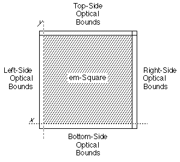
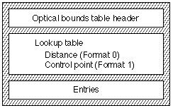
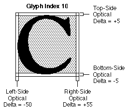
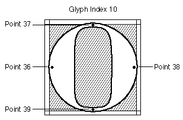

# “opbd”表
## 简介

光学边界表（标签名称：“opbd”）允许您设计包含标识字形光学边缘的信息的 AAT 字体。此信息用于使文本行的边缘以更美观的方式排列。此光学边界信息仅用于行的边缘，而不用于行内的点。

对于具有光学边缘信息的每个字形，此表中有四个数字，指定左、上、右和下光学边缘的值。这些值指定字形应移动的量以对齐其光学边缘。

符号约定与字体坐标系的符号约定相同。例如，与大写字母“C”关联的左侧增量为 -50 个单位意味着对于以该大写字母“C”字形开头的那些行，字形将向左移动 50 个单位。负值表示字形应向左或向下移动；正值表示字形应向右或向上移动。

此图显示了字形的光学边界：

## 光学边界表格式

光边界表的整体结构由光边界表头、查找表和实际光边界表项组成，如下图所示：

光学边界表可以具有以下两种格式之一：

|表格格式|说明|
|-|-|
|0|距离。与字形关联的增量值以 FUnit 为单位。对于字体中具有光学边缘的每个字形，为左侧、顶部、右侧和底部光学边缘指定距离增量值。零增量值用于指示一侧没有光学边界。
|1|控制点。您可以通过控制点指定字形光学边缘的位置。控制点指定字形内应与文本行边缘对齐的位置。对于字体中具有光学边缘的每个字形，为左侧、顶部、右侧和底部光学边缘指定控制点编号。特殊值 -1 表示您没有为给定边缘指定光学边缘控制点。

控制点光学边界格式 1 提供了比格式 0 更高级别的控制。可以提示控制点更改其位置，以改善每面小像素字形的外观。对于格式 0 距离，无法进行此校正。控制点在“glyf”表中定义。

光界表格式如下：

|类型|名称|描述|
|-|-|-|
|fixed32|版本|光学边界表的版本号（当前版本为 0x00010000）。
|uint16|格式|光学边界表的格式。格式 0 表示距离，格式 1 表示控制点。
|(variable)|查找数据|将字形与左侧、顶部、右侧和底部光学边界的四个 int16 值关联的查找表。

查找表用于查找与特定字形关联的四个 int16 光学边界值。每个lookupSegment的值始终是从光学边界表的开头到包含该段中字形的四个int16值的记录的16位偏移量。

## 光学边界表示例

### 示例：格式 0 光学边界表

让我们看一下为圆形字母提供光学边缘数据的罗马字体。有两个字形的光学边界数据：大写“C”（该字体的字形索引 10）和大写“A”（字形索引 43）。大写“A”字形有一个顶部数量，因为这种字体对于垂直文本和水平文本都应该看起来不错。下图显示了字形索引 10 的光学边界。

下表总结了字形索引 10 和 43 的光学边界数据。

|字形索引|侧面|Delta FUnits|
|-|-|-|
|10|左|-50|
|10|热门|+5|
|10|右|+55|
|10|底部|-5|
|43|左|-10|
|43|顶部|+15|
|43|右|0|
|43|底部|0|

下表显示如何为示例字体构建格式 0 光学边界表。

<table border="1" cellspacing="2" cellpadding="0">
		<tbody><tr align="left" valign="middle">
		<th align="middle">
			
偏移/ 
			长度

		</th>
		<th align="middle">
			
值

		</th>
		<th align="middle">
			
名称

		</th>
		<th align="left">
			
注释

		</th>
		</tr>
		<tr align="left" valign="middle">
		<td>0/4</td>
		<td>0x00010000</td>
		<td>version</td>
		<td class="description">光学边界表的版本号，采用定点格式。</td>
		</tr>
		<tr align="left" valign="middle">
		<td>4/2</td>
		<td>0</td>
		<td>format</td>
		<td class="description">光学边界表的格式。该表将使用格式 0 指示光学边界将是距离值。</td>
		</tr>
		<tr align="left" valign="middle">
		<td colspan="4" class="description">（<a href="#">格式 6 查找表</a>从这里开始）</td>
		</tr>
		<tr align="left" valign="middle">
		<td>6/2</td>
		<td>6</td>
		<td>format</td>
		<td class="description">查找表格式 6（单表格式，第 2 章中介绍）。</td>
		</tr>
		<tr align="left" valign="middle">
		<td colspan="4" class="description">（接下来的五个字段是查找表的 <a href="#">BinSrchHeader</a>）</td>
		</tr>
		<tr align="left" valign="middle">
		<td>8/2</td>
		<td>4</td>
		<td>unitSize</td>
		<td class="description">LookupSingle 记录的大小（字形索引 2 个字节，偏移量 2 个字节）。</td>
		</tr>
		<tr align="left" valign="middle">
		<td>10/2</td>
		<td>2</td>
		<td>nUnits</td>
		<td class="description">要搜索的前一个unitSize的单元数。表中包含 2 个字形。</td>
		</tr>
		<tr align="left" valign="middle">
		<td>12/2</td>
		<td>8</td>
		<td>searchRange</td>
		<td class="description">unitSize 乘以小于或等于 nUnits 的最大二的幂。</td>
		</tr>
		<tr align="left" valign="middle">
		<td>14/2</td>
		<td>1</td>
		<td>entrySelector</td>
		<td class="description">小于或等于 nUnits 的最大的两个幂的对数以 2 为底。</td>
		</tr>
		<tr align="left" valign="middle">
		<td>16/2</td>
		<td>0</td>
		<td>rangeShift</td>
		<td class="description">unitSize 乘以 nUnits 的差值减去两个小于或等于 nUnits 的最大幂。</td>
		</tr>
		<tr align="left" valign="middle">
		<td colspan="4" class="description">（<code>LookupSingle</code> 记录条目从这里开始）</td>
		</tr>
		<tr align="left" valign="middle">
		<td>18/2</td>
		<td>10</td>
		<td>glyph</td>
		<td class="description">大写“C”的字形索引。</td>
		</tr>
		<tr align="left" valign="middle">
		<td>20/2</td>
		<td>30</td>
		<td>value</td>
		<td class="description">字形索引 10 的光学边界偏移。</td>
		</tr>
		<tr align="left" valign="middle">
		<td>22/2</td>
		<td>43</td>
		<td>glyph</td>
		<td class="description">大写“A”的字形索引。</td>
		</tr>
		<tr align="left" valign="middle">
		<td>24/2</td>
		<td>38</td>
		<td>value</td>
		<td class="description">字形索引 43 的光学边界偏移。</td>
		</tr>
		<tr align="left" valign="middle">
		<td>26/2</td>
		<td>0xFFFF</td>
		<td>glyph</td>
		<td class="description">特殊监护人进入。</td>
		</tr>
		<tr align="left" valign="middle">
		<td>28/2</td>
		<td>0</td>
		<td>value</td>
		<td class="description">特殊监护人进入。</td>
		</tr>
		<tr align="left" valign="middle">
		<td colspan="4" class="description">（以下是字形索引 10 的增量值）</td>
		</tr>
		<tr align="left" valign="middle">
		<td>30/2</td>
		<td>-50</td>
		<td>value</td>
		<td class="description">左侧光学边缘的增量值。</td>
		</tr>
		<tr align="left" valign="middle">
		<td>32/2</td>
		<td>+5</td>
		<td>value</td>
		<td class="description">顶侧光学边缘的增量值。</td>
		</tr>
		<tr align="left" valign="middle">
		<td>34/2</td>
		<td>+55</td>
		<td>value</td>
		<td class="description">右侧光​​学边缘的增量值。</td>
		</tr>
		<tr align="left" valign="middle">
		<td>36/2</td>
		<td>-5</td>
		<td>value</td>
		<td class="description">底侧光学边缘的增量值。</td>
		</tr>
		<tr align="left" valign="middle">
		<td colspan="4" class="description">（以下是字形索引 43 的增量值）</td>
		</tr>
		<tr align="left" valign="middle">
		<td>38/2</td>
		<td>-10</td>
		<td>value</td>
		<td class="description">左侧光学边缘的增量值。</td>
		</tr>
		<tr align="left" valign="middle">
		<td>40/2</td>
		<td>+15</td>
		<td>value</td>
		<td class="description">顶侧光学边缘的增量值。</td>
		</tr>
		<tr align="left" valign="middle">
		<td>42/2</td>
		<td>0</td>
		<td>value</td>
		<td class="description">右侧光​​学边缘的增量值 -此字形没有。</td>
		</tr>
		<tr align="left" valign="middle">
		<td>44/2</td>
		<td>0</td>
		<td>value</td>
		<td class="description">底部光学边缘的增量值——此字形没有。</td>
		</tr>
	</tbody></table>

### 示例：格式 1 光学边界表

对于此示例，大写字母“O”和“A”字形的光学边缘是通过控制点而不是实际距离指定的。请注意，特殊值“-1”表示不包含该边的光学信息。控制点在“glyf”表中定义。

下表总结了字形索引 10 的光学边界数据。

|字形索引|侧面|控制点
|-|-|-|
|10|左|36|
|10|上|37|
|10|右|38|
|10|下|39|
|43|左|32|
|43|上|41|
|43|右|-1|
|43|下|-1|

下表显示如何为示例字体构建格式 1 光学边界表。

<table border="1" cellspacing="2" cellpadding="0">
		<tbody><tr align="left" valign="middle">
		<th align="middle">
			
偏移/ 
			长度

		</th>
		<th align="middle">
			
值

		</th>
		<th align="middle">
			
名称

		</th>
		<th align="left">
			
注释

		</th>
		</tr>
		<tr align="left" valign="middle">
		<td>0/4</td>
		<td>0x00010000</td>
		<td>version</td>
		<td class="description">光学边界表的版本号，采用定点格式。</td>
		</tr>
		<tr align="left" valign="middle">
		<td>4/2</td>
		<td>1</td>
		<td>format</td>
		<td class="description">光学边界表的格式。该表将使用格式 1 指示光学边界将是控制点。</td>
		</tr>
		<tr align="left" valign="middle">
		<td colspan="4" class="description">（<a href="#">格式 6 查找表</a>从这里开始）</td>
		</tr>
		<tr align="left" valign="middle">
		<td>6/2</td>
		<td>6</td>
		<td>format</td>
		<td class="description">查找表格式 6（单表格式，第 2 章中介绍）。</td>
		</tr>
		<tr align="left" valign="middle">
		<td colspan="4" class="description">（接下来的五个字段是查找表的 <a href="">BinSrchHeader</a>）</td>
		</tr>
		<tr align="left" valign="middle">
		<td>8/2</td>
		<td>4</td>
		<td>unitSize</td>
		<td class="description">LookupSingle 记录的大小（字形索引 2 个字节，偏移量 2 个字节）。</td>
		</tr>
		<tr align="left" valign="middle">
		<td>10/2</td>
		<td>2</td>
		<td>nUnits</td>
		<td class="description">要搜索的前一个unitSize的单元数。表中包含 2 个字形。</td>
		</tr>
		<tr align="left" valign="middle">
		<td>12/2</td>
		<td>8</td>
		<td>searchRange</td>
		<td class="description">unitSize 乘以小于或等于 nUnits 的最大二的幂。</td>
		</tr>
		<tr align="left" valign="middle">
		<td>14/2</td>
		<td>1</td>
		<td>entrySelector</td>
		<td class="description">小于或等于 nUnits 的最大的两个幂的对数以 2 为底。</td>
		</tr>
		<tr align="left" valign="middle">
		<td>16/2</td>
		<td>0</td>
		<td>rangeShift</td>
		<td class="description">unitSize 乘以 nUnits 的差值减去两个小于或等于 nUnits 的最大幂。</td>
		</tr>
		<tr align="left" valign="middle">
		<td colspan="4" class="description">（<code>LookupSingle</code> 记录条目从这里开始）</td>
		</tr>
		<tr align="left" valign="middle">
		<td>18/2</td>
		<td>10</td>
		<td>glyph</td>
		<td class="description">大写“C”的字形索引。</td>
		</tr>
		<tr align="left" valign="middle">
		<td>20/2</td>
		<td>30</td>
		<td>value</td>
		<td class="description">字形索引 10 的光学边界偏移。</td>
		</tr>
		<tr align="left" valign="middle">
		<td>22/2</td>
		<td>43</td>
		<td>glyph</td>
		<td class="description">大写“A”的字形索引。</td>
		</tr>
		<tr align="left" valign="middle">
		<td>24/2</td>
		<td>38</td>
		<td>value</td>
		<td class="description">字形索引 43 的光学边界偏移。</td>
		</tr>
		<tr align="left" valign="middle">
		<td>26/2</td>
		<td>0xFFFF</td>
		<td>glyph</td>
		<td class="description">特殊监护人进入。</td>
		</tr>
		<tr align="left" valign="middle">
		<td>28/2</td>
		<td>0</td>
		<td>value</td>
		<td class="description">特殊监护人进入。</td>
		</tr>
		<tr align="left" valign="middle">
		<td colspan="4" class="description">（以下是字形索引10的控制点）</td>
		</tr>
		<tr align="left" valign="middle">
		<td>30/2</td>
		<td>36</td>
		<td>value</td>
		<td class="description">左侧光学边缘的增量值。</td>
		</tr>
		<tr align="left" valign="middle">
		<td>32/2</td>
		<td>37</td>
		<td>value</td>
		<td class="description">顶侧光学边缘的增量值。</td>
		</tr>
		<tr align="left" valign="middle">
		<td>34/2</td>
		<td>38</td>
		<td>value</td>
		<td class="description">右侧光​​学边缘的增量值。</td>
		</tr>
		<tr align="left" valign="middle">
		<td>36/2</td>
		<td>39</td>
		<td>value</td>
		<td class="description">底侧光学边缘的增量值。</td>
		</tr>
		<tr align="left" valign="middle">
		<td colspan="4" class="description">（以下是字形索引43的控制点）</td>
		</tr>
		<tr align="left" valign="middle">
		<td>38/2</td>
		<td>32</td>
		<td>value</td>
		<td class="description">Delta value for the left-side optical edge.</td>
		</tr>
		<tr align="left" valign="middle">
		<td>40/2</td>
		<td>41</td>
		<td>value</td>
		<td class="description">顶侧光学边缘的增量值。</td>
		</tr>
		<tr align="left" valign="middle">
		<td>42/2</td>
		<td>-1</td>
		<td>value</td>
		<td class="description">右侧光​​学边缘的增量值 -此字形没有。</td>
		</tr>
		<tr align="left" valign="middle">
		<td>44/2</td>
		<td>-1</td>
		<td>value</td>
		<td class="description">底部光学边缘的增量值——此字形没有。</td>
		</tr>
	</tbody></table>