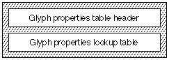

# “prop”表

## 一般表信息

### 简介
字形属性表（标签名称：“prop”）允许您创建 Apple Advanced Typography (AAT) 字体，每个字形都具有不同的属性。当前支持的属性如下：

* 无间距标记。这些是无间距字形，其定位参考前面的基本字符。示例包括浮动字形，如变音符号、重音符号和标记。
* 悬挂字形。这些字形悬挂在水平文本行的左边缘或右边缘，或悬挂在垂直文本行的顶部或底部。
* 方向成对字形。这些字形依赖于从左到右和从右到左的行。例如括号字形，如圆括号、方括号和花括号。
* 右侧附件。这些字形物理上附加到其右侧的字形。此信息用于对齐，以确保在如此连接的字形之间不会添加任何额外的空格、理想空格或设备空格。

所有 Unicode 字符都具有方向性。具有从左到右和从右到左方向性的字符称为强类型。强类型的字符称为强方向字符。与数字相关的方向类型称为弱类型。这些类型的字符称为弱方向字符。中性字符可以从右到左或从左到右书写，具体取决于行的上下文。

有关属性和方向性的更多信息，请参阅 Unicode 标准：全球字符编码。

### 字形属性表格式

字形属性表由字形属性表头和字形属性查找表组成。字形属性表的整体结构如下图所示：

自诞生以来，字形属性表已有三个版本。下表总结了各个版本：

|版本|描述|
|-|-|
|1.0|初始版本，支持浮动、悬挂标点、对称交换和 12 个基本 Unicode 方向属性。
|2.0|与 MacOS 系统 8.5 一起发布，此版本增加了对“附加在右侧”位的支持。
|3.0|这是目前在 OS X 和 iOS 上使用的版本；它增加了对 Unicode 3.0 中定义的其他方向属性的支持。

字形属性表的格式如下：

类型|名称|描述
|-|-|-|
fixed32|版本|字形属性表的版本号。请参阅上表了解每个版本的含义。
uint16|格式|字形属性表的格式，如果不存在查找数据，则设置为 0；如果存在查找数据，则设置为 1。
uint16|默认属性|如果查找表中不存在该字形，则应用于该字形的默认属性。
variable(变量)|查找数据|将字形与其属性关联的查找表。有关如何解释查找值的详细信息，请参阅下文。

查找表用于查找与特定字形关联的 16 位属性值。以下是如何解释 5 种查找表格式中的每一种的查找：

|查找表格式|解释|
|-|-|
|0|16 位属性值数组，字体中的每个字形一个。|
|2|每个 lookupSegment 的值是该段中所有字形的 16 位属性值。|
|4|每个 lookupSegment 的值是从查找表开头到 16 位属性值数组的 16 位偏移量，段中的每个字形一个。|
|6|每个 lookupSingle 的值是该字形的 16 位属性值。|
|8|valueArray 是 16 位属性值数组，修剪数组中的每个字形一个。|

单个字形属性长度为 16 位。字形属性位掩码及其说明如下表所示：

|掩码|解释|
|-|-|
|0x8000|此字形为浮动字形（例如浮动重音符号或元音符号）。注意：此位仅对前进宽度为零的字形设置，这一点非常重要。|
|0x4000|此字形可以悬挂在水平线的左边缘或垂直线的上边缘。|
|0x2000|此字形可以悬挂在水平线的右边缘或垂直线的下边缘。|
|0x1000|如果此属性位打开，并且字形以从右到左的方向分组结束，则应使用互补括号字形替换此字形。|
|0x0F00|这四个位给出互补括号字形的偏移量（如果此字形没有这样的互补括号字形，则为零）。|
|0x0080|此字形始终附加到物理上出现在其右侧的字形上。请注意，此位是在版本 2.0 中添加的；在 1.0 版字形属性表中设置它是无效的。|
|0x0060|这两个位必须设置为零。此掩码保留用于将来的属性。|
|0x001F|这五位包含字形的方向性类。请注意，在 3.0 之前的 Unicode 版本中，实际上只使用了其中四位。|

Unicode 重新排序算法将诸如“(”和“)”之类的字符视为开括号和闭括号，而不是左括号和右括号。这意味着用于呈现这些括号字符的字形将取决于文本的最终解析方向，如下表所示：

|方向性|打开/关闭|括号字形|
|-|-|-|
|从左到右|打开|(, [, {|
|从左到右|关闭|), ], }|
|从右到左|打开|), ], }|
|从右到左|关闭|(, [, {|

为了适应括号字形的双向性，“cmap”表应始终根据其“自然”方向更改字形中的括号字符。因此，当使用两个括号之一时，必须将互补的字形标识给 AAT 渲染系统。这是通过使用 0x1F00 位来实现的。如果字形是括号字形，则 0x0F00 位被视为对应字形的字形索引的 4 位有符号偏移量。0x1000 位用于确定该指定偏移处的字形是从右到左还是从左到右的字形版本。

例如，在罗马字体中，括号字形的顺序通常是“(”后跟“)”。对于“(”字形，字形索引可能是 11，而对于“)”字形，字形索引可能是 12。那么，对于 '(' 字形，属性掩码 0x1F00 将是 ')' 字形的 0x1100，而对于 ')' 字形，属性掩码 0x1F00。字形索引 =“11”的 0x1100 掩码表示相应的字形是从右到左的，字形索引偏移量为 +1，字形索引 =“11”+1 =“12”。0x1F00 掩码表示相应的字形也是从右到左的，字形索引偏移量为 -1，字形索引 =“12”-1 =“11”。

如果字形索引中的 '(' 和 ')' 之间有一个或多个字形，则此信息通过掩码值传达。例如，如果相应括号字形的字形索引分别为 11 和 13，则“(”字形的属性掩码 0x1F00 对于“)”字形将是 0x1200，对于“)”字形将是 0x1E00。0x1200 掩码表示相应的字形也是从右到左，字形索引偏移量为 +2，字形索引="11" + 2="13"。0x1E00 掩码表示相应的字形也是从右到左，字形索引偏移量为 -2，字形索引="13" - 2="11"。

Apple Advanced Typography 系统目前支持以下方向性类：

|类型|类别（十进制）|描述|
|-|-|-|
|Strong|0|强（从左到右）
|Strong|1|强（从右到左，非阿拉伯语）
|Strong|2|阿拉伯字母（从右到左）
|Weak|3|欧洲数字|
|Weak|4|欧洲数字分隔符|
|Weak|5|欧洲数字终止符|
|Weak|6|阿拉伯数字|
|Weak|7|通用数字分隔符|
|Neutral|8|块分隔符|
|Neutral|9|段分隔符|
|Neutral|10|空格|
|Neutral|11|其他中性字符|
|Neutral|12|至 31 保留（有些实际上是在 Unicode 3.0 中定义的）|

注意：Unicode 3.0 中定义了其他属性。如果使用这些属性，请确保将此表的版本设置为 3.0 或更高版本！

可以使用任何查找表格式。如果字形具有相似的属性，格式 2 可能比较合适。如果只有少数字形与默认字形不同，则可能首选格式 6。如果段数很大，可以选择格式 0 或 8。

### 字形属性表示例

#### 带有希伯来语和罗马字符的示例字体

此示例字体将同时包含希伯来语和罗马字符。需要包含此字体的双向功能，以适应罗马字形从左到右而希伯来字形从右到左的事实。

默认属性从左到右或从右到左的定义是任意的。将方向性类指定为 0 将此字体的默认属性定义为强从左到右。这对于罗马字形来说没问题，但我们需要提供一个查找表，将希伯来字形定义为具有从右到左的方向性。将希伯来字形的方向性类指定为 1 将其非默认属性定义为强从右到左（非阿拉伯语）。

由于此字体中的许多字形都具有相似的属性，我们将对非默认字形使用格式 2 单段查找表。我们将使用两个段，每个段都有自己的一组属性。段将是连续的字形索引范围，其中段中的所有字形将具有一个指定段属性的查找值。此字体的字形属性数据总结在下表中：

|字形|字形索引|方向性 类|掩码值|
|-|-|-|-|
|罗马|3-149|0|默认类别不需要。|
|希伯来语|150-225|1|1（十进制），0x0001，段 2|
|空格|2|10|10（十进制），0x000A，段 1|

<table border="1" cellspacing="2" cellpadding="0">
		<tbody><tr>
		<th>偏移/ 
		长度</th>
		<th>值</th>
		<th>名称</th>
		<th>注释</th>
		</tr>
		<tr>
		<td>0/4</td>
		<td>0x00030000</td>
		<td>version </td>
		<td class="description">字形属性表的版本号，采用定点格式。</td>
		</tr>
		<tr>
		<td>4/2</td>
		<td>1</td>
		<td>format</td>
		<td class="description">字形属性表的格式为1。存在查找数据。</td>
		</tr>
		<tr>
		<td>6/2</td>
		<td>0</td>
		<td>default properties</td>
		<td class="description">默认属性是从左到右的方向性和非空白；字形不能悬挂在线条的任意一端，也不能是浮动元素。</td>
		</tr>
		<tr>
		<td colspan="4" class="description">（<a href="#">格式 2 查找表</a>从这里开始）</td>
		</tr>
		<tr>
		<td>8/2</td>
		<td>2</td>
		<td>format</td>
		<td class="description">查找表格式2（段单一格式）。</td>
		</tr>
		<tr>
		<td colspan="4" class="description">（接下来的五个字段是查找表的 <a href="#">BinSrchHeader</a>）</td>
		</tr>
		<tr>
		<td>10/2</td>
		<td>6</td>
		<td>unitSize</td>
		<td class="description">LookupSegment 的大小：2 个字节用于起始字形索引，2 个字节用于结束字形索引，2 个字节用于字形属性值。</td>
		</tr>
		<tr>
		<td>12/2</td>
		<td>2</td>
		<td>nUnits</td>
		<td class="description">要搜索的前一个unitSize的条目数。查找表中包含 2 个属性。</td>
		</tr>
		<tr>
		<td>14/2</td>
		<td>12</td>
		<td>searchRange</td>
		<td class="description">unitSize 乘以小于或等于 nUnits 的最大二的幂。</td>
		</tr>
		<tr>
		<td>16/2</td>
		<td>1</td>
		<td>entrySelector</td>
		<td class="description">小于或等于 nUnits 的最大的两个幂的对数以 2 为底。</td>
		</tr>
		<tr>
		<td>18/2</td>
		<td>0</td>
		<td>rangeShift</td>
		<td class="description">unitSize 乘以 nUnits 的差值减去两个小于或等于 nUnits 的最大幂。</td>
		</tr>
		<tr>
		<td colspan="4" class="description">（<code>LookupSegment</code> 条目从此处开始；随后是第一个查找段）</td>
		</tr>
		<tr>
		<td>20/2</td>
		<td>2</td>
		<td>lastGlyph</td>
		<td class="description">空白的字形索引。这是该段中的最后一个字形索引。</td>
		</tr>
		<tr>
		<td>22/2</td>
		<td>2</td>
		<td>firstGlyph</td>
		<td class="description">空白的字形索引。这是该段中的第一个字形索引。</td>
		</tr>
		<tr>
		<td>24/2</td>
		<td>0x000A</td>
		<td>value</td>
		<td class="description">字形索引 2 的属性。方向性等级 10（空白、中性）。</td>
		</tr>
		<tr>
		<td colspan="4" class="description">（第二个 <code>LookupSegment</code> 如下）</td>
		</tr>
		<tr>
		<td>26/2</td>
		<td>225</td>
		<td>lastGlyph</td>
		<td class="description">希伯来字形的结尾字形索引。这是该段中的最后一个字形索引。</td>
		</tr>
		<tr>
		<td>28/2</td>
		<td>150</td>
		<td>firstGlyph</td>
		<td class="description">希伯来字形的起始字形索引。这是该段中的第一个字形索引。</td>
		</tr>
		<tr>
		<td>30/2</td>
		<td>0x0001</td>
		<td>value</td>
		<td class="description">字形索引 150 到 225（从右到左）的属性。</td>
		</tr>
	</tbody></table>

#### 带罗马字符的示例字体

此示例字体包含 98 个罗马字形，涵盖了 7 位 ASCII 所需的字形。此示例字体的字形属性数据如下：

|段|字形索引|字形|属性|方向性类|
|-|-|-|-|-|
|0|3|空格|0x000A|空格 (10)
|1|4|!|0x000B|其他中性 (11)
|2|5|"|0x600B|其他中性 (11)
|3|6-8|# $ %|0x0005|欧洲数字终止符 (5)
|4|9|&|0x0000|强 (从左到右) (0)
|5|10|'|0x600B|其他中性 (11)
|6|11|(|0x110B|其他中性 (11)
|7|12|)|0x1F0B|其他中性 (11)
|8|13|*|0x000B|其他中性 (11)
|9|14|+|0x0005|欧洲数字终止符 (5)
|10|15|,|0x0007|通用数字分隔符 (7)
|11|16|?|0x0005|欧洲数字终止符 (5)
|12|17-18|. /|0x0004|欧洲数字分隔符(4)
|13|19-28|0-9|0x0003|欧洲数字 (3)
|14|29|:|0x0007|通用数字分隔符 (7)
|15|30|;|0x000B|其他中性 (11)
|16|31|<|0x120B|其他中性 (11)
|17|32|=|0x000B|其他中性 (11)
|18|33|>|0x1E0B|其他中性 (11)
|19|34-35|? @|0x000B|其他中性 (11)
|20|36-61|A-Z|0x0000|强 (从左到右) (0)
|21|62|[|0x120B|其他中性 (11)
|22|63|\|0x000B|其他中性 (11)
|23|64|]|0x1E0B|其他中性(11)
|24|65-93|^ _ `|和 a-z|0x0000 强（从左到右） (0)
|25|94|{|0x120B|其他中性 (11)
|26|95|||0x000B|其他中性 (11)
|27|96|}|0x1E0B|其他中性 (11)
|28|97|~|0x000B|其他中性 (11)

下表给出了该示例字体的字形属性表：

<table border="1" cellspacing="2" cellpadding="0">
		<tbody><tr>
		<th>偏移/长度</th>
		<th>值</th>
		<th>名称</th>
		<th>注释</th>
		</tr>
		<tr>
		<td>0/4</td>
		<td>0x00030000</td>
		<td>version</td>
		<td class="description">字形属性表的版本号，采用定点格式。</td>
		</tr>
		<tr>
		<td>4/2</td>
		<td>1</td>
		<td>format</td>
		<td class="description">表格式为1，表示存在查找数据。</td>
		</tr>
		<tr>
		<td>6/2</td>
		<td>0</td>
		<td>default</td>
		<td class="description">默认属性是从左到右的方向性和非空白；字形不能悬挂在线条的任意一端，也不能是浮动元素。</td>
		</tr>
		<tr>
		<td colspan="4" class="description">（<a href="#">格式 8 查找表</a>从这里开始）</td>
		</tr>
		<tr>
		<td>8/2</td>
		<td>8</td>
		<td>format</td>
		<td class="description">查找表格式 8（修剪数组）。</td>
		</tr>
		<tr>
		<td>10/2</td>
		<td>3</td>
		<td>firstGlyph</td>
		<td class="description">我们在修剪数组中包含值的第一个字形。</td>
		</tr>
		<tr>
		<td>12/2</td>
		<td>95</td>
		<td>glyphCount</td>
		<td class="description">修剪数组中的字形数量。</td>
		</tr>
		<tr>
		<td colspan="4" class="description">（实际属性如下，从 3 到 97 的每个字形对应一个 16 位字）</td>
		</tr>
		<tr>
		<td>14/2</td>
		<td>0x000A</td>
		<td>valueArray[0]</td>
		<td class="description">字形 3 是空白。</td>
		</tr>
		<tr>
		<td>16/2</td>
		<td>0x000B</td>
		<td>valueArray[1]</td>
		<td class="description">字形 4 是其他中性的。</td>
		</tr>
		<tr>
		<td>18/2</td>
		<td>0x600B</td>
		<td>valueArray[2]</td>
		<td class="description">字形 5 是其他中性字形，也是一个可以从任一侧悬挂的悬挂标点符号字形。</td>
		</tr>
		<tr>
		<td>20/2</td>
		<td>0x0005</td>
		<td>valueArray[3]</td>
		<td class="description">字形 6 是欧洲数字终止符。</td>
		</tr>
		<tr>
		<td>22/2</td>
		<td>0x0005</td>
		<td>valueArray[4]</td>
		<td class="description">字形 7 是欧洲数字终止符。</td>
		</tr>
		<tr>
		<td>24/2</td>
		<td>0x0005</td>
		<td>valueArray[5]</td>
		<td class="description">字形 8 是欧洲数字终止符。</td>
		</tr>
		<tr>
		<td>26/2</td>
		<td>0x0000</td>
		<td>valueArray[6]</td>
		<td class="description">字形 9 是从左到右的。</td>
		</tr>
		<tr>
		<td>28/2</td>
		<td>0x600B</td>
		<td>valueArray[7]</td>
		<td class="description">字形 10 是其他中性的，也是一个可以从任一侧悬挂的悬挂标点符号。</td>
		</tr>
		<tr>
		<td>30/2</td>
		<td>0x110B</td>
		<td>valueArray[8]</td>
		<td class="description">字形 11 是其他中性字形，并且在偏移量 +1 处有一个包围字形。</td>
		</tr>
		<tr>
		<td>32/2</td>
		<td>0x1F0B</td>
		<td>valueArray[9]</td>
		<td class="description">字形 12 是其他中性字形，并且在偏移量为 -1 处具有包围字形。</td>
		</tr>
		<tr>
		<td>34/2</td>
		<td>0x000B</td>
		<td>valueArray[10]</td>
		<td class="description">字形 13 是其他中性的。</td>
		</tr>
		<tr>
		<td>36/2</td>
		<td>0x0005</td>
		<td>valueArray[11]</td>
		<td class="description">字形 14 是欧洲数字终止符。</td>
		</tr>
		<tr>
		<td>38/2</td>
		<td>0x0007</td>
		<td>valueArray[12]</td>
		<td class="description">字形 15 是通用数字终止符。</td>
		</tr>
		<tr>
		<td>40/2</td>
		<td>0x0005</td>
		<td>valueArray[13]</td>
		<td class="description">字形 16 是欧洲数字终止符。</td>
		</tr>
		<tr>
		<td>42/2</td>
		<td>0x0004</td>
		<td>valueArray[14]</td>
		<td class="description">字形 17 是欧洲数字分隔符。</td>
		</tr>
		<tr>
		<td>44/2</td>
		<td>0x0004</td>
		<td>valueArray[15]</td>
		<td class="description">字形 18 是欧洲数字分隔符。</td>
		</tr>
		<tr>
		<td>46/2</td>
		<td>0x0003</td>
		<td>valueArray[16]</td>
		<td class="description">字形 19 是欧洲号码。</td>
		</tr>
		<tr>
		<td>48/2</td>
		<td>0x0003</td>
		<td>valueArray[17]</td>
		<td class="description">字形 20 是欧洲号码。</td>
		</tr>
		<tr>
		<td>50/2</td>
		<td>0x0003</td>
		<td>valueArray[18]</td>
		<td class="description">字形 21 是欧洲号码。</td>
		</tr>
		<tr>
		<td>52/2</td>
		<td>0x0003</td>
		<td>valueArray[19]</td>
		<td class="description">字形 22 是欧洲数字。</td>
		</tr>
		<tr>
		<td>54/2</td>
		<td>0x0003</td>
		<td>valueArray[20]</td>
		<td class="description">字形 23 是欧洲号码。</td>
		</tr>
		<tr>
		<td>56/2</td>
		<td>0x0003</td>
		<td>valueArray[21]</td>
		<td class="description">字形 24 是欧洲号码。</td>
		</tr>
		<tr>
		<td>58/2</td>
		<td>0x0003</td>
		<td>valueArray[22]</td>
		<td class="description">字形 25 是欧洲号码。</td>
		</tr>
		<tr>
		<td>60/2</td>
		<td>0x0003</td>
		<td>valueArray[23]</td>
		<td class="description">字形 26 是欧洲号码。</td>
		</tr>
		<tr>
		<td>62/2</td>
		<td>0x0003</td>
		<td>valueArray[24]</td>
		<td class="description">字形 27 是欧洲号码。</td>
		</tr>
		<tr>
		<td>64/2</td>
		<td>0x0003</td>
		<td>valueArray[25]</td>
		<td class="description">字形 28 是欧洲号码。</td>
		</tr>
		<tr>
		<td>66/2</td>
		<td>0x0007</td>
		<td>valueArray[26]</td>
		<td class="description">字形 29 是通用数字终止符。</td>
		</tr>
		<tr>
		<td>68/2</td>
		<td>0x000B</td>
		<td>valueArray[27]</td>
		<td class="description">字形 30 是其他中性的。</td>
		</tr>
		<tr>
		<td>70/2</td>
		<td>0x120B</td>
		<td>valueArray[28]</td>
		<td class="description">字形 31 是其他中性字形，并且在偏移量 +2 处有一个包围字形。</td>
		</tr>
		<tr>
		<td>72/2</td>
		<td>0x000B</td>
		<td>valueArray[29]</td>
		<td class="description">字形 32 是其他中性的。</td>
		</tr>
		<tr>
		<td>74/2</td>
		<td>0x1E0B</td>
		<td>valueArray[30]</td>
		<td class="description">字形 33 是​​其他中性字形，并且在偏移量 -2 处有一个包围字形。</td>
		</tr>
		<tr>
		<td>76/2</td>
		<td>0x000B</td>
		<td>valueArray[31]</td>
		<td class="description">字形 34 是其他中性的。</td>
		</tr>
		<tr>
		<td>78/2</td>
		<td>0x000B</td>
		<td>valueArray[32]</td>
		<td class="description">字形 35 是其他中性的。</td>
		</tr>
		<tr>
		<td>80/2</td>
		<td>0x0000</td>
		<td>valueArray[33]</td>
		<td class="description">字形 36 是从左到右的。</td>
		</tr>
		<tr>
		<td>82/2</td>
		<td>0x0000</td>
		<td>valueArray[34]</td>
		<td class="description">字形 37 是从左到右的。</td>
		</tr>
		<tr>
		<td>84/2</td>
		<td>0x0000</td>
		<td>valueArray[35]</td>
		<td class="description">字形 38 是从左到右。</td>
		</tr>
		<tr>
		<td>86/2</td>
		<td>0x0000</td>
		<td>valueArray[36]</td>
		<td class="description">字形 39 是从左到右的。</td>
		</tr>
		<tr>
		<td>88/2</td>
		<td>0x0000</td>
		<td>valueArray[37]</td>
		<td class="description">字形 40 是从左到右。</td>
		</tr>
		<tr>
		<td>90/2</td>
		<td>0x0000</td>
		<td>valueArray[38]</td>
		<td class="description">字形 41 是从左到右。</td>
		</tr>
		<tr>
		<td>92/2</td>
		<td>0x0000</td>
		<td>valueArray[39]</td>
		<td class="description">字形 42 是从左到右。</td>
		</tr>
		<tr>
		<td>94/2</td>
		<td>0x0000</td>
		<td>valueArray[40]</td>
		<td class="description">字形 43 是从左到右。</td>
		</tr>
		<tr>
		<td>96/2</td>
		<td>0x0000</td>
		<td>valueArray[41]</td>
		<td class="description">字形 44 是从左到右。</td>
		</tr>
		<tr>
		<td>98/2</td>
		<td>0x0000</td>
		<td>valueArray[42]</td>
		<td class="description">字形 45 是从左到右。</td>
		</tr>
		<tr>
		<td>100/2</td>
		<td>0x0000</td>
		<td>valueArray[43]</td>
		<td class="description">字形 46 是从左到右。</td>
		</tr>
		<tr>
		<td>102/2</td>
		<td>0x0000</td>
		<td>valueArray[44]</td>
		<td class="description">字形 47 是从左到右。</td>
		</tr>
		<tr>
		<td>104/2</td>
		<td>0x0000</td>
		<td>valueArray[45]</td>
		<td class="description">字形 48 是从左到右。</td>
		</tr>
		<tr>
		<td>106/2</td>
		<td>0x0000</td>
		<td>valueArray[46]</td>
		<td class="description">字形 49 是从左到右。</td>
		</tr>
		<tr>
		<td>108/2</td>
		<td>0x0000</td>
		<td>valueArray[47]</td>
		<td class="description">字形 50 是从左到右。</td>
		</tr>
		<tr>
		<td>110/2</td>
		<td>0x0000</td>
		<td>valueArray[48]</td>
		<td class="description">字形 51 是从左到右。</td>
		</tr>
		<tr>
		<td>112/2</td>
		<td>0x0000</td>
		<td>valueArray[49]</td>
		<td class="description">字形 52 是从左到右。</td>
		</tr>
		<tr>
		<td>114/2</td>
		<td>0x0000</td>
		<td>valueArray[50]</td>
		<td class="description">字形 53 是从左到右。</td>
		</tr>
		<tr>
		<td>116/2</td>
		<td>0x0000</td>
		<td>valueArray[51]</td>
		<td class="description">字形 54 是从左到右。</td>
		</tr>
		<tr>
		<td>118/2</td>
		<td>0x0000</td>
		<td>valueArray[52]</td>
		<td class="description">字形 55 是从左到右。</td>
		</tr>
		<tr>
		<td>120/2</td>
		<td>0x0000</td>
		<td>valueArray[53]</td>
		<td class="description">字形 56 是从左到右。</td>
		</tr>
		<tr>
		<td>122/2</td>
		<td>0x0000</td>
		<td>valueArray[54]</td>
		<td class="description">字形 57 是从左到右。</td>
		</tr>
		<tr>
		<td>124/2</td>
		<td>0x0000</td>
		<td>valueArray[55]</td>
		<td class="description">字形 58 是从左到右。</td>
		</tr>
		<tr>
		<td>126/2</td>
		<td>0x0000</td>
		<td>valueArray[56]</td>
		<td class="description">字形 59 是从左到右。</td>
		</tr>
		<tr>
		<td>128/2</td>
		<td>0x0000</td>
		<td>valueArray[57]</td>
		<td class="description">字形 60 是从左到右。</td>
		</tr>
		<tr>
		<td>130/2</td>
		<td>0x0000</td>
		<td>valueArray[58]</td>
		<td class="description">字形 61 是从左到右。</td>
		</tr>
		<tr>
		<td>132/2</td>
		<td>0x120B</td>
		<td>valueArray[59]</td>
		<td class="description">字形 62 是其他中性字形，并且在偏移量 +2 处有一个包围字形。</td>
		</tr>
		<tr>
		<td>134/2</td>
		<td>0x000B</td>
		<td>valueArray[60]</td>
		<td class="description">字形 63 是其他中性的。</td>
		</tr>
		<tr>
		<td>136/2</td>
		<td>0x1E0B</td>
		<td>valueArray[61]</td>
		<td class="description">字形 64 是其他中性字形，并且在偏移量 -2 处有一个包围字形.</td>
		</tr>
		<tr>
		<td>138/2</td>
		<td>0x0000</td>
		<td>valueArray[62]</td>
		<td class="description">字形 65 是从左到右。</td>
		</tr>
		<tr>
		<td>140/2</td>
		<td>0x0000</td>
		<td>valueArray[63]</td>
		<td class="description">字形 66 是从左到右。</td>
		</tr>
		<tr>
		<td>142/2</td>
		<td>0x0000</td>
		<td>valueArray[64]</td>
		<td class="description">字形 67 是从左到右。</td>
		</tr>
		<tr>
		<td>144/2</td>
		<td>0x0000</td>
		<td>valueArray[65]</td>
		<td class="description">字形 68 是从左到右。</td>
		</tr>
		<tr>
		<td>146/2</td>
		<td>0x0000</td>
		<td>valueArray[66]</td>
		<td class="description">字形 69 是从左到右。</td>
		</tr>
		<tr>
		<td>148/2</td>
		<td>0x0000</td>
		<td>valueArray[67]</td>
		<td class="description">字形 70 是从左到右。</td>
		</tr>
		<tr>
		<td>150/2</td>
		<td>0x0000</td>
		<td>valueArray[68]</td>
		<td class="description">字形 71 是从左到右。</td>
		</tr>
		<tr>
		<td>152/2</td>
		<td>0x0000</td>
		<td>valueArray[69]</td>
		<td class="description">字形 72 是从左到右。</td>
		</tr>
		<tr>
		<td>154/2</td>
		<td>0x0000</td>
		<td>valueArray[70]</td>
		<td class="description">字形 73 是从左到右。</td>
		</tr>
		<tr>
		<td>156/2</td>
		<td>0x0000</td>
		<td>valueArray[71]</td>
		<td class="description">字形 74 是从左到右。</td>
		</tr>
		<tr>
		<td>158/2</td>
		<td>0x0000</td>
		<td>valueArray[72]</td>
		<td class="description">字形 75 是从左到右。</td>
		</tr>
		<tr>
		<td>160/2</td>
		<td>0x0000</td>
		<td>valueArray[73]</td>
		<td class="description">字形 76 是从左到右。</td>
		</tr>
		<tr>
		<td>162/2</td>
		<td>0x0000</td>
		<td>valueArray[74]</td>
		<td class="description">字形 77 是从左到右。</td>
		</tr>
		<tr>
		<td>164/2</td>
		<td>0x0000</td>
		<td>valueArray[75]</td>
		<td class="description">字形 78 是从左到右。</td>
		</tr>
		<tr>
		<td>166/2</td>
		<td>0x0000</td>
		<td>valueArray[76]</td>
		<td class="description">字形 79 是从左到右。</td>
		</tr>
		<tr>
		<td>168/2</td>
		<td>0x0000</td>
		<td>valueArray[77]</td>
		<td class="description">字形 80 是从左到右。</td>
		</tr>
		<tr>
		<td>170/2</td>
		<td>0x0000</td>
		<td>valueArray[78]</td>
		<td class="description">字形 81 是从左到右。</td>
		</tr>
		<tr>
		<td>172/2</td>
		<td>0x0000</td>
		<td>valueArray[79]</td>
		<td class="description">字形 82 是从左到右。</td>
		</tr>
		<tr>
		<td>174/2</td>
		<td>0x0000</td>
		<td>valueArray[80]</td>
		<td class="description">字形 83 是从左到右。</td>
		</tr>
		<tr>
		<td>176/2</td>
		<td>0x0000</td>
		<td>valueArray[81]</td>
		<td class="description">字形 84 是从左到右。</td>
		</tr>
		<tr>
		<td>178/2</td>
		<td>0x0000</td>
		<td>valueArray[82]</td>
		<td class="description">字形 85 是从左到右。</td>
		</tr>
		<tr>
		<td>180/2</td>
		<td>0x0000</td>
		<td>valueArray[83]</td>
		<td class="description">字形 86 是从左到右。</td>
		</tr>
		<tr>
		<td>182/2</td>
		<td>0x0000</td>
		<td>valueArray[84]</td>
		<td class="description">字形 87 是从左到右。</td>
		</tr>
		<tr>
		<td>184/2</td>
		<td>0x0000</td>
		<td>valueArray[85]</td>
		<td class="description">字形 88 是从左到右。</td>
		</tr>
		<tr>
		<td>186/2</td>
		<td>0x0000</td>
		<td>valueArray[86]</td>
		<td class="description">字形 89 是从左到右。</td>
		</tr>
		<tr>
		<td>188/2</td>
		<td>0x0000</td>
		<td>valueArray[87]</td>
		<td class="description">字形 90 是从左到右。</td>
		</tr>
		<tr>
		<td>190/2</td>
		<td>0x0000</td>
		<td>valueArray[88]</td>
		<td class="description">字形 91 是从左到右。</td>
		</tr>
		<tr>
		<td>192/2</td>
		<td>0x0000</td>
		<td>valueArray[89]</td>
		<td class="description">字形 92 是从左到右。</td>
		</tr>
		<tr>
		<td>194/2</td>
		<td>0x0000</td>
		<td>valueArray[90]</td>
		<td class="description">字形 93 是从左到右。</td>
		</tr>
		<tr>
		<td>196/2</td>
		<td>0x120B</td>
		<td>valueArray[91]</td>
		<td class="description">字形 94 是其他中性字形，并且在偏移量 +2 处有一个包围字形。</td>
		</tr>
		<tr>
		<td>198/2</td>
		<td>0x000B</td>
		<td>valueArray[92]</td>
		<td class="description">Glyph 95 是其他中性的。</td>
		</tr>
		<tr>
		<td>200/2</td>
		<td>0x1E0B</td>
		<td>valueArray[93]</td>
		<td class="description">字形 96 是其他中性字形，并且具有偏移量为 -2 的包围字形。</td>
		</tr>
		<tr>
		<td>202/2</td>
		<td>0x000B</td>
		<td>valueArray[94]</td>
		<td class="description">Glyph 97 是其他中性的。</td>
		</tr>
	</tbody></table>

## 平台特定信息

CoreText 目前从 Unicode 属性数据库获取方向性和相关属性信息。它在确定双向镜像字形时使用“prop”表，在启用光学对齐时使用悬挂字形。未来操作系统版本可能会支持“prop”表浮动字形的对齐。

## 依赖项

“prop”表定位字形索引，这些索引不得超过最大配置文件表中的字形索引限制。