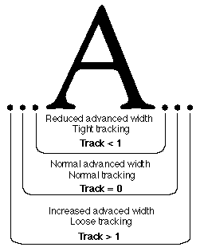
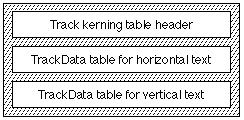

# “trak”表

## 简介

跟踪表（标签：“trak”）允许您设计 AAT 字体，以便调整正常的字形间距。间距基于字体大小和轨道号。用户或应用程序选择字体大小和轨道号，然后计算字体中每个字形的正确字形间距量并将其应用于文本。您在跟踪表中指定的信息用于计算字体所有字形大小的适当间距量。

跟踪类似于字距调整。跟踪通过使用点大小和指定的轨道号进行计算来确定字形间距调整，从而控制间距量。相同的调整适用于字体中的所有字形。相比之下，字距调整考虑两个或多个相邻字形的身份，以选择预定的字形间距调整值。

下图显示了跟踪如何根据轨道值调整字形的高级宽度以实现紧密、正常和松散的文本。

前进宽度的减少或增加量由存储在跟踪表中的每尺寸轨道值决定。如果存储了所需的点大小和轨道号，则使用这些值。如果在跟踪表中找不到所需的点大小和轨道号，则执行插值或外推以确定对指定字体大小和跟踪号所需的前进宽度的调整。

每尺寸轨道值在 FUnits 表中指定。对于每 em 有 2048 个单位的字体，FUnit 值为 10 为 10/2048 = 4.88E-3 ems。在跟踪期间，存储或计算的 FUnit 值（以 ems 为单位）乘以点大小，并添加到每个字形的前进宽度中。如果值为负，则前进宽度减少。如果值为正，则前进宽度增加。

您创建的跟踪表应至少具有两种字体大小的轨道号 -1、0 和 +1 的每尺寸跟踪值。表中还可以包含其他字体大小。跟踪号是任意的，但应使用值 -1、0 和 +1 分别表示松散、正常和紧密跟踪。

跟踪表允许您交叉引用与您在表中包含的每个轨道号相关的描述性短语。这些非功能性短语包含在名称表中（标签名称“名称”）。这些短语作为 nameRecord[count] 的 nameID 包含在内，其中 count 是名称记录的顺序号。跟踪表提供对名称表中计数值的交叉引用。轨道大小 -1、0 和 -1 的可能名称可能是松散、正常和紧密。类似的短语也可用于描述字体的特征。请参阅下面的示例以进一步说明。

## 跟踪表格式

跟踪表的整体结构由跟踪头、水平文本的跟踪数据表和垂直文本的跟踪数据表组成，如下图所示。由于水平表和垂直表都提供了偏移量，因此它们的顺序是任意的。

总体跟踪表格式如下：

类型|名称|描述
|-|-|-|
|fixed|version|跟踪表的版本号（当前版本为 0x00010000）。|
|uint16|format|跟踪表的格式（设置为 0）。|
|uint16|horizOffset|水平文本从跟踪表开头到 TrackData 的偏移量（如果没有则为 0）。|
|uint16|vertOffset|垂直文本从跟踪表开头到 TrackData 的偏移量（如果没有则为 0）。|
|uint16|reserved|保留。设置为 0。|
|TrackData|horizData|水平文本的 TrackData（如果存在）。|
|TrackData|vertData|垂直文本的 TrackData（如果存在）。|

TrackData表格式（必须是长字对齐）如下表所示：

类型|名称|描述
|-|-|-|
|uint16|nTracks|此表中包含的单独轨道数。
|uint16|nSizes|此表中包含的点大小数。
|uint32|sizeTableOffset|从跟踪表的开头到大小子表的开头的偏移量。
|trackTableEntry|trackTable[]|TrackTableEntry 记录的 Array[nTracks]。
|fixed32|sizeTable[]|大小值的 Array[nSizes]。

trackTableEntry格式如下：

类型|名称|描述
|-|-|-|
|fixed32|track|此记录的轨道值。
|uint16|nameIndex|此轨道的“名称”表索引（一个简短的单词或短语，如“loose”或“very tight”）。NameIndex 的值大于 255 且小于 32768。
|uint16|offset|从跟踪表开头到此轨道的每个大小跟踪值的偏移量。

## 跟踪表示例

以下是具有三个轨道的跟踪表示例（正常为 0、紧密为 -1、松散为 +1）。每个轨道的 12 点和 24 点文本均指定了按尺寸的跟踪值。下表总结了此示例的数据：

轨道|字体大小|FUnits
|-|-|-|
|-1|12|-15
|-1|24-7
|0|12|0
|0|24|0
|+1|12|50
|+1|24|20

本示例的跟踪表如下：

<table border="1" cellspacing="2" cellpadding="0">
		<tbody><tr align="left" valign="middle">
		<th align="middle">
			
偏移/ 
			长度

		</th>
		<th align="middle">
			
值

		</th>
		<th align="middle">
			
名称

		</th>
		<th align="left">
			
注释

		</th>
		</tr>
		<tr align="left" valign="middle">
		<td>0/4</td>
		<td>0x00010000</td>
		<td>version</td>
		<td class="description">跟踪表的版本号，采用定点格式。</td>
		</tr>
		<tr align="left" valign="middle">
		<td>4/2</td>
		<td>0</td>
		<td>format</td>
		<td class="description">格式 0 是此时定义的唯一格式。</td>
		</tr>
		<tr align="left" valign="middle">
		<td>6/2</td>
		<td>12</td>
		<td>horizOffset</td>
		<td class="description">水平文本的 TrackData 偏移量。</td>
		</tr>
		<tr align="left" valign="middle">
		<td>8/2</td>
		<td>0</td>
		<td>vertOffset</td>
		<td class="description">垂直文本的 TrackData 偏移量（值 0 表示无）</td>
		</tr>
		<tr align="left" valign="middle">
		<td>10/2</td>
		<td>0</td>
		<td>（源文档这里有些问题）</td>
		<!-- 源文档有些问题 -->
		<td class="description">(pad word) 填充保证以下。 TrackData 表是长字对齐的。</td>
		</tr>
		<tr align="left" valign="middle">
		<td colspan="4">（接下来是水平文本的 <code>TrackData</code>）</td>
		</tr>
		<tr align="left" valign="middle">
		<td>12/2</td>
		<td>3</td>
		<td>nTracks</td>
		<td class="description">包含的曲目数量。</td>
		</tr>
		<tr align="left" valign="middle">
		<td>14/2</td>
		<td>2</td>
		<td>nSizes</td>
		<td class="description">每个轨道的字体大小数。</td>
		</tr>
		<tr align="left" valign="middle">
		<td>16/4</td>
		<td>44</td>
		<td>sizeTableOffset</td>
		<td class="description">大小子表的偏移量。</td>
		</tr>
		<tr align="left" valign="middle">
		<td colspan="4">（三个排序的 <code>TrackTableEntry</code> 记录如下）</td>
		</tr>
		<tr align="left" valign="middle">
		<td>20/4</td>
		<td>0xFFFF0000</td>
		<td>track</td>
		<td class="description">-1 的定点表示（三个轨道中的第一个）。</td>
		</tr>
		<tr align="left" valign="middle">
		<td>24/2</td>
		<td>256</td>
		<td>nameIndex</td>
		<td class="description">描述性字符串“tight”的“名称”表索引。</td>
		</tr>
		<tr align="left" valign="middle">
		<td>26/2</td>
		<td>52</td>
		<td>offset</td>
		<td class="description">轨道编号 -1 的两个按尺寸跟踪值的偏移量。</td>
		</tr>
		<tr align="left" valign="middle">
		<td>28/4</td>
		<td>0x00000000</td>
		<td>track</td>
		<td class="description">0 的定点表示（三个轨道中的第二个）。</td>
		</tr>
		<tr align="left" valign="middle">
		<td>32/2</td>
		<td>258</td>
		<td>nameIndex</td>
		<td class="description">描述性字符串“normal”的“name”表索引。</td>
		</tr>
		<tr align="left" valign="middle">
		<td>34/2</td>
		<td>60</td>
		<td>offset</td>
		<td class="description">轨道编号 0 的两个按尺寸跟踪值的偏移量。</td>
		</tr>
		<tr align="left" valign="middle">
		<td>38/4</td>
		<td>0x00010000</td>
		<td>track</td>
		<td class="description">+1 的定点表示（三个轨道中的第三个）。</td>
		</tr>
		<tr align="left" valign="middle">
		<td>40/2</td>
		<td>257</td>
		<td>nameIndex</td>
		<td class="description">描述性字符串“loose”的“名称”表索引。</td>
		</tr>
		<tr align="left" valign="middle">
		<td>42/2</td>
		<td>56</td>
		<td>offset</td>
		<td class="description">轨道编号的两个按尺寸跟踪值的偏移量 +1。</td>
		</tr>
		<tr align="left" valign="middle">
		<td colspan="4">（接下来是大小子表[即 <code>sizeTable</code> 数组]）</td>
		</tr>
		<tr align="left" valign="middle">
		<td>44/4</td>
		<td>0x000C0000</td>
		<td>sizeTable[1]</td>
		<td class="description">12 点的定点表示。</td>
		</tr>
		<tr align="left" valign="middle">
		<td>48/4</td>
		<td>0x00180000</td>
		<td>sizeTable[2]</td>
		<td class="description">24 点的定点表示。</td>
		</tr>
		<tr align="left" valign="middle">
		<td colspan="4">（最后包含 <code>TrackTableEntry</code> 记录中包含偏移量的按尺寸跟踪值）</td>
		</tr>
		<tr align="left" valign="middle">
		<td>52/2</td>
		<td>-15</td>
		<td>value</td>
		<td class="description">FUnits 紧密跟踪 12 点。</td>
		</tr>
		<tr align="left" valign="middle">
		<td>54/2</td>
		<td>-7</td>
		<td>value</td>
		<td class="description">24 点紧密跟踪的 FUnits。</td>
		</tr>
		<tr align="left" valign="middle">
		<td>56/2</td>
		<td>50</td>
		<td>value</td>
		<td class="description">12 点松动跟踪的 F 单位。</td>
		</tr>
		<tr align="left" valign="middle">
		<td>58/2</td>
		<td>20</td>
		<td>value</td>
		<td class="description">24 点松散跟踪的 FUnits。</td>
		</tr>
		<tr align="left" valign="middle">
		<td>60/2</td>
		<td>0</td>
		<td>value</td>
		<td class="description">12 点正常跟踪的 F 单位。</td>
		</tr>
		<tr align="left" valign="middle">
		<td>62/2</td>
		<td>0</td>
		<td>value</td>
		<td class="description">24 点正常跟踪的 F 单位。</td>
		</tr>
	</tbody></table>