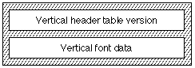

# “vhea”表

## 一般表信息

垂直标题表（标签名称：“vhea”）包含垂直字体所需的信息。垂直字体的字形要么从上到下书写，要么从下到上书写。此表包含与整个字体相关的一般信息。与特定字形相关的信息在垂直度量表（标签名称：“vmtx”）中给出。

垂直标题表中的数据必须与垂直度量表中出现的数据一致。垂直度量表中的前进高度和顶部侧边距值必须与垂直标题表中的最大前进高度和最小底部侧边距值相对应。

注意：本章中的材料仅适用于 TrueType 字体。

## 垂直标题表格式

垂直标题表由垂直标题表版本和垂直字体数据组成。垂直标题表的整体结构如下图所示：

垂直表头格式如下：

类型|名称|描述
|-|-|-|
|fixed32|version|垂直标题表的版本号（当前版本为 0x00011000）。|
|int16|vertTypoAscender|此字体的垂直印刷上升部。它是从垂直中心基线到设计空间右侧的距离（以 FUnits 为单位）。这通常设置为全宽字形水平前进的一半。例如，如果全宽为 1000 FUnits，则此字段将设置为 500。|
|int16|vertTypoDescender|此字体的垂直印刷下降部。它是从垂直中心基线到设计空间左侧的距离（以 FUnits 为单位）。这通常设置为全宽字形水平前进的一半。例如，如果全宽为 1000 FUnits，则此字段将设置为 -500。|
|int16|vertTypoLineGap|此字体的垂直印刷线间隙。|
|int16|advanceHeightMax|字体中发现的最大前进高度测量值（以 FUnits 为单位）。此值必须与垂直度量表中的条目一致。|
|int16|minTopSideBearing|字体中发现的最小顶部方位测量值（以 FUnits 为单位）。此值必须与垂直度量表中的条目一致。|
|int16|minBottomSideBearing|字体中发现的最小底部方位测量值（以 FUnits 为单位）。此值必须与垂直度量表中的条目一致。|
|int16|yMaxExtent|定义为 minTopSideBearing 字段的值加上 yMin 字段的值减去 yMax 字段的值的结果。|
|int16|caretSlopeRise|caretSlopeRise 字段的值除以 caretSlopeRun 字段的值可确定插入符号的斜率。0 表示上升，1 表示运行，表示水平插入符号。上升值 1 和运行值 0 指定垂直插入符号。对于字形为倾斜或斜体的字体，上升值介于 0 和运行值 1 之间是理想的。对于垂直字体，水平插入符号最好。|
|int16|caretSlopeRun|请参阅 caretSlopeRise 字段。非倾斜字体的值 = 0。|
|int16|caretOffset|倾斜字形上的高亮部分需要从字形移开的量，以便产生最佳外观。对于非倾斜字体，将值设置为 0。|
|int16|保留|设置为 0。|
|int16|保留|设置为 0。|
|int16|保留|设置为 0。|
|int16|保留|设置为 0。|
|int16|metricDataFormat|设置为 0。|
|uint16|numOfLongVerMetrics|垂直度量表中的前进高度数。|

## 垂直标题表示例

下表显示了垂直字体的垂直标题表示例。

|偏移/长度|值|名称|注释|
|-|-|-|-|
|0/4|0x00010000|version|垂直标题表的版本号，采用定点格式。
|4/2|1024|vertTypoAscender|em-square 高度的一半。
|6/2|-1024|vertTypoDescender|em-square 高度减去一半
|8/2|0|vertTypoLineGap|印刷行间隙为 0 FUnits。
|10/2|2079|advanceHeightMax|字体中发现的最大前进高度测量值为 2079 FUnits。
|12/2|-342|minTopSideBearing|字体中发现的最小顶部侧轴承测量值为 -342 FUnits。
|14/2|-333|minBottomSideBearing|字体中发现的最小底部侧轴承测量值为 -333 FUnits。
|16/2|2036|yMaxExtent|minTopSideBearing 字段加上 yMin 字段值减去 yMax 字段值的结果，结果为 2036。
|18/2|0|caretSlopeRise|插入符号斜率上升 0 且插入符号斜率为 1 表示垂直字体的水平插入符号。
|20/2|1|caretSlopeRun|插入符号斜率上升 0 且插入符号斜率为 1 表示垂直字体的水平插入符号。
|22/2|0|caretOffset|对于非倾斜字体，值设置为 0。
|24/4|0|保留|设置为 0。
|26/2|0|保留|设置为 0。
|28/2|0|保留|设置为 0。
|30/2|0|保留|设置为 0。
|32/2|0|metricDataFormat|设置为 0。
|34/2|258|numOfLongVerMetrics|垂直度量表中的前进高度数量为 258。

应用程序可以通过以下表达式确定 OpenType 字体单倍行距垂直文本的推荐行距：

vhea.vertTypoAscender - vhea.vertTypoDescender + vhea.vertTypoLineGap

应用程序可以使用此值作为默认垂直行距。

## 依赖项

垂直度量表使用垂直标题表的 numOfLongVerMetrics 字段中的信息。此数字不得大于字体中的字形总数，在最大配置文件表中定义。
