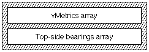

# “vmtx”表

## 简介

垂直度量表（标签名称：“vmtx”）允许您指定 AAT 垂直字体中每个字形的垂直间距。此表由一个或两个数组组成，其中包含字体中每个字形的垂直布局的度量信息（前进高度和顶部方位）。垂直度量坐标系如下图所示：

* **注意：** 本章中的材料仅适用于 TrueType 字体。

AAT 垂直字体需要垂直标题表（标签名称：'vhea'）和垂直度量表。垂直标题表包含与整个字体相关的通用信息。垂直度量表包含与特定字形相关的信息。

## 垂直指标表格式

垂直度量表的整体结构由下图所示的两个数组组成。此表没有表头，但要求两个数组中包含的字形数量等于字体中的字形总数。可以使用该表的简短版本来容纳所有前进高度都相等的字体。

vMetrics 数组包含每个条目的两个值。这些是数组中包含的每个字形的前进高度和顶部方位。

vMetrics 数组中的条目数由垂直标题表的 numOfLongVerMetrics 字段的值决定。

在等宽字体（如 Courier 或 kanji）中，所有字形都具有相同的前进高度。如果字体是等宽的，则第一个数组中只需要一个条目，但该条目是必需的。

垂直度量数组中条目的格式如下：

类型|名称|描述
|-|-|-|
|uint16|advanceHeight|字形的前进高度。FUnits 中的有符号整数。
|int16|topSideBearing|字形的顶部侧边距。FUnits 中的有符号整数

第二个数组是可选的，通常用于字体中的等宽字形。每个字体只允许一个这样的字形，并且它必须位于字体的末尾。此数组包含第一个数组中未表示的字形的顶部方位，并且您必须假设此数组中的所有字形都具有与 vMetrics 数组中最后一个条目相同的前进高度。因此，此数组中的所有条目都是等宽的。

此数组中的条目数是通过从字体中的字形数量中减去 numOfLongVerMetrics 的值来计算的。因此，第一个数组中表示的字形加上第二个数组中表示的字形的总和等于字体中的字形数量。顶部方位数组的格式如下：

类型|名称|描述
|-|-|-|
|int16|topSideBearing[]\字形的顶部边距。FUnits 中的有符号整数

## 垂直度量表示例

此示例字体有 258 个字形，垂直标题表中 numOfLongVerMetrics 的值为 258。因此，vMetrics 数组中的 <advance height, top-side bearing> 对的数量为 258。

top-side bearing 数组中的条目数由字形数 (258) 减去 numOfLongVerMetrics (258) 得出。对于此示例，这相当于 258 - 258 = 0；因此，第二个数组中没有任何条目。

vMetrics 数组中的每个条目长度为 2 个字节。由于每个字形有 2 个条目，共有 258 个字形，因此此垂直度量表的大小为 2 * 2 * 258 = 1032 个字节。

下表显示了此字体的垂直度量表数据示例。

|字形索引|前部高度|顶侧支撑|
|-|-|-|
|0|1673|102|
|1|204|102|
|2|204|102|
|...|...|...|
|257|1716|102|

下表显示了此示例字体的垂直度量表。

<table border="1" cellspacing="2" cellpadding="0">
		<tbody><tr align="left" valign="middle">
		<th align="middle">
			
偏移/ 
			长度

		</th>
		<th align="middle">
			
值

		</th>
		<th align="middle">
			
名称

		</th>
		<th align="left">
			
注释

		</th>
		</tr>
		<tr align="left" valign="middle">
		<td>0/2</td>
		<td>1673</td>
		<td>advanceHeight[1]</td>
		<td class="description">字形索引 1 的向前高度。</td>
		</tr>
		<tr align="left" valign="middle">
		<td>2/2</td>
		<td>102</td>
		<td>topSideBearing[1]</td>
		<td class="description">字形索引 1 的顶部支撑。</td>
		</tr>
		<tr align="left" valign="middle">
		<td>4/2</td>
		<td>204</td>
		<td>advanceHeight[2]</td>
		<td class="description">字形索引 2 的向前高度。</td>
		</tr>
		<tr align="left" valign="middle">
		<td>6/2</td>
		<td>102</td>
		<td>topSideBearing[2]</td>
		<td class="description">字形索引 2 的顶部支撑。</td>
		</tr>
		<tr align="left" valign="middle">
		<td>8/2</td>
		<td>204</td>
		<td>advanceHeight[3]</td>
		<td class="description">字形索引 3 的向前高度。</td>
		</tr>
		<tr align="left" valign="middle">
		<td>10/2</td>
		<td>102</td>
		<td>topSideBearing[3]</td>
		<td class="description">字形索引 3 的顶部支撑。</td>
		</tr>
		<tr align="left" valign="middle">
		<td colspan="4" class="description">（该数组持续字形 4 到 257。这部分数组未在此处显示）</td>
		</tr>
		<tr align="left" valign="middle">
		<td>1028/2</td>
		<td>1716</td>
		<td>advanceHeight[258]</td>
		<td class="description">字形索引 258 的向前高度。</td>
		</tr>
		<tr align="left" valign="middle">
		<td>1030/2</td>
		<td>102</td>
		<td>topSideBearing[258]</td>
		<td class="description">字形索引 258 的顶部方位。这是字体中的最后一个字形。</td>
		</tr>
	</tbody></table>