## 介绍

本章概述了理解 TrueType 字体引擎所需的关键概念，该软件将 TrueType 字体中的信息转换为适合在屏幕或打印机上显示的光栅图像。

## 字体引擎的工作原理
光栅化字形轮廓是一个多步骤过程，其过程如下：

* 字形的主轮廓描述被缩放到适当的大小。
* 缩放的轮廓根据其相关说明进行网格拟合。
* 适合网格的轮廓被扫描转换以产生适合光栅显示的位图图像。

图 1 说明了这个过程。

**图1** 字体引擎的工作

**主要外轮廓**
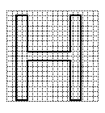

**1 比例轮廓**
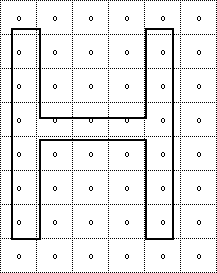

**2格拟合轮廓**
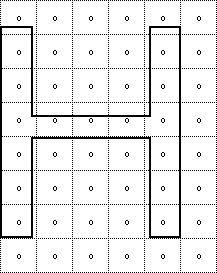

**3 光栅图像**

## 缩放主轮廓

TrueType 字体存储每个字形的主轮廓描述。 当应用程序为特定设备请求特定大小的特定字形时，字体引擎将创建必要的位图。

此过程的第一步是将主轮廓缩放到所需的大小。 缩放轮廓是字体引擎中称为缩放器的部分的工作。 当主轮廓被缩放时，构成字形轮廓的点从与设备无关的 em 单位更改为与设备相关的 26.6 固定点数，表示像素网格中的位置。 在接下来的文本中，显示为网格坐标的主轮廓点将在坐标编号上方有一个条，如 (x~,y~)。

一个缩放的轮廓点可以占据任何可以表示为 64 个像素的位置（即，作为 26.6 的定点数）。 仍处于其原始轮廓位置的缩放坐标（即，尚未通过指令进行网格拟合）将在坐标上显示一个波浪号，如 (x~, y~)。 表示为最接近像素的 64 分之一的点坐标将显示为用冒号分隔坐标的整数部分和小数部分。 因此，在这个符号中，一个又一个半像素将被写为 1:32。

像素中心始终位于两条半网格线的交点处。 点 (2:32, 7:32) 占据像素中心，而点 (3:0, 4:0) 则不占据。 像素与网格的关系如图 2 所示。

**图 2** 像素和网格

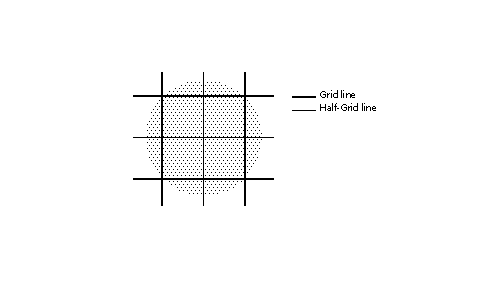

### 将单位转换为像素

标量通过将主坐标系中的值乘以比例将它们转换为像素坐标系中的值。 这个比例是：

pointSize * resolution / (72 points per inch * units_per_em).

其中 pointSize 是要显示字形的大小，resolution 是输出设备的分辨率，units per em 是最初定义主轮廓的网格的分辨率。 分母中的 72 代表每英寸的点数。

例如，假设一个字形特征的长度为 550 FUnits，并在一个主网格上定义，每个 em 有 2048 个单位。 下面的计算表明它在 72 dpi 屏幕上 18 点的大小为 4.83 像素。

```
550 * [(18 * 72 )/ (72 * 2048 )] = 4.83
```

### 创建原点和前进点

缩放器使用字体文件中“hdmx”表中的数据创建两个附加点。 这些点代表字形的起点和前进宽度。 原点是笔的原始位置。 想象一下，笔移动左侧方位距离，绘制字形，将笔从原点移动前进宽度，现在就位以开始下一个字形。 这个位置是前进点。 起始点和前进点可通过指令访问。 如果给定字形中的点从 0 到 n-1 编号，则原点的编号为 n，前进点的编号为 n+1。

**图 3** 添加了原点和前进点的字形轮廓

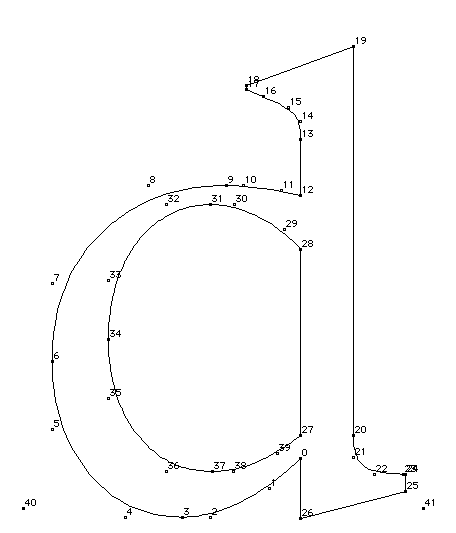

### 网格拟合缩放的轮廓

一旦将特定字形的主轮廓缩放到所需的大小和设备，就可以执行与该字形相关的指令。 指示字形的两个关键目标是消除机会关系对网格的影响并控制关键维度。 有关更多信息，请参阅[使用字体](./instructing_fonts.md)。

如前所述，执行字形指令的一个关键效果是将描述字形的缩放轮廓点移动到新位置。 一旦如此移动，点就被称为网格拟合。 它们的坐标在坐标网格中表示为 (x,y) 位置。

由于指令在主轮廓缩放后运行，因此它们的效果取决于所请求字形的实际大小和分辨率。 图 4 显示了一个母版轮廓和两个通过执行相关的字形指令从该母版生成的网格拟合轮廓。 通过首先将主轮廓缩放到每 em 12 个像素然后执行字形指令生成的网格拟合轮廓不同于首先将主轮廓缩放到每 em 18 个像素然后执行字形指令生成的网格拟合轮廓。

说明不需要特定于大小或分辨率，因为它们引用原始主大纲中存在的点。 它们的动作基于对字形特征的几何分析，并且与大小和分辨率无关。 此规则的例外是本章后面描述的特定于大小和分辨率的 DELTA 指令。

**图 4** 缩放然后网格拟合主轮廓

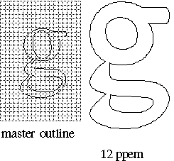

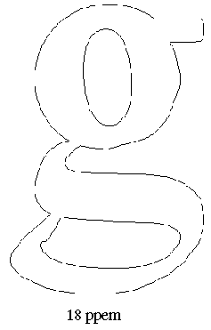

### 扫描转换网格拟合的轮廓

一旦主轮廓被缩放并适合网格，它就可以被扫描转换器光栅化。 扫描转换器采用网格拟合轮廓并应用一组规则来确定当打印或显示在屏幕上时哪些像素将成为字形图像的一部分。

第一条规则如下：

规则 1：如果一个像素的中心位于字形轮廓之内或之上，则该像素被打开并成为字形位图图像的一部分。

### 区分字形的内部和外部
扫描转换器面临的一个关键问题是确定像素中心落在“字形轮廓内或字形轮廓上”意味着什么。 有时这似乎很明显，但复杂的字形会使这个看似直截了当的问题变得困难。

TrueType 扫描转换器通过使用非零缠绕数(non-zero winding number)规则来区分字形的内部和外部，从而解决了这个问题。 该规则如下：

*具有非零绕组数的点位于字形内部。 所有其他点都在字形之外。*

下面介绍的四个步骤构成了一种确定点的绕组数的方法。

1. 从所讨论的点向无穷远画一条射线。 （光线指向的方向并不重要。）
2. 从零计数开始。
3. 每次字形轮廓从右到左或从下到上穿过射线时，计数加一。 （这种交叉被称为 on-transition，因为 TrueType 扫描转换器从左到右，从下到上扫描。）
4. 每当字形的轮廓从左到右或从上到下穿过射线时，从计数中减一。 （这种交叉称为非过渡。）
5. 如果最终计数不为零，则该点是内部点。 否则，它是一个外点。

可以通过查看定义轮廓的点号来确定轮廓的方向。 它的方向是从较低的点号向较高的点号。

图 5 显示了一个转换。这里的轮廓从底部到顶部穿过射线。

**图 5** 转换

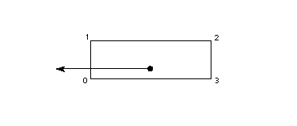

图 6 显示了一个关闭过渡。这里的轮廓从左到右穿过光线。

**图 6** 关闭转换

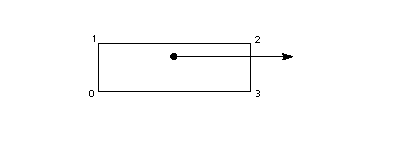

图 7 演示了在确定点是否在字形内时使用绕组数。 考虑到问题中的每一点，可以说如下：

* 点 <cite>p<sub>1</sub></cite> 和 <cite>p<sub>4</sub></cite> 每个都经历一个单独的过渡，给它们非零的绕组数。 它们是内部点。
* 点 <cite>p<sub>2</sub></cite> under 进行一个关闭转换，然后是一个开启转换，使其绕组数为零。 这是一个外部点。
* 点 <cite>p<sub>3</sub></cite> 和 <cite>p<sub>5</sub></cite> 说明了正确设置曲线方向的重要性。 点 <cite>p<sub>3</sub></cite> 经历了一个 on 转换，然后是一个 off 转换，绕组数为*零。 这是一个外部点。
* 另一方面，点 <cite>p<sub>5</sub></cite> 经历了一次关闭转换，然后是第二次关闭转换，使其绕组数为 2。它是一个内部点。

**图 7** 内点和外点

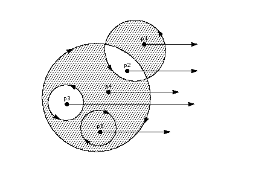

### 使用扫描转换器控制丢失

TrueType 指令旨在使网格拟合字形成为可能，这样无论点大小或使用的转换如何，规则 1 都将打开所需的像素。 通常很难预见一个字形可能经历的所有可能的转换。 这一事实使得很难指示字形以确保对于每个所需的转换都会发生适当的网格拟合轮廓失真。 对于以每 em 尺寸非常小的像素显示的复杂字形来说，这通常是一个问题。 在这些情况下，字形的某些再现可能包含丢失（渲染位图中的孔或间隙）。 在这种情况下，可能需要使用交替扫描转换模式。

如果需要，字体创建者可以通过将扫描转换器模式从默认设置更改为丢弃控制模式来调用两个额外的扫描转换规则。 关于使用哪种扫描转换器模式的决定可以在字体范围内或逐个字形的基础上做出。

扫描转换模式的选择是通过设置图形状态变量扫描控制的值来进行的。 解释器在确定是否使用 dropout 控制模式时会考虑三个条件中的每一个：

* 字形是否旋转？
* 字形是否被拉伸？
* ppem 的当前设置是否小于指定的 ppem 值？
也可以完全关闭 dropout 控制。

更改扫描控制的值是使用 SCANCTRL[] 指令完成的任务。 请参阅 SCANENTRAL[] SCAN 转换控制。 有关更改扫描控制值的更多信息。

要了解 dropout 控制扫描转换规则，重要的是要知道扫描线是扫过字形表面的水平线或垂直线。 水平和垂直扫描线的交点确定像素中心。

**图 8** 相邻像素

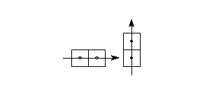

每当字形内部有一个连接区域包含两个黑色像素，而这两个黑色像素不能通过仅通过黑色像素的线连接时，就会发生丢失。 可以通过查看连接两个相邻像素中心的假想线段来测试潜在的丢失。 如果此线段同时与过渡轮廓线和过渡轮廓线相交，则存在潜在的丢失情况。 仅当两条轮廓线在两个方向上继续以切割相邻像素中心之间的其他线段时，潜在的丢失才成为实际的丢失。 这种情况如图 9 所示。

**图 9** 导致两次丢失的情况

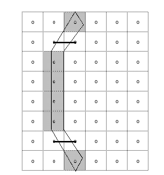

在穿过扫描线后立即连接在一起的两条线或曲线形成短截线。 存根不会导致丢失，但可能会导致字形的词干比预期的要短。 这种情况如图 10 所示。

**图 10** 一个 stub

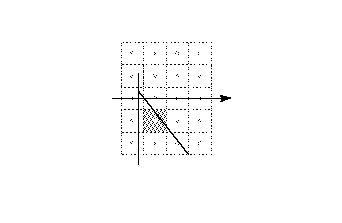

扫描转换器可以在 dropout 和 stub 都被填充的模式下运行。在 dropout 和 stub 控制模式（扫描转换器模式 0）中采用的规则如下所示。

*规则 2a：如果连接两个相邻像素中心的水平扫描线同时被一个过渡轮廓和非过渡轮廓相交，并且两个像素都没有按照规则 1 打开，则打开最左边的像素 .*

*规则 2b：如果连接两个相邻像素中心的垂直扫描线同时与过渡轮廓和非过渡轮廓相交，并且两个像素都没有按照规则 1 打开，则打开最底部的像素 .*

扫描转换器也可以在只填充dropout而stub保持原样的模式下操作（扫描转换器模式1）。 规则 3a 和 3b 描述了它在这种模式下的操作。

*规则 3a：如果连接两个相邻像素中心的水平扫描线同时被一个过渡轮廓和非过渡轮廓相交，则规则 1 中没有一个像素已经打开，并且这两个轮廓继续与另一个轮廓相交 扫描线（这不是stub），打开最左边的像素。*

*规则 3b：如果连接两个相邻像素中心的垂直扫描线同时与过渡轮廓和非过渡轮廓相交，则规则 1 中没有一个像素已经打开，并且这两个轮廓继续与另一个轮廓相交 扫描线（这不是stub），打开最底部的像素。*

检查与定义其边界的相交扫描线形成正方形的扫描线段以验证它们被两个轮廓相交。 这些轮廓可能与与 dropout 扫描线段相交的轮廓不同。 这是非常不可能的，但可能必须通过一些奇异字形中的网格拟合来控制。

## 解释器环境

解释器是 TrueType 解释器的一部分，它执行在字体文件中找到的指令。

### 可以使用说明的地方

指令可以与特定字形相关联，也可以与整个字体相关联。 与特定字形相关的指令称为字形程序。 指令也可用于*字体程序和控制值程序*。

字体程序（在字体文件的“fpgm”表中找到）是一组执行一次的指令，这是应用程序第一次访问字体时。 字体程序用于创建函数定义（参见“FDEF[] Function DEFinition”）和指令定义（参见“IDEF[] Instruction DEFinition”）。 字体程序中定义的功能和指令可以在各个字形程序中访问。 另请参阅“示例字体程序”。

控制值程序是每次点大小或变换发生变化时执行的指令序列。 这些指令存储在字体文件的“准备”表中。 控制值程序用于进行字体范围的更改，而不是管理单个字形。 另请参阅“控制值程序示例”。

属于字形程序的指令存储在字体文件的“glyf”表中。 每次请求字形时都会执行与字形相关的指令。

### 指令名称

指令由它们的操作码唯一指定，但更常见的是它们的名称。

指令名称的格式为 MNEMONIC[flag]，其中助记符旨在帮助记住指令的功能。 例如，MDAP[a] 指令中的 MDAP 代表 Move Direct Absolute Point。 同样，RUTG[ ] 是 Round Up To Grid 的缩写。

密切相关的指令有时共用一个名称。 此类名称可以使用一组关联的标志映射到唯一的操作码。 要计算指令变体的操作码，请将标志表示的无符号二进制数添加到文档中给出的两个操作码值中的较低值。 在执行此操作时，请注意最左边的位是最重要的。

指令名称后面的标志也用于定义每个指令变体的语义。 二进制数被分解为一系列标志。 设置为 1 的标志表示 TRUE。 设置为 0 的标志表示 FALSE。 二进制数字也可以分组，以便在更复杂的选项中进行选择。 在这种情况下，文档指定了与每个可能的数字组合相关的含义。

### 图形状态

图形状态由一组指导解释器动作的变量组成。 本章将根据需要介绍图形状态变量。 图形状态变量的完整列表可以在“图形状态”中找到。

图形状态变量都具有在任何字体解释开始时建立的默认值。 给定图形状态变量的默认值在开始解释任何字形时重新建立。 换句话说，图形状态没有字形间内存。 在处理单个字形时更改图形状态变量的值将产生仅对该字形有效的更改。

要为图形状态变量建立新的默认值，必须在控制值程序中更改该变量的值。 除非使用 INSTCTRL[] 来禁止这些新值，否则在控制值程序中所做的更改将应用于所有随后处理的字形。

指令可用于更改每个图形状态变量的值。 更改图形状态变量值的指令有时具有以单词 set 开头的名称。 （设置循环状态的指令是此规则的一个例外。）新值应位于堆栈顶部。

设置图形状态变量值的指令列于表 1。

**表 1** 设置图形状态值

|图形状态变量|助记符|操作说明|
|-|-|-|
|自由 & 投影矢量|将向量设置为坐标轴|[SVTCA[a]]()|
|投影向量|将投影向量设置为坐标轴|[SPVTCA[a]]()|
|自由向量|将自由向量设置为坐标轴|[SFVTCA[a]]()|
|投影向量|将投影向量设置为线|[SPVTL[a]]()|
|自由向量|将自由向量设置为线|[SFVTL[a]]()|
|自由向量|将自由向量设置为投影向量|[SFVTPV[]]()|
|双投影向量|将双投影矢量设置为线|[SDPVTL[]]()|
|投影向量|将投影向量设置为线|[SVPTL[]]()|
|投影向量|从堆栈设置投影向量|[SPVFS[]]()|
|自由向量|从堆栈中设置自由向量|[SFVFS[]]()|
|rp0|设置参考点 0|[SRP0[]]()|
|rp1|设置参考点 1|[SRP1[]]()|
|rp2|设置参考点 2|[SRP2[]]()|
|zp0|设置区域指针 0|[SZP0[]]()|
|zp1|设置区域指针 1|[SZP1[]]()|
|zp0, zp1, zp2|Set Zone PointerS|[SZPS[]]()|
|圆形状态|圆形到半网格|[RTHG[]]()|
|圆形状态|圆形到网格|[RTG[]]()|
|圆形状态|圆形到双网格|[RTDG[]]()|
|圆形状态|向上舍入到网格|[RUTG[]]()|
|圆形状态|向下舍入到网格|[RDTG[]]()|
|圆形状态|设置四舍五入|[ROFF[]]()|
|圆形状态|超级圆|[SROUND[]]()|
|圆形状态|超级 45 圆|[S45ROUND[]]()|
|环形|设置循环|[SLOOP[]]()|
|单宽切入|设置单宽切入|[SSWCI[]]()|
|控制值切入|设置控制值表切入|[SSWCI[]]()|
|最小距离|设置最小距离|[SMD[]]()|

有两条指令可分别获取自由向量和投影向量的值。 检索状态变量值的指令具有以单词 get 开头的名称。 获取指令将通过将该值放在堆栈顶部来返回相关状态变量的值。

表 2 列出了两个 get 指令。

**表 2：** 获取图形状态变量

|助记符|操作说明|
|-|-|
|获得自由向量(Get Freedom Vector)|[GFV[]]()|
|获取投影向量(Get Projection Vector)|[GPV[]]()|

### 从编译器那里获取信息

提供了三个指令，以便获得有关正在解释的字形的信息以及对指示字形有用的其他数据。 可以使用 GETINFO[ ] 指令请求缩放器版本号。 相同的指令可用于查询字形是否已被拉伸或旋转。 也可以请求当前字形的每 em 点或像素的大小。

**表 3** 获取信息

|助记符|操作说明|
|-|-|
|获取信息(GET INFOrmation)|[GETINFO[]]()|
|测量每个 EM 的像素(Measure Pixels Per EM)|[MPPEM[]]()|
|测量点大小(Measure Point Size)|[MPS[]]()|

## 指令处理

本节描述解释器中对处理指令很重要的那些部分。 它首先描述了包含可以在字体、控制值或字形程序中找到的数据和指令的指令流。 它继续讨论堆栈，解释器获取指令参数并存储指令结果的地方和解释器存储区域，其中可以临时保存值并稍后检索。

### 指令流

构成字体、控制值或字形程序的指令操作码和数据存储为按顺序排列的字节值序列。 从解释器的角度来看，它们代表了一个按顺序排列的字节值流，称为指令流。

指令指针 (IP) 标记要执行的下一条指令。 随着指令的执行，指令流中的操作码和数据逐渐被用完。 指令不能将新数据添加到指令流中。 图 11 显示了指令流，其中指令指针标记了要执行的下一条指令。

**图 11** 指令蒸汽

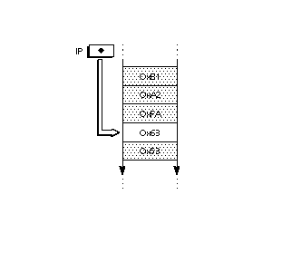

### 改变控制流程

通常，指令流中遇到的操作码是按顺序执行的，但是，执行顺序可以通过一组称为控制指令流的指令来更改。 这些说明列在下表 4 中。

|助记符|操作说明|
|-|-|
|IF test)|[IF[]]()|
|ELSE clause|[	ELSE[]]()|
|End IF|[MPS[]]()|
|跳转相对错误(Jump Relative On False)|[JROF[]]()|
|跳转相对真(Jump Relative On True)|[JROT[]]()|
|跳跃相对(JuMP Relative)|[JMPR[]]()|
|循环和调用(LOOP and CALL)|[LOOPCALL[]]()|

### 堆栈
TrueType 解释器将指令所需的任何数据和指令创建的结果存储在解释器堆栈上。 将数据放在堆栈上称为推送操作。 从堆栈中取出数据称为弹出操作。 压入堆栈的最后一项将始终是弹出的第一项。

堆栈元素总是 32 位宽。 堆栈中使用的数据类型记录在指令集中。 该部分还提供了有关堆栈交互的其他详细信息。

### 将数据从指令流移动到堆栈

一些统称为推送指令的指令将数据从指令流移动到解释器堆栈。 这些指令在 TrueType 指令集中从指令流中获取参数是独一无二的。 所有其他指令从堆栈中获取所需的任何数据。 推送指令总结在下面的表 5 中。

**表 5** 推送指令

|助记符|操作说明|
|-|-|
|PUSH N Bytes|[NPUSHB[]]()|
|PUSH N Words|[NPUSHW[]]()|
|PUSH Bytes|[PUSHB[abc]]()|
|PUSH Words|[PUSHW[abc]]()|

由于指令流是 8 位宽而堆栈是 32 位宽，因此压入堆栈的字节会扩展为 32 位。 当字（16 位数量）被压入堆栈时，它们是从两个字节（指令流中首先出现的高字节）创建的，并且符号扩展为 32 位。

**图 12** 扩展字节值以形成长字

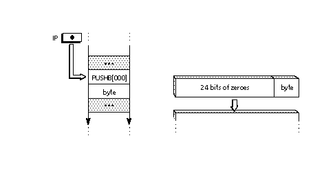

那些推动字的组合两个字节形成一个有符号字，然后对该字进行符号扩展，直到它达到 32 位宽。 当两个字节组合成一个字时，该字的高字节总是出现在指令流中的第一个字节。 低字节是第二个出现的字节。 图 13 显示了如何组合两个指令流字节，然后在将它们压入堆栈时进行符号扩展。

**图 13** 组合字节值以形成符号扩展长字

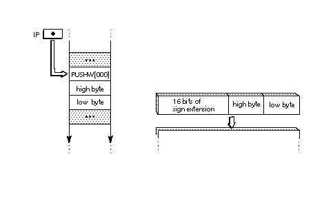

### 管理堆栈

TrueType 提供了基本的堆栈操作操作，可以更改堆栈的内容或重新排序其元素。 这些说明列在下表 6 中。

**表 6：** 管理堆栈

|助记符|操作说明|
|-|-|
|清除堆栈(CLEAR the stack)|[CLEAR[]]()|
|堆栈的深度(DEPTH of the stack)|[DEPTH[]]()|
|重复顶部堆栈元素(DUPlicate top stack element)|[DUP[]]()|
|POP 顶部堆栈元素(POP top stack element)|[POP[]]()|
|复制索引元素(Copy INDEXed element)|[CINDEX[]]()|
|移动索引元素(Move INDEXed element)|[MINDEX[]]()|
|滚动顶部 3 个堆栈元素(ROLL top 3 stack elements)|[ROLL[]]()|
|交换顶部两个堆栈元素(SWAP top two stack elements)|[SWAP[]]()|

### 用循环重复指令

通常在指令流中遇到的一条指令只会执行一次。 一些指令查看循环状态变量并执行该变量指示的次数。 表 7 中列出了使用循环变量的指令。

循环变量的默认值为 1。将循环设置为零或负值是非法的。 使用表 8 中所示的 SLOOP[ ] 指令设置循环变量。

**表 7** 使用循环变量的指令

|助记符|操作说明|
|-|-|
|对齐相对点(Align Relative Point)|[ALIGNRP[]]()|
|翻转点(FLIP PoinT)|[FLIPPT[]]()|
|插值点(Interpolate Point)|[IP[]]()|
|转移点(SHift Point)|[SHP[a]]()|
|移位像素数量(SHift by PIXEL amount)|[SHPIX[]]()|

**表 8** 设置循环变量的值
|助记符|操作说明|
|-|-|
|设置循环(Set LOOP)|[SLOOP[]]()|

### 执行算术

TrueType 指令集提供表 8 中列举的基本算术函数。除非另有说明，否则对 26.6 个定点数进行算术运算，产生 26.6 个定点结果。

**表 9** 执行逻辑操作。

|助记符|操作说明|
|-|-|
|添加(ADD)|[ADD[]]()|
|减去(SUBtract)|[SUB[]]()|
|划分(DIVide)|[DIV[]]()|
|乘(MULtiply)|[MUL[]]()|
|绝对值(ABSolute value)|[ABS[]]()|
|否定(NEGate)|[NEG[]]()|
|FLOOR|[FLOOR[]]()|
|天花板(CEILING)|[CEILING[]]()|
|最大(MAXimum)|[MAX[]]()|
|最小(MINimum)|[MIN[]]()|

### 执行逻辑运算

TrueType 指令集提供了一组基本的逻辑功能。 它们在表 10 中列举。如果结果为 FALSE，这些函数返回零，如果结果为 TRUE，则返回非零值。

**表 10** 执行逻辑操作。

|助记符|操作说明|
|-|-|
|少于(Less Than)|[LT[]]()|
|小于或等于(Less Than or EQual)|[LTEQ[]]()|
|更好(Greater Than)|[GT[]]()|
|大于或等于(Greater Than or EQual)|[GTEQ[]]()|
|平等的(EQual)|[EQ[]]()|
|不相等(Not EQual)|[NEQ[]]()|
|奇数元素(ODD element)|[ODD[]]()|
|偶数元素(EVEN element)|[EVEN[]]()|
|AND|[AND[]]()|
|OR|[OR[]]()|
|NOT|[NOT[]]()|

### 存储区

解释器维护一个存储区域，该存储区域由一部分内存组成，可用于临时存储从解释器堆栈中获取的数据。 可以读取存储数据的值并将新值写入存储。 存储位置范围从 0 到 n-1，其中 n 是在字体文件的“maxp”表中的 maxStorage 条目中建立的值。 值是 32 位数字。

### 读取和写入存储

以下两条指令可以从解释器存储区域中的位置读取值并将新值写入存储位置。

**表 11：** 访问存储

|助记符|操作说明|
|-|-|
|从存储中读取(Read from Storage)|RS[]|
|写入存储(Write to Storage)|WS[]|

## 管理像素网格中的点

TrueType 指令集的关键任务是网格拟合字形轮廓之一，以允许扫描转换器生成用于显示的优质位图图像。 该任务包括通过移动构成其轮廓的点来重塑字形轮廓。 以下部分描述了用于管理像素网格中的点的指令。

### 区域和点

点是网格中的位置。 正如存储在字体文件中一样，点具有以 FUnit 表示的坐标。 这些坐标指的是主网格中的位置。 然而，一旦被字体引擎缩放，点位置表示为 26.6 个固定点数，表示设备特定像素网格中的位置。 也就是说，它们被赋予最接近的像素的 64 分之一。 符号 wn:fp 用于表示点位置，其中 wn 表示整数，fp 表示小数部分。 数字六将写成 6:0。 四分之一的数字将写为 0:16。 方便时，点的位置会用十进制数表示，如2.5表示位置的二分之一。

指令通过指定特定区域中的给定点编号来引用构成字形轮廓的点。 构成当前字形轮廓的点被称为在字形区域（区域 1）中。 这些点在字体文件的“glyf”表中定义。

可以使用指令创建对指示字形有用的第二组点。 据说这些点位于暮光区（0 区）。 0 区中的点由字形程序中的指令创建。 这些点不会在每个字形程序开始时重新初始化，因此每个字形程序在访问它们之前必须确定将这些点设置在所需的位置。

指令不明确引用区域，而是使用三个区域指针中的一个或多个，可以将其设置为两个区域中的任何一个。 如果一条指令使用区域指针 1 (zp1)，则该指令将使用它引用的区域中的点。 它可以指向暮光区域或字形区域。

一些指令将假定它们引用的点位于特定区域指针所引用的区域中。 其他指令需要通过设置标志（即通过使用指令变体）明确指定区域指针。

以下所有内容唯一地指定字形区域中的同一点：

* 字形区域中的第 5 点
* 区域 1 中的点 5
* zp0 指向的区域中的点 5，其中 zp0 指向区域 1
* zp2 指向的区域中的点 5，其中 zp2 指向区域 1
* zp0 中的 rp0，其中 zp0 指向区域 1，而 rp0 的值为 5
* zp2 中的 rp0，其中 zp2 指向区域 1，而 rp0 的值为 5
以下所有内容都指定了暮光区中的同一点

* 暮光区的第 5 点
* 0区中的点5
* zp1 指向的区域中的点 5，其中 zp1 指向区域 0
* zp1 中的 rp0，其中 zp1 指向区域 0，而 rp0 的值为 5
请注意，暮光区域中的点 5 与字形区域中的点 5 不同。

### 设置区域指针

建立区域指针值的指令在表 12 中列出。

**表 12：** 设置区域指针

|助记符|操作说明|
|-|-|
|设置区域指针 0(Set Zone Pointer 0)|[SZPO[]]()
|设置区域指针 1(Set Zone Pointer 1)|[SZP1[]]()
|设置区域指针 2(Set Zone Pointer 2)|[SZP2[]]()
|设置区域指针 S(Set Zone PointerS)|[SZPS[]]()

由于字形区域和暮光区域都从零开始对它们的点进行编号，因此相同的数字可以出现在两个区域中。 为了明确地指定一个点，有必要使用它的编号和它的区域。 例如，字形区域中的点 6 指定一个唯一点。

### 设置参考点

有些指令不是通过编号而是通过参考点设备来参考点。 三个参考点 rp0、rp1 和 rp2 中的每一个都可以与表示点编号的整数相关联。 当该参考点与特定区域相关联时，将明确指定一个点。 表 13 中列出了将参考点设置为点编号的说明。

**表 13** 设置参考点

|助记符|操作说明|
|-|-|
|设置参考点 0|[SRPO[]]()|
|设置参考点 1|[SRP1[]]()|
|设置参考点 2|[SRP2[]]()|

### 转折点

曲线上点可以更改为曲线外点，反之亦然。 可以更改单个点或一系列点。 表 10 列出了翻转点的指令。

**表 14** 翻转点

|助记符|操作说明|
|-|-|
|翻转点(FLIP PoinT)|[FLIPPT[]]()|
|翻转范围(FLIP RanGe ON)|[FLIPRGON[]]()|
|翻转范围关闭(FLIP RanGe OFF)|[FLIPRGOFF[]]()|

### 像素网格中的移动

像素网格中点的移动总是沿着自由向量，一个图形状态变量表示像素网格中的一个向量。 自由向量可以在空间中平移，使其保持相对于坐标系的方向，但通过要移动的点。 按照惯例，自由向量显示为通过要移动的点的虚线。 点沿向量移动。

对于大多数指令，给定的自由向量和它的 180 度对面是等价的。 唯一的例外是 SHPIX[ ] 指令，它测量沿自由向量的距离。 当点沿自由向量移动时，点的移动方向将如图 14 所示。

**图 14** 沿自由向量的移动点

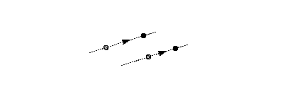

### 获取和设置自由向量

存在一种用于获得自由向量的当前值的指令。 它的值作为一对 (x,y) 坐标返回。 可以通过在堆栈上指定其坐标、将其设置为坐标轴或坐标轴、将其设置为平行或垂直于一条线或将其设置为平行或垂直于投影矢量来设置自由向量。 表 15 列出了设置自由向量的说明。

### 设置和获取点位置

以下部分介绍如何在像素网格中查找点的位置以及如何将其设置为指定位置。

#### 沿投影向量获取点的位置

点的位置表示为沿当前投影向量的位置。 为了理解解释器如何确定一个点的位置，想象一下从那个点到向量的垂线。 在下面的插图中，用于将距离投影到投影矢量上的线是虚线。 垂线与投影矢量相交的位置用于读取该点的坐标。

这个过程如图 15 所示。在图中，点 p1、p2 和 p3 都在坐标位置 1.2 处，就像在 L1L1' 线上可以找到的任何点一样。 点 p4 位于坐标位置 -0.6。

**图 15** 获取一个点的坐标

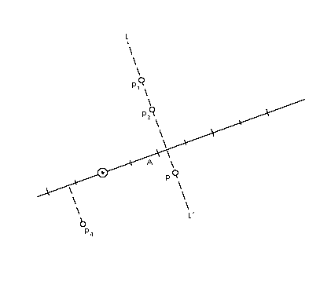

#### 设置点的位置

设置一个点的坐标意味着使它在投影向量上的投影等于所需的值。 从概念上讲，这是通过将点沿自由向量移动到向量与投影向量在所需坐标值处的垂线相交的位置来完成的。

在图 16 中，三个点 p1、p2 和 p3 都设置为沿投影矢量具有相同的值。 每个点沿自由向量移动，直到到达自由向量与坐标位置 2 处投影向量的垂线的交点。

**图 16** 设置点坐标

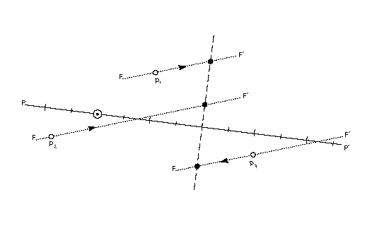

获取和设置点坐标的说明如表 1 所示

**表 1** 获取和设置点坐标

|助记符|指令|
|-|-|
|获取坐标(Get Coordinate)|[GC[a]]()|
|从堆栈设置坐标|[SCFS[]]()|

### 像素网格中的测量

像素网格中距离的测量始终沿投影矢量进行，投影矢量是描述像素网格中矢量的图形状态变量。 网格距离是有符号值。 测量从 A 点到 B 点的距离将产生与测量从 B 点到 A 点的距离所得到的符号相反的结果。

按照惯例，从网格坐标系的原点发出的实线用长线标记的网格单元和短线标记的半网格单元来表示投影矢量。 投影矢量如图 17 所示。

**图 17** 投影矢量

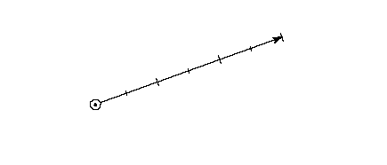

#### 设置投影矢量

存在一种用于获得投影矢量的当前值的指令。 它的值作为一对 (x,y) 坐标返回。 获取和设置投影向量的说明如表 16 所示。

**表 16** 获取和设置投影向量

|助记符|指令|
|-|-|
|获取投影向量(Get Projection Vector)|[GPV]()|
|将双投影矢量设置为线(Set Dual Projection Vector To Line)|[SDPVTL[]]()|
|从堆栈设置投影向量(Set Projection Vector From Stack)|[SPVFS[]]()|
|将投影向量设置为坐标轴(Set Projection Vector To Coordinate Axis)|[SPVTCA[a]]()|
|将投影向量设置为线(Set Projection Vector To Line)|[SPVTL[a]]()|

#### 找到两点之间的距离

两点之间的距离是通过比较它们沿投影矢量的位置来确定的。 点和参考点之间的距离总是通过从点的坐标中减去参考点沿投影矢量的坐标来获得。

在测量两点之间的距离时，区分这些点之间的主轮廓距离和它们的网格拟合距离差是很重要的。 距离是沿投影矢量测量的，是一个有符号的量。 返回的值是一个 F26Dot6 数字，表示以像素为单位的数量。 换句话说，距离是在像素网格中的缩放轮廓中的点之间测量的。

**表 17** 测量两点之间的距离

|助记符|指令|
|-|-|
|测量距离(Measure Distance)|[MD[a]]()|

### 使用颜色进行引擎补偿

除了大小的属性，距离还具有颜色的属性。 颜色用于补偿不同标记引擎对字形最终输出图像外观的影响。

#### 确定距离的颜色

TrueType 解释器区分三种不同类型的距离：黑色、白色和灰色。

黑色区域是包含由扫描转换器打开的像素的区域。 白色区域是不包含由扫描转换器打开的像素的区域。

在考虑两点之间的距离时，以下规则将确定距离是黑色、白色还是灰色：

仅穿过黑色区域的距离是黑色距离。 仅穿过白色区域的距离是白色距离。 跨越黑色和白色区域组合的距离可以是黑色、白色或灰色，具体取决于所覆盖的距离类型的组合。

* 如果两个点的右侧（沿投影矢量）都有黑色，则距离为灰色。
* 如果两个点的左侧都有黑色，则距离为灰色。

**图 18** 中所示的规则可用于确定由不同颜色的子距离组成的距离的颜色。

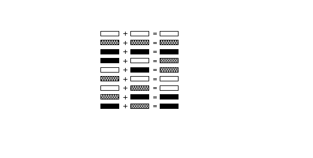

图 19 显示了如何组合黑色、白色和灰色距离的示例。 距离 [4,5] 为黑色； [4,0] 为灰色，[5,0] 为白色。 组合距离 [4,0] 将黑色距离添加到白色距离以获得灰色距离。 当该灰色距离被添加到黑色距离 [0,1] 时，得到的距离 [4,1] 为灰色加黑色或黑色。

**图 19** 白色、黑色和灰色距离

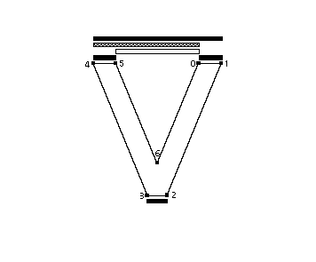

#### 补偿引擎特性

距离类型用于确定表 18 中列出的指令和使用图形状态变量 round state 的其他指令将如何管理距离值。 对于灰色距离，因为它们结合了黑白距离，所以不会进行引擎补偿。 然而，黑色或白色距离需要在舍入之前添加或减去补偿项。 所需的补偿量将由打印机驱动程序设置。 例如，如果打印引擎有大像素，解释器将通过使黑色距离趋于缩小而白色距离趋于增长来进行补偿。 结果是在不同的点尺寸打印机上，字体应该为最终输出的字形产生相同的重量和颜色。

### 四舍五入

TrueType 解释器完成的所有舍入都应用于表示两点之间距离的值，而不是应用于网格位置。 舍入值的效果取决于舍入状态变量的设置。 值可以四舍五入为整数或半整数。

所有舍入都通过使用舍入状态设置来控制如何将 26.6 个定点数的域映射到一组由相等距离分隔的离散值。 许多预定义的舍入规则可用，并且可以使用指令进行设置。 这些使四舍五入到最接近的整数 (RTG[])、最接近的半整数 (RTHG[])、最接近的较小整数 (RDTG[])、最接近的较大整数 (RUTG[]) 或最接近的一半成为可能 整数或整数 (RTDG[])。

图 20 显示了使用每个预定义的舍入状态舍入距离 1.4 的效果。

**图 20** 回合状态的影响

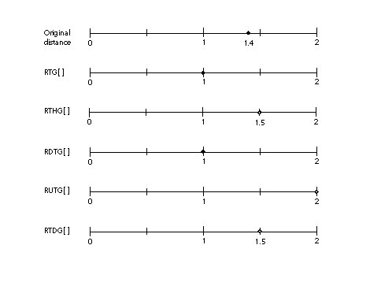

除了预定义的舍入状态外，还可以使用两条指令来设置自定义舍入状态。 它们是 SROUND[] 和 S45ROUND[]。 它们通过设置周期、阶段和阈值来工作，它们共同分别定义了一轮的动作。

* 句点指定舍入值之间的分隔或间隔的长度。
* 相位指定舍入值与周期倍数的偏移量。
* 阈值指定映射到每个值的舍入值之前的域部分。 更直观地说，阈值告诉一个值何时“向前下降”到下一个最大整数。
每个预定义的轮次状态等效于周期、阶段和阈值的特定设置。 关系如表 19 所示。

**表 19** 将预定义的回合状态映射到自定义状态

|指令|周期|阶段|阈值|
|-|-|-|-|
[RTG[]]()|格子(grid)|0|4/8 阶段(period)
[RTHG[]]()|格子(grid)|1/2*阶段(period)|	4/8 阶段(period)
[RTDG[]]()|1/2 * 格子(grid)|0|4/8 阶段(period)/64
[RUTG[]]()|格子(grid)|0|阶段(period) -1
[RDTG[]]()|格子(grid)|0|0

周期基于 *gridPeriod* 的值，即网格位置之间的距离。 对于 SROUND[]，gridPeriod 等于 1.0 像素。 对于 S45ROUND[]，gridPeriod 是 2 个像素的平方根。 表 20 显示了周期的可能值以及它们与 gridPeriod 的关系。 有关设置周期、相位和阈值的更多信息，请参阅指令集中的 SROUND[] 和 S45ROUND[] 条目。

周期参数的值可以是 1/2 像素、1 像素或 2 像素。

**表 20** 设置周期

