# 指令系统

## 介绍

本节按字母顺序列出了 TrueType 指令集。 每个描述都从基本事实开始。 下面简要描述指令的功能。 本材料仅供参考。 有关 TrueType 语言的介绍，请参阅 Instructing Fonts 。

## 理解指令摘要

以下部分总结了理解后面的说明摘要所需的基本信息。

### 指令摘要格式

每个指令描述都以一个基本信息列表开始，如下面的图 1 所示。 对于给定的指令，仅包括相关信息字段。 例如，除了“push”指令之外的所有指令都省略了“From IS”字段。 通常，如果特定指令描述中省略了“使用”字段，则可以安全地假设该指令没有图形状态依赖性。 指令控制状态变量是该规则的一个例外。 它不会出现在每条指令的使用字段中，尽管它可以关闭所有指令的执行。

**图 1 指令摘要格式**

<table>
  <tr>
    <td>MNEMONIC[flags]</td>
    <td>助记词的解释</td>
  </tr>
  <tr>
    <td>Code Range</td>
    <td>标识此指令及其变体的十六进制代码范围</td>
  </tr>
  <tr>
    <td>Flags</td>
    <td>括号内二进制数含义的解释</td>
  </tr>
  <tr>
    <td>From IS</td>
    <td>来自 IS 推送指令从指令流中获取的任何参数</td>
  </tr>
  <tr>
    <td>Pops</td>
    <td>从堆栈弹出的任何参数</td>
  </tr>
  <tr>
    <td>Pushes</td>
    <td>任何压入堆栈的参数</td>
  </tr>
  <tr>
    <td>Uses</td>
    <td>该指令所依赖的任何状态变量</td>
  </tr>
  <tr>
    <td>Sets</td>
    <td>此指令设置的任何状态变量</td>
  </tr>
  <tr>
    <td>Gets</td>
    <td>此指令检索其值的状态变量</td>
  </tr>
  <tr>
    <td>Related instructions</td>
    <td>任何密切相关的指令，包括具有相似或相反效果的指令</td>
  </tr>
</table>

**表示堆栈相互作用**

在随后的指令摘要中，将列出一条指令从堆栈弹出或压入堆栈的参数，以及它们的用途和数据类型的简要说明。
在从堆栈弹出参数的情况下，列出的第一个参数是第一个从堆栈弹出的参数，第二个是下一个弹出的参数，依此类推。

<table>
  <tr>
    <td rowspan="10">MNEMONIC[flags]</td>
    <td>arg3：第一个参数弹出（uint32）</td>
  </tr>
  <tr>
    <td>arg2：弹出的第二个参数（uint32）</td>
  </tr>
  <tr>
    <td>arg1：弹出第三个参数（F26Dot6）</td>
  </tr>
</table>

在从堆栈弹出参数的情况下，第一个压入堆栈的结果首先出现，第二个压入的结果出现在它下面，依此类推。

<table>
  <tr>
    <td rowspan="10">Pushes</td>
    <td>result1：推送的第一个结果（F26Dot6）</td>
  </tr>
  <tr>
    <td>result2：推送的第二个结果（F26Dot6）</td>
  </tr>
</table>

当需要总结一条指令的堆栈交互时，信息将写在一行中。 弹出的项目在两个连字符左侧的左侧，推送的项目在右侧。 上面的例子会写成：

（arg1 arg2 arg3 -- 结果 1 结果 2）。

列表中最右边的项目始终是堆栈顶部的项目。

**堆栈中使用的数据类型**

许多 TrueType 指令与解释器堆栈交互。 简单来说，它们从堆栈中获取数据并将结果返回到堆栈中。 他们操作的堆栈元素都是 32 位值。 指令解释这些值的方式各不相同。 有些人认为所有压入或弹出的 32 位都是重要的。 有些只使用某些位。 有些将 32 位数量视为带符号整数，有些将其视为无符号整数，有些则将其视为定点值。
可以出现在堆栈上的数据类型在下面的表 1 中列出。

在压入或弹出的 32 位中只有一部分相关的情况下，数据类型的名称以大写字母 E 开头，表示“扩展”。 无符号值扩展为 32 位，有效位左侧为零。 有符号值被符号扩展为 32 位。

定点数的名称以字母 F 开头。名称由表示数字整数部分的位数和表示二进制小数点的字母“DOT”组成。 其次是小数位数。 扩展定点数以字母 EF 开头。

通用堆栈元素的数据类型为 StkElt。 任何 32 位数量都可以具有此数据类型。

**表 1：** 指令集数据类型

|数据类型|描述|
|-|-|
|Eint8|符号扩展 8 位整数|
|Euint16|零扩展 16 位无符号整数|
|EFWord|符号扩展的 16 位有符号整数，描述 FUnits 中的数量，em 空间中的最小可测量单位|
|EF2Dot14|符号扩展的 16 位有符号固定数，低 14 位表示小数|
|uint32|32 位无符号整数|
|int32|32 位有符号整数|
|F26Dot6|32 位有符号固定数，低 6 位代表小数|
|StkElt|任意 32 位数量|

## 理解插图

许多说明都附有插图。 这些插图中的大多数解释了指令对字形轮廓中点位置的影响。 图 1 列出了这些插图中使用的约定。 请记住，
* 除非另有说明，否则距离是沿投影矢量测量的
* 除非另有说明，指令沿自由向量移动点
有关移动点的更多信息，请参阅 [字体教程](./instructing_fonts.md) 。

**图 1** 图示要点

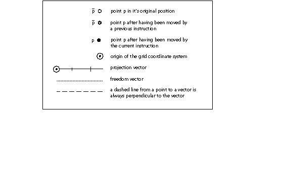

## 说明
### AA[] 调整角度

<table>
  <tr>
    <td>代码范围</td>
    <td>0x7F</td>
  </tr>
  <tr>
    <td>pops 尾部弹出</td>
    <td>p：点数（uint32）</td>
  </tr>
  <tr>
    <td>Pushes 压入栈</td>
    <td>-</td>
  </tr>
  <tr>
    <td>相关说明</td>
    <td>SANGW[ ]</td>
  </tr>
</table>

从堆栈中弹出一个参数。 该指令是不合时宜的，没有其他作用。

### ABS[] 绝对值

<table>
  <tr>
    <td>代码范围</td>
    <td>0x64</td>
  </tr>
  <tr>
    <td>pops 尾部弹出</td>
    <td>n：定点数（F26Dot6）</td>
  </tr>
  <tr>
    <td >Pushes 推动</td>
    <td>|n|：n 的绝对值 (F26Dot6)</td>
  </tr>
  <tr>
    <td colspan="10" >用绝对值替换堆栈顶部的数字。</td>
  </tr>
</table>

从堆栈弹出一个 26.6 定点数 n，并将 n 的绝对值压入堆栈。

### ADD[] 添加

<table>
  <tr>
    <td>代码范围</td>
    <td>0x60</td>
  </tr>
  <tr>
    <td>pops 尾部弹出</td>
    <td>n2：定点数（F26Dot6） n1：定点数（F26Dot6）</td>
  </tr>
  <tr>
    <td >Pushes 推动</td>
    <td>总和：n1 + n2(F26Dot6)</td>
  </tr>
  <tr>
    <td colspan="10" >将栈顶的两个数字相加。</td>
  </tr>
</table>

从堆栈中弹出两个 26.6 定点数 n2 和 n1，并将这两个数字的和压入堆栈。

### ALIGNPTS[] 对齐点

<table>
  <tr>
    <td>代码范围</td>
    <td>0x27</td>
  </tr>
  <tr>
    <td>pops 尾部弹出</td>
    <td>p2：点编号 (uint32) p1：点编号 (uint32)</td>
  </tr>
  <tr>
    <td>Pushes 压入栈</td>
    <td>-</td>
  </tr>
  <tr>
    <td>使用</td>
    <td>带点 p2 的 zp0 和带点 p1 的 zp1、自由向量、投影向量</td>
  </tr>
  <tr>
    <td>相关说明</td>
    <td>ALIGNRP[ ]</td>
  </tr>
</table>

沿与投影向量正交的轴对齐编号为堆栈顶部两项的两个点。
从堆栈中弹出两个点数 p2 和 p1，并通过将两个点沿自由向量移动到它们沿投影向量的投影的平均值，使它们之间的距离为零。

在下图中，点 p1 和 p2 沿着自由向量移动，直到它们之间的投影距离减小为零。 从 A 到 B 的距离等于 d/2，这等于从 B 到 C 的距离。值 d/2 是 p1 和 p2 之间原始投影距离的一半。

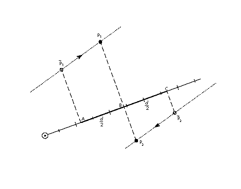

### ALIGNRP[] 与参考点对齐

<table>
  <tr>
    <td>代码范围</td>
    <td>0x27</td>
  </tr>
  <tr>
    <td>pops 尾部弹出</td>
    <td>p1、p2、...、ploopvalue：点数 (uint32)</td>
  </tr>
  <tr>
    <td>Pushes 压入栈</td>
    <td>-</td>
  </tr>
  <tr>
    <td>使用</td>
    <td>带点 p2 的 zp0 和带点 p1 的 zp1、自由向量、投影向量</td>
  </tr>
  <tr>
    <td>相关说明</td>
    <td>ALIGNPTS[ ]</td>
  </tr>
</table>

将编号位于堆栈顶部的点与 rp0 引用的点对齐。
从堆栈中弹出点编号 p1、p2、...、ploopvalue，并通过移动每个点 pi 将这些点与 rp0 的当前位置对齐，从而使从 pi 到 rp0 的投影距离减小为零。 对齐的点数取决于状态变量循环的当前设置。

在下图中，点 p 沿着自由向量移动，直到它与 rp0 的投影距离减小为零。

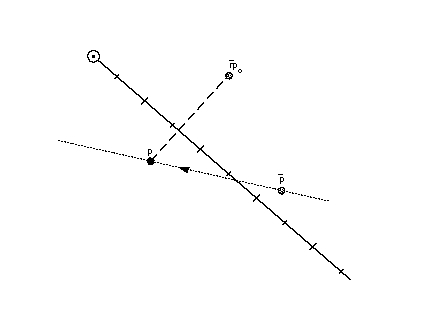

### AND[] 逻辑与

<table>
  <tr>
    <td>代码范围</td>
    <td>0x5A</td>
  </tr>
  <tr>
    <td>pops 尾部弹出</td>
    <td>e2：堆栈元素 (StkElt) e1：堆栈元素 (StkElt)</td>
  </tr>
  <tr>
    <td>Pushes 压入栈</td>
    <td>(e1 and e2)：e1 和 e2 的逻辑与 (uint32)</td>
  </tr>
  <tr>
    <td>使用</td>
    <td>带点 p2 的 zp0 和带点 p1 的 zp1、自由向量、投影向量</td>
  </tr>
  <tr>
    <td>相关说明</td>
    <td>OR[ ]</td>
  </tr>
</table>

获取顶部两个堆栈元素的逻辑与。
从堆栈中弹出顶部的两个元素 e2 和 e1，并将两个元素的逻辑与结果压入堆栈。 如果其中一个或两个元素为 FALSE（值为零），则压入零。 如果两个元素都为 TRUE（具有非零值），则压入一个。

### CALL[] 调用函数

<table>
  <tr>
    <td>代码范围</td>
    <td>0x2B</td>
  </tr>
  <tr>
    <td>pops 尾部弹出</td>
    <td>f：函数标识符号（0 到 (n-1) 范围内的 int32，其中 n 在“maxp”表中指定）</td>
  </tr>
  <tr>
    <td>Pushes 压入栈</td>
    <td>-</td>
  </tr>
  <tr>
    <td>相关说明</td>
    <td>FDEF[ ], EIF[ ]</td>
  </tr>
</table>

### CEILING[] 天花板

<table>
  <tr>
    <td>代码范围</td>
    <td>0x67</td>
  </tr>
  <tr>
    <td>pops 尾部弹出</td>
    <td>n：定点数（F26Dot6）</td>
  </tr>
  <tr>
    <td>Pushes 压入栈</td>
    <td>n : n 的上限 (F26Dot6)</td>
  </tr>
  <tr>
    <td>相关说明</td>
    <td>FLOOR[ ]</td>
  </tr>
</table>

获取堆栈顶部数字的上限。
从堆栈中弹出一个数字 n 并压入 n ，即大于或等于 n 的最小整数值。 请注意，n 的上限虽然是一个整数值，但表示为 26.6 定点数。

### CINDEX[] 将 INDEXed 元素复制到栈顶

<table>
  <tr>
    <td>代码范围</td>
    <td>0x25</td>
  </tr>
  <tr>
    <td>pops 尾部弹出</td>
    <td>k：堆栈元素编号（int32）</td>
  </tr>
  <tr>
    <td>Pushes 压入栈</td>
    <td>ek: 第 k 个堆栈元素 (StkElt)</td>
  </tr>
  <tr>
    <td rowspan="4" >堆栈之前</td>
    <td>k：堆栈元素编号</td>
  </tr>
  <tr>
    <td>e1：堆栈元素</td>
  </tr>
  <tr>
    <td>...</td>
  </tr>
  <tr>
    <td>ek：堆栈元素</td>
  </tr>
  <tr>
    <td rowspan="4" >堆栈之后</td>
    <td>ek：索引元素</td>
  </tr>
  <tr>
    <td>e1：堆栈元素</td>
  </tr>
  <tr>
    <td>...</td>
  </tr>
  <tr>
    <td>ek：堆栈元素</td>
  </tr>
  <tr>
    <td>相关说明</td>
    <td>MINDEX[ ]</td>
  </tr>
</table>

将索引堆栈元素复制到堆栈顶部。
从堆栈中弹出堆栈元素编号 k，并将第 k 个堆栈元素的副本压入堆栈顶部。 由于它是一个被压入的副本，因此第 k 个元素保持在其原始位置。 此功能是 CINDEX[ ] 和 MINDEX[ ] 指令之间的主要区别。

k 的零值或负值是错误的。

### CLEAR[] 清除堆栈

<table>
  <tr>
    <td>代码范围</td>
    <td>0x22</td>
  </tr>
  <tr>
    <td>pops 尾部弹出</td>
    <td>堆栈中的所有项目 (StkElt)</td>
  </tr>
  <tr>
    <td>Pushes 压入栈</td>
    <td>-</td>
  </tr>
</table>

清除堆栈中的所有元素。

### DEBUG[] 调试调用

<table>
  <tr>
    <td>代码范围</td>
    <td>0x4F</td>
  </tr>
  <tr>
    <td>pops 尾部弹出</td>
    <td>n：整数（uint32）</td>
  </tr>
  <tr>
    <td>Pushes 压入栈</td>
    <td>-</td>
  </tr>
</table>

从堆栈中弹出一个整数。 在解释器的非调试版本中，指令的执行将继续。 在可供字体开发人员使用的调试版本中，将调用依赖于实现的调试器。
该指令仅用于调试目的，不应成为成品字体的一部分。 某些实现不支持此指令。

### DELTAC1[] DELTA异常C1

<table>
  <tr>
    <td>代码范围</td>
    <td>0x73</td>
  </tr>
  <tr>
    <td rowspan="2" >pops 尾部弹出</td>
    <td>n：异常规范和 CVT 条目号的对数 (uint32)</td>
  </tr>
  <tr>
    <td>argn, cn, argn-1,cn-1, , arg1, c1：CVT 条目号和异常规范对（uint32 对）</td>
  </tr>
  <tr>
    <td>Pushes 压入栈</td>
    <td>-</td>
  </tr>
  <tr>
    <td>使用</td>
    <td>delta 转移, delta 基础</td>
  </tr>
  <tr>
    <td>相关说明</td>
    <td>DELTAC2[ ], DELTAC3, DELTAP1, DELTAP2, DELTAP3</td>
  </tr>
</table>

为一个或多个 CVT 值创建例外，每个 CVT 值都具有指定的磅值和指定的数量。

弹出一个整数 n，后跟 n 对异常规范和控制值表条目号。 DELTAC1[] 更改每个 CVT 条目中指定的值，大小和像素数量在其成对参数中指定。

DELTAC1[] 指令的 8 位 arg 组件分解为两部分。 最重要的 4 位表示应用异常的每个 em 的相对像素数。 最低有效 4 位表示要进行的更改的大小。

每个 em 的相对像素数是参数中指定的值和增量基数的函数。 DELTAC1[] 指令以每 em 像素大小工作，从 delta base 到 delta_base + 15。要以更大的每 em 像素大小调用异常，请使用 DELTAC2[] 或 DELTAC3[] 指令，这会影响大小的变化 最多 delta_base + 47 或者，如果需要，增加 delta base 的值。

移动的幅度在指令中以编码形式指定。 表 5 列出了异常值的映射和移动的幅度。步长的大小取决于增量偏移的值。

**表 4：** 映射到移动步数的幅度值

<table>
  <tr>
    <th>选择器</th>
    <td>0</td>
    <td>1</td>
    <td>2</td>
    <td>3</td>
    <td>4</td>
    <td>5</td>
    <td>6</td>
    <td>7</td>
    <td>8</td>
    <td>9</td>
    <td>10</td>
    <td>11</td>
    <td>12</td>
    <td>13</td>
    <td>14</td>
    <td>15</td>
  </tr>
  <tr>
    <th>步数</th>
    <td>-8</td>
    <td>-7</td>
    <td>-6</td>
    <td>-5</td>
    <td>-4</td>
    <td>-3</td>
    <td>-2</td>
    <td>-1</td>
    <td>1</td>
    <td>2</td>
    <td>3</td>
    <td>4</td>
    <td>5</td>
    <td>6</td>
    <td>7</td>
    <td>8</td>
  </tr>
</table>

有关 DELTA 指令的更多信息，请参阅 [字体教程](./instructing_fonts.md)。

### DELTAC2[] DELTA异常C2

<table>
  <tr>
    <td>代码范围</td>
    <td>0x74</td>
  </tr>
  <tr>
    <td rowspan="2" >pops 尾部弹出</td>
    <td>n：异常规范和 CVT 条目号的对数 (uint32)</td>
  </tr>
  <tr>
    <td>argn, cn, argn-1,cn-1, , arg1, c1：CVT 条目号和异常规范对（uint32 对）</td>
  </tr>
  <tr>
    <td>Pushes 压入栈</td>
    <td>-</td>
  </tr>
  <tr>
    <td>使用</td>
    <td>delta 转移, delta 基础</td>
  </tr>
  <tr>
    <td>相关说明</td>
    <td>DELTAC2[ ], DELTAC3[], DELTAP1[], DELTAP2[], DELTAP3[]</td>
  </tr>
</table>

为一个或多个 CVT 值创建例外，每个 CVT 值都具有指定的磅值和指定的数量。
弹出一个整数 n，后跟 n 对异常规范和 CVT 条目号。 DELTAC2[] 以其配对参数中指定的大小和数量更改每个 CVT 条目中的值。

DELTAC2[] 指令与 DELTAC1[] 指令完全相同，除了以从 (delta_base + 16) 到 (delta_base + 31) 开始的每 em 像素大小操作。 要以每 em 大小的较小像素调用异常，请使用 DELTAC1[] 指令。 要以较小的每 em 像素大小调用异常，请使用 DELTAC3[] 指令，该指令可以影响最大 delta_base + 47 大小的更改，或者，如果需要，更改 delta base 的值。

有关详细信息，请参阅 DELTAC1[] 或 [字体教程](./instructing_fonts.md) 的条目。

### DELTAC3[] DELTA 异常 C3

<table>
  <tr>
    <td>代码范围</td>
    <td>0x75</td>
  </tr>
  <tr>
    <td rowspan="2" >pops 尾部弹出</td>
    <td>n：CVT条目号和异常规范的对数（uint32）</td>
  </tr>
  <tr>
    <td>argn, cn, argn-1,cn-1, , arg1, c1：CVT 条目号和异常规范对（uint32 对）</td>
  </tr>
  <tr>
    <td>Pushes 压入栈</td>
    <td>-</td>
  </tr>
  <tr>
    <td>使用</td>
    <td>delta 转移, delta 基础</td>
  </tr>
  <tr>
    <td>相关说明</td>
    <td>DELTAC2[ ], DELTAC3[], DELTAP[], DELTAP2[], DELTAP3[]</td>
  </tr>
</table>

为一个或多个 CVT 值创建例外，每个 CVT 值都具有指定的磅值和指定的数量。
弹出一个整数 n，后跟 n 对异常规范和 CVT 条目号。 DELTAC3[] 以其配对参数中指定的大小和数量更改每个 CVT 条目中的值。

DELTAC3[] 指令与 DELTAC1 指令完全相同，除了以从 (delta_base + 32) 到 (delta_base + 47) 开始的每 em 像素大小操作。

有关详细信息，请参阅 DELTAC1[] 或 [字体教程](./instructing_fonts.md) 的条目。

### DELTAP1[] DELTA异常P1

<table>
  <tr>
    <td>代码范围</td>
    <td>0x5D</td>
  </tr>
  <tr>
    <td>Pops n：异常规范和点数对（uint32）</td>
    <td>argn, pn, argn-1, pn-1, , arg1, p1：n 对异常规范和点（uint32 对）</td>
  </tr>
  <tr>
    <td>Pushes 压入栈</td>
    <td>-</td>
  </tr>
  <tr>
    <td>使用</td>
    <td>zp0, delta base, delta shift, 自由向量, 投影向量</td>
  </tr>
  <tr>
    <td>相关说明</td>
    <td>DELTAC2[ ], DELTAC3, DELTAP1, DELTAP2, DELTAP3</td>
  </tr>
</table>

在一个或多个点位置创建异常，每个位置都具有指定的点大小和指定的数量。
DELTAP1[] 作用于 zp0 引用的区域中的点。 它以配对参数中指定的大小和数量移动指定的点。 移动一个点可以打开或关闭位图中选定的像素，这些像素将在扫描转换受影响的轮廓时创建。 可以指定任意数量的点和参数。

分组 [argi, pi] 可以执行 n 次。 argi 的值由一个字节组成，低四位表示异常的大小，高四位表示每个 em 值的相对像素。

DELTAP 指令工作的实际每 em 像素大小是相对每 em 像素大小和 delta base 的函数。 DELTAP1[] 指令以每 em 像素大小工作，从 delta_base 到 delta_base + 15。要在每 em 更大像素大小上调用异常，请使用 DELTAP2[] 或 DELTAP3[] 指令，它们一起可以影响更改 大小最大为 delta_base + 47，或者，如果需要，增加 delta base 的值。

移动的幅度在指令中以编码形式指定。 表 5 列出了从 DELTA 指令中使用的异常值到移动步长的映射。 步长的大小取决于增量偏移的值。

**表 5：** 映射到移动步数的幅度值

<table>
  <tr>
    <th>选择器</th>
    <td>0</td>
    <td>1</td>
    <td>2</td>
    <td>3</td>
    <td>4</td>
    <td>5</td>
    <td>6</td>
    <td>7</td>
    <td>8</td>
    <td>9</td>
    <td>10</td>
    <td>11</td>
    <td>12</td>
    <td>13</td>
    <td>14</td>
    <td>15</td>
  </tr>
  <tr>
    <th>步数</th>
    <td>-8</td>
    <td>-7</td>
    <td>-6</td>
    <td>-5</td>
    <td>-4</td>
    <td>-3</td>
    <td>-2</td>
    <td>-1</td>
    <td>1</td>
    <td>2</td>
    <td>3</td>
    <td>4</td>
    <td>5</td>
    <td>6</td>
    <td>7</td>
    <td>8</td>
  </tr>
</table>

### DELTAP2[] DELTA 异常 P2

<table>
  <tr>
    <td>代码范围</td>
    <td>0x71</td>
  </tr>
  <tr>
    <td>Pops n：异常规范和点数对（uint32）</td>
    <td>argn, pn, argn-1, pn-1, , arg1, p1：n 对异常规范和点（uint32 对）</td>
  </tr>
  <tr>
    <td>Pushes 压入栈</td>
    <td>-</td>
  </tr>
  <tr>
    <td>使用</td>
    <td>zp0, delta shift, delta base, 自由向量, 投影向量</td>
  </tr>
  <tr>
    <td>相关说明</td>
    <td>DELTAC2[ ], DELTAC3, DELTAP1, DELTAP2, DELTAP3</td>
  </tr>
</table>

在一个或多个点位置创建异常，每个位置都具有指定的点大小和指定的数量。
DELTAP2[] 作用于 zp0 引用的区域中的点。 它以配对参数中指定的大小和数量移动指定的点。 移动一个点可以打开或关闭位图中选定的像素，这些像素将在扫描转换受影响的轮廓时创建。 可以指定任意数量的点和参数。

DELTAP2[] 指令与 DELTAP1[] 指令相同，除了以从 (delta_base + 16) 到 (delta_base + 31) 开始的每 em 像素大小进行操作。 要以每 em 大小的较小像素调用异常，请使用 DELTAP1[] 指令。 要以每 em 大小的较小像素调用异常，请使用 DELTAP3[] 指令。 如有必要，更改 delta_base 的值。

### DELTAP3[] DELTA 异常 P3

<table>
  <tr>
    <td>代码范围</td>
    <td>0x71</td>
  </tr>
  <tr>
    <td>Pops n：异常规范和点数对（uint32）</td>
    <td>argn, pn, argn-1, pn-1, , arg1, p1：n 对异常规范和点（uint32 对）</td>
  </tr>
  <tr>
    <td>Pushes 压入栈</td>
    <td>-</td>
  </tr>
  <tr>
    <td>使用</td>
    <td>zp0, delta shift, delta base, 自由向量, 投影向量</td>
  </tr>
  <tr>
    <td>相关说明</td>
    <td>DELTAC2[ ], DELTAC3, DELTAP1, DELTAP2, DELTAP3</td>
  </tr>
</table>

在一个或多个点位置创建异常，每个位置都具有指定的点大小和指定的数量。
弹出一个整数 n，后跟 n 对异常规范和点。 DELTAP3[] 作用于 zp0 引用的区域中的点。 它以配对参数中指定的大小和数量移动指定的点。 移动一个点可以打开或关闭位图中选定的像素，这些像素将在扫描转换受影响的轮廓时创建。 可以指定任意数量的点和参数。

DELTAP3[] 指令与 DELTAP1[] 指令相同，除了以从 (delta_base + 32) 到 (delta base + 47) 开始的每 em 像素大小进行操作。 要以每 em 大小的较小像素调用异常，请使用 DELTAP1[] 或 DELTAP2[] 指令。 如有必要，更改增量基数的值。

### DEPTH[] 栈的深度

<table>
  <tr>
    <td>代码范围</td>
    <td>0x24</td>
  </tr>
  <tr>
    <td>Pops</td>
    <td>-</td>
  </tr>
  <tr>
    <td>Pushes 压入栈</td>
    <td>n：元素数量（int32）</td>
  </tr>
</table>

将 n（当前在堆栈中的元素数）压入堆栈。

### DIV[]除法

<table>
  <tr>
    <td>代码范围</td>
    <td>0x62</td>
  </tr>
  <tr>
    <td rowspan="2" >Pops</td>
    <td>n2：小数 (F26Dot6)</td>
  </tr>
  <tr>
    <td>n1：最后一个小数（F26Dot6）</td>
  </tr>
  <tr>
    <td>Pushes 压入栈</td>
    <td>(n1 * 64)/n2：商 (F26Dot6)</td>
  </tr>
</table>

将堆栈顶部的第二个数除以堆栈顶部的数字。
从堆栈中弹出两个 26.6 定点数 n1 和 n2，并将 n2 除以 n1 得到的商压入堆栈。 除法按以下方式进行，n1 左移六位，然后除以 2。

### DUP[] DUPlicate 栈顶元素

<table>
  <tr>
    <td>代码范围</td>
    <td>0x20</td>
  </tr>
  <tr>
    <td>Pops</td>
    <td>e：堆栈元素（StkElt）</td>
  </tr>
  <tr>
    <td>Pushes 压入栈</td>
    <td>e：堆栈元素（StkElt）</td>
  </tr>
  <tr>
    <td>e：堆栈元素（StkElt）</td>
    <td></td>
  </tr>
</table>

复制栈顶元素。
从堆栈中弹出一个元素 e，复制该元素并将其压入两次。

### EIF[] End IF

<table>
  <tr>
    <td>代码范围</td>
    <td>0x59</td>
  </tr>
  <tr>
    <td>Pops</td>
    <td>-</td>
  </tr>
  <tr>
    <td>Pushes 压入栈</td>
    <td>-</td>
  </tr>
  <tr>
    <td>相关说明</td>
    <td>IF[ ], ELSE[ ]</td>
  </tr>
</table>

标记 IF 或 IF-ELSE 指令序列的结束。

### ELSE[] ELSE 子句

<table>
  <tr>
    <td>代码范围</td>
    <td>0x1B</td>
  </tr>
  <tr>
    <td>Pops</td>
    <td>-</td>
  </tr>
  <tr>
    <td>Pushes 压入栈</td>
    <td>-</td>
  </tr>
  <tr>
    <td>相关说明</td>
    <td>IF[ ], ELSE[ ]</td>
  </tr>
</table>

标记当 IF 指令在堆栈上遇到 FALSE 值时要执行的指令序列的开始。 该指令序列以 EIF 指令结束。

IF-ELSE-EIF 序列的 ELSE 部分是可选的。

### ENDF[] END 函数定义

<table>
  <tr>
    <td>代码范围</td>
    <td>0x2D</td>
  </tr>
  <tr>
    <td>Pops</td>
    <td>-</td>
  </tr>
  <tr>
    <td>Pushes 压入栈</td>
    <td>-</td>
  </tr>
  <tr>
    <td>相关说明</td>
    <td>FDEF[ ], IDEF[ ]</td>
  </tr>
</table>

标记函数定义或指令定义的结尾。 函数定义和指令定义不能嵌套。

### EQ[] 相等

<table>
  <tr>
    <td>代码范围</td>
    <td>0x54</td>
  </tr>
  <tr>
    <td>Pops</td>
    <td>e2：堆栈元素 e1：堆栈元素</td>
  </tr>
  <tr>
    <td>Pushes 压入栈</td>
    <td>b：布尔值（[0,1]范围内的uint32）</td>
  </tr>
  <tr>
    <td>相关说明</td>
    <td>NEQ[ ]</td>
  </tr>
</table>

测试栈顶的两个数是否相等。
从堆栈中弹出两个 32 位值 e2 和 e1 并比较它们。 如果它们相同，则将一个表示 TRUE 的值压入堆栈。 如果它们不相等，则将零（表示 FALSE）放入堆栈。

### EVEN[] EVEN

<table>
  <tr>
    <td>代码范围</td>
    <td>0x57</td>
  </tr>
  <tr>
    <td>Pops</td>
    <td>e: 堆栈元素 (F26Dot6)</td>
  </tr>
  <tr>
    <td>Pushes 压入栈</td>
    <td>b：布尔值（[0,1]范围内的uint32）</td>
  </tr>
  <tr>
    <td>使用</td>
    <td>圆形状态</td>
  </tr>
  <tr>
    <td>相关说明</td>
    <td>ODD[ ]</td>
  </tr>
</table>

测试堆栈顶部的数字在根据舍入状态舍入时是否为偶数。
从堆栈中弹出一个 26.6 的数字 e，并根据当前轮次状态对该数字进行四舍五入。 然后将该数字截断为整数。 如果被截断的数字是偶数，则表示 TRUE 的 1 被压入堆栈； 如果它是奇数，则将零（表示 FALSE）放入堆栈。

### FDEF[] 函数定义

<table>
  <tr>
    <td>代码范围</td>
    <td>0x2C</td>
  </tr>
  <tr>
    <td>Pops</td>
    <td>f：函数标识符号（0 到 (n-1) 范围内的整数，其中 n 在“maxp”表中指定</td>
  </tr>
  <tr>
    <td>Pushes 压入栈</td>
    <td>-</td>
  </tr>
  <tr>
    <td>相关说明</td>
    <td>ENDF[ ], CALL[ ]</td>
  </tr>
</table>

标记函数定义的开始，并从堆栈中弹出一个数字 f 以唯一标识此函数。 当在指令流中遇到 ENDF[] 时，该定义将终止。 函数定义只能出现在字体程序或 CVT 程序中。 函数必须先定义，然后才能与 CALL[ ] 指令一起使用。

### FLIPOFF[] 将自动 FLIP 布尔值设置为 OFF

<table>
  <tr>
    <td>代码范围</td>
    <td>0x4E</td>
  </tr>
  <tr>
    <td>Pops</td>
    <td>-</td>
  </tr>
  <tr>
    <td>Pushes 压入栈</td>
    <td>-</td>
  </tr>
  <tr>
    <td>设置</td>
    <td>自动翻转</td>
  </tr>
  <tr>
    <td>影响</td>
    <td>MIRP、MIAP</td>
  </tr>
  <tr>
    <td>相关指令</td>
    <td>FLIPON[ ], MIRP[ ], MIAP[ ]</td>
  </tr>
</table>

将图形状态中的自动翻转布尔值设置为 FALSE，导致 MIRP[] 和 MIAP[] 指令使用控制值表条目的符号。 当自动翻转设置为 FALSE 时，测量距离的方向变得很重要。 自动翻转状态变量的默认值为 TRUE。

### FLIPON[] 将自动 FLIP 布尔值设置为 ON

<table>
  <tr>
    <td>代码范围</td>
    <td>0x4D</td>
  </tr>
  <tr>
    <td>Pops</td>
    <td>-</td>
  </tr>
  <tr>
    <td>Pushes 压入栈</td>
    <td>-</td>
  </tr>
  <tr>
    <td>设置</td>
    <td>自动翻转</td>
  </tr>
  <tr>
    <td>影响</td>
    <td>MIRP、MIAP</td>
  </tr>
  <tr>
    <td>相关指令</td>
    <td>FLIPOFF[ ], MIRP[ ], MIAP[ ]</td>
  </tr>
</table>

将图形状态中的自动翻转布尔值设置为 TRUE，导致 MIRP[] 和 MIAP[] 指令忽略控制值表条目的符号。 当自动翻转变量为 TRUE 时，测量距离的方向变得无关紧要。 自动翻转状态变量的默认值为 TRUE。

### FLIPPT[] 翻转点

<table>
  <tr>
    <td>代码范围</td>
    <td>0x80</td>
  </tr>
  <tr>
    <td>Pops</td>
    <td>p1, p2, , ploopvalue: 点数 (uint32)</td>
  </tr>
  <tr>
    <td>Pushes 压入栈</td>
    <td>-</td>
  </tr>
  <tr>
    <td>使用</td>
    <td>zp0，循环</td>
  </tr>
  <tr>
    <td>相关说明</td>
    <td>FLIPRGON[ ], FLIPRGOFF[ ]</td>
  </tr>
</table>

使曲线上的点成为曲线外点或使曲线外的点成为曲线上的点。
从堆栈中弹出点 p、p1、p2、...、ploopvalue。 如果 pi 是曲线上的点，则它是曲线外的点。 如果 pi 是曲线外点，则它是曲线上点。 没有点 pi 被标记为已触摸。 因此，所有翻转点都不会受到 IUP[ ] 指令的影响。 FLIPPT[ ] 指令重新定义字形轮廓的形状。

### FLIPRGOFF[] FLIP RanGe 关闭

<table>
  <tr>
    <td>代码范围</td>
    <td>0x80</td>
  </tr>
  <tr>
    <td rowspan="2" >Pops</td>
    <td>h：范围内的高点数（uint32）</td>
  </tr>
  <tr>
    <td>l：范围内的低点数（uint32）</td>
  </tr>
  <tr>
    <td>Pushes 压入栈</td>
    <td>-</td>
  </tr>
  <tr>
    <td>使用</td>
    <td>zp0</td>
  </tr>
  <tr>
    <td>相关说明</td>
    <td>FLIPPT[ ], FLIPRGOFF[ ]</td>
  </tr>
</table>

将指定范围内的所有点更改为曲线外点。
弹出定义点范围的两个数字，第一个是高点，第二个是低点。 此范围内的曲线上点将成为曲线外点。 点的位置不受影响，因此点不标记为触摸。

### FLIPRGON[] FLIP RanGe 开启

<table>
  <tr>
    <td>代码范围</td>
    <td>0x81</td>
  </tr>
  <tr>
    <td rowspan="2" >Pops</td>
    <td>h：翻转范围内的高点数（uint32）</td>
  </tr>
  <tr>
    <td>l：翻转范围内的低点数（uint32）</td>
  </tr>
  <tr>
    <td>Pushes 压入栈</td>
    <td>-</td>
  </tr>
  <tr>
    <td>使用</td>
    <td>zp0</td>
  </tr>
  <tr>
    <td>相关说明</td>
    <td>FLIPPT[ ], FLIPRGOFF[ ]</td>
  </tr>
</table>

使指定范围内的所有点成为曲线上的点。
弹出定义点范围的两个数字，第一个是高点，第二个是低点。 此范围内的曲线外点将变为曲线上点。 点的位置不受影响，因此点不标记为触摸。

### FLOOR[] FLOOR

<table>
  <tr>
    <td>代码范围</td>
    <td>0x66</td>
  </tr>
  <tr>
    <td>Pops</td>
    <td>n：需要 floor 的号码（F26Dot6）</td>
  </tr>
  <tr>
    <td>Pushes 压入栈</td>
    <td>n : n 层 (F26Dot6)</td>
  </tr>
  <tr>
    <td>相关说明</td>
    <td>CEILING[ ]</td>
  </tr>
</table>

获取堆栈顶部值的底部。

从堆栈中弹出一个 26.6 定点数 n 并返回 n ，即小于或等于 n 的最大整数值。 请注意，n 的下限虽然是一个整数值，但表示为 26.6 定点数。

### GC[a] 获取投影到投影向量上的坐标

<table>
  <tr>
    <td>代码范围</td>
    <td>0x46 - 0x47</td>
  </tr>
  <tr>
    <td rowspan="2" >a</td>
    <td>0：使用点p的当前位置</td>
  </tr>
  <tr>
    <td>1：使用原轮廓中p点的位置</td>
  </tr>
  <tr>
    <td>Pops</td>
    <td>p: 点号 (uint32)</td>
  </tr>
  <tr>
    <td>Pushes 压入栈</td>
    <td>c：坐标位置（F26Dot6）</td>
  </tr>
  <tr>
    <td>使用</td>
    <td>zp2，投影向量，双投影向量</td>
  </tr>
  <tr>
    <td>相关说明</td>
    <td>SCFS[ ]</td>
  </tr>
</table>

使用当前投影向量获取指定点的坐标值。
弹出一个点号 p 并将该点在当前投影向量上的坐标值压入堆栈。 GC[] 返回的值取决于投影向量的当前方向。

下图，GC[1]，p1 在栈顶，返回点 p1 的原始位置，而 GC[0]，p2 在栈顶，返回点 p2 的当前位置。

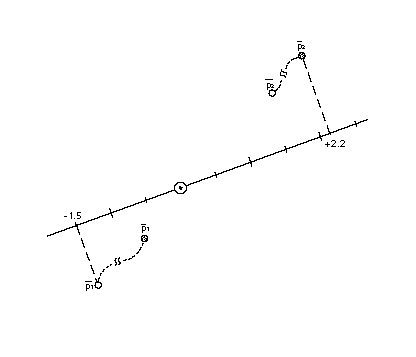

### GETINFO[] 获取信息

<table>
  <tr>
    <td>代码范围</td>
    <td>0x88</td>
  </tr>
  <tr>
    <td>Pops</td>
    <td>选择器：整数（uint32）</td>
  </tr>
  <tr>
    <td>Pushes 压入栈</td>
    <td>结果：整数（uint32）</td>
  </tr>
</table>

用于获取有关呈现字体的 TrueType 引擎版本的数据以及当前字形的特征。 该指令弹出一个用于确定所需信息类型的选择器，并将结果压入堆栈。
在选择器中设置位 0 请求引擎版本。 设置位 1 询问字形是否已旋转。 设置位 2 询问字形是否已被拉伸。 要请求有关这些值中的两个或更多个的信息，请设置适当的位。 例如，选择器值 6 (0112) 请求有关旋转和拉伸的信息。

结果与请求的信息一起被压入堆栈。 结果的第 0 位到第 7 位包含字体引擎版本号。 表 0-2 中列出了版本号。

如果当前字形已旋转，则位 8 设置为 1。 否则为 0。 位 9 设置为 1 以指示字形已被拉伸。 否则为 0。

**表 0-1** 选择器位和产生的结果

**表 6**
|选择位|意义|结果位|
|-|-|-|
|0|获取引擎版本|0-7|
|1|旋转？|8|
|2|拉伸？|9|
表 0-2 中给出了引擎版本的可能值。

**表 0-2** 字体引擎版本号

|系统|引擎版本|
|-|-|
|Macintosh System6.0|1|
|Macintosh System7.0|2|
|Windows 3.1|3|
|KanjiTalk 6.1|4|

如果 TrueType 引擎是 System 7.0 版本，并且选择器请求有关版本号、旋转和拉伸的信息，并且字形旋转但未拉伸，则结果将为 01 0000 00102 或 258。

### GFV[] 获取自由向量

<table>
  <tr>
    <td>代码范围</td>
    <td>0x0D</td>
  </tr>
  <tr>
    <td>Pops</td>
    <td>-</td>
  </tr>
  <tr>
    <td rowspan="2" >Pushes 压入栈</td>
    <td>px: x 分量 (EF2Dot14)</td>
  </tr>
  <tr>
    <td>py：y 分量 (EF2Dot14)</td>
  </tr>
  <tr>
    <td>获取</td>
    <td>自由向量</td>
  </tr>
  <tr>
    <td>相关说明</td>
    <td>GPV[ ]</td>
  </tr>
</table>

将当前自由向量分解为其 x 和 y 分量，并将这些分量作为两个 2.14 数字放入堆栈。 这些数字占据每个 long 的最低有效两个字节。

压入的第一个分量 px 是自由向量的 x 分量。 第二个推入的 py 是自由向量的 y 分量。 每个都是一个2.14的数字。

GFV[] 将自由向量视为源自网格原点的单位向量。 在下图中，A 点到 B 点的距离为 1 个单位。

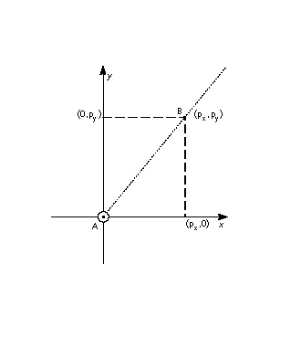

### GPV[] Get Projection Vector 获取投影向量

<table>
  <tr>
    <td>代码范围</td>
    <td>0x0C</td>
  </tr>
  <tr>
    <td>Pops</td>
    <td>-</td>
  </tr>
  <tr>
    <td rowspan="2" >Pushes 压入栈</td>
    <td>px: x 组件 (EF2Dot14)</td>
  </tr>
  <tr>
    <td>py：y 组件 (EF2Dot14)</td>
  </tr>
  <tr>
    <td>获取</td>
    <td>投影矢量</td>
  </tr>
  <tr>
    <td>相关说明</td>
    <td>GFV[ ]</td>
  </tr>
</table>

将当前投影向量分解为其 x 和 y 分量，并将这些分量作为两个 2.14 数字压入堆栈。
压入的第一个分量 px 是投影向量的 x 分量。 第二个压入的 py 是投影向量的 y 分量。

GPV[] 将投影矢量视为源自网格原点的单位矢量。 在下图中，A 点到 B 点的距离是一个单位。

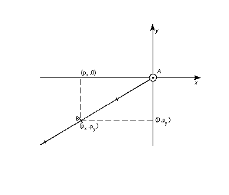

### GT[] 大于

<table>
  <tr>
    <td>代码范围</td>
    <td>0x52</td>
  </tr>
  <tr>
    <td>Pops</td>
    <td>e2：堆栈元素 e1：堆栈元素</td>
  </tr>
  <tr>
    <td>Pushes 压入栈</td>
    <td>b：布尔值（[0,1]范围内的uint32）</td>
  </tr>
  <tr>
    <td>相关指令</td>
    <td>LT[ ], GTEQ[ ]</td>
  </tr>
</table>

比较顶部两个堆栈元素的大小。
从堆栈中弹出两个整数 e2 和 e1 并比较它们。 如果 e1 大于 e2，则表示 TRUE 的 1 被压入堆栈。 如果 e1 不大于 e1，则表示 FALSE 的零被放入堆栈。

### GTEQ[] 大于或等于

<table>
  <tr>
    <td>代码范围</td>
    <td>0x53</td>
  </tr>
  <tr>
    <td>Pops</td>
    <td>e2：堆栈元素 e1：堆栈元素</td>
  </tr>
  <tr>
    <td>Pushes 压入栈</td>
    <td>b：布尔值（[0,1]范围内的uint32）</td>
  </tr>
  <tr>
    <td>相关指令</td>
    <td>LTEQ[ ], GT[ ]</td>
  </tr>
</table>

比较顶部两个堆栈元素的大小。
从堆栈中弹出两个整数 e2 和 e1 并比较它们。 如果 e1 大于或等于 e2，则表示 TRUE 的 1 被压入堆栈。 如果 e1 不大于或等于 e1，则表示 FALSE 的零被放入堆栈。

### IDEF[] 指令定义

<table>
  <tr>
    <td>代码范围</td>
    <td>0x89</td>
  </tr>
  <tr>
    <td>Pops</td>
    <td>操作码 (Eint8)</td>
  </tr>
  <tr>
    <td>Pushes 压入栈</td>
    <td>-</td>
  </tr>
  <tr>
    <td>相关指令</td>
    <td>ENDF[ ]</td>
  </tr>
</table>

开始指令的定义。 该指令由弹出的操作码标识。 IDEF[ ] 指令的目的是允许旧版本的缩放器使用使用在以后版本的 TrueType 解释器中定义的指令的字体。 引用未定义的操作码将无效。 IDEF[ ] 不适用于创建用户定义的指令。 FDEF[ ] 应该用于该目的。
当在指令流中遇到 ENDF[ ] 时，以 IDEF[ ] 开始的指令定义终止。 不允许嵌套的 IDEF。 弹出的操作码的后续执行将定向到该指令定义的内容。 IDEF 应在字体程序中定义。 不建议在 CVT 程序中定义指令。

### IF[] IF test

<table>
  <tr>
    <td>代码范围</td>
    <td>0x58</td>
  </tr>
  <tr>
    <td>Pops</td>
    <td>e：堆栈元素</td>
  </tr>
  <tr>
    <td>Pushes 压入栈</td>
    <td>-</td>
  </tr>
  <tr>
    <td>相关指令</td>
    <td>ELSE[ ], EIF[ ]</td>
  </tr>
</table>

标记 if 语句的开始。
从堆栈中弹出一个整数 e。 如果 e 为零 (FALSE)，指令指针将移动到指令流中关联的 ELSE 或 EIF[] 指令。 如果 e 为非零 (TRUE)，则执行指令流中的下一条指令。 执行将继续，直到遇到关联的 ELSE[] 指令或关联的 EIF[] 指令结束 IF[] 语句。 如果在 EIF[] 之前找到关联的 ELSE[] 语句，则指令指针将移至 EIF[] 语句。

### INSTCTRL[ ] INSTRuction 执行控制

<table>
  <tr>
    <td>代码范围</td>
    <td>0x8E</td>
  </tr>
  <tr>
    <td>Pops</td>
    <td>s：选择器（int32） v：指令控制值（int32）</td>
  </tr>
  <tr>
    <td>Pushes 压入栈</td>
    <td>-</td>
  </tr>
  <tr>
    <td>设置</td>
    <td>指令控制</td>
  </tr>
</table>

设置指令控制状态变量，可以打开或关闭指令的执行并调节 CVT 程序中设置的参数的使用。

该指令清除和设置各种控制标志。 选择器用于选择相关标志。 该值决定了该标志的新设置。

在 1.0 版中，只使用了两个标志。

标志 1 用于禁止网格拟合。 选择器值为 1。如果此标志设置为 TRUE (v=1)，则不会执行与字形相关的任何指令。 如果标志为 FALSE (v=0)，指令将被执行。 例如，要在旋转或拉伸字形时禁止网格调整，请在预编程中使用以下序列：

<table>
  <tr>
    <td>PUSHB[000] 6</td>
    <td>/* 要求 GETINFO 检查拉伸或旋转 */</td>
  </tr>
  <tr>
    <td>GETINFO[ ]</td>
    <td>/* 如果字形被拉伸或旋转，将推送 TRUE */</td>
  </tr>
  <tr>
    <td>IF[]</td>
    <td>/* 测试栈顶的值 */</td>
  </tr>
  <tr>
    <td>PUSHB[000] 1</td>
    <td>/* INSTCTRL 的值 */</td>
  </tr>
  <tr>
    <td>PUSHB[000] 1</td>
    <td>/* INSTCTRL 选择器 */</td>
  </tr>
  <tr>
    <td>INSTCTRL[]</td>
    <td>/* 基于选择器和值将关闭网格匹配 */</td>
  </tr>
  <tr>
    <td colspan="2" >EIF[]</td>
  </tr>
</table>

标志 2 用于确定在执行与字形相关的指令时应忽略 CVT 程序中设置的任何参数。 这些包括，例如，扫描类型和 CVT 切入的值。 当 flag2 设置为 TRUE 时，将使用这些参数的默认值，而不管预编程对这些值所做的任何更改。 当 flag2 设置为 FALSE 时，由 CVT 程序更改的参数值将用于字形指令。

INSTCTRL[] 只能在 CVT 程序中执行。

### IP[] Interpolate Point 插值点

<table>
  <tr>
    <td>代码范围</td>
    <td>0x39</td>
  </tr>
  <tr>
    <td>Pops</td>
    <td>p1, p2, , ploopvalue: 点数 (uint32)</td>
  </tr>
  <tr>
    <td>Pushes 压入栈</td>
    <td>-</td>
  </tr>
  <tr>
    <td>使用</td>
    <td>带 rp1 的 zp0、带 rp2 的 zp1、带点 p 的 zp2、循环、自由向量、投影向量、双投影向量</td>
  </tr>
  <tr>
    <td>相关指令</td>
    <td>IUP[ ]</td>
  </tr>
</table>

对指定点的位置进行插值以保留它们与参考点 rp1 和 rp2 的原始关系。

从堆栈中弹出点编号 p1、p2、...、ploopvalue。 移动每个点 pi，使其与 rp1 和 rp2 的关系与原始无指令轮廓中的关系相同。 即，以下关系成立：
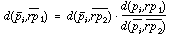

如果 rp1 和 rp2 在投影向量上占据相同的位置，则该指令是非法的。

更直观地说，IP[] 指令保留了一个点相对于两个参考点的相对关系。

在下图中，点 p 是相对于参考点 rp1 和 rp2 进行插值的。 第一张图中，IP[]指令执行前的情况，p点到rp1原位置的距离为d1，p点到rp2原位置的距离为d2。 两个距离之比为 d1:d2。

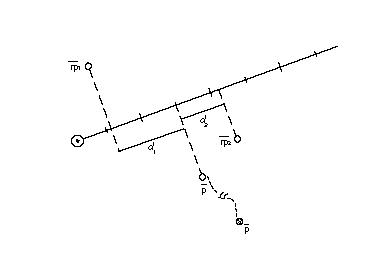

IP[] 指令的效果如下图所示。 它沿着自由向量移动点 p，直到从 rp1 的当前位置到点 p 的距离 d3 与从点 p 到点 rp2 的当前位置的距离 d4 之比等于 d1:d2。 也就是说，点 p 沿着自由向量移动，直到 d1:d2 = d3:d4。当这些距离沿着投影向量测量时。

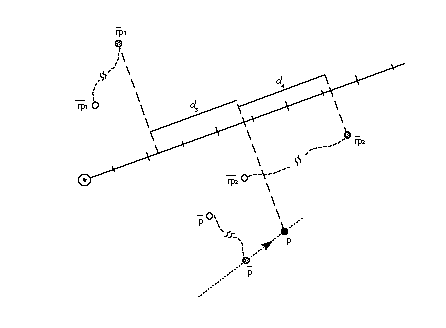

### ISECT[] 将点 p 移动到两条线的 InterSECTion

<table>
  <tr>
    <td>代码范围</td>
    <td>0x0F</td>
  </tr>
  <tr>
    <td rowspan="5" >Pops</td>
    <td>a0：A线的起点（uint32）</td>
  </tr>
  <tr>
    <td>a1：A线的终点（uint32）</td>
  </tr>
  <tr>
    <td>b0：B线的起点（uint32）</td>
  </tr>
  <tr>
    <td>b1：B线的终点（uint32）</td>
  </tr>
  <tr>
    <td>p：要移动的点 (uint32) 推动 -</td>
  </tr>
  <tr>
    <td>相关指令</td>
    <td>zp2 with point p, zp0 with line A, zp1 with line B</td>
  </tr>
</table>

将指定的点移动到指定的两条线的交点。

弹出 A 行的端点 a0 和 a1，然后是 B 行的端点 b0 和 b1，然后是点 p。 将点 p 置于直线 A 和 B 的交点处。点 a0 和 a1 定义直线 A。类似地，b0 和 b1</rpe> 定义直线 B。ISECT 忽略移动点 p 中的自由向量。

在平行线 A 和 B 的退化情况下，该点位于中间。 那是。

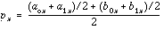

在下图中，点 p 从其当前位置移动到 a0、a1 定义的直线与 b0、b1 定义的直线的交点。 请注意，点 p 不需要沿着自由向量移动，而只是简单地重新定位在交点处。

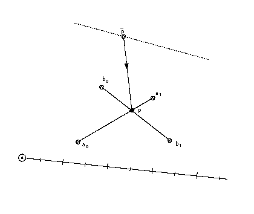

### IUP[a] 通过轮廓插值未触及的点

<table>
  <tr>
    <td>代码范围</td>
    <td>0x30 - 0x31</td>
  </tr>
  <tr>
    <td rowspan="2" >a</td>
    <td>0：在y方向插值</td>
  </tr>
  <tr>
    <td>1：在x方向插值</td>
  </tr>
  <tr>
    <td>Pops</td>
    <td>-</td>
  </tr>
  <tr>
    <td>Pushes 压入栈</td>
    <td>-</td>
  </tr>
  <tr>
    <td>使用</td>
    <td>zp2</td>
  </tr>
  <tr>
    <td>相关指令</td>
    <td>IP[ ]</td>
  </tr>
</table>

在 zp2 引用的区域中插入未接触点，以保留未接触点与该区域中其他点的原始关系。

逐个轮廓考虑参考字形轮廓轮廓，移动按顺序落在一对触摸点之间的任何未触摸点。 然而，这样一个点如何移动取决于它的投影是否落在触摸点的投影之间。 也就是说，如果未触摸点的投影 x 坐标或 y 坐标（取决于插值是在 x 中还是在 y 中）最初位于触摸对的坐标之间，则该坐标将在新坐标之间线性插值 接触点。 否则，未触摸点将移动最近触摸点从其原始轮廓位置移动的量。 布尔值 a 决定插值是在 x 方向还是在 y 方向。 自由度和投影矢量的当前设置不相关。

下面的一组图说明了这种区别。 第一张图显示了执行 IUP[] 指令之前的轮廓。 这里 p1、p2、p3、p4 和 p5 是轮廓上的连续点。 点 p2、p3 和 p4 都依次落在轮廓上的 p1 和 p5 之间。 假设点 p3 已被触及。

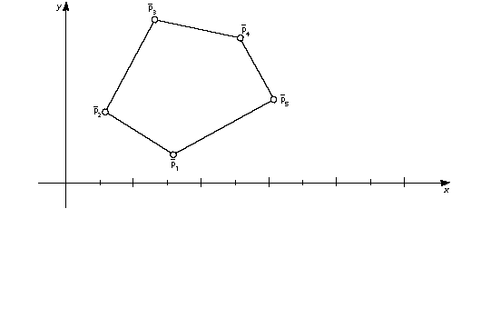

点 p4 的 x 坐标介于 p1 和 p5 之间，而点 p2 和 p3 则没有。 假设 p1 和 p5 已被先前的指令移动，并且点 p3 已被触摸但未从其原始位置移动。 作为 IUP[1] 的结果，发生了 x 方向的插值。 点 p4 将被线性插值。 点 p2 将移动最近触摸点移动的量。 点 p3 将不受影响。 （假设点 p2 和 p4 处于它们的原始位置。这不是严格必要的，因为 UTP[ ] 指令可以不触及已移动的点，因此受 IUP[ ] 指令的操作影响。）

作为 IUP[1] 指令的结果，移动了两个点。 第一步是下图所示的转变。 点 p1 从其原始位置平行于 x 轴移动了 ds 个单位的距离。 点 p2 平行于 x 轴移动，直到它与原始位置的距离等于 ds。

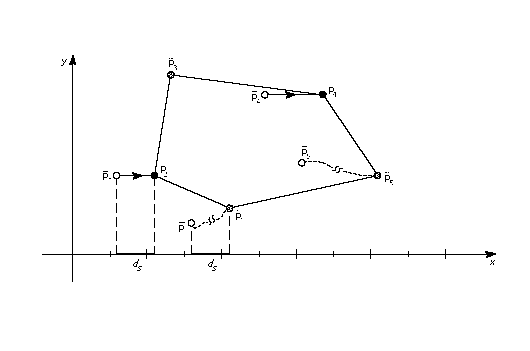

第二步是下图所示的线性插值。 点 p4 沿指定轴移动到一个新位置，该位置保持与点 p1 和 p5 的相对距离。 插值后点p4到p1的原始距离(d1)与点p4到p5的原始距离(d2)之比等于点p4到p1(d3)的新距离与新点p4到p1的新距离(d3)之比。 点 p4 到 p4 的距离 (d4)。 即：d1:d2 = d3:d4

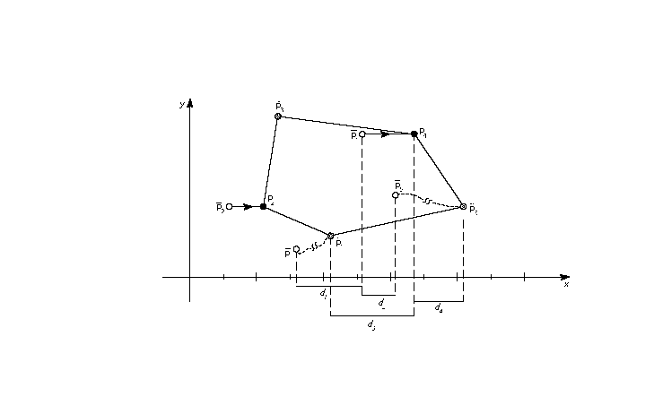

该指令对 zp2 指向的字形区域中的点进行操作。 该区域应始终为区域 1。将 IUP[ ] 应用于区域 0 是非法的。

IUP[ ] 指令不接触它移动的点。 因此，受 IUP[ ] 指令影响的未触及点将受到后续 IUP[] 指令的影响，除非它们被中间指令触及。

### JMPR[] JuMP 相对

<table>
  <tr>
    <td>代码范围</td>
    <td>0x1C</td>
  </tr>
  <tr>
    <td>Pops</td>
    <td>偏移量：要移动指令指针的字节数 (int32)</td>
  </tr>
  <tr>
    <td>Pushes 压入栈</td>
    <td>-</td>
  </tr>
  <tr>
    <td>相关指令</td>
    <td>JROF[ ], JROT[ ]</td>
  </tr>
</table>

将指令指针移动到由从堆栈中弹出的偏移量指定的新位置。
从堆栈弹出一个整数偏移量。 带符号的偏移量被添加到指令指针，并在指令流中的新位置恢复执行。 跳转是相对于指令本身的位置。 也就是说，+1 的偏移量会导致紧跟在 JMPR[] 指令之后的指令被执行。

### JROF[] 相对跳转设置为假

<table>
  <tr>
    <td>代码范围</td>
    <td>0x79</td>
  </tr>
  <tr>
    <td>Pops</td>
    <td>e：堆栈元素偏移量：要移动指令指针的字节数（int32）</td>
  </tr>
  <tr>
    <td>Pushes 压入栈</td>
    <td>-</td>
  </tr>
  <tr>
    <td>相关指令</td>
    <td>JMPR[ ] JROT[ ]</td>
  </tr>
</table>

如果测试的元素具有 FALSE（零）值，则将指令指针移动到由从堆栈弹出的偏移量指定的新位置。

弹出一个布尔值 e 和一个偏移量。 在布尔值 e 为 FALSE 的情况下，带符号的偏移量将添加到指令指针，并在新位置恢复执行； 否则，不进行跳跃。 跳转是相对于指令本身的位置。

### JROT[] 相对跳转设置为 True 

<table>
  <tr>
    <td>代码范围</td>
    <td>0x78</td>
  </tr>
  <tr>
    <td rowspan="3" >Pops</td>
    <td>e：堆栈元素</td>
  </tr>
  <tr>
    <td>偏移量：要移动的字节数</td>
  </tr>
  <tr>
    <td>指令指针（int32）</td>
  </tr>
  <tr>
    <td>Pushes 压入栈</td>
    <td>-</td>
  </tr>
  <tr>
    <td>相关指令</td>
    <td>JMPR[ ] JROF[ ]</td>
  </tr>
</table>

如果测试的元素具有 TRUE 值，则将指令指针移动到由从堆栈弹出的偏移值指定的新位置。
弹出一个布尔值 e 和一个偏移量。 如果布尔值为 TRUE（非零），则带符号的偏移量将添加到指令指针，并且将在获得的地址处恢复执行。 否则，不会进行跳跃。 跳转是相对于指令本身的位置。

### LOOPCALL[] 循环调用函数

<table>
  <tr>
    <td>代码范围</td>
    <td>0x2A</td>
  </tr>
  <tr>
    <td>Pops</td>
    <td>f：0 到 (n-1) 范围内的函数编号整数，其中 n 在“maxp”表中指定
count：调用函数的次数（有符号字）</td>
  </tr>
  <tr>
    <td>Pushes 压入栈</td>
    <td>-</td>
  </tr>
  <tr>
    <td>相关指令</td>
    <td>SLOOP[ ]</td>
  </tr>
</table>

反复调用一个函数。

弹出一个函数编号 f 和一个计数。 调用函数 f，计算次数。

### LT[] 小于

<table>
  <tr>
    <td>代码范围</td>
    <td>0x50</td>
  </tr>
  <tr>
    <td rowspan="2" >Pops</td>
    <td>e2：堆栈元素（StkElt）</td>
  </tr>
  <tr>
    <td>e1：堆栈元素（StkElt）</td>
  </tr>
  <tr>
    <td>Pushes 压入栈</td>
    <td>b：布尔值（[0,1]范围内的uint32）</td>
  </tr>
  <tr>
    <td>相关指令</td>
    <td>GT[ ], LTEQ[ ]</td>
  </tr>
</table>

比较堆栈顶部的两个数字。 如果两个数字中的第二个小于第一个，则测试成功。

从堆栈中弹出两个整数 e2 和 e1，并比较它们。 如果 e1 小于 e2，则将表示 TRUE 的 1 压入堆栈。 如果 e1 不小于 e2，则将表示 FALSE 的 0 放入堆栈。

### LTEQ[] 小于或等于

<table>
  <tr>
    <td>代码范围</td>
    <td>0x51</td>
  </tr>
  <tr>
    <td rowspan="2" >Pops</td>
    <td>e2：堆栈元素</td>
  </tr>
  <tr>
    <td>e1：堆栈元素</td>
  </tr>
  <tr>
    <td>Pushes 压入栈</td>
    <td>b：布尔值（[0,1]范围内的uint32）</td>
  </tr>
  <tr>
    <td>相关指令</td>
    <td>GTEQ[ ], LT[ ]</td>
  </tr>
</table>

比较堆栈顶部的两个数字。 如果两个数字中的第二个小于或等于第一个，则测试成功。
从堆栈中弹出两个整数 e2 和 e1 并比较它们。 如果 e1 小于或等于 e2，则表示 TRUE 的 1 被压入堆栈。 如果 e1 大于 e2，则将零（表示 FALSE）放入堆栈。

### MAX[] 栈顶两个元素的最大值

<table>
  <tr>
    <td>代码范围</td>
    <td>0x8B</td>
  </tr>
  <tr>
    <td rowspan="2" >Pops</td>
    <td>e2：堆栈元素</td>
  </tr>
  <tr>
    <td>e1：堆栈元素</td>
  </tr>
  <tr>
    <td>Pushes 压入栈</td>
    <td>e1 和 e2 的最大值</td>
  </tr>
  <tr>
    <td>相关指令</td>
    <td>MIN[ ]</td>
  </tr>
</table>

返回栈顶两个元素中较大的一个。

从堆栈中弹出两个元素 e2 和 e1，并将这两个量中较大的一个压入堆栈。

### MD[a] 测量距离

<table>
  <tr>
    <td>代码范围</td>
    <td>0x49 - 0x4A</td>
  </tr>
  <tr>
    <td rowspan="2" >a</td>
    <td>0：测量网格拟合轮廓中的距离</td>
  </tr>
  <tr>
    <td>1：测量原始轮廓中的距离</td>
  </tr>
  <tr>
    <td>Pops 弹出</td>
    <td>p2：点编号 (uint32) p1：点编号 (uint32)</td>
  </tr>
  <tr>
    <td>Pushes 压入栈</td>
    <td>d：距离（F26Dot6）</td>
  </tr>
</table>

将 zp0 与点 p1、zp1 与点 p2、投影向量、双投影向量一起使用
测量指定的两点之间的距离。

弹出两个点编号 p2 和 p1 并测量指定的两个点之间的距离。 距离 d 作为像素坐标被推入堆栈。 距离是有符号的。 颠倒列出点的顺序将改变结果的符号。

根据布尔变量 a 的设置，将在原始轮廓或网格拟合轮廓中测量距离。 MD[0] 测量原始轮廓中的距离，而 MD[1] 测量网格拟合轮廓中的距离。 与往常一样，距离是沿着投影矢量测量的。 正如颠倒点的排列顺序会改变距离的符号一样，颠倒投影矢量的方向也会产生同样的效果。

在下面的示例中，MD[1] 将产生从点 p1 到点 p2 的原始轮廓距离。 MD[0] 将产生从点 p1 到点 p2 的距离。

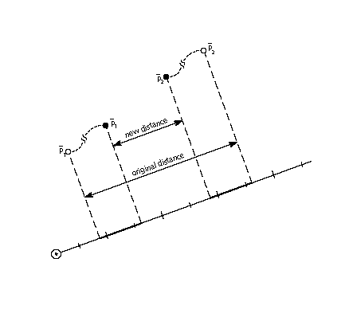

### MDAP[a] (Move Direct Absolute Point) 直接移动绝对点

<table>
  <tr>
    <td>代码范围</td>
    <td>0x2E - 0x2F</td>
  </tr>
  <tr>
    <td rowspan="2" >a</td>
    <td>0：不对值进行四舍五入</td>
  </tr>
  <tr>
    <td>1：对值进行四舍五入</td>
  </tr>
  <tr>
    <td>Pops 弹出</td>
    <td>p：点编号（uint32）</td>
  </tr>
  <tr>
    <td>Pushes 压入栈</td>
    <td>-</td>
  </tr>
  <tr>
    <td>Sets 设置</td>
    <td>rp0 和 rp1 设置为点 p</td>
  </tr>
  <tr>
    <td>Uses 使用</td>
    <td>zp0，自由向量，投影向量，圆形状态</td>
  </tr>
  <tr>
    <td>相关指令</td>
    <td>MDRP[ ], MIAP[ ]</td>
  </tr>
</table>

触发并在某些情况下舍入指定点。 “被打乱”的点将不受后续IUP[]指令的影响，并且通常旨在用作未来指令的参考点。 点按舍入设置为网格的点将导致该点沿投影向量具有整数值坐标。 如果投影矢量设置为 x 轴或 y 轴，这将导致点网格对齐。
弹出一个点编号 p，并将参考点 rp0 和 rp1 设置为点 p。 如果布尔值 a 设置为 1，则根据投影矢量测量的点 p 的坐标将被舍入，然后从其当前位置移动舍入距离。 如果布尔值 a 设置为 0，则点 p 不会移动，但仍被标记为沿当前自由向量指定的方向触发。

### MDRP[abcde](Move Direct Relative Point) 移动径直相对点

<table>
  <tr>
    <td>代码范围</td>
    <td>0xC0 - 0xDF</td>
  </tr>
  <tr>
    <td rowspan="2" >a</td>
    <td>0：不重置rp0到点p</td>
  </tr>
  <tr>
    <td>1：设置rp0为点p</td>
  </tr>
  <tr>
    <td rowspan="2" >b</td>
    <td>0：不保持距离大于或等于最小距离</td>
  </tr>
  <tr>
    <td>1：保持距离大于或等于最小距离</td>
  </tr>
  <tr>
    <td rowspan="2" >c</td>
    <td>0：不舍入距离</td>
  </tr>
  <tr>
    <td>1：四舍五入距离</td>
  </tr>
  <tr>
    <td>de</td>
    <td>引擎特性补偿的距离类型</td>
  </tr>
  <tr>
    <td>Pops 弹出</td>
    <td>p2：点数 (uint32)</td>
  </tr>
  <tr>
    <td>Pushes 压入栈</td>
    <td>-</td>
  </tr>
  <tr>
    <td>Sets 设置</td>
    <td>p点移动后，rp1等于rp0，rp2等于点号p； 如果 a 标志设置为 TRUE，则 rp0 设置为等于点号 p</td>
  </tr>
  <tr>
    <td>Uses 使用</td>
    <td>d：距离（F26Dot6）</td>
  </tr>
  <tr>
    <td>Pushes 压入栈</td>
    <td>zp0 与 rp0 和 zp1 与点 p、最小距离、圆形状态、单宽度值、单宽度切入、自由向量、投影向量、双投影向量</td>
  </tr>
  <tr>
    <td>相关指令</td>
    <td>MDAP[ ], MIRP[ ]</td>
  </tr>
</table>

保留指定点和参考点 rp0 之间的主轮廓距离。

弹出一个点号p，并沿自由向量移动点p，使其新位置到rp0当前位置的距离与原始无指令轮廓中两点之间的距离相同，然后调整为 与布尔设置保持一致。 请注意，只有 rp0 和点 p 的原始位置以及 rp0 的当前位置决定了点 p 沿自由向量的新位置。

MDRP[] 通常用于使用来自原始轮廓的值来控制字形特征的宽度或高度。 由于 MDRP[] 使用直接测量并且不引用控制值切入，因此它用于控制所指示的字形所特有的测量。 如果需要协调对点的控制与字体中其他字形中的点的处理，则需要 MIRP[] 指令。

虽然MDRP[]不是指CVT，但其效果确实取决于单宽度切入值。 如果从无指令轮廓获取的测量值与单一宽度值之间的设备空间距离小于单一宽度切入，则将优先使用单一宽度值而不是轮廓距离。 换句话说，如果两个距离足够近（相差小于单一宽度切入），则将使用单一宽度值。

round state图形状态变量的设置将决定点p到rp0的距离是否以及如何舍入。 如果未设置舍入位，则该值将不舍入。 如果设置了舍入位，则效果将取决于舍入状态的选择。

MDRP[]指令也可以设置为使用最小距离值。 最小距离设置两点之间的距离可以舍入到的值的下限。

与所有 TrueType 距离一样，使用 MDRP[] 指令测量的距离必须是黑色、白色或灰色。 用布尔值表示该值允许解释器根据需要补偿发动机特性。

如下图所示，点 p 沿着自由向量从当前位置移动到距参考点 rp0 距离为 d 的新位置。 这个距离与p到rp0的原始距离相同。

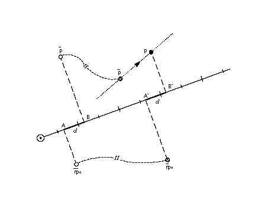

### MIAP[a] 移动间接绝对点

<table>
  <tr>
    <td>代码范围</td>
    <td>0x3E - 0x3F</td>
  </tr>
  <tr>
    <td rowspan="2" >a</td>
    <td>0：不舍入距离，不看控制值切入</td>
  </tr>
  <tr>
    <td>1：圆整距离，看控制值切入</td>
  </tr>
  <tr>
    <td rowspan="2" >Pops 弹出</td>
    <td>n：CVT 条目号 (F26Dot6)</td>
  </tr>
  <tr>
    <td>p：点编号（uint32）</td>
  </tr>
  <tr>
    <td>Pushes 压入栈</td>
    <td>-</td>
  </tr>
  <tr>
    <td>Sets 设置</td>
    <td>将 rp0 和 rp1 设置为点 p</td>
  </tr>
  <tr>
    <td>Uses 使用</td>
    <td>zp0、圆形状态、控制值切入、自由向量、投影向量</td>
  </tr>
  <tr>
    <td>相关指令</td>
    <td>MSIRP[ ], MIRP[ ], MDAP[ ]</td>
  </tr>
</table>

通过将点移动到控制值表中指定的位置，可以将点的位置与其他相似点的位置进行协调。

弹出CVT条目号n和点号p，然后将点p移动到第n个控制值表条目指定的绝对坐标位置。 坐标是沿着当前投影矢量测量的。 如果布尔值 a 的值为 1，则位置将按照舍入状态指定进行舍入。 如果布尔值a的值为1并且CVT值与原始位置之间的设备空间差大于控制值切入，则原始位置将被四舍五入（而不是CVT值）。

上面的布尔值控制舍入和控制值切入的使用。 要让该布尔值仅指定 MIAP[] 指令是否应查看控制值切入值，请使用 ROFF[] 指令关闭舍入。

该指令可用于“创建”暮光区点。 这是通过将 zp0 设置为区域 0 并将最初位于原点的指定点移动到所需位置来完成的。

在下图中，点 p 沿着自由向量移动，直到它占据沿着投影向量投影到 c 个单位的位置。

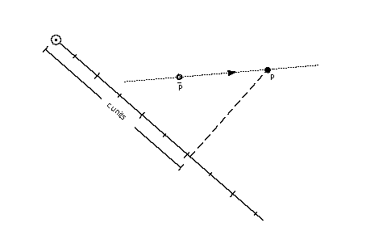

### MIN[] 栈顶两个元素的最小值

<table>
  <tr>
    <td>代码范围</td>
    <td>0x8C</td>
  </tr>
    <td>Pops 弹出</td>
    <td>e2：堆栈元素 e1：堆栈元素</td>
  </tr>
  <tr>
    <td>Pushes 压入栈</td>
    <td>e1 和 e2 中的最小值</td>
  </tr>
  <tr>
    <td>相关指令</td>
    <td>MAX[ ]</td>
  </tr>
</table>

返回顶部两个堆栈元素中的最小值。

### MINDEX[] 将 INDEXed 元素移动到栈顶

<table>
  <tr>
    <td>代码范围</td>
    <td>0x26</td>
  </tr>
    <td>Pops 弹出</td>
    <td>k：堆栈元素</td>
  </tr>
  <tr>
    <td>Pushes 压入栈</td>
    <td>ek：堆栈元素</td>
  </tr>
  <tr>
    <td rowspan="5" >堆栈之前</td>
    <td>k：堆栈元素编号（uint32）</td>
  </tr>
  <tr>
    <td>e1：堆栈元素</td>
  </tr>
  <tr>
    <td>...</td>
  </tr>
  <tr>
    <td>ek-1：堆栈元素</td>
  </tr>
  <tr>
    <td>ek：栈元素</td>
  </tr>
  <tr>
    <td rowspan="4" >堆栈之后</td>
    <td>ek：索引元素</td>
  </tr>
  <tr>
    <td>e1：堆栈元素</td>
  </tr>
  <tr>
    <td>...</td>
  </tr>
  <tr>
    <td>ek-1：堆栈元素</td>
  </tr>
  <tr>
    <td>相关指令</td>
    <td>CINDEX[ ]</td>
  </tr>
</table>

将索引元素移动到堆栈顶部，从而将其从原始位置删除。

从堆栈中弹出一个整数 k，并将索引为 k 的元素移动到堆栈顶部。

### MIRP[abcde] 移动间接相对点

<table>
  <tr>
    <td>代码范围</td>
    <td>0xE0 - 0xFF</td>
  </tr>
  <tr>
    <td rowspan="2" >a</td>
    <td>0：不将rp0设置为p</td>
  </tr>
  <tr>
    <td>1：设置rp0为p</td>
  </tr>
  <tr>
    <td rowspan="2" >b</td>
    <td>0：不保持距离大于或等于最小距离</td>
  </tr>
  <tr>
    <td>1：保持距离大于或等于最小距离</td>
  </tr>
  <tr>
    <td rowspan="2" >c</td>
    <td>0：不舍入距离，不看控制值切入</td>
  </tr>
  <tr>
    <td>1：圆整距离，看控制值切入值</td>
  </tr>
  <tr>
    <td>de：</td>
    <td>引擎特性补偿的距离类型</td>
  </tr>
  <tr>
    <td >Pops 弹出</td>
    <td>n：CVT 条目号 (F26Dot6) p：点号 (uint32)</td>
  </tr>
  <tr>
    <td>Pushes 压入栈</td>
    <td>-</td>
  </tr>
  <tr>
    <td>Uses 使用</td>
    <td>zp0 与 rp0 和 zp1 与点 p。 圆形状态、控制值切入、单宽度值、单宽度切入、自由向量、投影向量、自动翻转、双投影向量</td>
  </tr>
  <tr>
    <td>Sets 设置</td>
    <td>移动点后，该指令将 rp1 设置为等于 rp0，将 rp2 设置为等于点号 p； 最后，如果 a 的值为 TRUE，则 rp0 设置为点号 p。</td>
  </tr>
  <tr>
    <td>相关指令</td>
    <td>MSIRP[ ], MIAP[ ], MDRP[ ]</td>
  </tr>
</table>

通过使某个点和参考点之间的距离受控制值表条目的约束，可以将该距离与其他类似距离进行协调。
沿着自由向量移动点 p，使得从 p 到 rp0 当前位置的距离等于引用的 CVT 条目中规定的距离，假设切入测试成功。 请注意，在进行切入测试时，MIRP[] 使用 p 和 rp0 之间的原始轮廓距离。 如果切入测试失败，点 p 将被移动，使其距 rp0 当前位置的距离等于 p 与 rp0 引用的点之间的原始轮廓距离。

MIRP[] 指令可以根据许多条件保留两点之间的距离。 根据布尔标志b的设置，距离可以保持大于或等于由最小距离状态变量建立的值。 类似地，可以根据round state图形状态变量来设置指令对距离进行舍入。 最小距离变量的值是两点之间的距离可以舍入到的最小可能值。 另外，如果设置了 c 布尔值，则 MIRP[] 指令将根据控制值切入进行操作。 如果实际测量值与 CVT 中的值之间的差异足够小（小于切入值），则将使用 CVT 值而不是实际值。 如果CVT值和单宽度值之间的设备空间差小于单宽度切入，则使用单宽度值而不是控制值表距离。

上面的 c 布尔值控制舍入和控制值表条目的使用。 如果您希望此布尔值的含义仅指定 MIRP[] 指令是否应查看控制值切入，请使用 ROFF[] 指令关闭舍入。 通过这种方式，可以指定舍入已关闭，但切入仍然适用。

MIRP[] 可用于在暮光区域创建点。

在下图中，点 p 沿着自由向量移动，直到其到点 rp0 的距离等于参考 CVT 条目中找到的距离 d。

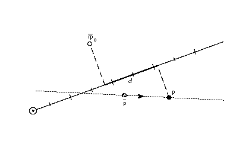

### MPPEM[] Measure Pixels Per EM 测量每个 EM 的像素

<table>
  <tr>
    <td>代码范围</td>
    <td>0x4B</td>
  </tr>
    <td>Pops 弹出</td>
    <td>-</td>
  </tr>
  <tr>
    <td>Pushes 压入栈</td>
    <td>ppem：每 em 的像素 (Euint16)</td>
  </tr>
  <tr>
    <td>使用</td>
    <td>投影向量</td>
  </tr>
  <tr>
    <td>相关指令</td>
    <td>MPS[ ]</td>
  </tr>
</table>

将当前每 em 的像素数推入堆栈。 每em的像素是渲染设备的分辨率以及当前点大小和当前变换矩阵的函数。 该指令查看投影向量并返回该方向上每 em 的像素数。 该数字始终是整数。

下图分别显示了 18 点 Times New Roman 字体在 72 dpi、144 dpi 和 300 dpi 下的放大倍数。 增加每 em 的像素数可以提高所获得图像的质量。 但是，它不会改变所获得图像的绝对大小。

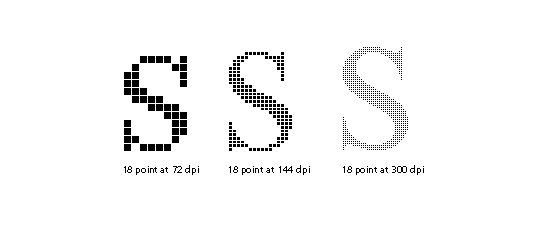

### MPS[] Measure Point Size 测量点大小

<table>
  <tr>
    <td>代码范围</td>
    <td>0x4C</td>
  </tr>
    <td>Pops 弹出</td>
    <td>-</td>
  </tr>
  <tr>
    <td>Pushes 压入栈</td>
    <td>pointSize: 当前点大小(Euint16)</td>
  </tr>
  <tr>
    <td>相关指令</td>
    <td>MPPEM[ ]</td>
  </tr>
</table>

将当前点值推入堆栈。

测量点大小可用于获得一个值，该值用作选择是否分支到通过指令流的替代路径的基础。 它使得可以以不同的方式处理低于或高于某个阈值的点大小。

下图显示了 72 dpi 下 12 点、24 点和 48 点 Times New Roman Q 的放大倍数。 请注意，增加字形的点大小会增加其绝对大小。 在低分辨率设备（例如屏幕）上，可以以更高的点大小捕获更多细节。

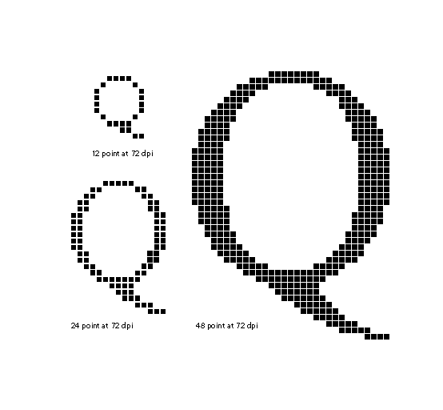

### MSIRP[a] Move Stack Indirect Relative Point 移动堆栈间接相对点

<table>
  <tr>
    <td>代码范围</td>
    <td>0x3A - 0x3B</td>
  </tr>
  <tr>
    <td rowspan="2" >a</td>
    <td>0：不改变rp0</td>
  </tr>
  <tr>
    <td>1：设置rp0为点号p</td>
  </tr>
  <tr>
    <td >Pops 弹出</td>
    <td>d: 距离 (F26Dot6) p: 点编号 (uint32)</td>
  </tr>
  <tr>
    <td>Pushes 压入栈</td>
    <td>-</td>
  </tr>
  <tr>
    <td>Uses 使用</td>
    <td>zp1 与点 p 和 zp0 与 rp0、自由向量、投影向量</td>
  </tr>
  <tr>
    <td>相关指令</td>
    <td>MIRP[ ]</td>
  </tr>
</table>

通过设置从堆栈中弹出的值的距离，可以协调点和参考点之间的距离。

弹出距离 d 和点编号 p，并使点 p 与 rp0 当前位置之间的距离等于 d。 距离 d 以像素坐标表示。

MSIRP[ ] 与 MIRP[ ] 指令非常相似，只是从堆栈而不是 CVT 中获取距离。 由于MSIRP[]不使用CVT，因此控制值切入不是MIRP[]中的因素。 由于 MSIRP[ ] 不进行舍入，因此其效果不依赖于舍入状态。

MSIRP[] 可用于在暮光区域创建点。

在下图中，点 p 沿着自由向量移动，直到与 rp0 的距离为 d。

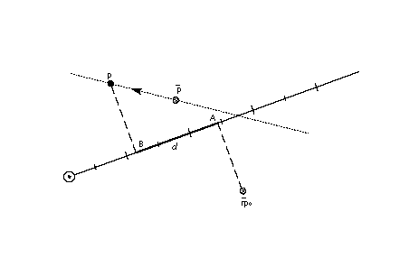

### MUL[] MULtiply 乘法

<table>
  <tr>
    <td>代码范围</td>
    <td>0x63</td>
  </tr>
    <td rowspan="2">Pops 弹出</td>
    <td>n2：乘数（F26Dot6</td>
  </tr>
  </tr>
    <td>n1：被乘数（F26Dot6）</td>
  </tr>
  <tr>
    <td>Pushes 压入栈</td>
    <td>(n2 * n1)/64：乘积 (F26Dot6)</td>
  </tr>
  <tr>
    <td>相关指令</td>
    <td>DIV[ ]</td>
  </tr>
</table>

将堆栈顶部的两个数字相乘。 从堆栈中弹出两个 26.6 数字 n2 和 n1，并将两个元素的乘积压入堆栈。 52.12 结果右移 6 位，并丢弃高 26 位，得到 26.6 结果。

### NEG[] NEGate 否定门

<table>
  <tr>
    <td>代码范围</td>
    <td>0x65</td>
  </tr>
    <td>Pops 弹出</td>
    <td>n：像素坐标（F26Dot6）</td>
  </tr>
  <tr>
    <td>Pushes 压入栈</td>
    <td>-n：n1 的否定 (F26Dot6)</td>
  </tr>
</table>

对堆栈顶部的数字求反。
从堆栈中弹出一个数字 n，并将 n 的负值压入堆栈。

### NEQ[] Not EQual 不等于

<table>
  <tr>
    <td>代码范围</td>
    <td>0x63</td>
  </tr>
    <td rowspan="2">Pops 弹出</td>
    <td>n2：乘数（F26Dot6</td>
  </tr>
  </tr>
    <td>n1：被乘数（F26Dot6）</td>
  </tr>
  <tr>
    <td>Pushes 压入栈</td>
    <td>(n2 * n1)/64：乘积 (F26Dot6)</td>
  </tr>
  <tr>
    <td>相关指令</td>
    <td>DIV[ ]</td>
  </tr>
</table>

判断栈顶两个元素是否不相等。
从堆栈中弹出两个数字 e2 和 e1 并比较它们。 如果它们不同，则将表示 TRUE 的 1 压入堆栈。 如果它们相等，则为零，表示 FALSE 被压入堆栈。

### NOT[] logical NOT 逻辑非

<table>
  <tr>
    <td>代码范围</td>
    <td>0x5C</td>
  </tr>
    <td>Pops 弹出</td>
    <td>e：栈元素</td>
  </tr>
  <tr>
    <td>Pushes 压入栈</td>
    <td>(not e)：e 的逻辑非 (uint32)</td>
  </tr>
</table>

对堆栈顶部的数字取逻辑非。

从堆栈中弹出数字 e，并返回对 e 执行逻辑 NOT 运算的结果。 如果 e 为零，则将 1 压入堆栈；如果 e 非零，则将 0 压入堆栈。

### NPUSHB[] PUSH N Bytes 压入 N 个字节

<table>
  <tr>
    <td>代码范围</td>
    <td>0x40</td>
  </tr>
    <td rowspan="2">From IS</td>
    <td>n：要推送的字节数（1 个字节解释为整数）</td>
  </tr>
  </tr>
    <td>b1, b2,...bn：n 个字节的序列</td>
  </tr>
  <tr>
    <td>Pushes 压入栈</td>
    <td>b1、b2、...bn：n 个字节的序列，每个字节扩展为 32 位 (uint32)</td>
  </tr>
  <tr>
    <td>相关指令</td>
    <td>NPUSHW[ ], PUSHB[ ], PUSHW[]</td>
  </tr>
</table>

从指令流中取出 n 个字节并将它们压入堆栈。

查看指令流中的下一个字节 n，并从指令流中取出 n 个无符号字节，其中 n 是 (0 255) 范围内的无符号整数，并将它们推入堆栈。 要压入的字节数 n 不会压入堆栈。

每个字节值在压入堆栈之前都会无符号扩展为 32 位。

### NPUSHW[] PUSH N Words 压入n个字

<table>
  <tr>
    <td>代码范围</td>
    <td>0x41</td>
  </tr>
    <td rowspan="2">From IS</td>
    <td>n：要压入的字数（1 个字节代表整数）</td>
  </tr>
  </tr>
    <td>w1, w2,...wn：由字节对组成的 n 个字序列，高字节首先出现</td>
  </tr>
  <tr>
    <td>Pushes 压入栈</td>
    <td>w1、w2、...wn：n 个字的序列，每个字扩展为 32 位 (int32)</td>
  </tr>
  <tr>
    <td>相关指令</td>
    <td>NPUSHW[ ], PUSHB[ ]</td>
  </tr>
</table>

从指令流中取出 n 个字并将它们压入堆栈。

查看下一个指令流字节 n 并从指令流中取出 n 个 16 位有符号字，其中 n 是 (0 255) 范围内的无符号整数，并将它们压入堆栈。 每个字在放入堆栈之前都会被符号扩展为 32 位。值 n 不会被压入堆栈。

### NROUND[ab] No ROUNDing of value 不对值进行舍入

<table>
  <tr>
    <td>代码范围</td>
    <td>0x6C - 0x6F</td>
  </tr>
  <tr>
    <td>ab</td>
    <td>引擎特性补偿的距离型</td>
  </tr>
  <tr>
    <td>Pops 弹出</td>
    <td>n1：像素坐标（F26Dot6）</td>
  </tr>
  <tr>
    <td>Pushes 压入栈</td>
    <td>n2：像素坐标（F26Dot6）</td>
  </tr>
  <tr>
    <td>相关说明</td>
    <td>ROUND[ ]</td>
  </tr>
</table>

更改堆栈顶部数字的值以补偿引擎特性。

从堆栈中弹出一个值 n1，并可能增加或减少其值以补偿使用布尔设置 ab 建立的引擎特性。 结果 n2 被压入堆栈。

NROUND[ab] 因其与 ROUND[ab] 的关系而得名。 它执行与 ROUND[ab] 相同的操作，只是它不对补偿引擎特性后获得的结果进行舍入。

### ODD[] ODD

<table>
  <tr>
    <td>代码范围</td>
    <td>0x6C - 0x6F</td>
  </tr>
  <tr>
    <td>Pops 弹出</td>
    <td>n1：像素坐标（F26Dot6）</td>
  </tr>
  <tr>
    <td>Pushes 压入栈</td>
    <td>n2：像素坐标（F26Dot6）</td>
  </tr>
  <tr>
    <td>使用</td>
    <td>四舍五入状态</td>
  </tr>
  <tr>
    <td>相关说明</td>
    <td>ROUND[ ]</td>
  </tr>
</table>

测试栈顶的数字是否为奇数。

从堆栈中弹出一个数字 e1，并在测试之前根据舍入状态的当前设置对其进行舍入。 然后该数字被截断为整数。 如果截断的数字是奇数，则将 1（表示 TRUE）压入堆栈；如果是偶数，则将 0（表示 FALSE）压入堆栈。

### OR[] logical OR

<table>
  <tr>
    <td>代码范围</td>
    <td>0x5B</td>
  </tr>
  <tr>
    <td>Pops 弹出</td>
    <td>e2：堆栈元素 e1：堆栈元素</td>
  </tr>
  <tr>
    <td>Pushes 压入栈</td>
    <td>(e1 或 e2)：e1 和 e2 的逻辑或 (uint32)</td>
  </tr>
  <tr>
    <td>相关说明</td>
    <td>AND[ ]</td>
  </tr>
</table>

取堆栈顶部两个数字的逻辑或。

将两个数字 e2 和 e1 从堆栈中弹出，并将两个元素之间的逻辑或运算的结果压入堆栈。 如果两个元素都为 FALSE（值为零），则压入零。 如果两个元素之一都为 TRUE（具有非零值），则压入 1。

