# 字体教程

## 介绍

优质轮廓字体是一种在低分辨率设备上以小尺寸提供易读性并在大尺寸和高分辨率设备上提供对原始设计的保真度的字体。 应尽量减少由于轮廓形状和网格放置之间的相互作用而产生的体积。 本节将描述如何指示 TrueType 字体以确保它具有刚刚描述的属性。

## 光栅化和网格

将字形轮廓转换为[位图](https://baike.baidu.com/item/%E4%BD%8D%E5%9B%BE/1017781)的一种简单技术是将轮廓叠加到光栅网格上。 中心位于网格内或网格上的所有像素都将成为要生成的位图图像的一部分。 其它的则不是。

使用此规则对圆进行光栅化的结果如图 1 所示。该图揭示了这种简单光栅化技术的一些缺点。 具体来说，结果会随着光栅网格中轮廓的精确位置而变化，并且生成的形状从左到右或从上到下都不是对称的，这在圆形中是理想的。

**图 1** 位图随栅格网格中的位置而变化

当在给定网格上以给定大小进行光栅化时，给定轮廓总是产生相同的结果会更好。 栅格化形状时应保留重要属性（如对称性）。

这类问题不仅具有理论上的重要性，而且会影响数字字体的易读性。 不受控制的光栅化产生的常见问题包括不均匀的词干权重、丢失、字符特征的丢失和衬线不对称。 此类问题的一些实例如图 2 所示。

**图 2** 光栅化问题

最终结果是字母在小尺寸时难以辨认，而在大尺寸时则不雅。 图 3 说明了阅读此类文本所固有的困难。

**图 3** 变化影响难以辨认的文本

随着分辨率或点大小的增加，光栅化问题最终会消失。然而，对于屏幕显示字体的用户来说，这样的改进还是不够，在许多情况下，对于那些在 300 dpi 设备上打印的用户来说也不够。

随着尺寸和分辨率的增加，易读性会提高，但即使在每 em 像素数相对较高的情况下，原始设计的优雅和保真度仍然存在问题。这个问题如图 4 所示。在这里，由哑光栅化生成的位图（左）清晰可辨，但不美观。其中比较明显的问题是 e 顶部的像素缺失、下部曲线的锯齿状以及计数器的外观不佳。

**图 4** 10 点无指令纽约 e，在 300 dpi设备

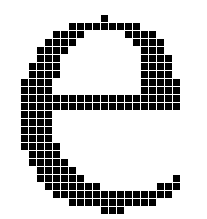

TrueType 语言试图通过在光栅化之前使字形轮廓变形以打开“正确的”像素来解决由光栅化事故引起的问题。这种技术，如图 5 所示，被称为“网格拟合”轮廓。在这里，施加在较浅主轮廓上的较暗轮廓表示将被光栅化以产生用于表示字形的最终输出位的轮廓。

**图 5** 网格拟合后的 10 点纽约 e 轮廓

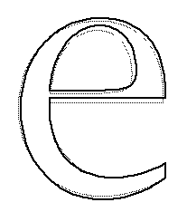

当网格拟合轮廓设置为光栅化器时，结果具有更令人愉悦的外观，更接近于主轮廓中捕获的设计。

**图 6** 10 点有指令 New York e，在 300 dpi 设备上

正如前面的讨论所建议的，网格拟合的一些目标如下：

* 消除变化对网格的影响。
* 控制字形内和字形之间的关键尺寸。
* 保留对称性和其他重要的字形特征。

但是，可以将这些一般概念进一步细化为一组可以用 TrueType 语言表达的目标。在接下来的几节中，将更具体地描述这些想法。

## 字体教程

本节概述了指导 TrueType 字体所涉及的任务。所提出的技术可用于字体的“手”指示。对这些技术的理解对于那些打算编写自动工具的人或任何需要对指导过程有低层次理解的人来说应该是有用的。

### 确定预期用途

在设计字体时，重要的是要确定预期使用该字体的每个 em 的最小像素数。如果它仅用于打印机或[照排机](https://baike.baidu.com/item/%E7%85%A7%E7%9B%B8%E6%8E%92%E5%AD%97%E6%9C%BA/7258484)，则设计任务将大大简化。通常，目标是在 72 dpi 设备上以屏幕尺寸可读的字体。这可能意味着将字体设置为每 em 9 个像素。

### 考虑字体有一个整体

在设计字形时，保留字体的整体外观和字形之间的关系很重要。要做到这一点，重要的是要确定适用于整个字体的关键尺寸，例如大写高度、x 高度和基线。在每个 em 尺寸的小像素下，这些尺寸的细微变化是不可能的，并且巨大的差异将是灾难性的。
在罗马字体中，大写“H”和“O”以及小写“n”和“o”通常用作控制字符，以确定笔直和圆形字符的大写高度和 x 高度. 这些字符可用于构建控制值表。

**图 7** 罗马字体的关键垂直尺寸。

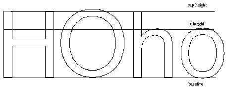

### 考虑单个字形
确定需要保留哪些字符特征。在每个 em 大小的小像素下，可能需要牺牲设计的某些方面。因此，有必要设置优先级。
要保留的关键特征包括应该在给定字符内均匀的词干权重，并且应该在字体中的相似字形中同时中断。其他通常值得关注的特征是衬线、词干宽度和对角线。

### 控制空白区域
在网格拟合字形中，目标不仅是控制光栅化时构成该字符的像素，还控制笔画之间和字形之间的空间。特别是在屏幕尺寸上，控制空白是一项关键任务。除非指令严格控制侧方位，否则字符可能会在屏幕上发生碰撞，从而损害文本的外观并破坏可读性。未能控制笔画之间的间距可能会导致字形看起来像黑色斑点。

### 控制向前宽度
保持向前宽度对于确保一致的间距很重要。通常在屏幕上获得最佳间距和在打印机上获得最佳间距之间存在冲突。例如，如果决定将右侧轴承舍入到网格中，则字形的原始前进宽度将略有改变。根据渲染字形的大小，效果可以是向上或向下舍入该值。这些错误在打印机尺寸上可能会被夸大，从而产生非常不希望的效果。
在指示向前宽度时，确定字体最重要的用途很重要。通常，优先考虑保留最常用字形的向前宽度。

### 避免规则化特征
为获得最佳结果，字体指导应遵循以下准则：
在小尺寸下，不应允许偶然效应放大字形原始轮廓设计中的微小差异。
在大尺寸下，原始设计的微妙之处应该会显现出来。
使用控制值表来协调字形中的特征将在小尺寸下实现理想的一致性，例如 x 高度。它还可以导致更大尺寸的正则化。例如，大写圆形字形的大写高度可能相差几个单位。在小尺寸下，忽略这些细微差异是正确的，因为像素太少而无法正确表示它们。在大尺寸时，必须允许设计师的意图重新出现。

TrueType 通过使用控制值表切入值解决了这个问题。

* 与控制值表条目相差小于“少量”的值应采用表值。
* 与控制值表条目相差超过“少量”的值应保留其原始轮廓值。
可接受的“少量”是对照值表切入，即表值首选的差值。在指示字体时，重要的是要意识到切入的效果。切入可以从其原始默认值更改或在始终首选表值的情况下完全关闭。

### 最后处理异常
健壮的指令应该处理字体中的大多数网格拟合需求。如果为特定大小的特定字形获得的结果令人失望，请使用 DELTA 指令来获取所需的位图。应谨慎使用 DELTA，并且仅在应用了非尺寸特定说明之后。

## 示例字体
在接下来的几节中，这些一般思想将应用于使用 TrueType 语言指示四个字符的问题。这些字符来自两种不同的字体：纽约和日内瓦。这些是同名的原始 Macintosh 位图面的 TrueType 再现。它们提供了指导衬线和无衬线面的示例。
下面的四个示例将把指示字形的任务作为一个三步过程来处理：

1. 确定要保留的关键特征。
2. 确定保留这些特征所需的几何约束。
3. 编写旨在保留这些功能的说明。

对于每个字形，将进行分析以确定哪些特征是最重要的保留。必须在字体中跨字形协调的尺寸将输入到控制值表中。最后，将提供每个字形说明的图解和注释外观。可以在“说明”部分找到所使用的每个指令的正式规范。

## 纽约字体：大写 H

New York H 用于说明罗马字体的大写衬线直字形的说明。一些大写的直线如图 8 所示。
**图 8** 大写直线

### 确定关键特征

指示大写H的问题可以分为两个子问题，控制x方向的距离和控制y方向的距离。

在 x 方向上要控制的关键距离如图 9 所示。它们是：

1. 字形左侧的空间
2. 主体宽度
3. 整体宽度（包括左右空间）
4. 主线宽度
5. 衬线（衬线指的是字体起始末端的细节装饰）

**图 9** New York H：x 方向的受控距离

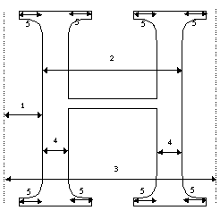

y方向要控制的关键距离如图10所示。它们是：

6. 横梁厚度
7. 衬线厚度
8. 整体高度
9. 横梁高度（横梁顶部距离底部高度）

<!-- apple 源文档有错误 -->

**图 10** New York H：y 方向的受控距离

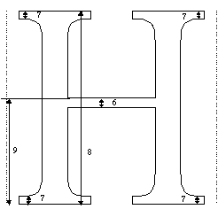

### 创建控制值表

大写 H 与此字体中的其他大写直字形具有共同特征。 需要协调此字形中的关键尺寸与其他相关字形中的关键尺寸，这表明需要许多控制值表条目。

H 的大写高度的控制值表条目来自对字体中相关字母高度的分析。 如下表1所示，entry 2的值为1552，查看字体数据发现这确实是H的高度，也是I、K、L等相关字形的高度。

要创建控制值表条目 4，即大写词干宽度，有必要查看整个字体的关键字形中词干的宽度，并找到一个所有字形都能接受的值。 一种可能的方法是对相关值进行平均。

一旦确定了值，就应该在控制值表中输入必要的控制值表条目。

正如几何分析所建议的以及随后的说明将展示的那样，H 的说明将需要多个控制值表条目。 它们如表 1 所示。

**表 1** 纽约控制值表

|入口|值|描述|
|-|-|-|
|0|1552|上限高度|
|1|0|基线|
|2|62|衬线高度|
|3|186|衬线宽度|
|4|202|大写字干宽度|
|5|264|左侧轴承|
|6|77|大写笔画|
|7|1110|大写字母H的黑体宽度|

### 说明

H 的网格拟合指令必须引用构成字形描述的轮廓点。 图 11 显示了大写 H 轮廓以及定义该轮廓的曲线上和曲线外点。 此字形的说明如下。 每条说明都附有对其作用的解释，如果相关，还附有对其影响或使用的要点的说明。
指令从 x 方向开始，这是自由向量和投影向量的默认方向。指示字形的工作从左到右进行。 遵循 y 方向 80% 的说明。

并非所有定义字形的轮廓点都需要被指示。 关键点被移动到所需位置。 插值用于“带来”字形轮廓中的其余点。

**图 11** Uppercase 大写 York H

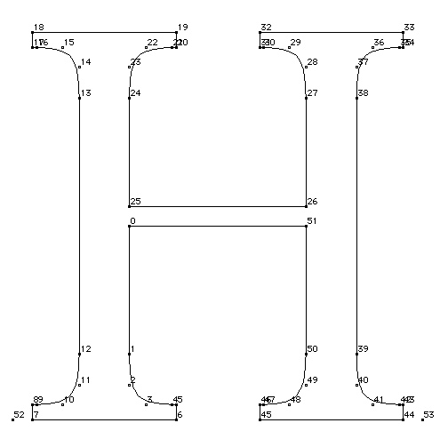

应用于 New York H 的第一组指令控制字形在其向前宽度内的位置。 一种稍微更复杂的控制字形放置的方法是将公共左侧方位聚类，并从原点使用指定的控制值表条目对它们进行 MIRP[]。

<table>
  <tr>
    <td rowspan="3" >
      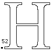
    </td>
    <td>PUSHB[000]</td>
    <td>将一个字节压入堆栈。</td>
  </tr>
  <tr>
    <td>52</td>
    <td>原点。</td>
  </tr>
  <tr>
    <td>SRP0[]</td>
    <td>将 rp0 设置为点 52，即左侧幻影点。</td>
  </tr>
</table>

下一组指令用于控制字形左侧的空间。 这是通过 MIRP[] 指令控制左干上的关键点到原点的距离来实现的。 参考点 rp0 被改变以准备下一条指令。

通过选择不设置最小距离布尔值，教程决定在每个 em 像素大小较小的情况下，当用于渲染字形的可用像素数量很少时，允许该距离消失。

在 MIRP[] 指令中设置第三个布尔值会导致值被舍入（使用默认舍入到网格的舍入状态）。 此外，还使用切入。
80%

<table>
  <tr>
    <td rowspan="10">
      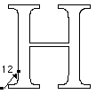
    </td>
    <td>PUSHB[001]</td>
    <td>将两个字节压入堆栈。</td>
  </tr>
  <tr>
    <td>12</td>
    <td>要移动的点。</td>
  </tr>
  <tr>
    <td>5</td>
    <td>要使用的控制值表条目。</td>
  </tr>
  <tr>
    <td rowspan="7" >MIRP[10100]</td>
    <td>移动点 12，直到它与 rp0（左侧幻影点）的距离等于控制值表条目 5（左侧方位）中的舍入值。</td>
  </tr>
  <tr>
    <td>将 rp1 设置为 rp0（第 52 点）</td>
  </tr>
  <tr>
    <td>将 rp0 设置为点 12。</td>
  </tr>
  <tr>
    <td>不要使用最小距离。</td>
  </tr>
  <tr>
    <td>圆形并使用切入。</td>
  </tr>
  <tr>
    <td>这是一个灰色距离。</td>
  </tr>
  <tr>
    <td>将 rp2 设置为点 12。</td>
  </tr>
</table>

接下来的几个指令用于控制左干上的外衬线。 第一个 MIRP[] 控制下部外侧衬线的长度。 设置最小距离布尔确保衬线不会消失。

<table>
  <tr>
    <td rowspan="10">
      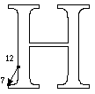
    </td>
    <td>PUSHB[001]</td>
    <td>将两个字节压入堆栈。</td>
  </tr>
  <tr>
    <td>7</td>
    <td>要移动的点。</td>
  </tr>
  <tr>
    <td>34</td>
    <td>要使用的控制值表条目。</td>
  </tr>
  <tr>
    <td rowspan="7" >MIRP[01100]</td>
    <td>移动点 7，直到它与 rp0（点 12）的距离为控制值表条目 34（衬线宽度）中的值。</td>
  </tr>
  <tr>
    <td>将 rp1 设置为 rp0。</td>
  </tr>
  <tr>
    <td>不要更改 rp0。</td>
  </tr>
  <tr>
    <td>使用最小距离。</td>
  </tr>
  <tr>
    <td>圆形并使用切入。</td>
  </tr>
  <tr>
    <td>这是一个灰色距离。</td>
  </tr>
  <tr>
    <td>将 rp2 设置为点 7。</td>
  </tr>
</table>

SHP[] 指令可以协调左上外侧衬线与左下外侧衬线的长度。 点 17 被移动到一个新位置，该位置源自点 7 的网格拟合位置。

<table>
  <tr>
    <td rowspan="3" >
      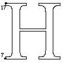
    </td>
    <td>PUSHB[000]</td>
    <td>将一个字节压入堆栈。</td>
  </tr>
  <tr>
    <td>17</td>
    <td>要移动的点的编号。</td>
  </tr>
  <tr>
    <td>SHP[0]</td>
    <td>移位点 17 已经移动了 rp2 的量（点 7）。</td>
  </tr>
</table>
继续“由外向内”的方法，下一个要在左杆中控制的特征。 它的粗细链接到控制值表条目 4，其中包含进行切入测试时要使用的大写词干出席值。 将这个值绑定到控制值表条目意味着所有相似的值将同时跳到下一个最大的像素值。 设置最小距离布尔值，确保词干不会消失。

<table>
  <tr>
    <td rowspan="10">
      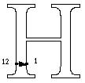
    </td>
    <td>PUSHB[001]</td>
    <td>将两个字节压入堆栈。</td>
  </tr>
  <tr>
    <td>1</td>
    <td>点号。</td>
  </tr>
  <tr>
    <td>4</td>
    <td>控制值表位置。</td>
  </tr>
  <tr>
    <td rowspan="7" >MIRP[11101]</td>
    <td>移动点 1，直到它与 rp0（点 12）的距离是控制值表条目 4 中的值（大写字干宽度）。</td>
  </tr>
  <tr>
    <td>将 rp1 设置为 rp0（点 12）。</td>
  </tr>
  <tr>
    <td>将 rp0 设置为点 1。</td>
  </tr>
  <tr>
    <td>使用最小距离。</td>
  </tr>
  <tr>
    <td>圆形并使用切入。</td>
  </tr>
  <tr>
    <td>这是一个黑色的距离。</td>
  </tr>
  <tr>
    <td>将 rp2 设置为点 1。</td>
  </tr>
</table>
由于之前的指令可能移动了点1，所以需要控制横杆与左杆的交点。 这是通过对齐点 25 和点 1 来实现的。点 25 离点 1 太远，无法通过随后的 x 方向插值“带走”，而点 0（在点 1 和另一个触摸点之间） 会适当移动。 ALIGNRP[] 指令确保它们将保持在同一垂直轴上。

<table>
  <tr>
    <td rowspan="3" >
      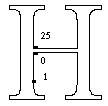
    </td>
    <td>PUSHB[000]</td>
    <td>将一个字节压入堆栈。</td>
  </tr>
  <tr>
    <td>25</td>
    <td>要对齐的点的编号。</td>
  </tr>
  <tr>
    <td>ALIGNRP[]	</td>
    <td>下一条指令控制左字干内侧衬线的长度。 布尔设置与前面关于外衬线的指令相同。 这是通过移位指令完成的。</td>
  </tr>
</table>
下一条指令控制左字干内侧衬线的长度。 布尔设置与前面关于外衬线的指令相同。 这是通过移位指令完成的。

<table>
  <tr>
    <td rowspan="10">
      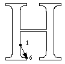
    </td>
    <td>PUSHB[001]</td>
    <td>将两个字节压入堆栈。</td>
  </tr>
  <tr>
    <td>6</td>
    <td>点号。</td>
  </tr>
  <tr>
    <td>34</td>
    <td>控制值表位置。</td>
  </tr>
  <tr>
    <td rowspan="7" >MIRP[01100]</td>
    <td>移动点 6 直到它在 x 方向上与 rp0 的距离（点 1 是控制值表条目 34（衬线宽度）中的值）。</td>
  </tr>
  <tr>
    <td>将 rp1 设置为 rp0。</td>
  </tr>
  <tr>
    <td>不要更改 rp0。</td>
  </tr>
  <tr>
    <td>使用最小距离。</td>
  </tr>
  <tr>
    <td>圆形并使用切入。</td>
  </tr>
  <tr>
    <td>这是一个灰色距离。</td>
  </tr>
  <tr>
    <td>将 rp2 设置为点 6。</td>
  </tr>
</table>
与外衬线一样，需要协调右上内衬线与左下内衬线的长度。

<table>
  <tr>
    <td rowspan="3" >
      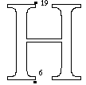
    </td>
    <td>PUSHB[000]</td>
    <td>将一个字节压入堆栈。</td>
  </tr>
  <tr>
    <td>19</td>
    <td>要移动的点的编号</td>
  </tr>
  <tr>
    <td>SHP[0]</td>
    <td>移位点 19 已经移动了 rp2 的量（点 6）。</td>
  </tr>
</table>
继续从左到右穿过字形，下一组指令控制黑体宽度。 这是一个黑色的距离。

<table>
  <tr>
    <td rowspan="3" >
      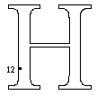
    </td>
    <td>PUSHB[000]</td>
    <td>将一个字节压入堆栈。</td>
  </tr>
  <tr>
    <td>12</td>
    <td>点号</td>
  </tr>
  <tr>
    <td>SRP0[]</td>
    <td>将rp0设置为12，黑体左侧。</td>
  </tr>
</table>

<table>
  <tr>
    <td rowspan="10">
      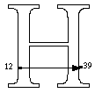
    </td>
    <td>PUSHB[000]</td>
    <td>将两个字节压入堆栈。</td>
  </tr>
  <tr>
    <td>39</td>
    <td>点号。</td>
  </tr>
  <tr>
    <td>7</td>
    <td>控制值表位置。</td>
  </tr>
  <tr>
    <td rowspan="7" >MIRP[10101]</td>
    <td>移动点 39，直到它与 rp0（点 12）的距离为控制值表 7 中的值。</td>
  </tr>
  <tr>
    <td>将 rp1 设置为 rp0（第 12 点）。</td>
  </tr>
  <tr>
    <td>将 rp0 更改为第 39 点。</td>
  </tr>
  <tr>
    <td>不要使用最小距离。 为什么？思考一下？</td>
  </tr>
  <tr>
    <td>圆形并使用切入。</td>
  </tr>
  <tr>
    <td>这是一个黑色距离。</td>
  </tr>
  <tr>
    <td>将 rp2 设置为点 39。</td>
  </tr>
</table>
此时，指示从字形的右外侧部分向左进行。

右侧外侧衬线长度的控制方式与左侧外侧衬线相似。

<table>
  <tr>
    <td rowspan="10">
      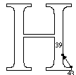
    </td>
    <td>PUSHB[001]</td>
    <td>将两个字节压入堆栈。</td>
  </tr>
  <tr>
    <td>43</td>
    <td>点号。</td>
  </tr>
  <tr>
    <td>34</td>
    <td>控制值表位置。</td>
  </tr>
  <tr>
    <td rowspan="7" >MIRP[01100]</td>
    <td>移动点 43，直到它与 rp0（点 39）的距离是控制值表条目 34 中的值。</td>
  </tr>
  <tr>
    <td>将 rp1 设置为 rp0（第 39 点）</td>
  </tr>
  <tr>
    <td>o 不改变 rp0。</td>
  </tr>
  <tr>
    <td>遵守最小距离。</td>
  </tr>
  <tr>
    <td>圆形并使用切入。</td>
  </tr>
  <tr>
    <td>这是一个灰色距离。</td>
  </tr>
  <tr>
    <td>将 rp2 设置为点 43。</td>
  </tr>
</table>
使用 SHP[] 指令将上部外侧衬线与下部外侧衬线对齐。

<table>
  <tr>
    <td rowspan="3" >
      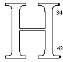
    </td>
    <td>PUSHB[000]</td>
    <td>将一个字节压入堆栈。</td>
  </tr>
  <tr>
    <td>34</td>
    <td>点号</td>
  </tr>
  <tr>
    <td>SRP[0]</td>
    <td>位移点 34 已经移动了 rp2 的量（点 43）。</td>
  </tr>
</table>
右主杆粗细的控制方式与左杆大致相同。

<table>
  <tr>
    <td rowspan="10">
      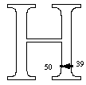
    </td>
    <td>PUSHB[001]</td>
    <td>将两个字节压入堆栈。</td>
  </tr>
  <tr>
    <td>50</td>
    <td>点号。</td>
  </tr>
  <tr>
    <td>4</td>
    <td>控制值表位置。</td>
  </tr>
  <tr>
    <td rowspan="7" >MIRP[11101]</td>
    <td>移动点 50 直到它与 rp0（点 39）的距离是控制值表条目 4 中的值，即大写字干宽度。</td>
  </tr>
  <tr>
    <td>将 rp1 设置为 rp0。</td>
  </tr>
  <tr>
    <td>将 rp0 更改为点 50</td>
  </tr>
  <tr>
    <td>遵守最小距离。</td>
  </tr>
  <tr>
    <td>圆形并使用切入。</td>
  </tr>
  <tr>
    <td>这是一个黑色距离。</td>
  </tr>
  <tr>
    <td>将 rp2 设置为点 50。</td>
  </tr>
</table>
上杆上的关键点与下杆上的关键点对齐。 该点可能已在控制词干宽度时移动。

<table>
  <tr>
    <td rowspan="3" >
      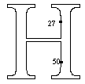
    </td>
    <td>PUSHB[000]</td>
    <td>将一个字节压入堆栈。</td>
  </tr>
  <tr>
    <td>27</td>
    <td>点号</td>
  </tr>
  <tr>
    <td>ALIGNRP[]</td>
    <td>将点 27 与 rp0（点 50）对齐。</td>
  </tr>
</table>
右侧内衬线的控制方式与左侧相同。 在某些情况下，最好在随后的 MIRP[] 指令中关闭最小距离布尔值。 效果是使内部衬线消失而不是在小尺寸时发生碰撞。

<table>
  <tr>
    <td rowspan="10">
      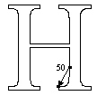
    </td>
    <td>PUSHB[001]</td>
    <td>将两个字节压入堆栈。</td>
  </tr>
  <tr>
    <td>45</td>
    <td>点号。</td>
  </tr>
  <tr>
    <td>34</td>
    <td>控制值表位置。</td>
  </tr>
  <tr>
    <td rowspan="7" >MIRP[01100]</td>
    <td>移动点 45 直到它与 rp0（点 50）的距离是控制值表条目 34 中的值</td>
  </tr>
  <tr>
    <td>将 rp1 设置为 rp0。</td>
  </tr>
  <tr>
    <td>不要改变rp0</td>
  </tr>
  <tr>
    <td>遵守最小距离。</td>
  </tr>
  <tr>
    <td>圆形并使用切入。</td>
  </tr>
  <tr>
    <td>这是一个灰色距离。</td>
  </tr>
  <tr>
    <td>将 rp2 设置为点 45。</td>
  </tr>
</table>
移位指令用于对齐上下衬线。

<table>
  <tr>
    <td rowspan="3" >
      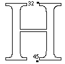
    </td>
    <td>PUSHB[000]</td>
    <td>将一个字节压入堆栈。</td>
  </tr>
  <tr>
    <td>32</td>
    <td>点号</td>
  </tr>
  <tr>
    <td>SHP[0]</td>
    <td>移动点 32，但移动量为 rp2（点 45）</td>
  </tr>
</table>
x 方向的指令现已完成。 其余指令在 y 方向上工作。 第一步是将自由度和投影矢量重置为 y 轴。

<table>
  <tr>
    <td>SVTCA[0]</td>
    <td>将自由向量和投影向量设置为 y 轴</td>
  </tr>
</table>
MIAP[]指令用于控制关键点与基线的关系。 设置了布尔值，表示控制值切入和回合状态都用于确定所采取的动作。

<table>
  <tr>
    <td rowspan="10">
      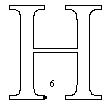
    </td>
    <td>PUSHB[001]</td>
    <td>将两个字节压入堆栈。</td>
  </tr>
  <tr>
    <td>6</td>
    <td>点号。</td>
  </tr>
  <tr>
    <td>8</td>
    <td>控制值表位置。</td>
  </tr>
  <tr>
    <td rowspan="7" >MIAP[1]</td>
    <td>将点 6 移动到控制值表条目 8 中切入的位置。</td>
  </tr>
  <tr>
    <td>将 rp0 和 rp1 设置为点 6。</td>
  </tr>
</table>
ALIGNRP[] 指令将先前移动的点与右衬线上的对应点对齐。

<table>
  <tr>
    <td rowspan="3" >
      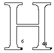
    </td>
    <td>PUSHB[000]</td>
    <td>将一个字节压入堆栈。</td>
  </tr>
  <tr>
    <td>44</td>
    <td>点号</td>
  </tr>
  <tr>
    <td>ALIGNRP[]</td>
    <td>将点 44 与 rp0（点 6）对齐。</td>
  </tr>
</table>
从下到上，下一组指令控制底部衬线的高度。 首先处理左下角的衬线。

<table>
  <tr>
    <td rowspan="10">
      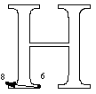
    </td>
    <td>PUSHB[001]</td>
    <td>将两个字节压入堆栈。</td>
  </tr>
  <tr>
    <td>8</td>
    <td>点号。</td>
  </tr>
  <tr>
    <td>32</td>
    <td>控制值表位置。</td>
  </tr>
  <tr>
    <td rowspan="7" >MIRP[11101]</td>
    <td>移动点 8，直到它与 rp0（点 6）的距离为控制值表条目 32（衬线高度）中的值。</td>
  </tr>
  <tr>
    <td>将 rp1 设置为 rp0。</td>
  </tr>
  <tr>
    <td>将 rp0 设置为 8。</td>
  </tr>
  <tr>
    <td>遵守最小距离。</td>
  </tr>
  <tr>
    <td>圆形并使用切入。</td>
  </tr>
  <tr>
    <td>这是一个黑色距离。</td>
  </tr>
  <tr>
    <td>将 rp2 设置为点 8。</td>
  </tr>
</table>
一旦建立了单个衬线高度，就可以使用对齐指令将其应用于所有较低的衬线。

<table>
  <tr>
    <td rowspan="8">
      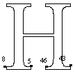
    </td>
    <td>PUSHB[001]</td>
    <td>将两个字节压入堆栈。</td>
  </tr>
  <tr>
    <td>3</td>
    <td>循环变量的值。</td>
  </tr>
  <tr>
    <td>SLOOP[]	</td>
    <td>将循环计数设置为 3。</td>
  </tr>
  <tr>
    <td>PUSHB[002]</td>
    <td>将三个字节压入堆栈。</td>
  </tr>
  <tr>
    <td>5</td>
    <td>点号</td>
  </tr>
  <tr>
    <td>46</td>
    <td>点号</td>
  </tr>
  <tr>
    <td>43</td>
    <td>点号</td>
  </tr>
  <tr>
    <td>ALIGNRP[]</td>
    <td>将点 5、46 和 43 与 rp0（点 8）对齐。 这将对齐两个较低衬线的高度。</td>
  </tr>
</table>
下一组指令使用间接指令和控制值表条目来控制 H 顶部与大写字母高度的关系。

<table>
  <tr>
    <td rowspan="8">
      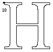
    </td>
    <td>PUSHB[001]</td>
    <td>将两个字节压入堆栈。</td>
  </tr>
  <tr>
    <td>18</td>
    <td>点号</td>
  </tr>
  <tr>
    <td>2</td>
    <td>控制值表位置。</td>
  </tr>
  <tr>
    <td rowspan="2">MIAP[1]	</td>
    <td>如果切入测试成功，将点 18 移动到控制值表条目 2（上限高度）中指定的位置。</td>
  </tr>
  <tr>
    <td>将 rp0 和 rp1 设置为点 18。</td>
  </tr>
</table>
对左上角衬线所做的更改现在应用到右侧。

<table>
  <tr>
    <td rowspan="3" >
      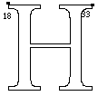
    </td>
    <td>PUSHB[000]</td>
    <td>将一个字节压入堆栈。</td>
  </tr>
  <tr>
    <td>33</td>
    <td>点号</td>
  </tr>
  <tr>
    <td>ALIGNRP[]</td>
    <td>将点 33 与 rp0（点 18）对齐。 这会将右侧与大写高度对齐。</td>
  </tr>
</table>
从字形顶部向下，指令用于控制上部衬线的高度。

<table>
  <tr>
    <td rowspan="10">
      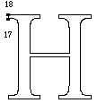
    </td>
    <td>PUSHB[001]</td>
    <td>将两个字节压入堆栈。</td>
  </tr>
  <tr>
    <td>17</td>
    <td>点号。</td>
  </tr>
  <tr>
    <td>32</td>
    <td>控制值表位置。</td>
  </tr>
  <tr>
    <td rowspan="7" >MIRP[11101]</td>
    <td>移动点 17，直到它与 rp0（点 18）的距离为控制值表条目 32（衬线高度）中的值。</td>
  </tr>
  <tr>
    <td>将 rp1 设置为 rp0（第 18 点）</td>
  </tr>
  <tr>
    <td>将 rp0 更改为第 17 点。</td>
  </tr>
  <tr>
    <td>遵守最小距离。</td>
  </tr>
  <tr>
    <td>圆形并使用切入。</td>
  </tr>
  <tr>
    <td>这是一个黑色距离。</td>
  </tr>
  <tr>
    <td>将 rp2 设置为点 17。</td>
  </tr>
</table>

现在，所有上部衬线的底部都可以对齐，以符合先前 MIRP[] 指令所做的更改。

<table>
  <tr>
    <td rowspan="8">
      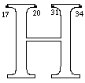
    </td>
    <td>PUSHB[000]</td>
    <td>将一个字节压入堆栈。</td>
  </tr>
  <tr>
    <td>3</td>
    <td>循环变量的值。</td>
  </tr>
  <tr>
    <td>SLOOP[]	</td>
    <td>将循环计数设置为 3。</td>
  </tr>
  <tr>
    <td>PUSHB[002]</td>
    <td>将三个字节压入堆栈。</td>
  </tr>
  <tr>
    <td>20</td>
    <td>点号</td>
  </tr>
  <tr>
    <td>31</td>
    <td>点号</td>
  </tr>
  <tr>
    <td>34</td>
    <td>点号</td>
  </tr>
  <tr>
    <td>ALIGNRP[]</td>
    <td>将点 20、31 和 34 与 rp0（点 17）对齐以控制顶部衬线的高度</td>
  </tr>
</table>
由于字形的顶部和底部可能已经改变了位置，因此需要从整体上控制横条与字形的关系。 设置参考点以用于控制横杆高度。

<table>
  <tr>
    <td rowspan="3" >
      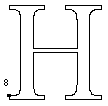
    </td>
    <td>PUSHB[000]</td>
    <td>将一个字节压入堆栈。</td>
  </tr>
  <tr>
    <td>8</td>
    <td>点号</td>
  </tr>
  <tr>
    <td>SRP2[]</td>
    <td>将 rp2 设置为点 8。</td>
  </tr>
</table>
crossbar 的高度在 baseline 和 cap height 之间插值，以保持其在字形顶部和底部之间的相对位置。

<table>
  <tr>
    <td rowspan="3" >
      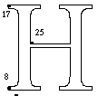
    </td>
    <td>PUSHB[000]</td>
    <td>将一个字节压入堆栈。</td>
  </tr>
  <tr>
    <td>25</td>
    <td>点号</td>
  </tr>
  <tr>
    <td>IP[]</td>
    <td>在 rp1（点 17）和 rp2（点 8）之间插入点 25。</td>
  </tr>
</table>
现在它已经被插值，连接横杆和左杆的点被圆化到网格并被触摸以防止它被未来的插值移动。

<table>
  <tr>
    <td rowspan="4" >
      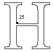
    </td>
    <td>PUSHB[000]</td>
    <td>将一个字节压入堆栈。</td>
  </tr>
  <tr>
    <td>25</td>
    <td>点号</td>
  </tr>
  <tr>
    <td rowspan="2" >MDAP[1]</td>
    <td>圆形和接触点 25。</td>
  </tr>
  <tr>
    <td>将 rp0 和 rp1 设置为点 25</td>
  </tr>
</table>
使用控制值表条目控制横杆的高度。

<table>
  <tr>
    <td rowspan="10">
      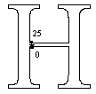
    </td>
    <td>PUSHB[001]</td>
    <td>将两个字节压入堆栈。</td>
  </tr>
  <tr>
    <td>0</td>
    <td>点号。</td>
  </tr>
  <tr>
    <td>6</td>
    <td>控制值表位置。</td>
  </tr>
  <tr>
    <td rowspan="7" >MIRP11101]</td>
    <td>移动点 0，直到它与 rp0 的距离为控制值表条目 6 中的值。</td>
  </tr>
  <tr>
    <td>将 rp1 设置为 rp0 (点25)</td>
  </tr>
  <tr>
    <td>将 rp0 更改为点 0。</td>
  </tr>
  <tr>
    <td>遵守最小距离。</td>
  </tr>
  <tr>
    <td>圆形并使用切入。</td>
  </tr>
  <tr>
    <td>这是一个黑色距离。</td>
  </tr>
  <tr>
    <td>将 rp2 设置为点 0。</td>
  </tr>
</table>

最后，所做的所有更改将分布在未受先前指令影响的点中。 IUP[] 通过插入每个未触摸点相对于最近的一对触摸点的位置来工作，每个触摸点沿着轮廓位于未触摸点的任一侧。 有关 IUP[] 指令的更多信息，请参见指令部分。

注意插值是先在x方向，再在y方向进行的，这样可以在两个方向上调整未接触点的位置。

<table>
  <tr>
    <td>IUP[1]</td>
    <td>在 x 中插值。</td>
  </tr>
  <tr>
    <td>IUP[0]</td>
    <td>在 y 中插值。</td>
  </tr>
</table>

## 纽约：大写字母 O

New York O 是大写圆形字形的一个例子。 O 以及 New York 面中的其他一些大写字母圆，如图 12 所示。

**图 12** 大写圆

在指示这些字形时面临的特殊问题之一是，它们不是位于基线上，而是与基线重叠。 在每 em 像素尺寸较小的情况下，将没有足够的位来允许这样的悬垂。 对于较大的尺寸，必须保留原始设计。

### 确定关键特征

在指示大写字母O时，需要控制图13所示的特征。 在 x 方向上，它们是：

1. 字形左侧的空间
2. 圆的底线
3. 前进宽度
4. 车身宽度

**图 13** The New York O：x 方向的控制距离

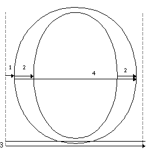

需要在 y 方向上控制以下特征：

5. 上限高度重叠
6. 基线重叠
7. 水平

**图 14** 纽约 O：y 方向上的受控距离

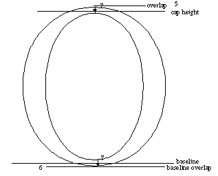

### 创建控制值表

要指示大写 0，需要扩展 New York 的控制值表以包含新条目。

**表 3-2：** 纽约控制值表

|入口|值|描述|被使用过在|
|-|-|-|-|-|
|0|1552|上限高度|H|
|1|0|基线|H|
|2|62|衬线高度|H|
|3|186|衬线宽度|H|
|4|202|大写字干宽度|H|
|5|264|左侧轴承|H|
|6|77|大写笔画|H|
|7|1110|大写字母H的黑体宽度|H|
|8|1598|圆帽高度|O|
|9|-47|大写圆形与基线重叠|O|
|10|85|左侧支撑 O|O|
|11|62|上圆横杆宽|O|
|12|233|大写圆杆|O|
|13|86|右侧支撑|O|

### 说明

纽约 O 的说明如下。 它们指的是图 15 中所示的轮廓点。

**图 15** 纽约大写 O

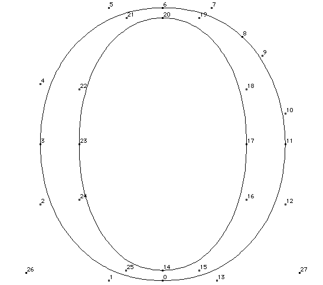

这里介绍了在 x 方向上指示此字形的两种不同方法。 同时控制左侧和右侧支撑将在低分辨率屏幕上产生更好看的整数间距，但需要特别注意向前宽度不会受到显着影响。 首先显示此方法。 在讨论 y 方向的指令之前，简要描述了另一种方法。

首先将 rp0 设置为左侧幻影点。

<table>
  <tr>
    <td rowspan="3" >
      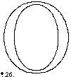
    </td>
    <td>PUSHB[000]</td>
    <td>将一个字节压入堆栈。</td>
  </tr>
  <tr>
    <td>26</td>
    <td>点号</td>
  </tr>
  <tr>
    <td>SRP0[]</td>
    <td>将 rp0 设置为 26。</td>
  </tr>
</table>

通过将点 26 和 3 之间的距离连接到控制值表条目 10 来控制左侧方位。

<table>
  <tr>
    <td rowspan="10">
      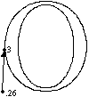
    </td>
    <td>PUSHB[001]</td>
    <td>将两个字节压入堆栈。</td>
  </tr>
  <tr>
    <td>3</td>
    <td>点号。</td>
  </tr>
  <tr>
    <td>10</td>
    <td>控制值表位置。</td>
  </tr>
  <tr>
    <td rowspan="7" >MIRP[10100]</td>
    <td>移动点 3，直到它与 rp0（点 26）的距离是控制值表条目 10 中的值。</td>
  </tr>
  <tr>
    <td>将 rp1 设置为 rp0（第 26 点）。</td>
  </tr>
  <tr>
    <td>将 rp0 更改为第 3 点。</td>
  </tr>
  <tr>
    <td>不要使用最小距离。</td>
  </tr>
  <tr>
    <td>圆形并使用切入。</td>
  </tr>
  <tr>
    <td>这是一个灰色距离。</td>
  </tr>
  <tr>
    <td>将 rp2 设置为点 3。</td>
  </tr>
</table>

左侧圆形干的宽度与控制值表条目 12 中的值相关联。词干将随着字体中其他类似干的变化而变化。 设置最小距离布尔值可防止干在小尺寸时消失。 距离是圆的。 使用控制值表以切入为准。

<table>
  <tr>
    <td rowspan="10">
      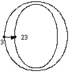
    </td>
    <td>PUSHB[001]</td>
    <td>将两个字节压入堆栈。</td>
  </tr>
  <tr>
    <td>23</td>
    <td>点号。</td>
  </tr>
  <tr>
    <td>12</td>
    <td>控制值表位置。</td>
  </tr>
  <tr>
    <td rowspan="7" >MIRP[01101]</td>
    <td>移动点 23，直到它与 rp0（点 3）的距离是控制值表条目 12（大写圆杆）中的值。</td>
  </tr>
  <tr>
    <td>将 rp1 设置为 rp0。</td>
  </tr>
  <tr>
    <td>不要更改 rp0。</td>
  </tr>
  <tr>
    <td>遵守最小距离。</td>
  </tr>
  <tr>
    <td>圆形并使用切入。</td>
  </tr>
  <tr>
    <td>这是一个黑色距离。</td>
  </tr>
  <tr>
    <td>将 rp2 设置为点 3。</td>
  </tr>
</table>

接下来的指令控制字形的黑体宽度。

<table>
  <tr>
    <td rowspan="10">
      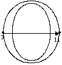
    </td>
    <td>PUSHB[001]</td>
    <td>将一个字节压入堆栈。</td>
  </tr>
  <tr>
    <td>11</td>
    <td>点号。</td>
  </tr>
  <tr>
    <td rowspan="7" >MDRP[10101]</td>
    <td>移动点 11，使其与 rp0（点 3）的距离是这两点之间的原始轮廓距离。</td>
  </tr>
  <tr>
    <td>将 rp1 设置为 rp0。</td>
  </tr>
  <tr>
    <td>不要更改 rp0。</td>
  </tr>
  <tr>
    <td>遵守最小距离。</td>
  </tr>
  <tr>
    <td>圆形并使用切入。</td>
  </tr>
  <tr>
    <td>这是一个黑色距离。</td>
  </tr>
  <tr>
    <td>将 rp2 设置为点 3。</td>
  </tr>
</table>

右圆杆的控制方式与左杆类似。

<table>
  <tr>
    <td rowspan="10">
      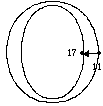
    </td>
    <td>PUSHB[001]</td>
    <td>将两个字节压入堆栈。</td>
  </tr>
  <tr>
    <td>17</td>
    <td>点号。</td>
  </tr>
  <tr>
    <td>12</td>
    <td>控制值表位置。</td>
  </tr>
  <tr>
    <td rowspan="7" >MIRP[01101]</td>
    <td>移动点 17，直到它与 rp0（点 11）的距离是控制值表条目 12 中的值。</td>
  </tr>
  <tr>
    <td>将 rp1 设置为 rp0。</td>
  </tr>
  <tr>
    <td>不要更改 rp0。</td>
  </tr>
  <tr>
    <td>使用最小距离</td>
  </tr>
  <tr>
    <td>舍入和切入适用。</td>
  </tr>
  <tr>
    <td>这是一个黑色距离。</td>
  </tr>
  <tr>
    <td>将 rp2 设置为点 17。</td>
  </tr>
</table>

字形的右侧方位由控制值表条目控制，就像之前控制左侧方位一样。 不遵守最小距离，因此，该距离可能会在每个 em 像素值较小时消失。

<table>
  <tr>
    <td rowspan="10">
      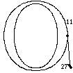
    </td>
    <td>PUSHB[001]</td>
    <td>将两个字节压入堆栈。</td>
  </tr>
  <tr>
    <td>27</td>
    <td>前进宽度位置的点号。</td>
  </tr>
  <tr>
    <td>13</td>
    <td>控制值表位置。</td>
  </tr>
  <tr>
    <td rowspan="7" >MIRP[01101]</td>
    <td>移动点 17，直到它与 rp0（点 11）的距离是控制值表条目 12 中的值。</td>
  </tr>
  <tr>
    <td>将 rp1 设置为 rp0。</td>
  </tr>
  <tr>
    <td>不要更改 rp0。</td>
  </tr>
  <tr>
    <td>使用最小距离</td>
  </tr>
  <tr>
    <td>舍入和切入适用。</td>
  </tr>
  <tr>
    <td>这是一个黑色距离。</td>
  </tr>
  <tr>
    <td>将 rp2 设置为点 17。</td>
  </tr>
</table>

如果您选择不在其向前宽度内指示字形的位置，请首先将点 3 舍入到网格并将其锁定到位。 然后继续指导左杆、整体宽度，最后是右杆。

<table>
  <tr>
    <td rowspan="4" >
      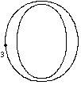
    </td>
    <td>PUSHB[000]</td>
    <td>将一个字节压入堆栈。</td>
  </tr>
  <tr>
    <td>3</td>
    <td>点号</td>
  </tr>
  <tr>
    <td rowspan="2" >MDAP[1]</td>
    <td>将 rp0 设置为 26。</td>
  </tr>
  <tr>
    <td>将 rp0 和 rp1 设置为点 3</td>
  </tr>
</table>

在指示垂直距离之前，将自由度和投影矢量设置为 y 轴。

<table>
  <tr>
    <td>SVTCA[0]</td>
    <td>将自由向量和投影向量设置为 y 轴。</td>
  </tr>
</table>

下一组指令用于控制基线重叠。 间接指令 (MIAP[]) 用于将字形连接到小尺寸的基线，同时一旦有足够数量的可用像素就允许重叠返回。

这里发生了两件事。 常见的圆形被设置为有些重叠。 对于某些磅值集，控制值程序将重叠设置为零。

<table>
  <tr>
    <td rowspan="10">
      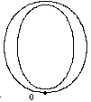
    </td>
    <td>PUSHB[000]</td>
    <td>将两个字节压入堆栈。</td>
  </tr>
  <tr>
    <td>0</td>
    <td>点号。</td>
  </tr>
  <tr>
    <td>9</td>
    <td>控制值表条目号。</td>
  </tr>
  <tr>
    <td rowspan="7" >MIAP[1]</td>
    <td>将点 0 移动到控制值表条目 9 中指定的位置，以切入为准。</td>
  </tr>
  <tr>
    <td>该值是四舍五入的。</td>
  </tr>
  <tr>
    <td>将 rp0 和 rp1 设置为点 0。</td>
  </tr>
</table>

MIRP[] 用于控制下方水平圆杆的高度。 设置最小距离布尔值可防止此水平杆消失。

<table>
  <tr>
    <td rowspan="10">
      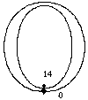
    </td>
    <td>PUSHB[000]</td>
    <td>将两个字节压入堆栈。</td>
  </tr>
  <tr>
    <td>14</td>
    <td>点号。</td>
  </tr>
  <tr>
    <td>11</td>
    <td>控制值表条目号。</td>
  </tr>
  <tr>
    <td rowspan="7" >MIRP[01101]</td>
    <td>移动点 14，直到它与 rp0（点 0）的距离为控制值表条目 11 中的值（大写水平圆字干宽度）。</td>
  </tr>
  <tr>
    <td>将 rp1 设置为 rp0。</td>
  </tr>
  <tr>
    <td>rp0 不变。</td>
  </tr>
  <tr>
    <td>遵守最小距离。</td>
  </tr>
  <tr>
    <td>舍入和切入适用。</td>
  </tr>
  <tr>
    <td>距离是黑色的。</td>
  </tr>
  <tr>
    <td>将 rp2 设置为点 14。</td>
  </tr>
</table>

使用大写圆形的控制值表条目控制字形的大写高度。

<table>
  <tr>
    <td rowspan="10">
      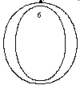
    </td>
    <td>PUSHB[000]</td>
    <td>将两个字节压入堆栈。</td>
  </tr>
  <tr>
    <td>6</td>
    <td>点号。</td>
  </tr>
  <tr>
    <td>8</td>
    <td>控制值表条目号。</td>
  </tr>
  <tr>
    <td rowspan="7" >MIAP[1]</td>
    <td>将点 6 移动到控制值表 8 中切入的位置。</td>
  </tr>
  <tr>
    <td>将 rp0 和 rp1 设置为点 6。</td>
  </tr>
</table>

水平字干宽度由 MIRP[] 指令控制。
<table>
  <tr>
    <td rowspan="10">
      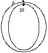
    </td>
    <td>PUSHB[000]</td>
    <td>将两个字节压入堆栈。</td>
  </tr>
  <tr>
    <td>20</td>
    <td>点号。</td>
  </tr>
  <tr>
    <td>11</td>
    <td>控制值表条目号。</td>
  </tr>
  <tr>
    <td rowspan="7" >MIRP[01101]</td>
    <td>移动点 20，直到它与 rp0（点 6）的距离是控制值表条目 11 中的值（大写水平圆杆宽度）。</td>
  </tr>
  <tr>
    <td>rp0 不变。</td>
  </tr>
  <tr>
    <td>舍入和切入适用。</td>
  </tr>
  <tr>
    <td>距离是黑色的。</td>
  </tr>
  <tr>
    <td>将 rp0 设置为 rp1。</td>
  </tr>
  <tr>
    <td>将 rp2 设置为点 20。</td>
  </tr>
</table>

所有未接触点的位置都通过x方向的插值和y方向的插值进行调整。

<table>
  <tr>
    <td>IUP[1]</td>
    <td>在 x 中插值</td>
  </tr>
  <tr>
    <td>IUP[0]</td>
    <td>在 y 中插值</td>
  </tr>
</table>

## 日内瓦：大写字母 B

大写字母 B 有直杆和圆杆、横杆和两个圆杆与横杆相交处的难以控制的“缩进”。

**图 16** 具有直形和圆形字干的字形

### 确定关键特征

首先设置要在 x 方向上控制的特征。
1. 茎宽
2. 黑体宽度
3. 碗间的叉
4. 上碗凹处
(B叉处像碗)

**图 17** 日内瓦 B：x 方向的受控距离

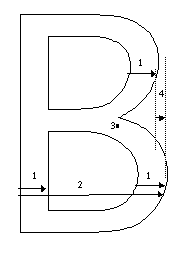

接下来建立要在 y 方向上控制的特征。

5. 上限高度
6. 与基线的关系
7. 横梁的高度
8. 水平字干的宽度
9. 胯部

**图 18** Geneva B：y 方向上的受控距离

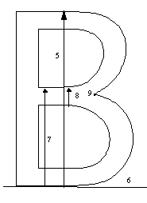

## 创建控制值表

指示 Geneva B 所需的控制值表条目如下所示。

**表 3：** 日内瓦控制值表

|入口|值|说明|
|-|-|-|
|0|1552|帽高|
|1|0|基线|
|2|202|竖杆宽度|
|3|155|水平杆高|

## 说明

Geneva B 的说明如下所示。 说明中提到的点编号如图 19 所示。

**图 19** 日内瓦大写 B

说明从处理字形的黑体宽度和在高级宽度内放置的简单方法开始。

不触及原点和前进点，使整数前进宽度始终等于四舍五入的小数宽度。 这为打印机尺寸提供了最准确的位置和宽度

首先，控制x方向上的距离。 默认情况下，自由向量和投影向量指向这个方向。

说明从将点 8 锁定到最近的网格线开始。 效果是将黑体宽度与网格对齐。

<table>
  <tr>
    <td rowspan="10">
      
    </td>
    <td>PUSHB[000]</td>
    <td>将一个字节压入堆栈。</td>
  </tr>
  <tr>
    <td>8</td>
    <td>点号。</td>
  </tr>
  <tr>
    <td rowspan="7" >MDAP[1]</td>
    <td>舍入点 8 并触摸它，使其不受未来插值的影响。</td>
  </tr>
  <tr>
    <td>将 rp0 和 rp1 设置为点 8。</td>
  </tr>
</table>

MIRP[] 指令用于控制主干宽度。 该值使用控制值表条目与其他类似值协调。 该技术可确保当切入测试失败时，词干权重将以相同的每 em 像素值中断。

<table>
  <tr>
    <td rowspan="10">
      
    </td>
    <td>PUSHB[000]</td>
    <td>将两个字节压入堆栈。</td>
  </tr>
  <tr>
    <td>27</td>
    <td>点号。</td>
  </tr>
  <tr>
    <td>11</td>
    <td>控制值表条目号。</td>
  </tr>
  <tr>
    <td rowspan="7" >MIRP[01101]</td>
    <td>移动点 27 直到它与 rp0（点 8）的水平距离是控制值表条目 2（大写词干）中的值。</td>
  </tr>
  <tr>
    <td>将 rp1 设置为 rp0。</td>
  </tr>
  <tr>
    <td>rp0 不变。</td>
  </tr>
  <tr>
    <td>舍入和切入适用。</td>
  </tr>
  <tr>
    <td>距离是黑色的。</td>
  </tr>
  <tr>
    <td>将 rp2 设置为点 27。</td>
  </tr>
</table>

下一条指令确保两个计数器的左侧对齐。 优先使用移位指令而不是 ALIGNRP[] 指令，因为 SHP[0] 将 rp0 保持在点 8 以用于下一条移动指令。 ALIGNRP[] 需要将 rp0 移动到点 27。SHP[0] 不需要。 这节省了一条 SRP0[] 指令。

<table>
  <tr>
    <td rowspan="10">
      
    </td>
    <td>PUSHB[000]</td>
    <td>将一个字节压入堆栈。</td>
  </tr>
  <tr>
    <td>8</td>
    <td>点号。</td>
  </tr>
  <tr>
    <td rowspan="7" >MDAP[1]</td>
    <td>舍入点 8 并触摸它，使其不受未来插值的影响。</td>
  </tr>
  <tr>
    <td>将 rp0 和 rp1 设置为点 8。</td>
  </tr>
</table>

下一条指令为经过舍入的字形保留原始轮廓黑体宽度。

<table>
  <tr>
    <td rowspan="10">
      
    </td>
    <td>PUSHB[000]</td>
    <td>将一个字节压入堆栈。</td>
  </tr>
  <tr>
    <td>3</td>
    <td>点号。</td>
  </tr>
    <td rowspan="7" >MDRP[10101]</td>
    <td>移动点 3，直到它与点 rp0（点 8）的距离为原始轮廓距离，进行四舍五入和引擎补偿。</td>
  </tr>
  <tr>
    <td>将 rp1 设置为 rp0。</td>
  </tr>
  <tr>
    <td>将 rp0 设置为点 3。</td>
  </tr>
  <tr>
    <td>不要使用最小距离</td>
  </tr>
  <tr>
    <td>圆形的。</td>
  </tr>
  <tr>
    <td>这是一个黑色的距离。</td>
  </tr>
  <tr>
    <td>将 rp2 设置为点 3。</td>
  </tr>
</table>

下面的圆形垂直词干被“mirped”到与左直词干相同的控制值表条目。

<table>
  <tr>
    <td rowspan="10">
      
    </td>
    <td>PUSHB[000]</td>
    <td>将两个字节压入堆栈。</td>
  </tr>
  <tr>
    <td>31</td>
    <td>点号。</td>
  </tr>
  <tr>
    <td>4</td>
    <td>控制值表条目号。</td>
  </tr>
  <tr>
    <td rowspan="7" >MIRP[01101]</td>
    <td>移动点 31，直到它与 rp0（点 3）的距离是控制值表条目 2 中的值。</td>
  </tr>
  <tr>
    <td>将 rp1 设置为 rp0</td>
  </tr>
  <tr>
    <td>不要更改 rp0。</td>
  </tr>
  <tr>
    <td>舍入和切入适用。</td>
  </tr>
  <tr>
    <td>距离是黑色的。</td>
  </tr>
  <tr>
    <td>将 rp2 设置为点 31。</td>
  </tr>
</table>

使用 MDRP[] 恢复点 14 和 13 之间的原始轮廓距离，以圆形状态为准。

<table>
  <tr>
    <td rowspan="10">
      
    </td>
    <td>PUSHB[000]</td>
    <td>将一个字节压入堆栈。</td>
  </tr>
  <tr>
    <td>14</td>
    <td>点号。</td>
  </tr>
  <tr>
    <td>4</td>
    <td>控制值表条目号。</td>
  </tr>
  <tr>
    <td rowspan="7" >MDRP[10100]</td>
    <td>移动点 14，直到它与点 rp0（点 3）的距离为原始轮廓距离，进行四舍五入引擎补偿。</td>
  </tr>
  <tr>
    <td>将 rp1 设置为 rp0。</td>
  </tr>
  <tr>
    <td>将 rp0 移动到点 14</td>
  </tr>
  <tr>
    <td>不要使用最小距离。</td>
  </tr>
  <tr>
    <td>圆形的</td>
  </tr>
  <tr>
    <td>这是一个灰色距离。</td>
  </tr>
  <tr>
    <td>将 rp2 设置为点 14。</td>
  </tr>
</table>

使用控制值表条目 2 控制上部圆形垂直词干，该词条用于其他词干。

<table>
  <tr>
    <td rowspan="10">
      
    </td>
    <td>PUSHB[000]</td>
    <td>将两个字节压入堆栈。</td>
  </tr>
  <tr>
    <td>22</td>
    <td>点号。</td>
  </tr>
  <tr>
    <td>4</td>
    <td>控制值表条目号。</td>
  </tr>
  <tr>
    <td rowspan="7" >MIRP[01101]</td>
    <td>移动点 22，直到它与 rp0（点 14）的距离是控制值表条目 2 中的值。</td>
  </tr>
  <tr>
    <td>将 rp1 设置为 rp0。</td>
  </tr>
  <tr>
    <td>rp0 不变。</td>
  </tr>
  <tr>
    <td>舍入和切入应用。</td>
  </tr>
  <tr>
    <td>距离是黑色的</td>
  </tr>
  <tr>
    <td>将 rp2 设置为点 22。</td>
  </tr>
</table>

参考点 1 被重置，为即将到来的插补做准备。

<table>
  <tr>
    <td rowspan="10">
      
    </td>
    <td>PUSHB[000]</td>
    <td>将一个字节压入堆栈。</td>
  </tr>
  <tr>
    <td>27</td>
    <td>点号。</td>
  </tr>
  <tr>
    <td rowspan="7" >SRP1[]</td>
    <td>先前的 MIRP[] 指令将 rp2 设置为指向 22。现在将 rp1 设置为 27 以准备 IP[] 指令。</td>
  </tr>
</table>

在点 14 和 27 之间插入点 0 可确保其在这些点之间的相对位置恢复到原始轮廓中的位置。

<table>
  <tr>
    <td rowspan="10">
      
    </td>
    <td>PUSHB[000]</td>
    <td>将一个字节压入堆栈。</td>
  </tr>
  <tr>
    <td>0</td>
    <td>点号。</td>
  </tr>
  <tr>
    <td rowspan="7" >IP[]</td>
    <td>在 rp1 (14) 和 rp2(27) 之间插入点 0</td>
  </tr>
</table>

x 方向的指令完成后，自由向量和投影向量被设置为 y 方向。

<table>
  <tr>
    <td>SVTCA[0]</td>
    <td>将自由度和投影矢量设置为 y 轴。</td>
  </tr>
</table>

通过将点 7 链接到控制值表条目 1 中的值，点 7 保持在基线上。

<table>
  <tr>
    <td rowspan="10">
      
    </td>
    <td>PUSHB[000]</td>
    <td>将两个字节压入堆栈。</td>
  </tr>
  <tr>
    <td>7</td>
    <td>点号。</td>
  </tr>
  <tr>
    <td>1</td>
    <td>控制值表项编号。</td>
  </tr>
  <tr>
    <td rowspan="7" >MIAP[1]</td>
    <td>将点 7 移动到控制值表条目 1 中指定的位置。</td>
  </tr>
  <tr>
    <td>将值四舍五入。</td>
  </tr>
  <tr>
    <td>将 rp0 和 rp1 设置为点 7。</td>
  </tr>
</table>

水平杆的高度通过将其链接到控制值表条目 3（水平杆高度）中的值来控制。

<table>
  <tr>
    <td rowspan="10">
      
    </td>
    <td>PUSHB[001]</td>
    <td>将两个字节压入堆栈。</td>
  </tr>
  <tr>
    <td>27</td>
    <td>点号。</td>
  </tr>
  <tr>
    <td>3</td>
    <td>控制值表条目号。</td>
  </tr>
  <tr>
    <td rowspan="7" >MIRP[01101]</td>
    <td>移动点 27，使其与 rp0（点 7）的距离为控制值表条目 3 中的值</td>
  </tr>
  <tr>
    <td>将 rp1 设置为 rp0。</td>
  </tr>
  <tr>
    <td>不要改变rp0</td>
  </tr>
  <tr>
    <td>使用最小距离</td>
  </tr>
  <tr>
    <td>舍入值并使用切入</td>
  </tr>
  <tr>
    <td>这是一个黑色的距离。</td>
  </tr>
  <tr>
    <td>将 rp2 设置为点 27。</td>
  </tr>
</table>

B 的高度使用与控制值表位置 2（大写字母高度）相关联的间接指令进行控制。

<table>
  <tr>
    <td rowspan="10">
      
    </td>
    <td>PUSHB[001]</td>
    <td>将两个字节压入堆栈。</td>
  </tr>
  <tr>
    <td>10</td>
    <td>点号。</td>
  </tr>
  <tr>
    <td>0</td>
    <td>控制值表项编号。</td>
  </tr>
  <tr>
    <td rowspan="7" >MIAP[1]</td>
    <td>移动点 10 使其位于控制值表位置 0，接受切入测试。</td>
  </tr>
  <tr>
    <td>在移动点之前将控制值表值四舍五入。</td>
  </tr>
  <tr>
    <td>将 rp0 和 rp1 设置为点 10。</td>
  </tr>
</table>

上部水平杆使用与下部相同的控制值表条目进行控制。

<table>
  <tr>
    <td rowspan="10">
      
    </td>
    <td>PUSHB[001]</td>
    <td>将两个字节压入堆栈。</td>
  </tr>
  <tr>
    <td>26</td>
    <td>点号。</td>
  </tr>
  <tr>
    <td>3</td>
    <td>控制值表条目号。</td>
  </tr>
  <tr>
    <td rowspan="7" >MIRP[01101]</td>
    <td>超过点 26，使其与 rp0（点 10）的距离为控制值表条目 3 中的值。</td>
  </tr>
  <tr>
    <td>设置 rp1 等于 rp0。</td>
  </tr>
  <tr>
    <td>不要更改 rp0。</td>
  </tr>
  <tr>
    <td>使用最小距离。</td>
  </tr>
  <tr>
    <td>圆形并使用切入。</td>
  </tr>
  <tr>
    <td>这是一个黑色的距离。</td>
  </tr>
  <tr>
    <td>设置 rp2 等于点 26</td>
  </tr>
</table>

参考点 rp1 设置为点 27，准备用于重新建立点 17 相对于点 26 和 27 的位置的插值。

<table>
  <tr>
    <td rowspan="10">
      
    </td>
    <td>PUSHB[000]</td>
    <td>将一个字节压入堆栈。</td>
  </tr>
  <tr>
    <td>27</td>
    <td>点号。</td>
  </tr>
  <tr>
    <td rowspan="7" >SRP1</td>
    <td>将 rp1 设置为点 27。</td>
  </tr>
</table>

<table>
  <tr>
    <td rowspan="10">
      
    </td>
    <td>PUSHB[000]</td>
    <td>将一个字节压入堆栈。</td>
  </tr>
  <tr>
    <td>17</td>
    <td>点号。</td>
  </tr>
  <tr>
    <td rowspan="7" >IP</td>
    <td>在 rp1（点 27）和 rp2（26）之间插入点 17</td>
  </tr>
</table>

一旦调整了点 17 的位置，它就会被四舍五入到网格中并被涉及，这样它就不会被未来的插值移动。

<table>
  <tr>
    <td rowspan="10">
      
    </td>
    <td>PUSHB[000]</td>
    <td>将一个字节压入堆栈。</td>
  </tr>
  <tr>
    <td>17</td>
    <td>点号。</td>
  </tr>
  <tr>
    <td rowspan="7" >MDAP[1]</td>
    <td>将点 17 的位置四舍五入并触摸它，使其不受未来插值的影响</td>
  </tr>
  <tr>
    <td>rp0 和 rp1 设置为点 17</td>
  </tr>
</table>

横杆杆的宽度使用水平杆的控制值表条目进行控制。

<table>
  <tr>
    <td rowspan="10">
      
    </td>
    <td>PUSHB[000]</td>
    <td>将两个字节压入堆栈。</td>
  </tr>
  <tr>
    <td>36</td>
    <td>点号。</td>
  </tr>
  <tr>
    <td>3</td>
    <td>控制值表条目号。</td>
  </tr>
  <tr>
    <td rowspan="7" >MIRP[01101]</td>
    <td>移动点 36，直到它与 rp0（点 17）的距离是控制值表条目 3 中的值。</td>
  </tr>
  <tr>
    <td>设置 rp1 等于 rp0。</td>
  </tr>
  <tr>
    <td>不要更改 rp0。</td>
  </tr>
  <tr>
    <td>舍入和切入适用。</td>
  </tr>
  <tr>
    <td>距离是黑色的</td>
  </tr>
  <tr>
    <td>将 rp2 设置为点 36。</td>
  </tr>
</table>

点 0 在点 17 和 36 之间插值。这调整了该点的垂直位置，就像之前的插值调整了它的水平位置一样。

<table>
  <tr>
    <td rowspan="10">
      
    </td>
    <td>PUSHB[000]</td>
    <td>将一个字节压入堆栈。</td>
  </tr>
  <tr>
    <td>0</td>
    <td>点号。</td>
  </tr>
  <tr>
    <td rowspan="7" >IP[]</td>
    <td>在 rp1（点 17）和 rp2（点 36）之间插入点 0。</td>
  </tr>
</table>

调整所有未接触点相对于已受指令影响的点的位置。 首先在 x 方向进行调整，然后在 y 方向进行调整。

<table>
  <tr>
    <td>IUP[1]</td>
    <td>在 x 中插值</td>
  </tr>
  <tr>
    <td>IUP[0]</td>
    <td>在 x 中插值</td>
  </tr>
</table>

## 日内瓦：小写 k

之所以选择日内瓦小写字母 k，是因为它的两个对角线笔画带来了指导性挑战。 这是所示示例中唯一需要将投影矢量设置为相对于像素网格的非正交位置的字形。
对角线和垂直主干之间的连接也提出了一个有趣的指导问题。

日内瓦的许多其他字形都有对角线，可以从类似的指导技术中受益。 其中一些如图 12 所示。

**图 20** 小写对角线

### 确定关键特征

这个字形的目标是控制：
1. 主干。
2. 对角线与主干的关系。
3. 对角线。

**图 21** 日内瓦 k：受控距离

### 创建控制值表

表 4 显示了 Geneva 的扩展控制值表，其中包含指示 Geneva k 所需的条目。

**表 4：** 日内瓦控制值表

|入口|值|描述|被使用在|
|-|-|-|-|
|0|1552|帽高 B|B|
|1|0|基线|k|
|2|202|大写垂直字干宽度|B|
|3|155|水平杆高|B
|4|1614|帽高 k|k|
|5|1117|x-高|k|
|6|0|基线|k|
|7|对角杆粗细|k|
|8|194|小写直杆|k|

### 说明

字母 k 的说明如下所示。 说明中提到的轮廓点如图 22 所示。
**图 22** 小写 Geneva k

在开始处理对角线之前，指令控制 x 方向和 y 方向的关键点。 一旦解决了这些方向上的网格拟合问题，就会指示对角线。

说明首先将字形的左边缘与网格对齐并将其锁定到位。

<table>
  <tr>
    <td rowspan="10">
      
    </td>
    <td>PUSHB[000]</td>
    <td>将一个字节压入堆栈。</td>
  </tr>
  <tr>
    <td>1</td>
    <td>点号。</td>
  </tr>
  <tr>
    <td rowspan="7" >MDAP[1]</td>
    <td>围绕点 1 的位置并触摸它，使其不受未来插值的影响。</td>
  </tr>
  <tr>
    <td>将 rp0 和 rp1 设置为点 1。</td>
  </tr>
</table>

控制主干的宽度。

<table>
  <tr>
    <td rowspan="10">
      
    </td>
    <td>PUSHB[000]</td>
    <td>将两个字节压入堆栈。</td>
  </tr>
  <tr>
    <td>10</td>
    <td>点号。</td>
  </tr>
  <tr>
    <td>7</td>
    <td>控制值表条目号。</td>
  </tr>
  <tr>
    <td rowspan="7" >MIRP[01101]</td>
    <td>移动点 10，直到它与 rp0（点 1）的距离为控制值表条目 7 中的值。</td>
  </tr>
  <tr>
    <td>rp0 不变。</td>
  </tr>
  <tr>
    <td>舍入和切入适用。</td>
  </tr>
  <tr>
    <td>距离是黑色的</td>
  </tr>
  <tr>
    <td>将 rp2 设置为点 10。</td>
  </tr>
</table>

连接主干和对角线的点在 x 方向上对齐。

<table>
  <tr>
    <td rowspan="10">
      
    </td>
    <td>PUSHB[000]</td>
    <td>将一个字节压入堆栈。</td>
  </tr>
  <tr>
    <td>4</td>
    <td>点号。</td>
  </tr>
  <tr>
    <td rowspan="7" >SHP[0]</td>
    <td>将点 4 移动 rp2（点 10）的移动量。</td>
  </tr>
</table>

x 方向上对角线的内部（以及随后的黑体宽度）受到控制而不是外部，因为在这个 k 中，两个对角线笔划到达一个点的方式是一个重要特征。 重要的是在 x 方向上网格对齐该裤裆中的点，并控制 y 方向上的两个点以保持它们现有的关系。 随后将从笔画的那一侧控制对角杆重量。 第 4 点和第 10 点将不再移动。

<table>
  <tr>
    <td rowspan="10">
      
    </td>
    <td>PUSHB[000]</td>
    <td>将一个字节压入堆栈。</td>
  </tr>
  <tr>
    <td>9</td>
    <td>点号。</td>
  </tr>
  <tr>
    <td rowspan="7" >MDRP[10101]</td>
    <td>移动点 9，直到它与 rp0（点 1）的距离为原始轮廓距离，进行四舍五入和引擎补偿。</td>
  </tr>
  <tr>
    <td>将 rp2 设置为点 9</td>
  </tr>
</table>

9点和8点的相对关系是用偏移保存的。

<table>
  <tr>
    <td rowspan="10">
      
    </td>
    <td>PUSHB[000]</td>
    <td>将一个字节压入堆栈。</td>
  </tr>
  <tr>
    <td>8</td>
    <td>点号。</td>
  </tr>
  <tr>
    <td rowspan="7" >SHP[0]</td>
    <td>将点 8 移动 rp2（点 9）的移动量。</td>
  </tr>
</table>

顶部对角线与底部对角线对齐。

<table>
  <tr>
    <td rowspan="10">
      
    </td>
    <td>PUSHB[000]</td>
    <td>将一个字节压入堆栈。</td>
  </tr>
  <tr>
    <td>5</td>
    <td>点号。</td>
  </tr>
  <tr>
    <td rowspan="7" >MDRP[10100]</td>
    <td>移动点 5，直到它与 rp2（点 9）的距离为原始轮廓距离，进行四舍五入和引擎补偿。</td>
  </tr>
  <tr>
    <td>将 rp2 设置为点 5。</td>
  </tr>
  <tr>
    <td>该指令的作用是保留点 5 与点 9 的原始关系（由先前的 MDRP[] 指令移动）。</td>
  </tr>
</table>

第 6 点的移动与之前的第 8 点相同。

<table>
  <tr>
    <td rowspan="10">
      
    </td>
    <td>PUSHB[000]</td>
    <td>将一个字节压入堆栈。</td>
  </tr>
  <tr>
    <td>6</td>
    <td>点号。</td>
  </tr>
  <tr>
    <td rowspan="7" >SHP[0]</td>
    <td>将点 6 移动 rp2（点 5）的移动量。</td>
  </tr>
</table>

调整 k 的叉柱以反映在对角线上发生的运动。

<table>
  <tr>
    <td rowspan="10">
      
    </td>
    <td>PUSHB[000]</td>
    <td>将一个字节压入堆栈。</td>
  </tr>
  <tr>
    <td>6</td>
    <td>点号。</td>
  </tr>
  <tr>
    <td rowspan="7" >SHP[0]</td>
    <td>将点 6 移动 rp2（点 5）的移动量。</td>
  </tr>
</table>

自由和投影矢量设置为 y 轴，以便可以开始垂直方向的指令。

<table>
  <tr>
    <td>SVTCA[0]</td>
    <td>将自由度和投影向量设置为 y 轴</td>
  </tr>
</table>

字形通过控制值表条目绑定到基线。

<table>
  <tr>
    <td rowspan="10">
      
    </td>
    <td>PUSHB[001]</td>
    <td>将两个字节压入堆栈。</td>
  </tr>
  <tr>
    <td>1</td>
    <td>点号。</td>
  </tr>
  <tr>
    <td>6</td>
    <td>控制值表条目号。</td>
  </tr>
  <tr>
    <td rowspan="7" >SHP[0]</td>
    <td>将点 1 移动到控制值表条目 6 中切入的位置。</td>
  </tr>
  <tr>
    <td>将 rp0 和 rp1 设置为点 1</td>
  </tr>
</table>

点 8 和 9 对齐，以便在指示对角线之前它们将位于 x 方向和 y 方向的最终位置。

<table>
  <tr>
    <td rowspan="10">
      
    </td>
    <td>PUSHB[000]</td>
    <td>将一个字节压入堆栈。</td>
  </tr>
  <tr>
    <td>9</td>
    <td>点号。</td>
  </tr>
  <tr>
    <td rowspan="7" >ALIGNRP[]</td>
    <td>将点 9 与 rp0（点 1）对齐</td>
  </tr>
</table>

