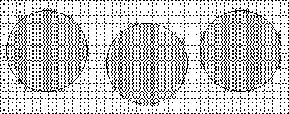

# 字体教程

## 介绍

优质轮廓字体是一种在低分辨率设备上以小尺寸提供易读性并在大尺寸和高分辨率设备上提供对原始设计的保真度的字体。 应尽量减少由于轮廓形状和网格放置之间的相互作用而产生的体积。 本节将描述如何指示 TrueType 字体以确保它具有刚刚描述的属性。

## 光栅化和网格

将字形轮廓转换为位图的一种简单技术是将轮廓叠加到光栅网格上。 中心位于网格内或网格上的所有像素都将成为要生成的位图图像的一部分。 所有其他人都不是。
使用此规则对圆进行光栅化的结果如图 1 所示。该图揭示了这种简单光栅化技术的一些缺点。 具体来说，结果会随着光栅网格中轮廓的精确位置而变化，并且生成的形状从左到右或从上到下都不是对称的，这在圆形中是理想的。

**图 1** 位图随栅格网格中的位置而变化

当在给定网格上以给定大小进行光栅化时，给定轮廓总是产生相同的结果会更好。 栅格化形状时应保留重要属性（如对称性）。

这类问题不仅具有理论上的重要性，而且会影响数字字体的易读性。 不受控制的光栅化产生的常见问题包括不均匀的词干权重、丢失、字符特征的丢失和衬线不对称。 此类问题的一些实例如图 2 所示。

**图 2** 光栅化问题

最终结果是字母在小尺寸时难以辨认，而在大尺寸时则不雅。 图 3 说明了阅读此类文本所固有的困难。

**图 3** 变化影响难以辨认的文本

随着分辨率或点大小的增加，光栅化问题最终会消失。然而，对于屏幕显示字体的用户来说，这样的改进还是不够，在许多情况下，对于那些在 300 dpi 设备上打印的用户来说也不够。

随着尺寸和分辨率的增加，易读性会提高，但即使在每 em 像素数相对较高的情况下，原始设计的优雅和保真度仍然存在问题。这个问题如图 4 所示。在这里，由哑光栅化生成的位图（左）清晰可辨，但不美观。其中比较明显的问题是 e 顶部的像素缺失、下部曲线的锯齿状以及计数器的外观不佳。

**图 4** 10 点无指令纽约 e，300 dpi

TrueType 语言试图通过在光栅化之前使字形轮廓变形以打开“正确的”像素来解决由光栅化事故引起的问题。这种技术，如图 5 所示，被称为“网格拟合”轮廓。在这里，施加在较浅主轮廓上的较暗轮廓表示将被光栅化以产生用于表示字形的最终输出位的轮廓。

**图 5** 网格拟合后的 10 点纽约 e 轮廓

当网格拟合轮廓设置为光栅化器时，结果具有更令人愉悦的外观，更接近于主轮廓中捕获的设计。

**图 6** 10 点指令 New York e at 300 dpi

正如前面的讨论所建议的，网格拟合的一些目标如下：

* 消除变化对网格的影响。
* 控制字形内和字形之间的关键尺寸。
* 保留对称性和其他重要的字形特征。

但是，可以将这些一般概念进一步细化为一组可以用 TrueType 语言表达的目标。在接下来的几节中，将更具体地描述这些想法。

## 字体教程

本节概述了指导 TrueType 字体所涉及的任务。所提出的技术可用于字体的“手”指示。对这些技术的理解对于那些打算编写自动工具的人或任何需要对指导过程有低层次理解的人来说应该是有用的。

### 确定预期用途

在指示字体时，重要的是要确定预期使用该字体的每个 em 的最小像素数。如果它仅用于打印机或排字机，则指导任务将大大简化。通常，目标是在 72 dpi 设备上以屏幕尺寸可读的字体。这可能意味着将字体设置为每 em 9 个像素。

### 考虑字体有一个整体

在指示字形时，保留字体的整体外观和字形之间的关系很重要。要做到这一点，重要的是要确定适用于整个字体的关键尺寸，例如大写高度、x 高度和基线。在每个 em 尺寸的小像素下，这些尺寸的细微变化是不可能的，并且巨大的差异将是灾难性的。
在罗马字体中，大写“H”和“O”以及小写“n”和“o”通常用作控制字符，以确定笔直和圆形字符的大写高度和 x 高度. 这些字符可用于构建控制值表。

**图 7** 罗马字体的关键垂直尺寸。

### 考虑单个字形
确定需要保留哪些字符特征。在每个 em 大小的小像素下，可能需要牺牲设计的某些方面。因此，有必要设置优先级。
要保留的关键特征包括应该在给定字符内均匀的词干权重，并且应该在字体中的相似字形中同时中断。其他通常值得关注的特征是衬线、词干宽度和对角线。

### 控制空白区域
在网格拟合字形中，目标不仅是控制光栅化时构成该字符的像素，还控制笔画之间和字形之间的空间。特别是在屏幕尺寸上，控制空白是一项关键任务。除非指令严格控制侧方位，否则字符可能会在屏幕上发生碰撞，从而损害文本的外观并破坏可读性。未能控制笔画之间的间距可能会导致字形看起来像黑色斑点。

### 控制前进宽度
保持前进宽度对于确保一致的间距很重要。通常在屏幕上获得最佳间距和在打印机上获得最佳间距之间存在冲突。例如，如果决定将右侧轴承舍入到网格中，则字形的原始前进宽度将略有改变。根据渲染字形的大小，效果可以是向上或向下舍入该值。这些错误在打印机尺寸上可能会被夸大，从而产生非常不希望的效果。
在指示前进宽度时，确定字体最重要的用途很重要。通常，优先考虑保留最常用字形的前进宽度。